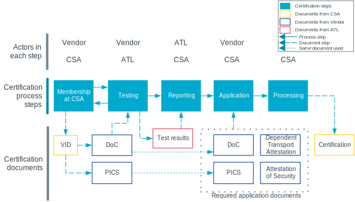
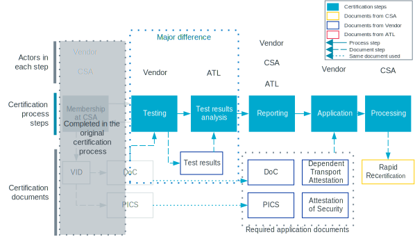
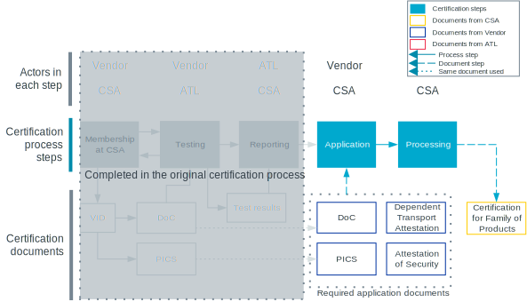
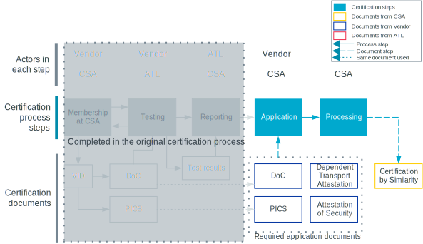

.. _ug_matter_device_certification:

Matter certification
####################

.. contents::
   :local:
   :depth: 2

Matter offers full certification, including test specification, certification program, and certification framework.

Read the following sections for an overview of the Matter certification process.
For detailed information, see the official Certification Policy documentation from `Connectivity Standards Alliance`_ (CSA).
This and other documents related to certification are available in the `Matter Resource Kit`_ to Matter members.

The public listing of certified Matter products is available at the `CSA Certified Products Database`_ page.

.. _ug_matter_device_certification_types:

Certification types
*******************

You can apply for certification of the following types:

Certified Product
   An end product that has obtained certification.
   The Certified Product label confirms that the product is fully compliant to the Matter standard and allows the product to use the Certified Product logo.

Certified Software Component
   A software feature of a Supported Operating Environment (SOE).

This page offers general introduction to the Matter certification process, and so it makes no distinction between these types.
It uses the term *Matter component* to refer to both of them.

.. _ug_matter_device_certification_overview:

Certification process overview
******************************

Each certification is preceded by a testing phase.
The testing confirms that the Matter component is following the Matter standard, as described in the Matter specification.
The certification is the official recognition of the conformity to the standard.

The following figure provides an overview of the Matter certification process steps.

   Matter certification process overview

.. _ug_matter_device_certification_initial_reqs:

Initial requirements: Membership at CSA
=======================================

Before you start applying for the Matter certification, you must join CSA, which is the Standards Developing Organization (SDO) for Matter.

.. table::

   +-------------------------------+---------------------------+-----------------------------+----------------------------------------+
   | Technology certification      | Stage for certification   | SDO to join                 | Minimum SDO membership level required  |
   +===============================+===========================+=============================+========================================+
   | Matter Certification          | Production                | `Join CSA`_                 | Adopter                                |
   +-------------------------------+---------------------------+-----------------------------+----------------------------------------+

Joining CSA allows you to meet the following certification requirements:

* Familiarity with the Matter Core Specification, which is the standard for the certification.
  You can download it from the `CSA Specifications Download Request`_ page.
* Assignment of Vendor ID (VID), which is required when applying for certification.
  You can apply to `CSA's Certification Team`_ to obtain VID.
  The VID codes are valid immediately upon assignment.

If you created your Matter product application using :ref:`matter_samples` as a reference, make sure you have read the `ug_matter_device_certification_matter_samples`_ section before proceeding with the following certification steps.

.. _ug_matter_device_certification_testing:

Testing
=======

The Matter certification process requires testing before any application for certification is sent.
The testing can be performed at an Authorized Test Laboratory (ATL), using a test plan developed by CSA.
Each ATL has its own submission process, but all require a Declaration of Conformity and a Protocol Implementation Conformance Statement (PICS).
Both documents confirm that the Matter component you are going to certify is meeting the protocol requirements.

The ATL can contact you if your Matter component is failing any of the test cases.

You can find the list of available ATLs on the `CSA's Testing Providers`_ page.

.. _ug_matter_device_certification_reporting:

Reporting
=========

After the Matter component successfully passes all required test cases, the ATL sends a test report to both you and CSA.
The test report summarizes the testing process and includes a variety of information, including details about the device, `Certification types`_, test plans, and Test Harness.

Application
===========

Once you have obtained the test report for your Matter component, you can apply for the certification to CSA.
You can do this online from the `CSA Member Resources page`_ using the different Certification and Testing tools to submit the required documentation.

Application requirements
------------------------

The final application for certification requires you to send the following documents to CSA:

* Declaration of Conformity
* `PICS`_
* `Dependent Transport Attestation`_
* `Matter Attestation of Security`_
* Description of the Matter component to be certified (and photos of the end product, for the product certification)

Certification document templates from Nordic Semiconductor
  When applying for certification for products that use Nordic Semiconductor's devices, some of the certification documents require providing information about Nordic Semiconductor's SoCs or the |NCS|.
  To help you with filling in these documents, Nordic Semiconductor can provide you with appropriate templates for:

  * Matter Attestation of Security
  * Thread certification by inheritance application

  To request and obtain such documents, open a private ticket on `DevZone`_ after you join the related SDO.

  .. note::
     Nordic Semiconductor provides just example answers based on the reference SDK applications, which may guide you on how to answer to certain platform-related questions.
     You are still solely responsible for filling original documents according to a product specification.
     The final approval depends on the Director of Certification in the given SDO.

PICS
++++

You can generate the PICS in the XML format using CSA's PICS Tool, available from `CSA Member Resources page`_.

Dependent Transport Attestation
+++++++++++++++++++++++++++++++

When applying for Matter certification, you must present a self-attestation that confirms you have applied for and obtained the certification for the transport platform you are using for your Matter component.
The processes for obtaining such certification are governed by different Standard Development Organizations (SDOs).

See the :ref:`ug_matter_device_certification_reqs` for more information about the processes compatible with the Matter platform in the |NCS|.

CSA provides attestation forms to its members on the `Matter Attestation Form`_ directory page.

.. _ug_matter_device_certification_reqs_security:

Matter Attestation of Security
++++++++++++++++++++++++++++++

For a Matter component to be certified, CSA's policies require an Attestation of Security that provides detailed information about the security level of the Matter component.
The attestation document lists robustness security requirements based on the Matter Core Specification.
The product developer must indicate the level of compliance and briefly justify the choice.

The attestation must be filled by the person responsible for end product certification who meets the following requirements:

* The person's organization is a `member of the Matter community <Join CSA_>`_.
* The person has an account on the `Connectivity Standards Alliance Certification Web Tool`_.

Once both these requirements are met, the responsible person can download the `Matter Attestation of Security template`_, fill it in, and submit it in the certification web tool when applying for the certification.

Processing
==========

During this stage of the certification process, CSA verifies the submission for relevant criteria, including relevant documentation, membership in CSA, completion of testing, and payment of applicable fees.
The duration of this step depends on the complexity of your application and the length of the review queue.

.. _ug_matter_device_certification_results:

Certification
=============

At the end of a successful processing, the Matter component is granted the certification.

CSA will ensure that the following certification actions are completed when the certification is granted:

* Certificate of compliance is sent to the certification requester.
* The newly certified Matter component is listed on the `CSA Certified Products Database`_ page.
* Matter certified logos are available from the Certification Web Tool dashboard.
* Certification Declaration file is available for download.
* Certification record is entered into :ref:`ug_matter_device_dcl`.

.. _ug_matter_device_certification_reqs:

Dependent certification requirements
************************************

.. ug_matter_certification_sdo_start

Because Matter is an application layer, it relies on proven technologies for network connectivity.
These technologies come with their own certification processes governed by different Standard Development Organizations (SDOs).

.. ug_matter_certification_sdo_end

.. _ug_matter_device_certification_reqs_mot:

Matter over Thread certification requirements
=============================================

The following table lists Matter over Thread certification requirements for when a product moves to production.

+-------------------------------+---------------------------+-----------------------------+----------------------------------------+
| Technology certification      | Stage for certification   | SDO to join                 | Minimum SDO membership level required  |
+===============================+===========================+=============================+========================================+
| Matter Certification          | Production                | `Join CSA`_                 | Adopter                                |
+-------------------------------+---------------------------+-----------------------------+----------------------------------------+
| Bluetooth QDID                | Production                | `Join Bluetooth SIG`_       | Adopter                                |
+-------------------------------+---------------------------+-----------------------------+----------------------------------------+
| Thread Group Certification    | Production                | `Join Thread Group`_        | Implementer                            |
+-------------------------------+---------------------------+-----------------------------+----------------------------------------+

Bluetooth and Thread certifications can be inherited from Nordic Semiconductor (see the :ref:`ug_matter_device_certification_reqs_dependent` section below).

You can also find more information about the Thread certification in the :ref:`Thread protocol section <ug_thread_cert>`.

.. _ug_matter_device_certification_reqs_mowifi:

Matter over Wi-Fi certification requirements
============================================

The following table lists Matter over Wi-Fi certification requirements for when a product moves to production.

+-------------------------------+---------------------------+-----------------------------+----------------------------------------+
| Technology certification      | Stage for certification   | SDO to join                 | Minimum SDO membership level required  |
+===============================+===========================+=============================+========================================+
| Matter Certification          | Production                | `Join CSA`_                 | Adopter                                |
+-------------------------------+---------------------------+-----------------------------+----------------------------------------+
| Bluetooth QDID                | Production                | `Join Bluetooth SIG`_       | Adopter                                |
+-------------------------------+---------------------------+-----------------------------+----------------------------------------+
| Wi-Fi Alliance Certification  | Production                | `Join Wi-Fi Alliance`_      | Implementer                            |
+-------------------------------+---------------------------+-----------------------------+----------------------------------------+

Bluetooth certification can be inherited from Nordic Semiconductor (see the :ref:`ug_matter_device_certification_reqs_dependent` section below).
:ref:`Wi-Fi certification <ug_wifi_certification>` is not yet available for inheritance from Nordic Semiconductor.

.. _ug_matter_device_certification_reqs_dual:

Certification requirements for dual protocol scenarios
======================================================

The following table lists certification requirements for products that offer :ref:`both Thread and Wi-Fi protocol support with Matter <ug_matter_overview_architecture_integration_designs_switchable>`.

+-------------------------------+---------------------------+-----------------------------+----------------------------------------+
| Technology certification      | Stage for certification   | SDO to join                 | Minimum SDO membership level required  |
+===============================+===========================+=============================+========================================+
| Matter Certification          | Production                | `Join CSA`_                 | Adopter                                |
+-------------------------------+---------------------------+-----------------------------+----------------------------------------+
| Bluetooth QDID                | Production                | `Join Bluetooth SIG`_       | Adopter                                |
+-------------------------------+---------------------------+-----------------------------+----------------------------------------+
| Thread Group Certification    | Production                | `Join Thread Group`_        | Implementer                            |
+-------------------------------+---------------------------+-----------------------------+----------------------------------------+
| Wi-Fi Alliance Certification  | Production                | `Join Wi-Fi Alliance`_      | Implementer                            |
+-------------------------------+---------------------------+-----------------------------+----------------------------------------+

Bluetooth and Thread certifications can be inherited from Nordic Semiconductor (see the :ref:`ug_matter_device_certification_reqs_dependent` section below).
:ref:`Wi-Fi certification <ug_wifi_certification>` is not yet available for inheritance from Nordic Semiconductor.

You can also find more information about the Thread certification in the :ref:`Thread protocol section <ug_thread_cert>`.

.. _ug_matter_device_certification_reqs_dependent:

Matter dependent certification inheritance
==========================================

If your product uses qualified Bluetooth stack or certified Thread libraries (or both) provided as part of the |NCS|, you can *inherit* certification from Nordic Semiconductor, provided that you do not introduce any changes to these stacks.
In practice, this means reusing Nordic Semiconductor's certification identifiers, which were obtained as a result of the official certification procedures.

When reusing Nordic Semiconductor's certification identifiers, you still need to join the SDO and meet its requirements to apply for certification by inheritance.
For example, if you want to inherit Nordic Semiconductor's certification for Matter over Thread, you still need to join organizations listed in :ref:`ug_matter_device_certification_reqs_mot` and meet the inheritance requirements of each of the SDOs.

.. note::
      The inheritance procedure differs from SDO to SDO and has different names.
      For details, contact the appropriate certification body in the SDO.

Certification identifiers
-------------------------

Nordic Semiconductor provides the following certification identifiers:

* Bluetooth Qualified Design IDs (Bluetooth QDIDs) - Obtained in accordance with `Bluetooth SIG's Qualification Process`_.
* Thread Certification IDs (Thread CIDs) - Obtained in accordance with `Thread Group's certification information`_.

You can visit the following pages on Nordic Semiconductor Infocenter to check the Bluetooth QDIDs and Thread CIDs valid for SoCs that support Matter applications:

* `nRF5340 DK Compatibility Matrix`_
* `nRF52840 DK Compatibility Matrix`_

Matter certification process variants
*************************************

The standard Matter certification process has several variants that you can use if you have already obtained the certification or you want to certify several products of the same family.

Rapid Recertification program
=============================

.. note::
      The Rapid Recertification program is currently experimental.
      You can read more about it in a dedicated document in the `Matter Resource Kit`_.

The Rapid Recertification program lets you perform the product testing using the services of a qualified CSA Member, even your own organization, instead of an ATL.
This allows for a potentially more streamlined recertification process when you want to certify
The first certification must still be done at an ATL.

   Matter's Rapid Recertification program overview

Product Family certification
============================

The Product Family certification lets you certify several variants of the same product.
In this certification path, the first product must be tested according to the original certification process at an ATL.
Then, you can apply for certification of the first product and a number of other products from the same family.

To be considered of the same family, the other products must meet the following criteria:

* All products must share the same device type as the first product.
* All products must be variants of the first product, which should also be the most feature complete.
* All products must conform with the Matter specifications, regardless of differences.

   Matter's Product Family certification overview

Certification by Similarity
===========================

Certification by Similarity lets you certify products that derive from a previously certified product.
This variant is meant for Matter components that use Matter software that was already certified as part of either the standard procedure or the `Product Family certification`_.

   Matter certification by similarity overview

.. _ug_matter_device_certification_matter_samples:

Certification status of Matter samples
**************************************

The |NCS| includes several :ref:`matter_samples` that are example implementations of Matter devices.
The samples are maintained to fulfill Matter certification requirements as closely as possible, but they do not have official Matter compliance certificates.
You can use them as a reference for creating your own application, but this does not guarantee that your application will pass the Matter certification.

The Matter certification program currently does not provide any form of platform certification, so the product maker is solely reponsible for ensuring that the application used fulfills all Matter certification requirements.
Before you start the application process for the Matter certification, make sure that the application configuration generated using :file:`.zap` file is compatible with the PICS generated for the certification purpose.
You can find the information about the specification and the valid PICS for specific Matter stack version that should be used for your product on the `CSA Matter Resource Kit`_ page, in the `Specification` section.
Especially, make sure that:

* ``FeatureMap`` attributes for all clusters match the desired configuration selected in PICS, and all other cluster requirements related to the specific ``FeatureMap`` value are met.
* ``ClusterRevision`` attributes for all clusters match the value of the Matter stack version that you want to use for your application certification.
* ``Attribute List``, ``Accepted Command List`` and ``Generated Command List`` attributes for all clusters contain all the values that need to be there and nothing more.

See the :ref:`ug_matter_creating_accessory` page for how to configure your application using the ZAP Tool.

Before you request the official product `ug_matter_device_certification_testing`_ from ATL, it is recommended to perform in-house certification testing of the product.
This testing can help you detect problems that could lead to certification failure, meaning it saves time and money that would be spent on official certification in ATL laboratory.
You can find the instruction how to execute in-house certification tests using a Matter Test Harness on the `CSA Matter Resource Kit`_ page.
Open the **Test Tool User Guide** link in the **Testing** section under the **Testing and Certification** section of the page.
