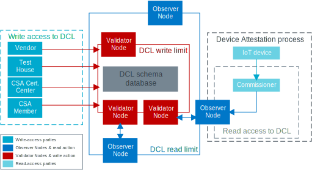

.. _ug_matter_device_dcl:

Matter Distributed Compliance Ledger
####################################

.. contents::
   :local:
   :depth: 2

Matter's Distributed Compliance Ledger (DCL) is a cryptographically secure database that is open to all contributors to the Matter project.
It acts as the source of truth for information about the compliance status of vendors and their device models, as well as for providing vendor device metadata to verified CSA members.
As a device maker, you should add information about your devices to the ledger before you ship the devices to market.
Without this step, Matter ecosystems might not allow commissioning your devices into the home network.

This database is distributed on many servers that are located around the globe.
The geographic locations are selected by the CSA to make the distribution as even as possible.
The DCL is based on the Tendermint protocol, which is used for running the blockchain technology.

During the :ref:`ug_matter_device_attestation` procedure, the DCL acts as the secure distribution point of the list of active and revoked Product Attestation Authority root certificates.

The ledger is publicly available at the `Distributed Compliance Ledger website <Distributed Compliance Ledger_>`_.

.. _ug_matter_device_certification_dcl_definition_roles:

DCL roles
=========

The DCL roles refer to the way of interaction with the database.
As the CSA member is granted access to the DCL, it receives the basic Vendor role, and can be assigned multiple roles over time if certain requirements are met.
Each of the roles corresponds to a unique key associated to each role for the given member.

Trustee
   The Trustees are appointed by the CSA to govern the DCL and approve or disapprove other DCL roles.

Validator Node Administrator
   The node administrator role can create Validator `DCL nodes`_.

Vendor
   The Vendor role is assigned to a CSA Member that requests access to the DCL.
   Each CSA Member can have one or more Vendor keys assigned.
   To obtain the Vendor key, the CSA Member must follow the Vendor key enrolment process, detailed in the DCL policies document.

CSA Certification Center (CSA CC)
   The CSA CC submits certification status to the DCL based on the test results submitted by an authorized Test House.

Test House
   The Test House role provides test results about class of devices.

.. _ug_matter_device_certification_dcl_definition_nodes:

DCL nodes
=========

The DCL is a server that contains the Validator Nodes (VNs) and Observer Nodes (ONs).
The main difference between them is the type of access to the DCL database.
These nodes can be upgraded through the DCL's node software upgrade procedure, after the certified software version is created and approved by CSA.

Validator Node (VN)
   A Validator Node can only be set up by authorized CSA members.
   It is a piece of software that runs on the DCL server and forms a peer-to-peer network with other VNs.
   Each VN holds a persistent database of records and validates new records by matching the signature from approved keys in the VN database.
   The validation occurs through a consensus protocol, which is based on a block-chain of VNs in the DCL.
   These nodes confirm data and vote to confirm an operation.
   Two-thirds of approvals are needed for the write operation to be accepted.

Observer Node (ON)
   An Observer Node can be set up by a CSA member for their exclusive use.
   This type of node provides read-only access to the DCL data and can be used for API interaction with the commissioner.
   ONs do not participate in the consensus protocol.
   If there is an attempt to write to an ON, the node forwards the request to a Validator Node.

.. _ug_matter_device_certification_dcl_definition_usage:

DCL usage
=========

The DCL stores and makes available information about the CSA members' products and their compliance status.
This is useful for the following use cases:

* Vendors can provide information about their products.
* CSA CCs can update the certification statuses of products.
* Both Vendors and CSA CCs can coordinate publishing of information about the products, for example to happen at the product launch date.
* CSA members can upload PAA certificates to the DCL and make it available for download and for the :ref:`ug_matter_device_attestation` procedure.

Ledger data is available in several JSON schemas.
For example, the PAA Schema provides the list of the PAA certificates for the approved PAAs.

   DCL interaction overview

Writing to the DCL
------------------

Writing to the DCL is restricted to the parties who participate in the certification process:

* CSA can add information about vendor's certification status.
* Vendor can write to the DCL to add device models that are associated to its Vendor ID and public key.
* Vendor can update information related to the device model already added to the DCL.
* Test Houses can update the test status of each device on the ledger.
* CSA Certification Centers can add or revoke the compliance status of a device.

Reading from the DCL
--------------------

Reading from the DCL is open to all parties who need to obtain the following compliance-related information, for example for commissioning purposes:

* Information about the device model, including firmware and hardware versions
* Device compliance state
* PAA certificates

.. _ug_matter_device_certification_dcl_working:

Working with the DCL as a Vendor
********************************

To work with the DCL as a Vendor and have your certification information listed in the DCL, complete the following steps:

1. Obtain access to the DCL by completing steps listed in the `DCL Quick Start Guide`_:

   a. Install and set up DCL CLI (``dcld``).
   b. Configure ``dcld`` to connect to one of the testnet nodes ("DCL CLI Configure" section).
   c. Create the Vendor account and request account approval ("Create Vendor Account Steps" section).

   At the end of this procedure, you obtain the public key and can submit your product information.
2. Using the public key, add :ref:`information about your device <ug_matter_device_certification_dcl_working_info>` into the DCL.
3. Send the device to an Authorized Test Laboratory (ATL).
4. Wait for the ATL to send the test results to the CSA and for the CSA to check them.
5. Wait for the CSA to verify the test results and publish the certification status to the DCL (see `DCL usage`_).

.. _ug_matter_device_certification_dcl_working_info:

What information the Vendor can provide
=======================================

The vendor can provide the following information into the following schemas in the DCL:

Vendor schema
   This schema provides general information about the Vendor, including Vendor ID, Vendor name, and Vendor's landing page URL.

Device model schema
   This schema provides general information about the device.
   It includes the Vendor ID, Product ID, name and label on the product, part number, device type, custom commissioning flow instructions, as well as a series of URLs related to commissioning, product page, Vendor tech support, or the user manual.

Device software version model schema
   This schema provides information specific to the device software version, including certification declaration number, firmware information, OTA software update image URL, OTA image size and OTA image checksum.
