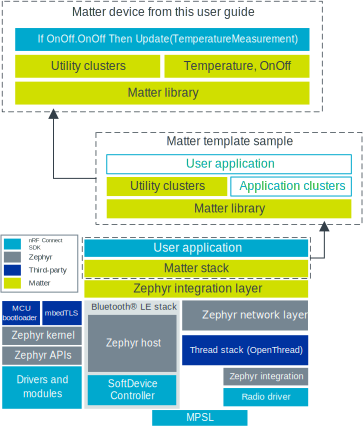

.. _ug_matter_creating_accessory:
.. _ug_matter_gs_adding_cluster:

Adding clusters to Matter application
#####################################

.. contents::
   :local:
   :depth: 2

As part of this guide, you will modify the :ref:`Matter template <matter_template_sample>` sample by adding new application clusters in order to create a Matter sensor device that measures temperature and can be turned on and off.
The sensor will periodically generate the simulated temperature sensor value and update the corresponding cluster attributes.
This application will form a Matter device within a Matter network.

.. note::
   Make sure you are familiar with Matter in the |NCS| and you have tested some of the available :ref:`matter_samples` before you work with this user guide.

.. _ug_matter_creating_accessory_overview:

Overview
********

The Matter device is a basic node of the `Matter`_ network.
The device is formed by the development kit and the application that is running the Matter stack, which is programmed on the development kit.

Each Matter application consists of the following layers:

* Matter stack that provides the Matter core components.
* Data Model layer in the form of clusters, which contains commands and attributes that are to be accessible over the Matter network.
  This layer can be further broken down into the following groups:

  * Utility clusters - These clusters represent management and diagnostic features of a Matter node.
    They are common for all Matter nodes.
  * Application clusters - These clusters represent functionalities specific to a given application.

* Application logic, such as turning on and off a light bulb in response to certain commands.

Creating a Matter device consists of adding new application clusters to the Matter template sample.
By default, the template sample includes only mandatory Matter clusters, necessary to commission the device into a Matter network.

   Creating Matter device

Cluster is a Data Model building block in Matter.
It is a representation of a single functionality within a Matter device, such as turning a device on and off.
Each cluster contains attributes, commands, and events, which can be mandatory or optional.
Attributes are stored in the device's memory, while commands can be used to modify or read the state of the device, including the cluster attributes.

Clusters appropriate for a single device type such as a sensor or a light bulb are organized into an addressable container that is called an *endpoint*.
Most utility clusters are required to be on the endpoint with ID ``0``.
Application clusters are usually assigned to endpoints with IDs ``1`` and higher.

An application can implement appropriate callback functions to be informed about specific cluster state changes.
These functions can be used to alter the device's behavior when the state of a cluster is changing as a result of some external event.

For more information about the Data Model layer, see :ref:`ug_matter_architecture_overview_dm` section on the Matter architecture documentation page.

Requirements
************

To take advantage of this guide, you need to be familiar with :ref:`ug_matter_architecture` and :ref:`ug_matter_configuring`, and have built and tested at least one of the available :ref:`matter_samples`.

.. _ug_matter_creating_accessory_copy:

.. rst-class:: numbered-step

Copy Matter template sample
***************************

Use the :ref:`Matter Template <matter_template_sample>` sample as the base for building a sensor device:

1. Make sure that you meet the requirements for building the sample.
#. Build and test the sample as described on its documentation page.
#. Copy the contents of the :file:`samples/matter/template` directory to a new directory meant for your custom application.
   For example, :file:`samples/matter/sensor`.

.. _ug_matter_creating_accessory_edit_zap:

.. rst-class:: numbered-step

Edit clusters using the ZAP tool
********************************

Adding the functionalities for an on/off switch and a sensor requires adding new clusters.

Adding new application clusters can be achieved by modifying ZAP file, which can be found as :file:`src/template.zap`.
This is a JSON file that contains the data model configuration of clusters, commands, and attributes that are enabled for a given application.
It is not used directly by Matter applications, but it is used to generate the source files for handling given clusters.

The ZAP file can be edited using `ZCL Advanced Platform`_ (ZAP tool), a third-party tool that is a generic templating engine for applications and libraries based on Zigbee Cluster Library.
This tool is provided with the Matter repository in the |NCS|.

To edit clusters using the ZAP tool, complete the following steps:

1. Download the ZAP package containing pre-compiled executables and libraries and extract it:

   .. note::
       You can download the package in a compatible version manually from the `ZCL Advanced Platform releases`_, but we recommend using a dedicated helper script that will do it for you.

   a. Open your installation directory for the |NCS| in a command line.
   #. Navigate to :file:`modules/lib/matter`.
   #. Run the helper script to download and extract the ZAP package in the directory that corresponds to the *location_path* argument:

      .. note::
       The `-o` argument in the command is used to allow overwriting files, if they already exist in the given location.
       Otherwise the script will display prompt during download and ask for user consent to overwrite the files directly.

      .. parsed-literal::
         :class: highlight

         python scripts/setup/nrfconnect/get_zap.py -l *location_path* -o

#. Verify the ZAP tool version by comparing the script output with the following possible cases:

   * Case 1: If your currently installed ZAP version matches the recommended one, you will see a message similar to the following one:

     .. code-block::

        Your currenly installed ZAP tool version: 2022.12.20 matches the recommended one.

     This means that your ZAP version is correct and the tool executable can be accessed from the operating system environment, so you can skip the following step about adding the ZAP tool to the system :envvar:`PATH` environment variable.

   * Case 2: If your currently installed ZAP version does not match the recommended one or no ZAP version is installed on your device, you will see a message similar to the following one:

     .. code-block::

        Your currenly installed ZAP tool version 2022.12.19 does not match the recommended one: 2022.12.20.

     Alternatively, this message can look like the following one:

     .. code-block::

        No ZAP tool version was found installed on this device.

     In this case, the package download process will start automatically:

     .. parsed-literal::
        :class: highlight

        Trying to download ZAP tool package matching your system and recommended version.
        100% [......................................................................] 150136551 / 150136551
        ZAP tool package was downloaded and extracted in the given location.

        #######################################################################################
        # Please add the following location to the system PATH: *package_extraction_location* #
        #######################################################################################

     .. note::
         The *package_extraction_location* in the example output will be replaced by the *location_path* from the previous step, where you extracted the package.

#. Add the *package_extraction_location* ZAP package location printed in the script output to the system :envvar:`PATH` environment variables.
   This is not needed if your currently installed ZAP version matches the recommended one (case 1 from the previous step).

   .. tabs::

      .. group-tab:: Linux

         For example, if you are using bash, run the following commands:

         .. parsed-literal::
            :class: highlight

            echo 'export PATH=package_extraction_location:"$PATH"' >> ${HOME}/.bashrc
            source ${HOME}/.bashrc

      .. group-tab:: Windows

         For the detailed instructions for adding :envvar:`PATH` environment variables on Windows, see :ref:`zephyr:env_vars`.

      .. group-tab:: macOS

         For example, if you are using bash, run the following commands:

         .. parsed-literal::
            :class: highlight

            echo 'export PATH=package_extraction_location:"$PATH"' >> ${HOME}/.bash_profile
            source ${HOME}/.bash_profile
   ..

#. Open the :file:`src/template.zap` for editing by running the following command, where ``samples/matter/sensor`` stands for the path where you copied the template sample in the first step of this guide.

   .. code-block::

      zap ../../../nrf/samples/matter/sensor/src/template.zap

   The ZAP tool's Zigbee Cluster Configurator window appears.

   .. figure:: images/matter_create_accessory_zcl_configurator.png
      :alt: Zigbee Cluster Configurator window in ZAP tool

      Zigbee Cluster Configurator window in ZAP tool

   By default, the window displays all available clusters.
   These can be filtered to show :guilabel:`Only Enabled` clusters.
   At this stage, only one endpoint is available (Endpoint 0).
#. In the ZAP tool, click :guilabel:`ADD NEW ENDPOINT`.
#. In the :guilabel:`Create New Endpoint` menu, create a new endpoint that represents the temperature sensor device type:

   .. figure:: images/matter_create_accessory_create_new_endpoint.png
      :alt: Create New Endpoint menu in ZAP tool

      Create New Endpoint menu in ZAP tool

   The new cluster is created with both the Basic and Identify clusters enabled.
#. Configure the On/Off cluster required for this endpoint:

   a. In the :guilabel:`Search Clusters` menu, find the On/Off cluster.
   #. Set the :guilabel:`Server` option for the On/Off cluster.

      .. figure:: images/matter_create_accessory_add_onoff_cluster.png
         :alt: Configuring the On/off server cluster

         Configuring the On/off server cluster

   #. In the :guilabel:`Configure` column, click the gear icon to open the cluster's configuration.
   #. In the :guilabel:`ATTRIBUTES` tab, make sure that you have the ``OnOff`` attribute enabled.
   #. In the :guilabel:`COMMANDS` tab, make sure that you have both On and Off commands enabled:

   .. figure:: images/matter_create_accessory_enable_onoff_commands.png
      :alt: On/off cluster configuration

      On/off cluster configuration

#. Configure the Temperature Measurement cluster required for this endpoint:

   a. Expand the :guilabel:`Measurement & Sensing` menu and configure the Temperature Measurement cluster by setting the :guilabel:`Server` option from the drop-down menu.

      .. figure:: images/matter_create_accessory_add_temperature_measurement.png
         :alt: Configuring the Temperature Measurement server cluster

         Configuring the Temperature Measurement server cluster

   #. Go to the Temperature Measurement cluster configuration and make sure that you have the ``MeasuredValue`` attribute enabled.

#. Save the file and exit.
#. Use the modified ZAP file to generate the C++ code that contains the selected clusters by running the following command, where ``samples/matter/sensor`` stands for the path where you copied the template sample in the first step of this guide:

   .. code-block::

      python ./scripts/tools/zap/generate.py ../../../nrf/samples/matter/sensor/src/template.zap

At this point, new clusters have been added to the Matter device.

.. _ug_matter_creating_accessory_edit_loop:

.. rst-class:: numbered-step

Edit the main loop of the application
*************************************

After adding clusters, you must modify the way in which the application interacts with the newly added clusters.
This is needed to properly model the sensor's behavior.

The :file:`src/app_task.cpp` file contains the main loop of the application.
Complete the steps in the following subsections to modify the main loop.

Edit the event queue
====================

The main application loop is based on an ``AppEventQueue``, on which events are posted by ZCL callbacks and by other application components, such as Zephyr timers.
In each iteration, an event is dequeued and a corresponding event handler is called.

Add new events
--------------

After you copied the template sample application, the following events are used in the application (:file:`src/app_event.h`):

* :c:enum:`Button` - For general operation of **Button 1**.
* :c:enum:`ButtonPushed` - For pressing **Button 1**.
* :c:enum:`ButtonReleased` - For releasing **Button 1**.
* :c:enum:`Timer` - For factory reset timeout.
* :c:enum:`UpdateLedState` - For updating of the **LED 1** state.

To model the behavior of the sensor, add the following new :c:enum:`AppEventType` events:

* :c:enum:`SensorActivate` - For sensor activation.
* :c:enum:`SensorDeactivate` - For sensor deactivation.
* :c:enum:`SensorMeasure` - For sensor measurement update.

For example, the edited :c:enum:`AppEventType` can look as follows:

.. code-block:: C++

   enum class AppEventType {
        None = 0,
        Button,
        ButtonPushed,
        ButtonReleased,
        Timer,
        UpdateLedState,
        SensorActivate,
        SensorDeactivate,
        SensorMeasure
   };

Add sensor timer
----------------

You need to make sure that the sensor is making measurements at the required time points.
For this purpose, use a Zephyr timer to periodically post :c:enum:`SensorMeasure` events.
In the template sample, such a timer is being used to count down 6 seconds when **Button 1** is being pressed to initiate the factory reset.

To add a new timer for the measurement event, edit the :file:`src/app_task.cpp` file as follows:

.. code-block:: C++

   k_timer sSensorTimer;

   void SensorTimerHandler(k_timer *timer)
   {
           AppEvent event;
           event.Type = AppEventType::SensorMeasure;
           event.Handler = AppTask::SensorMeasureHandler;
           AppTask::Instance().PostEvent(event);
   }

   void StartSensorTimer(uint32_t aTimeoutMs)
   {
           k_timer_start(&sSensorTimer, K_MSEC(aTimeoutMs), K_MSEC(aTimeoutMs));
   }

   void StopSensorTimer()
   {
           k_timer_stop(&sSensorTimer);
   }

   int AppTask::Init()
   {
           /*
           ... Original content
           */

           k_timer_init(&sSensorTimer, &SensorTimerHandler, nullptr);
           k_timer_user_data_set(&sSensorTimer, this);
           return 0;
   }

The timer must be initialized in the ``Init()`` method of the ``AppTask`` class.
If :c:func:`StartSensorTimer()` is called, the :c:struct:`SensorMeasure` event is added to the event queue every *aTimeoutMs* milliseconds, until :c:func:`StopSensorTimer()` is called.

Implement event handlers
------------------------

When an event is dequeued, the application calls the event handler in the :c:func:`DispatchEvent()` function.
Because you have added new events, you must implement the corresponding handlers.

To add new event handlers, complete the following steps:

1. Edit the :file:`src/app_task.cpp` file as follows:

   .. code-block:: C++

      void AppTask::SensorActivateHandler(const AppEvent &)
      {
              StartSensorTimer(500);
      }

      void AppTask::SensorDeactivateHandler(const AppEvent &)
      {
              StopSensorTimer();
      }

      void AppTask::SensorMeasureHandler(const AppEvent &)
      {
              chip::app::Clusters::TemperatureMeasurement::Attributes::MeasuredValue::Set(
                      /* endpoint ID */ 1, /* temperature in 0.01*C */ int16_t(rand() % 5000));
      }

   With this addition, when the sensor is active, the timer expiration event happens every half a second.
   This causes an invocation of :c:func:`SensorMeasureHandler()` and triggers an update of the ``MeasuredValue`` attribute of the Temperature Measurement cluster.

   .. note::
      In the code fragment, the example value is updated randomly, but in a real sensor application it would be updated with the value obtained from external measurement.

#. Declare these handler functions as ``static`` in the ``public`` scope of ``AppTask`` class in :file:`src/app_task.h` to make sure the application builds properly.

Include header for cluster attribute helpers
============================================

To import helper functions for accessing cluster attributes, make sure to include the following file in the :file:`src/app_task.cpp` file:

.. code-block:: C++

   #include <app-common/zap-generated/attributes/Accessors.h>

.. _ug_matter_creating_accessory_callback:

.. rst-class:: numbered-step

Create a callback for sensor activation and deactivation
********************************************************

Handlers for the :c:struct:`SensorActivate` and :c:struct:`SensorDeactivate` events are now ready, but the events are not posted to the event queue.
The sensor is supposed to be turned on and off remotely by changing the ``OnOff`` attribute of the On/off cluster, for example using the Matter controller.
This means that we need to implement a callback function to post one of these events every time the ``OnOff`` attribute changes.

To implement the callback function, complete the following steps:

1. Create a new file, for example :file:`src/zcl_callbacks.cpp`.
2. Implement the callback in this file:

   a. Open :file:`src/zap-generated/callback-stub.cpp` to check the list of customizable callback functions, marked with ``__attribute__((weak))``.
   #. Read the description of :c:func:`MatterPostAttributeChangeCallback()`.
   #. Implement :c:func:`MatterPostAttributeChangeCallback()` in the :file:`src/zcl_callbacks.cpp` file.

For example, the implementation can look as follows:

.. code-block:: C++

   #include "app_task.h"

   #include <app-common/zap-generated/ids/Attributes.h>
   #include <app-common/zap-generated/ids/Clusters.h>
   #include <app/ConcreteAttributePath.h>

   using namespace ::chip;
   using namespace ::chip::app::Clusters;

   void MatterPostAttributeChangeCallback(const chip::app::ConcreteAttributePath & attributePath, uint8_t type,
                                          uint16_t size, uint8_t * value)
   {
           if (attributePath.mClusterId != OnOff::Id || attributePath.mAttributeId != OnOff::Attributes::OnOff::Id)
                   return;

           AppEvent event;
           if (*value) {
               event.Type = AppEventType::SensorActivate;
               event.Handler = AppTask::SensorActivateHandler;
           }
           else {
               event.Type = AppEventType::SensorDeactivate;
               event.Handler = AppTask::SensorDeactivateHandler;
           }
           AppTask::Instance().PostEvent(event);
   }

In this implementation, the ``if`` part filters out events other than those that belong to the On/Off cluster.
Then, the callback posts the event for the sensor, namely ``SensorActivate`` if the current value of the attribute is not zero.

.. _ug_matter_creating_accessory_add_source:

.. rst-class:: numbered-step

Add new source file to CMakeLists
*********************************

To ensure that everything builds without errors, update the :file:`CMakeLists.txt` file by adding :file:`src/zcl_callbacks.cpp` source file to the ``app`` target.

.. _ug_matter_creating_accessory_test:

Testing the new sensor application
**********************************

.. note::
   Use CHIP Tool for Linux or macOS when :ref:`setting up Matter development environment <ug_matter_gs_testing_thread_separate_otbr_linux_macos>`.

To check if the sensor device is working, complete the following steps:

.. include:: ../../../../../samples/matter/template/README.rst
   :start-after: matter_template_sample_testing_start
   :end-before: #. Press **Button 1**

#. Activate the sensor by running the following command on the On/off cluster with the correct *node_ID* assigned during commissioning:

   .. parsed-literal::
      :class: highlight

      ./chip-tool onoff on *node_ID* 1

#. Read the measurement several times by checking value of ``MeasuredValue`` in the Temperature Measurement cluster:

   .. parsed-literal::
      :class: highlight

      ./chip-tool temperaturemeasurement read measured-value *node_ID* 1

#. Deactivate the sensor by running the following command on the On/off cluster with the correct *node_ID* assigned during commissioning:

   .. parsed-literal::
      :class: highlight

      ./chip-tool onoff off *node_ID* 1

#. Read the measurement again.
   The measurement should not change.
