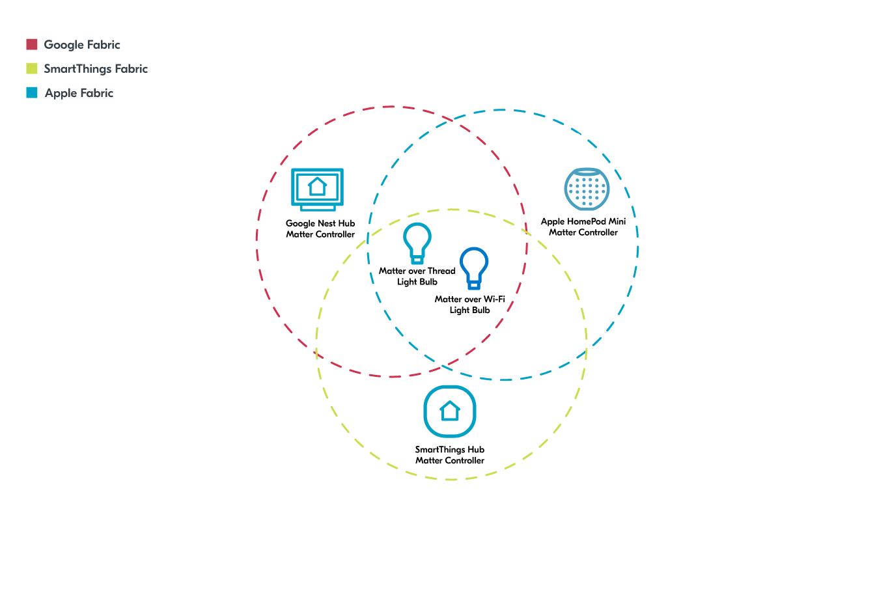

.. _ug_matter_gs_ecosystem_compatibility_testing:

Testing with commercial Matter ecosystems
#########################################

.. contents::
   :local:
   :depth: 2

Nordic Semiconductor's Matter platform and Matter applications integrated in the |NCS| follow the most recent versions of the Matter protocol and are interoperable with several commercial Matter ecosystems.

Matter allows multiple ecosystems to work with each other thanks to the :ref:`multiple fabrics feature <ug_matter_overview_multi_fabrics>`.
It also lets you use different wireless protocols for different use cases at the same time (for example, Thread or Wi-Fi).

You can test the interoperability of the Matter solution in the |NCS| with a selection of compatible Matter ecosystems by following the `Testing the nRF Connect platform with Apple, Google and Samsung ecosystems`_ tutorial on DevZone.

Prerequisites
*************

At the very least, you need the following pieces of hardware to set up and test the interoperability scenario from the tutorial:

* Matter over Thread development kit: 1x nRF52840 DK or 1x nRF5340 DK
* Matter over Wi-Fi development kit: 1x nRF7002 DK
* Devices from at least one of commercial ecosystems compatible with the official Matter implementation, for example:

  * `Apple Home <Apple Home integration with Matter_>`_
  * `Google Home <Google Home integration with Matter_>`_
  * `Samsung SmartThings <Samsung SmartThings integration with Matter_>`_

* 1x Wi-Fi Access Point supporting IPv6 connected to the Internet (for example, Asus RT-AC1300G, as used in the tutorial)
* 1x PC with nRF Connect SDK v2.2.0 (or later) installed

Setup and testing
*****************

Follow the steps in the `Testing the nRF Connect platform with Apple, Google and Samsung ecosystems`_ tutorial for detailed setup and testing instructions.
This will allow you to set up and test the following scenario with Apple Home, Google Home, and Samsung SmartThings.

   Example of Matter ecosystem compatibility from the DevZone tutorial
