.. _ug_nrfconnect_manufacturer_cluster_editor_tool:

nRF Connect Matter Manufacturer Cluster Editor tool
###################################################

.. contents::
   :local:
   :depth: 2

.. include:: /includes/matter_manufacturer_cluster_editor_note.txt

This guide describes how to use the nRF Connect Matter Manufacturer Cluster Editor tool to create a new cluster or extend an existing cluster.

Overview
********

The Matter data model defines clusters that are common for all manufacturers and can be used as a base for devices.
Sometimes, it is necessary to create a new cluster for a specific device, or extend an existing cluster to add new attributes, commands, or events that are specific to the device.
This tool allows you to perform such operations using a graphical user interface.
If the desired device type is not listed in the Matter Device Type Library specification, you can use the tool to create a new one, and include it in the project.

This guide describes how to run the tool, and its visual interfaces.
It shows how to create a new cluster, add an extension to the existing one, and create a new device type.

The tool supports the following features:

   * Creating a new manufacturer-specific cluster that contains attributes, commands, and events.
   * Creating extensions to the existing clusters defined in the Matter data model.
   * Adding new enumerations and structures.
   * Creating a new device type that is not listed in the Matter Device Type Library Specification.

Based on your edits, the tool generates a new XML file with the cluster definition or an extension to the existing cluster.
You can use the XML file as an argument in the :ref:`ug_matter_gs_tools_matter_west_commands_append` to add the XML file to the Matter ZCL database.

The guide is divided into the following sections:

* :ref:`ug_nrfconnect_manufacturer_cluster_editor_tool_downloading_installing` describes how to download, install and launch the tool on your machine.
* :ref:`ug_nrfconnect_manufacturer_cluster_editor_tool_basic_functionalities` describes the basic functionalities of UI and mechanisms of the tool.
* :ref:`ug_nrfconnect_manufacturer_cluster_editor_tool_creating_new_cluster` describes how to create a new cluster, add commands, attributes, and events, and save it as an XML file.
* :ref:`ug_nrfconnect_manufacturer_cluster_editor_tool_creating_cluster_extension` describes how to create a cluster extension, add commands, attributes, and events, and save it as an XML file.
* :ref:`ug_nrfconnect_manufacturer_cluster_editor_tool_creating_new_device_type` describes how to create a new device type, assign required or optional clusters, and require attributes, commands, and events.

You can learn about the tool functionalities directly from the tool interface, as well.
Hover your mouse over each element in the tool to see a dedicated tooltip with the information about the element.

For example, the following tooltip describes the **Code** element in the :guilabel:`Cluster` tab:

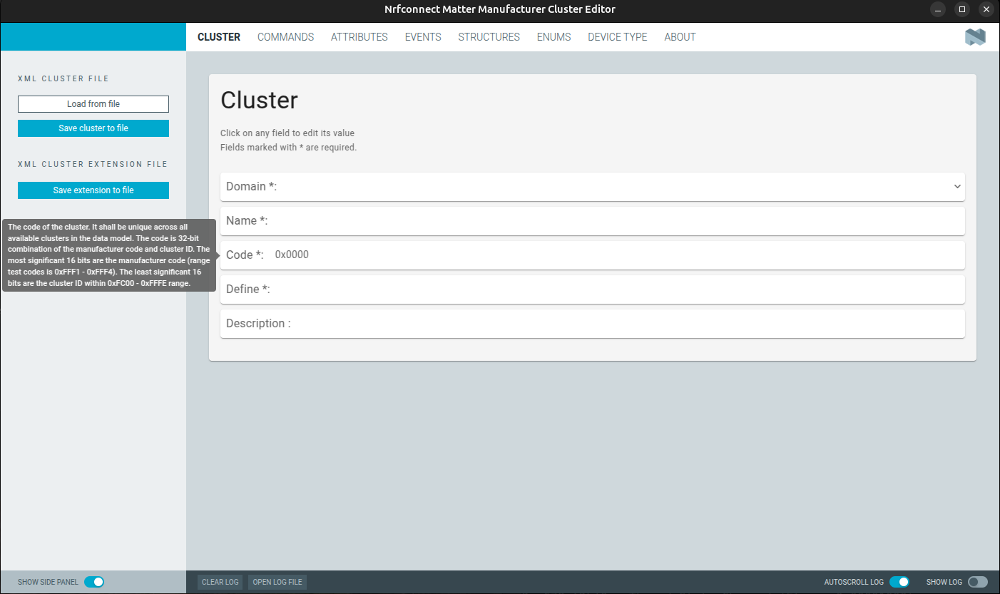

For an example of the tool usage, refer to the :ref:`ug_matter_gs_custom_clusters_create_xml_file` user guide.

Requirements
************

To take full advantage of this guide, you need to be familiar with the :ref:`ug_matter_architecture` and Matter Device Type Library specification.

.. _ug_nrfconnect_manufacturer_cluster_editor_tool_downloading_installing:

Downloading, installing and launching
*************************************

To download the preview version of the tool and install it, complete the following steps:

 1. Download the preview version of the tool from the `Matter nRF Connect releases`_ GitHub page, depending on your operating system:

    .. tabs::

      .. group-tab:: Windows

         ``nrfconnect-matter-manufacturer-cluster-editor_win64.zip``

      .. group-tab:: Linux

         ``nrfconnect-matter-manufacturer-cluster-editor_linux.AppImage``

      .. group-tab:: MacOS

         - ``nrfconnect-matter-manufacturer-cluster-editor_macos_x64.app.zip`` for Intel-based Macs
         - ``nrfconnect-matter-manufacturer-cluster-editor_macos_arm64.app.zip`` for Apple Silicon-based Macs

 #. Run the tool using one of the following methods depending on your operating system:

    .. tabs::

      .. group-tab:: Windows

            a. Unzip the downloaded file.
            #. Open the folder with the unzipped files.
            #. Click twice on the :file:`nRF Connect Matter Manufacturer Cluster Editor.exe` file to launch the tool.

      .. group-tab:: Linux

          a. Make the file executable:

             .. code-block:: console

                chmod +x ./nrfconnect-matter-manufacturer-cluster-editor_linux.AppImage

          b. Click twice on the :file:`nrfconnect-matter-manufacturer-cluster-editor_linux.AppImage` file, or use the following command:

             .. code-block:: console

                ./nrfconnect-matter-manufacturer-cluster-editor_linux.AppImage

      .. group-tab:: MacOS

         a. The application file should be automatically unpacked to the :file:`nRF Connect Matter Manufacturer Cluster Editor`, or :file:`nRF Connect Matter Manufacturer Cluster Editor.app` file.
         #. Click twice on the downloaded file.
         #. If a popup window appears indicating that the application was downloaded from the internet, click :guilabel:`Open`.

.. _ug_nrfconnect_manufacturer_cluster_editor_tool_basic_functionalities:

Basic functionalities
*********************

The tool UI is created based on the shared commodities for developing `nRF Connect for Desktop`_ applications.
The following sections describe the basic parts of the tool and their functionalities.

Side panel
==========

On the left side of the tool, you can see the navigation panel with the following elements:

* A name bar on the top of the panel with text field that represents the name of the cluster, and the name of the file, where the cluster is saved.
  You can change the name of the cluster by clicking on the name bar and typing a new name.
  The new name shall be unique across all available clusters in the Matter data model.

* A **XML cluster file** section that contains the following two buttons:

  * :guilabel:`Load from file` that loads the cluster definition or cluster extension from the XML file.
  * :guilabel:`Save cluster to file` that saves the current cluster definition to an XML file.
    You can use this button only for a new cluster.

* A :guilabel:`XML cluster extension file` tab with the :guilabel:`Save extension to file` button that checks the difference between the current filled-in values and the loaded cluster and saves the difference to the XML file.

The following figure shows the side panel of the tool:

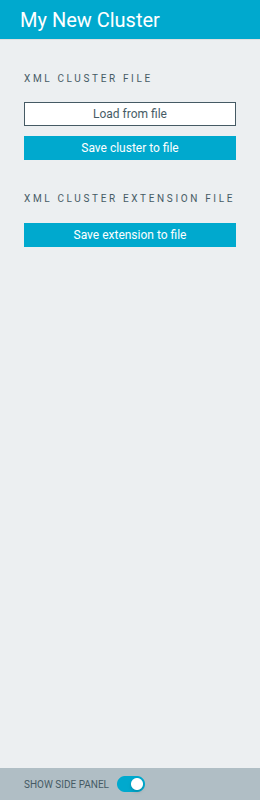

You can use the :guilabel:`Show side panel` toggle button to show or hide the side panel.

Loading the cluster file
------------------------

To load an XML file that contains the cluster definition or cluster extension, click the :guilabel:`Load from file` button.
Use the system file dialog to select the XML cluster file.
If the file contains more than one cluster, the tool shows the list of available clusters in the context menu.

For example:

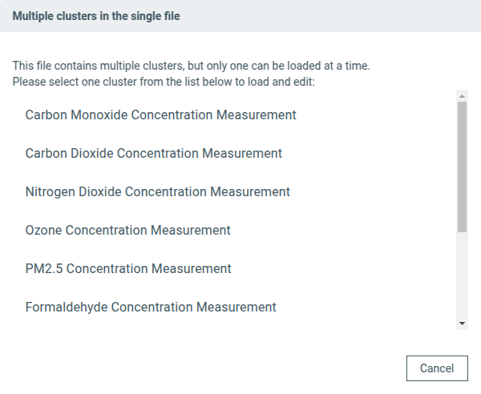

Select the cluster from the list to load a specific cluster definition or cluster extension.
After loading the cluster file, all tabs are populated with the data from the loaded cluster.

Saving the cluster file
-----------------------

To save the cluster file, click the :guilabel:`Save cluster to file` button.
Use the system file dialog to select the path and file name to save the cluster.

Saving the cluster extension file
---------------------------------

To save the cluster extension file, click the :guilabel:`Save extension to file` button.
Use the system file dialog to select the path and file name to save the cluster extension.

The tool checks the difference between the current cluster and the loaded cluster extension and saves the difference to the XML file.
If there is no difference, the tool shows a message indicating that there is no data to create a cluster extension, see the figure:

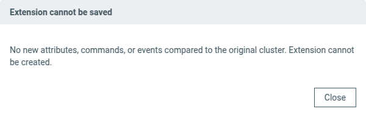

Main panel
==========

The main panel is the central part of the tool and contains the following tabs, each representing a different element of an XML cluster file:

* :guilabel:`CLUSTER` - Contains the cluster definition, description, and code
* :guilabel:`COMMANDS` - Lists all commands assigned to the cluster
* :guilabel:`ATTRIBUTES` - Shows all attributes associated with the cluster
* :guilabel:`EVENTS` - Displays all events defined for the cluster
* :guilabel:`STRUCTURES` - Lists all structure types defined for the cluster
* :guilabel:`ENUMS` - Contains all enumeration types used by the cluster
* :guilabel:`DEVICE TYPE` - Provides the device type definition

The following figure shows the main panel of the tool:

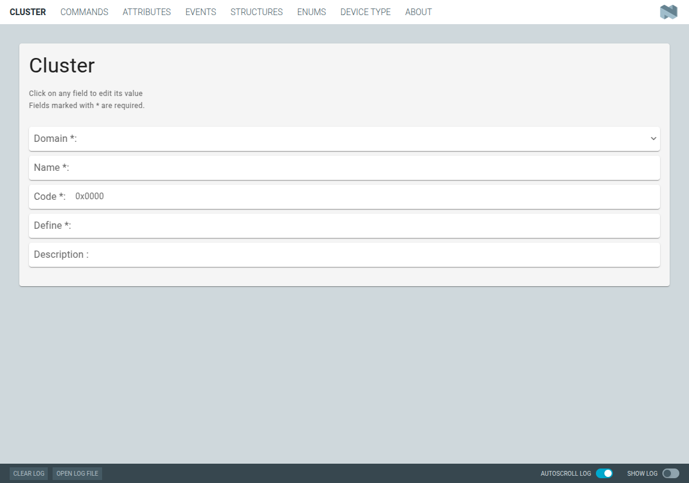

The :guilabel:`CLUSTERS` and :guilabel:`DEVICE TYPE` tabs consist of fields that you can edit directly in the opened window.
The :guilabel:`COMMANDS`, :guilabel:`ATTRIBUTES`, :guilabel:`EVENTS`, :guilabel:`ENUMS`, and :guilabel:`STRUCTURES` tabs consist of a table with the list of elements.
You can add, edit or delete the elements in the table using the edit box interface after clicking a field in the table.

Edit box
--------

The edit box is a dialog window that allows you to edit a row.
Click the pencil icon on each row of the table or the :guilabel:`Add Attributes` button in the top of the table to start editing.

The following figure shows location of the pencil icon and the :guilabel:`Add Attributes` button:

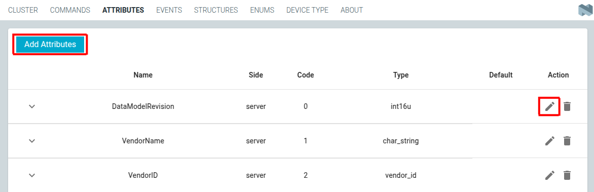

   Start edit

To remove a row from the table, click the trash can icon located under each element in the list.

The following figure shows an example of the trash icon location:

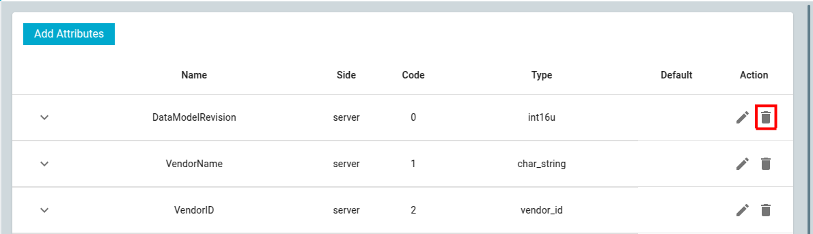

   Remove row

The contents of the edit box depends on the type of the tab, but in general it consists of the following elements:

* Fields to be filled with the specific information about the element.
* Additional buttons to add element-specific nested information.

The following figure shows an example of the edit box:

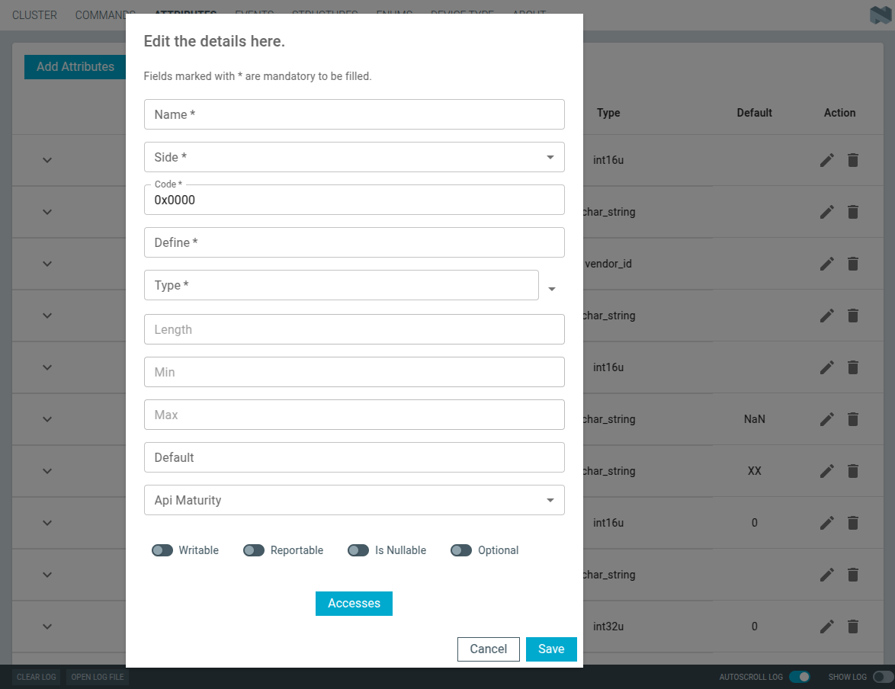

   Edit box

You must fill in all required fields marked with the asterisk before saving the element.
If any of the required fields is not filled, you will see an error message when trying to save the element, see the figure:

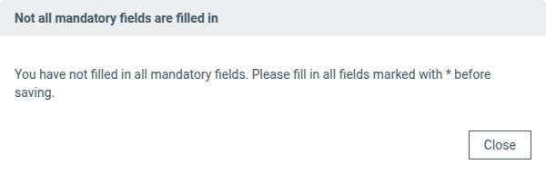

   Edit box error

After clicking an additional button in the edit box, you will see a new dialog with the list of elements.

To add a new element, click the plus icon in the top of the list.
To remove an element, click the trash can icon located under each element in the list.

For example, the :guilabel:`Accesses` button in the edit box dialog window of the :guilabel:`ATTRIBUTES` tab allows to add access control information for the attribute, see the figure:

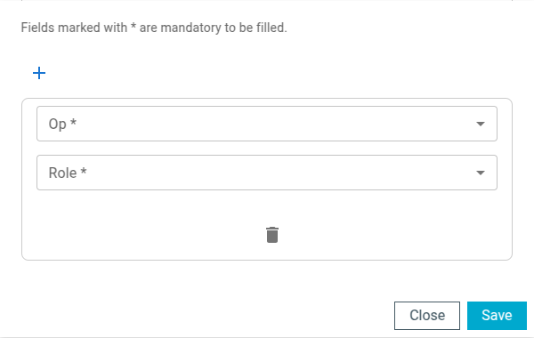

   Edit box access

The number visible on the right upper corner of the additional button represents the current number of elements in the list, see the figure:

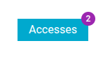

   Edit box access number

Details
-------

You can expand each row in the table to see the details of the element.
Each tab has a dedicated details implementation, so the content depends on the type of the element.

To see the details of an element, click the arrow icon on the left side of the row, see the figure:

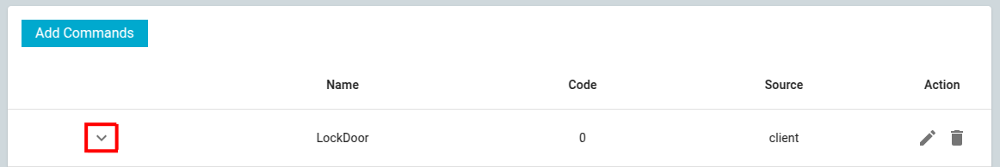

   Details arrow

The following elements can be displayed in the details depending on the type of the element and its content:

* Various text fields with specific information about the element.

  For example:

  .. figure:: images/matter_cluster_tool/matter_cluster_tool_edit_box_details_text_field.png
     :alt: Edit box details text field

     Edit box details text field

* List of additional elements.
  Click the button in this field to open a dedicated dialog with the list of elements.

  The following figure shows an example of details with a list of elements:

  .. figure:: images/matter_cluster_tool/matter_cluster_tool_edit_box_details_list.png
     :alt: Edit box details list

     Edit box details list

  The following figure shows an example of the details with a list of elements:

  .. figure:: images/matter_cluster_tool/matter_cluster_tool_edit_box_details_list_dialog.png
     :alt: Edit box details list dialog

     Edit box details list dialog

* List of boolean elements set to true.

  For example, nullable, reportable and optional elements are set to true:

  .. figure:: images/matter_cluster_tool/matter_cluster_tool_edit_box_details_boolean.png
     :alt: Edit box details boolean

     Edit box details boolean

* List of IDs of the clusters to which the element belongs.

  For example:

  .. figure:: images/matter_cluster_tool/matter_cluster_tool_edit_box_details_clusters.png
     :alt: Edit box details clusters

     Edit box details clusters

.. _ug_nrfconnect_manufacturer_cluster_editor_tool_creating_new_cluster:

Creating a new Matter cluster
*****************************

This section describes how you can create a new Matter cluster and save it as an XML file using the tool.
To create a new cluster definition, complete the following steps:

1. Open the :guilabel:`CLUSTERS` tab and fill in the required fields marked with the asterisk.
   You can fill also the optional fields.
   To see tooltips for the fields, hover your mouse over them.

#. Open one by one the :guilabel:`COMMANDS`, :guilabel:`ATTRIBUTES`, and :guilabel:`EVENTS` tabs and add the required elements to the cluster.
   Click the :guilabel:`Add` button on the top of each element tab to add a new element to the cluster.
   See the :ref:`ug_nrfconnect_manufacturer_cluster_editor_tool_basic_functionalities` section to learn how to add a new element to the cluster.

#. Open one by one the :guilabel:`ENUMS` and :guilabel:`STRUCTURES` tabs and add the required elements.
   The enums and structures do not belong to the cluster, but you can assign them to one or more clusters.
   See the :ref:`ug_nrfconnect_manufacturer_cluster_editor_tool_basic_functionalities` section to learn how to add a new element to the cluster.

#. Click :guilabel:`Save` to save the cluster to a file.

.. _ug_nrfconnect_manufacturer_cluster_editor_tool_creating_cluster_extension:

Creating a cluster extension
****************************

This section describes how you can create a cluster extension and save it as an XML file using the tool.
To create a cluster extension, complete the following steps:

1. Click the :guilabel:`Load from file` button to load an existing cluster definition.
   Use the system file dialog to select the XML cluster file.
   If the file contains more than one cluster, the tool shows the list of available clusters in the context menu.

#. Open one by one the :guilabel:`COMMANDS`, :guilabel:`ATTRIBUTES`, and :guilabel:`EVENTS` tabs and add the required elements to the cluster.
   Click the :guilabel:`Add` button on the top of each element tab to add a new element to the cluster.
   See the :ref:`ug_nrfconnect_manufacturer_cluster_editor_tool_basic_functionalities` section to learn how to add a new element to the cluster.

#. Open one by one the :guilabel:`ENUMS` and :guilabel:`STRUCTURES` tabs and add the required elements.
   The enums and structs do not belong to the cluster, but you can assign them to one or more clusters.
   See the :ref:`ug_nrfconnect_manufacturer_cluster_editor_tool_basic_functionalities` section to learn how to add a new element to the cluster.

#. Click the :guilabel:`Save extension to file` button to save the cluster extension to a file.

.. _ug_nrfconnect_manufacturer_cluster_editor_tool_creating_new_device_type:

Creating a new device type
**************************

This section describes how you can create a new device type and save it as an XML file using the tool.
To create a new device type, complete the following steps:

1. Open the :guilabel:`DEVICE TYPE` tab and fill in the required fields marked with the asterisk.
   You can fill also the optional fields.
   To see tooltips for the fields, hover your mouse over them.

#. Click the :guilabel:`Add Cluster assignment to device type` button to add the required clusters to the device type.
   You will see the dialog window with the following fields:

   * :guilabel:`Cluster` - The cluster to be assigned to the device type.
   * :guilabel:`Client` - Whether the cluster uses the client role for attributes, commands and events.
   * :guilabel:`Server` - Whether the cluster uses the server role for attributes, commands and events.
   * :guilabel:`Client Locked` - Whether the cluster should prevent to use other attributes, commands and events in client role than the ones assigned to the cluster.
   * :guilabel:`Server Locked` - Whether the cluster should prevent to use other attributes, commands and events in server role than the ones assigned to the cluster.

   Below the fields, you can see the four buttons:

   * :guilabel:`Required Attributes` - Add a new assignment to the device type.
   * :guilabel:`Required Commands` - Add a new assignment to the device type.
   * :guilabel:`Required Events` - Add a new assignment to the device type.
   * :guilabel:`Features` - Add a new assignment to the device type.

   The following figure shows the dialog window to assign a cluster to the device type:

   .. figure:: images/matter_cluster_tool/matter_cluster_tool_device_type_add_cluster.png
      :alt: Add cluster assignment to device type

      Add cluster assignment to device type

#. Click one of the :guilabel:`Required` buttons, and in the new dialog window, add a new assignment by clicking the plus icon and filling in the exact name of the attribute, command or event.

   For example, the following figure shows the dialog window to assign required attribute to the cluster:

   .. figure:: images/matter_cluster_tool/matter_cluster_tool_device_type_add_cluster_dialog.png
      :alt: Add cluster assignment to device type dialog

      Add cluster assignment to device type dialog

#. You can also specify the features of the device type by clicking the :guilabel:`Features` button.
   In the new dialog window, click the plus icon to add a new feature, and fill in the code and name of the feature.

   For example:

   .. figure:: images/matter_cluster_tool/matter_cluster_tool_device_type_add_feature.png
      :alt: Add feature to device type

      Add feature to device type

#. Click the :guilabel:`Save extension to file` or :guilabel:`Save cluster type to file` button depending on the purpose of the file.
