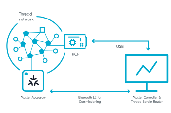

.. _ug_matter_gs_testing_thread_one_otbr:

Matter over Thread: Configuring Border Router and controller on one device
##########################################################################

.. contents::
   :local:
   :depth: 2

If you only have one device, be it a PC with Linux or a Raspberry Pi, you can set up and test the Matter over Thread development environment with both the Thread Border Router and the Matter controller running on this one device.

In this setup, a PC or a Raspberry Pi runs the Thread Border Router and the CHIP Tool for Linux or macOS simultaneously.
To simplify enabling the Thread communication with the Matter accessory device, use a Docker container with the OpenThread Border Router image instead of installing the OpenThread Border Router natively.

   Setup with OpenThread Border Router and Matter controller on the same device

You can use this setup with the CHIP Tool controller.

Requirements
************

To use this setup, you need the following hardware:

* One of the following:

  * 1x PC with Ubuntu (20.04 or newer)
  * 1x Raspberry Pi Model 3B+ or newer with Ubuntu (20.04 or newer) instead of Raspbian OS

* 1x Bluetooth LE dongle (can be embedded inside the PC, like it is on Raspberry Pi)
* 1x nRF52840 DK or nRF52840 Dongle - for the Radio Co-Processor (RCP) device
* 1x nRF52840 DK or nRF5340 DK - for the Matter accessory device (programmed with one of :ref:`matter_samples`)

Configuring the environment
***************************

To configure and use Thread Border Router and Matter controller on the same device, complete the following steps.

.. rst-class:: numbered-step

Program the sample
==================

Program the development kit for the Matter accessory device with one of available :ref:`matter_samples`.
We recommend using :ref:`Matter light bulb <matter_light_bulb_sample>`.

.. rst-class:: numbered-step

Configure the Thread Border Router
==================================

Configure the Thread Border Router on a PC or on a Raspberry Pi, depending on what hardware you are using.
For detailed steps, see the Running OTBR using Docker section on the :ref:`ug_thread_tools_tbr` page in the |NCS| documentation.

.. rst-class:: numbered-step

Configure the CHIP Tool
=======================

|matter_chip_tool_pc_default_line|
For this Matter over Thread, you will configure the controller on the same device as Thread Border Router.

Complete the following steps:

1. Choose one of the following options:

   * Use the prebuilt tool package from the `Matter nRF Connect releases`_ GitHub page.
     Make sure that the package is compatible with your |NCS| version.
   * Build manually from the source files available in the :file:`modules/lib/matter/examples/chip-tool` directory.
     Use the building instructions from the :doc:`matter:chip_tool_guide` page in the Matter documentation.

#. Configure the CHIP Tool controller.
   Complete the following actions by following the steps in the :doc:`matter:chip_tool_guide` user guide in the Matter documentation:

   * Build and run the CHIP Tool by completing the steps listed in "Building and running CHIP Tool".
   * Prepare the environment for testing by completing the steps listed in "Using CHIP Tool for Matter device testing".

.. rst-class:: numbered-step

Continue to testing the sample
==============================

Depending on which Matter sample you programmed onto the development kit, go to this sample's documentation page and complete the steps from the Testing section.
