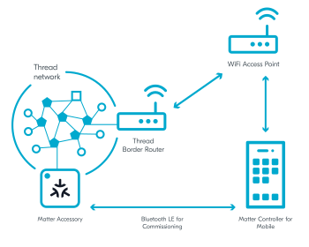

.. _ug_matter_configuring_mobile:
.. _ug_matter_gs_testing_thread_separate_otbr_android:

Matter over Thread: Configuring Border Router and Android controller on separate devices
########################################################################################

.. contents::
   :local:
   :depth: 2

.. include:: thread_separate_otbr_linux_macos.rst
   :start-after: matter_over_thread_separate_intro_start
   :end-before: matter_over_thread_separate_intro_end

In this Android-based setup, the Matter controller is installed on mobile, and a dedicated Wi-Fi Access Point and CHIP Tool for Android are used.

Requirements
************

To use this setup, you need the following hardware:

* 1x smartphone with Android 8+
* 1x Raspberry Pi Model 3B+ or newer (along with an SD card with at least 8 GB of memory)
* 1x Wi-Fi Access Point supporting IPv6 (without the IPv6 Router Advertisement Guard enabled on the router)
* 1x nRF52840 DK or nRF52840 Dongle - for the Radio Co-Processor (RCP) device
* 1x compatible Nordic Semiconductor's DK - for the Matter accessory device (compatible and programmed with one of :ref:`matter_samples`)

Configuring the environment
***************************

To configure and use Thread Border Router and CHIP Tool for Android on separate devices, complete the following steps.

.. rst-class:: numbered-step

Program the sample
==================

Program the development kit for the Matter accessory device with one of available :ref:`matter_samples`.
We recommend using :ref:`Matter light bulb <matter_light_bulb_sample>`.

.. rst-class:: numbered-step

Configure the Thread Border Router
==================================

Configure the Thread Border Router on a Raspberry Pi.
For detailed steps, see the :ref:`ug_thread_tools_tbr` page in the |NCS| documentation.

.. rst-class:: numbered-step

Configure the CHIP Tool for Android
===================================

|matter_chip_tool_android_recommended_line|

Complete the following steps to configure it:

1. Choose one of the following options:

   * Use the prebuilt tool package from the `Matter nRF Connect releases`_ GitHub page.
     Make sure that the package is compatible with your |NCS| version.
   * Build it manually from the source files available in the :file:`modules/lib/matter/src/android/CHIPTool` directory and using the building instructions from the :doc:`matter:android_building` page in the Matter documentation.

#. Complete the following steps from the :doc:`matter:nrfconnect_android_commissioning` user guide in the Matter documentation:

   * Building and installing CHIP Tool for Android - which prepares the controller for commissioning.
   * Preparing accessory device - which prepares your device programmed with the Matter sample for commissioning and provides you with the commissioning QR code.

     .. note::
         In the |NCS|, you can also use :ref:`NFC tag for Matter commissioning <ug_matter_configuring_optional_nfc>`.

   * Commissioning accessory device - which lets you commission your device into the network you created when configuring the Thread Border Router on Raspberry Pi.
   * Sending Matter commands - which checks the IPv6 connectivity.

.. rst-class:: numbered-step

Continue to testing the sample
==============================

Depending on which Matter sample you programmed onto the development kit, go to this sample's documentation page and complete the steps from the Testing section.
