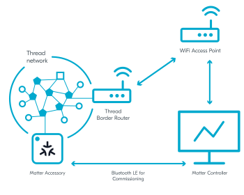

.. _ug_matter_gs_testing_thread_separate_otbr_linux_macos:

Matter over Thread: Configuring Border Router and Linux/macOS controller on separate devices
############################################################################################

.. contents::
   :local:
   :depth: 2

.. matter_over_thread_separate_intro_start

The recommended approach for Matter over Thread is to run the Thread Border Router and the Matter controller on separate devices.
With the Thread Border Router installed on Raspberry Pi, this approach provides support for most functionalities.
For example, it allows using a mobile controller by providing connectivity between a Wi-Fi network and a Thread network.

In such setup, Raspberry Pi runs the Thread Border Router, which provides communication between the Thread nodes and the Matter controller.
The controller can be installed on a PC.
Both the Thread Border Router and the Matter controller must support IPv6 communication over backbone network, for example Wi-Fi or Ethernet.

.. matter_over_thread_separate_intro_end

In this PC-based setup, the Matter controller is installed on PC that is running either Linux or macOS, and a dedicated Wi-Fi Access Point and the CHIP Tool Matter controller are used.
This is the recommended setup.

Requirements
************

To use this setup, you need the following hardware:

* 1x PC with Ubuntu (20.04 or newer)
* 1x Raspberry Pi Model 3B+ or newer (along with an SD card with at least 8 GB of memory)
* 1x Wi-Fi Access Point supporting IPv6 (without the IPv6 Router Advertisement Guard enabled on the router)
* 1x nRF52840 DK or nRF52840 Dongle - for the Radio Co-Processor (RCP) device
* 1x compatible Nordic Semiconductor's DK - for the Matter accessory device (compatible and programmed with one of :ref:`matter_samples`)

Configuring the environment
***************************

To configure and use Thread Border Router and CHIP Tool for Linux or macOS on separate devices, complete the following steps.

.. rst-class:: numbered-step

Program the sample
==================

Program the development kit for the Matter accessory device with one of available :ref:`matter_samples`.
We recommend using :ref:`Matter light bulb <matter_light_bulb_sample>`.

.. rst-class:: numbered-step

Configure the Thread Border Router
==================================

Configure the Thread Border Router on a Raspberry Pi.
For detailed steps, see the :ref:`ug_thread_tools_tbr` page in the |NCS| documentation.

.. rst-class:: numbered-step

Configure the CHIP Tool for Linux or macOS
==========================================

|matter_chip_tool_pc_default_line|
For this Matter over Thread, you will configure the controller on a separate device than the one running Thread Border Router.

Complete the following steps:

1. Choose one of the following options:

   * For Linux only - Use the prebuilt tool package from the `Matter nRF Connect releases`_ GitHub page.
     Make sure that the package is compatible with your |NCS| version.
   * For both Linux and macOS - Build it manually from the source files available in the :file:`modules/lib/matter/examples/chip-tool` directory and using the building instructions from the :doc:`matter:chip_tool_guide` page in the Matter documentation.

#. Configure the CHIP Tool controller.
   Complete the following actions by following the steps in the :doc:`matter:chip_tool_guide` user guide in the Matter documentation:

   * Build and run the CHIP Tool by completing the steps listed in "Building and running CHIP Tool".
   * Prepare the environment for testing by completing the steps listed in "Using CHIP Tool for Matter device testing".

.. rst-class:: numbered-step

Continue to testing the sample
==============================

Depending on which Matter sample you programmed onto the development kit, go to this sample's documentation page and complete the steps from the Testing section.
