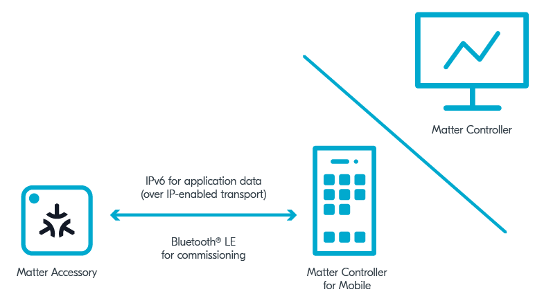

.. _ug_matter_tools:
.. _ug_matter_gs_tools:

Matter tools
############

.. contents::
   :local:
   :depth: 2

Use tools listed on this page to test :ref:`matter_samples` and develop Matter applications in the |NCS|.

GN tool
*******

To build and develop Matter applications, you need the `GN`_ meta-build system.
This system generates the Ninja files that the |NCS| uses.

The GN is automatically installed with the |NCS|'s Toolchain Manager when you :ref:`install the SDK automatically <gs_assistant>`.
If you are updating from the |NCS| version earlier than v1.5.0 or you are installing the |NCS| manually, see the :ref:`GN installation instructions <gs_installing_gn>`.

Matter controller tools
***********************

The following figure shows the available Matter controllers in the |NCS|.

   Controllers used by Matter

You can read more about the Matter controller on the :ref:`Matter network topologies <ug_matter_configuring_controller>` page.
For information about how to build and configure the Matter controller, see the pages in the :ref:`ug_matter_gs_testing` section.

ZAP tool
********

ZCL Advanced Platform, in short ZAP tool, is a third-party tool that is a generic node.js-based templating engine for applications and libraries based on Zigbee Cluster Library.

Installation
============

The tool is provided with the Matter repository in the |NCS| and does not require a separate installation, but you must make sure that you have installed ZAP tool prerequisites, as mentioned in the Quick instructions section in the :file:`README.md` file in the official `ZCL Advanced Platform`_ repository.

Usage
=====

You can use the ZAP tool for the following Matter use cases:

* Enabling and disabling clusters, cluster commands, attributes, and events
* Configuring attributes' default values
* Configuring attributes' properties, such as storage type (RAM storage, non-volatile storage, application-managed)

All the relevant data for these use cases is stored in the ZAP file of your Matter application, which you can edit using the ZAP tool GUI.
A ZAP file is a JSON file that contains the data model configuration of clusters, commands, and attributes that are enabled for a given application.
It is not used directly by the application, but it is used to generate global and customized source files for handling requests enabled by the user.
In the |NCS|, the ZAP file is provided in the :file:`src` directory for each :ref:`Matter sample <matter_samples>`.

For an example of how to use the ZAP tool to edit a ZAP file, see the :ref:`ug_matter_creating_accessory_edit_zap` in the :ref:`ug_matter_creating_accessory` user guide.
For more information about the ZAP tool, see the official `ZCL Advanced Platform`_ documentation.

Matter over Thread tools
************************

You can use the following :ref:`ug_thread_tools` when working with Matter in the |NCS| using the Matter over Thread setup.

Thread Border Router
====================

.. include:: ../../thread/tools.rst
    :start-after: tbr_shortdesc_start
    :end-before: tbr_shortdesc_end

See the :ref:`ug_thread_tools_tbr` documentation for configuration instructions.

nRF Sniffer for 802.15.4
========================

.. include:: ../../thread/tools.rst
    :start-after: sniffer_shortdesc_start
    :end-before: sniffer_shortdesc_end

nRF Thread Topology Monitor
===========================

.. include:: ../../thread/tools.rst
    :start-after: ttm_shortdesc_start
    :end-before: ttm_shortdesc_end
