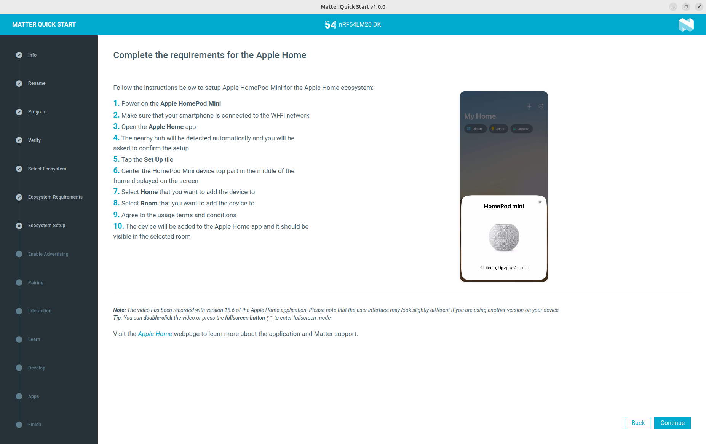

.. _ug_matter_tools:
.. _ug_matter_gs_tools:

Matter tools
############

.. contents::
   :local:
   :depth: 2

Use tools listed on this page to test :ref:`matter_samples` and develop Matter applications in the |NCS|.

.. _ug_matter_gs_tools_gn:
.. _gs_installing_gn:
.. _manual_installation_gn:

GN tool
*******

To build and develop Matter applications, you need the `GN`_ meta-build system.
This system generates the Ninja files that the |NCS| uses.

The GN is automatically installed with the |NCS|'s toolchain when you :ref:`install the nRF Connect SDK <install_ncs>`.
If you are updating from the |NCS| version earlier than v1.5.0, see the following GN installation instructions.

.. toggle:: GN installation instructions

   If you want to build Matter applications with the |NCS| version earlier than v1.5.0, install the `GN`_ meta-build system.
   This system generates the Ninja files that the |NCS| uses.

   .. tabs::

      .. group-tab:: Windows

         To install the GN tool, complete the following steps:

         1. Download the latest version of the GN binary archive for Windows from the `GN website`_.
         2. Extract the :file:`zip` archive.
         3. Ensure that the GN tool is added to your :envvar:`PATH` environment variable.
            For the exact instructions, see :ref:`zephyr:env_vars`.

      .. group-tab:: Linux

         To install the GN tool, complete the following steps:

         1. Create the directory for the GN tool:

            .. code-block:: console

               mkdir ${HOME}/gn && cd ${HOME}/gn

         #. Download the GN binary archive and extract it by using the following commands:

            .. code-block:: console

               wget -O gn.zip https://chrome-infra-packages.appspot.com/dl/gn/gn/linux-amd64/+/latest
               unzip gn.zip
               rm gn.zip

            The wget tool is installed when installing the required tools on Linux.
         #. Add the location of the GN tool to the system :envvar:`PATH`.
            For example, if you are using ``bash``, run the following commands:

            .. code-block:: console

               echo 'export PATH=${HOME}/gn:"$PATH"' >> ${HOME}/.bashrc
               source ${HOME}/.bashrc

      .. group-tab:: macOS

         To install the GN tool, complete the following steps:

         1. Create the directory for the GN tool:

            .. code-block:: console

               mkdir ${HOME}/gn && cd ${HOME}/gn

         #. Download the GN binary archive and extract it by using the following commands:

            * On macOS running on Apple Silicon:

            .. code-block:: console

               curl -o gn.zip -L https://chrome-infra-packages.appspot.com/dl/gn/gn/mac-arm64/+/latest

            * On macOS running on Intel:

            .. code-block:: console

               curl -o gn.zip -L https://chrome-infra-packages.appspot.com/dl/gn/gn/mac-amd64/+/latest

         #. Unzip the archive and then delete it:

            .. code-block:: console

               unzip gn.zip
               rm gn.zip

         #. Add the location of the GN tool to the system :envvar:`PATH`.

            .. code-block:: console

               (echo; echo 'export PATH="'${HOME}'/gn:$PATH"') >> ~/.zprofile
               source ~/.zprofile

.. _ug_matter_gs_tools_controller:

Matter controller tools
***********************

The following figure shows the available Matter controllers in the |NCS|.

.. figure:: ../overview/images/matter_setup_controllers_generic.png
   :width: 600
   :alt: Controllers used by Matter

   Controllers used by Matter

You can read more about the Matter controller on the :ref:`Matter network topologies <ug_matter_configuring_controller>` page.
For information about how to build and configure the Matter controller, see the pages in the :ref:`ug_matter_gs_testing` section.

.. _ug_matter_gs_tools_chip:

CHIP Tool for Linux or macOS
============================

The CHIP Tool for Linux or macOS is the default implementation of the Matter controller role, recommended for the nRF Connect platform.
You can read more about it on the :doc:`matter:chip_tool_guide` page in the Matter documentation.

Depending on your system, you can install the CHIP Tool in one of the following ways:

* For Linux only - Use the prebuilt tool package from the `Matter nRF Connect releases`_ GitHub page.
  Make sure that the package is compatible with your |NCS| version.
* For both Linux and macOS - Build it manually from the source files available in the :file:`modules/lib/matter/examples/chip-tool` directory and using the building instructions from the :doc:`matter:chip_tool_guide` page in the Matter documentation.

.. note::
   To use CHIP Tool for macOS you need to have the appropriate Apple profile installed on your macOS machine.
   To learn how to install the profile and work with Apple devices see the `Testing with Apple Devices`_ user guide in the Matter documentation.

.. _ug_matter_gs_tools_zap:

ZAP tool
********

ZCL Advanced Platform, in short ZAP tool, is a third-party tool that is a generic node.js-based templating engine for applications and libraries based on Zigbee Cluster Library.

You can use the ZAP tool for the following Matter use cases:

* Enabling and disabling clusters, cluster commands, attributes, and events.
* Configuring attributes' default values.
* Configuring attributes' properties, such as storage type (RAM storage, non-volatile storage, application-managed).

All the relevant data for these use cases is stored in the ZAP file of your Matter application, which you can edit using the ZAP tool GUI.
A ZAP file is a JSON file that contains the data model configuration of clusters, commands, and attributes that are enabled for a given application.
It is not used directly by the application, but it is used to generate global and customized source files for handling requests enabled by the user.
In the |NCS|, the ZAP file is provided in the :file:`src` directory for each :ref:`Matter sample <matter_samples>`.

For an example of how to use the ZAP tool to edit a ZAP file, see the :ref:`ug_matter_creating_accessory_edit_zap` in the :ref:`ug_matter_creating_accessory` user guide.
For more information about the ZAP tool, see the official `ZCL Advanced Platform`_ documentation.

.. _ug_matter_tools_installing_zap:

Installing the ZAP tool
=======================

You can install the ZAP tool either automatically or manually:

.. tabs::

   .. tab:: Automatic installation

      You can use the Matter west commands to automatically download and install the appropriate ZAP tool version dedicated to your current Matter revision.
      This tool checks the version of the Matter stack, which is located in the default location based on the ``ZEPHYR_BASE`` variable.
      The ``zap-gui`` and ``zap-generate`` commands automatically install the right version of the ZAP tool in the ``.zap-install`` directory within the |NCS|.
      After the first installation, if the version of the Matter SDK did not change, the installed version will be used for all command invocations.

      To install the ZAP tool according to the default Matter SDK location, use the following command:

      .. code-block:: console

         west zap-gui

      If you need to install the ZAP tool for a specific Matter version, provide the path to the desired Matter SDK location using the ``-m`` or ``--matter-path`` command argument and specify the *path_to_Matter_SDK*:

      .. code-block:: console

         west zap-gui -m <path_to_Matter_SDK>

      .. note::

         Providing a path to a version of the Matter SDK that is incompatible with the |NCS| revision may cause unpredictable errors.

      After the installation is done, you can close the ZAP tool GUI window.

      To read more about Matter west commands, see the :ref:`ug_matter_gs_tools_matter_west_commands` section.

   .. tab:: Manual installation

      You can manually install the ZAP tool using one of the following methods:

      * Download the ZAP tool package in a compatible version manually from the Assets section in `ZCL Advanced Platform releases`_.
      * Configure the tool and manually compile it using the instructions in the official `ZCL Advanced Platform`_ documentation.

      Both of these methods require you to add the ZAP tool location to the system :envvar:`PATH` environment variables.

..

.. _ug_matter_gs_tools_matter_west_commands:

Matter west commands
********************

Matter west commands are a set of commands dedicated for Matter-related purposes and integrated with :ref:`zephyr:west`.
You can use them to simplify work with the Matter application project.

.. _ug_matter_gs_tools_matter_west_commands_zap_tool:

ZAP tool west commands
======================

To simplify work with the :ref:`ug_matter_gs_tools_zap`, there are three commands implemented within the Matter west commands set:

* ``zap-append``
* ``zap-gui``
* ``zap-generate``

By default, both commands look for a :file:`.zap` file in the current directory.
You can also specify the path to the :file:`.zap` file explicitly.

.. _ug_matter_gs_tools_matter_west_commands_append:

``zap-append`` command
----------------------

To simplify adding new custom clusters to the Matter ZCL database and generating the required C++ files, you can use the ``zap-append`` west command.
The command converts the provided XML files with the cluster definition to JSON format and adds them to the data model definition file (:file:`zcl.json`).
You can provide a custom :file:`zcl.json` base file or use the existing one located in :file:`<default Matter SDK location>/src/app/zap-templates/zcl`.
Depending on the provided ``--output`` argument, the command updates the base JSON file or generates a new JSON file with the appended cluster definition to the base.
You can use the generated data model definition file as an argument to the ``zap-gui`` command to add the new cluster to the ZAP tool before launching the GUI.

This is the base command invocation:

.. code-block:: console

   west zap-append <path_to_xml_file>

You can use the following arguments:

* ``-h`` or ``--help`` to display the help message.

* ``-b`` or ``--base`` to provide an absolute path to the base :file:`zcl.json` file.
  The base file must contain the existing data model definition appropriate to the given Matter version.
  If the argument is not provided, the :file:`<default Matter SDK location>/src/app/zap-templates/zcl/zcl.json` file will be used.

* ``-m`` or ``--matter`` to provide a path to a different Matter SDK location than the default one.
  The command will use this path to read the required ZAP tool version.

* ``-o`` or ``--output`` to provide a path to the output directory where the generated JSON file will be stored.
  Use this option if you want to store the generated JSON file in a custom location.
  If not provided, the base :file:`zcl.json` file will be updated.

* ``--clusters`` to provide paths to the XML files that contain the custom cluster definitions.
  You can provide multiple XML files at once.

.. _ug_matter_gs_tools_matter_west_commands_zap_tool_gui:

``zap-gui`` command
-------------------

ZAP tool GUI is a Node.js application used to configure the data model of a Matter application.
It allows you to define endpoints, clusters, commands, attributes, and events for a specific application.
The ``zap-gui`` command installs the appropriate version of the ZAP tool on your host machine and launches the ZAP tool GUI.
The command integrates the :ref:`ug_matter_gs_tools_matter_west_commands_append` functionality, and you can use it to add new vendor-specific clusters before launching the ZAP tool GUI.

This is the base command invocation:

.. code-block:: console

   west zap-gui

You can use the following optional arguments:

* ``-h`` or ``--help`` to display the help message.

* ``-z`` or ``--zap-file`` to provide a path to the :file:`.zap` file.
  Use this option if you invoke the ``zap-gui`` command outside the project directory.

* ``-j`` or ``--zcl-json`` to provide a path to the data model definition file (:file:`zcl.json`).
  If the argument is not provided, the :file:`<default Matter SDK location>/src/app/zap-templates/zcl/zcl.json` file will be used.

* ``-m`` or ``--matter-path`` to provide a path to a different Matter SDK location than the default one.
  The command will use this path to read the required ZAP tool version.

* ``-c`` or ``--cache`` to provide a patch to the custom cache directory.
  If not provided a temporary cache directory will be used and removed automatically after closing the ZAP tool GUI.
  To keep the same cache for multiple invocations, provide the same path to the cache directory each time.

* ``clusters <cluster_name>`` to add a new cluster to the ZCL.
  Use this option to add a new cluster to the ZAP tool before launching the GUI.
  The cluster must be written in the XML file format and contains attributes, commands, and events and other required information.
  See the :ref:`ug_matter_creating_custom_cluster` user guide for more information.

.. _ug_matter_gs_tools_matter_west_commands_zap_tool_generate:

``zap-generate`` command
------------------------

A Matter application requires data model C++ files generated from the project :file:`.zap` file.
To generate the files, you can use the ``zap-generate`` Matter west command.

If you do not provide an output directory as an argument, the command will create and use a :file:`zap-generated/` directory within the directory containing the source :file:`.zap` file.
All generated C++ files will be stored in this directory.

This is the base command invocation:

.. code-block:: console

   west zap-generate

You can use the following optional arguments:

* ``-h`` or ``--help`` to display the help message.

* ``-z`` or ``--zap-file`` to provide a path to the :file:`.zap` file.
  Use this option if you call the ``zap-generate`` command outside the project directory.

* ``-o`` or ``--output`` to provide a path to the directory where output C++ files will be stored.
  Use this option if you call the ``zap-generate`` command outside the project directory.

* ``-m`` or ``--matter-path`` to provide a path to a different Matter SDK location than the default one.
  The command will use this path to read the required ZAP tool version and use the generation script from it.

.. _ug_matter_gs_tools_matter_west_commands_sync:

``zap-sync`` command
--------------------

This command will synchronize the ZAP file with the Matter Data Model and the :file:`zcl.json` file with the base :file:`zcl.json` file in the Matter SDK.
Use this command when you are about to update the Matter SDK revision in your project.

If you have custom clusters or device types in your project, you need to call this function with the additional ``-j`` and ``--clusters`` arguments.
For example:

.. code-block:: console

    west zap-sync -j zcl.json --clusters MyCluster.xml

You can use the following optional arguments:

* ``-z`` or ``--zap-file`` to provide a path to the :file:`.zap` file.
  Use this option if you invoke the ``zap-sync`` command outside the project directory.

* ``-j`` or ``--zcl-json`` to provide a path to the data model definition file (:file:`zcl.json`).
  If the argument is not provided, the :file:`<default Matter SDK location>/src/app/zap-templates/zcl/zcl.json` file will be used.

* ``-c`` or ``--clusters`` to provide paths to the XML files that contain the custom cluster definitions.

* ``-m`` or ``--matter-path`` to provide a path to a different Matter SDK location than the default one.

.. _ug_matter_gs_tools_matter_quickstart:

Matter Quick Start app
**********************

The Matter Quick Start app is a GUI tool for setting up and configuring Matter accessory devices.
It lets you evaluate Matter samples using precompiled HEX files, without the need of setting up the development environment.
You can use it to set up and test Matter devices with compatible commercial smart home ecosystems.

   Matter Quick Start app

The tool is available in `nRF Connect for Desktop`_.
For installation instructions and more information about the tool, see the `Matter Quick Start app`_ documentation.

.. _ug_matter_gs_tools_matter_cluster_editor:

Matter Cluster Editor app
*************************

The Matter Cluster Editor app is a GUI tool for creating new manufacturer-specific clusters or creating an extensions to the existing clusters.

.. note::
   |matter_cluster_editor_preview|

The tool is available in `nRF Connect for Desktop`_.
For installation instructions and more information about the tool, see the `Matter Cluster Editor app`_ documentation.

See also :ref:`ug_matter_creating_custom_cluster`.

.. _ug_matter_gs_tools_cert:

CHIP Certificate Tool
*********************

Matter's CHIP Certificate Tool, in short chip-cert, is a command-line utility tool for generating and editing Matter certificates such as Certificate Declarations (CD), Device Attestation Certificates (DAC), Product Attestation Intermediate (PAI) certificates, and Product Attestation Authority (PAA) certificate, alongside their related keys.
You can use it for integration testing purposes while working on a :ref:`Matter end product <ug_matter_intro_device>`.

For more information about the chip-cert tool, see how to :ref:`generate custom certification declarations <ug_matter_device_configuring_cd_generating_steps>` for integration testing in the |NCS|.
You can also take a look at the `CHIP Certificate Tool source files`_.

.. _ug_matter_gs_tools_cert_installation:

Installing CHIP Certificate Tool
================================

To install the chip-cert tool, complete the following steps:

1. Navigate to the :file:`connectedhomeip` root directory.
#. In a terminal, run the following command to build the tool executable file:

   .. code-block:: console

      cd src/tools/chip-cert && gn gen out && ninja -C out chip-cert

#. Add the chip-cert tool to the system :envvar:`PATH` environment variable when built.

Generating custom certificates in factory data
==============================================

Adding the chip-cert tool to the system :envvar:`PATH` allows you to build :ref:`matter_samples`, the :ref:`Matter weather station <matter_weather_station_app>`, and the :ref:`Matter bridge <matter_bridge_app>` applications with custom certificates included in the factory data.
This lets you for example change the test Vendor ID, Product ID, or other data.

To build a Matter application in the |NCS| with custom certification data, make sure to set the :kconfig:option:`CONFIG_CHIP_FACTORY_DATA_USE_DEFAULT_CERTS` to ``n`` when :doc:`building an example with factory data <matter:nrfconnect_factory_data_configuration>`.

.. _ug_matter_gs_tools_spake2:

SPAKE2+ Python tool
*******************

SPAKE2+ Python Tool is a Python script for generating SPAKE2+ protocol parameters.
The protocol is used during Matter commissioning to :ref:`establish a secure session <ug_matter_overview_commissioning_stages_case>` between the commissioner and the commissionee.

.. note::
   Currently, the tool only supports generating Verifier parameters.

For usage examples, see the `SPAKE2+ Python Tool page`_ in the Matter SDK official documentation.

.. _ug_matter_gs_tools_mot:

Matter over Thread tools
************************

You can use the following :ref:`ug_thread_tools` when working with Matter in the |NCS| using the Matter over Thread setup.

Thread Border Router
====================

.. include:: ../../thread/tools.rst
    :start-after: tbr_shortdesc_start
    :end-before: tbr_shortdesc_end

See the :ref:`ug_thread_tools_tbr` documentation for configuration instructions.

nRF Sniffer for 802.15.4
========================

.. include:: ../../thread/tools.rst
    :start-after: sniffer_shortdesc_start
    :end-before: sniffer_shortdesc_end

nRF Thread Topology Monitor
===========================

.. include:: ../../thread/tools.rst
    :start-after: ttm_shortdesc_start
    :end-before: ttm_shortdesc_end

.. _ug_matter_gs_tools_opp:

Online Power Profiler for Matter over Thread
********************************************

`Online Power Profiler for Matter over Thread`_ is a web tool that allows you to estimate the power consumption of your Matter devices.
It provides a graphical interface for configuring the parameters of your device, such as TX power, voltage supply, or ICD configuration and simulating its power consumption based on the simplified, theoretical model.
The tool supports the nRF52840, nRF5340 and nRF54L15 platforms.
It allows you to also estimate the power consumption of your device in a selected period of time and use the output for estimating the lifetime of the battery used as a power source.
