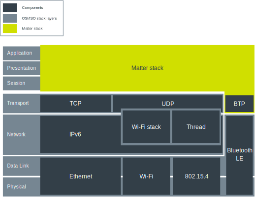
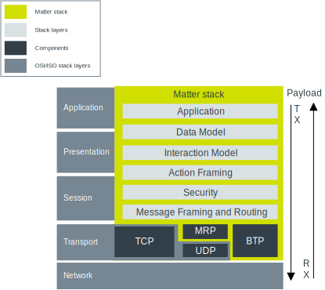

.. _ug_matter_architecture:
.. _ug_matter_overview_architecture:

Matter architecture
###################

.. contents::
   :local:
   :depth: 2

Matter defines an application layer on top of the IPv6-based transport protocols.
This allows for routing messages regardless of the underlying physical and link layers.

   Matter architecture overview

Stack architecture overview
***************************

The Matter application layer can be broken down into several main components, as shown on the following diagram.

   Matter stack overview

At its lowest layer, the Matter stack interacts with the Transport layer.
The payload flows down the protocol stack on the transmitting device and up the protocol stack on the receiving device.

.. _ug_matter_architecture_overview_app:

Application
***********

The Application layer defines the business logic for a given end product.
For example, for a door lock application, the business logic could be opening and closing a specific model of the door bolt in reaction to a voice command from a specific virtual assistant technology.
It could also define input from a specific PIN keyboard UI, reaction on a specific LED on the door bolt model, and so on.

.. _ug_matter_architecture_overview_dm:

Data Model
**********

.. include:: data_model.rst
   :start-after: ug_matter_data_model_desc_start
   :end-before: ug_matter_data_model_desc_end

For more information about the Data Model, see :ref:`ug_matter_overview_data_model`.

.. _ug_matter_architecture_overview_im:

Interaction Model
*****************

While the `Data Model`_ layer describes abstraction for handling data, the Interaction Model defines how to exchange this data between nodes through interactions.

.. include:: int_model.rst
   :start-after: ug_matter_int_model_desc_start
   :end-before: ug_matter_int_model_desc_end

.. _ug_matter_architecture_overview_af:

Action Framing
**************

The Action Framing layer transforms messages that are part of interactions from the `Interaction Model`_ into serialized binary packets.

.. _ug_matter_architecture_overview_sec:

Security
********

The Security layer takes the encoded frames from the `Action Framing`_ layer, encrypts them and appends them with a message authentication code.

.. _ug_matter_architecture_overview_routing:

Message Framing and Routing
***************************

This layer is responsible for composing the payload with required and optional header fields.
These header fields specify both the properties of the message and its logical routing information.

.. _ug_matter_architecture_overview_transport:

Transport and IP Framing
************************

This layer manages the transmission of the payload through the IP network to the peer device.
It uses either the Transmission Control Protocol (TCP) or the combination of User Datagram Protocol (UDP) with Matter's Message Reliability Protocol (MRP).
The MRP implements retransmissions, provides confirmation of delivery, and ensures that duplicated messages are rejected.
During the commissioning process, Bluetooth Transport Protocol over Bluetooth LE can be used instead of this layer.
