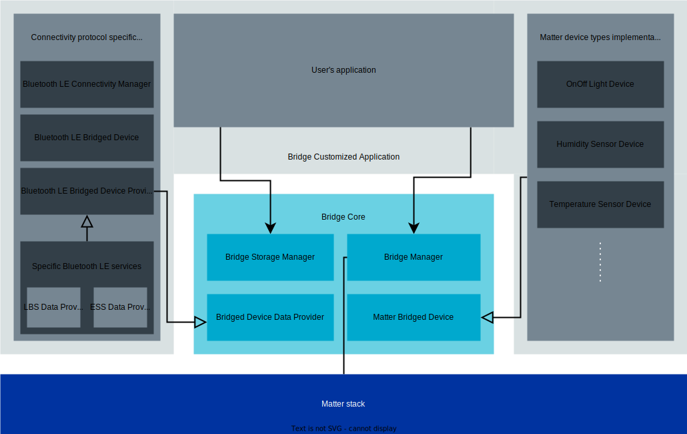

.. _ug_matter_overview_bridge:

Matter Bridge
#############

.. contents::
   :local:
   :depth: 2

A Matter bridge is a device that makes it possible to use non-Matter IoT devices in a Matter fabric together with native Matter devices.
A non-Matter devices used this way is called a *bridged device*.
A Matter bridge exposes the bridged devices to Matter nodes in a fabric as Matter endpoints.
This exposure is transparent, meaning that the Matter nodes are able to communicate with non-Matter bridged devices as if they were native Matter devices.

The Matter bridge translates between the specific subset of the Matter data model and the data representation specific for the other protocol.
It is not the role of a bridge to translate all traffic between the protocols used on the networking layer.
The Matter specification describes only the part of bridge functionality strictly related to the Matter data model and communication with native Matter nodes.

It is out of scope for the Matter specification to define:

* The connectivity technologies used by the bridged devices, so they can use any technology (for example, Bluetooth® LE or Zigbee) as long as the Matter bridge supports it too.
* The subset of Matter device types supported by the bridge.
* The user interface used by the application to add or remove bridged devices to the bridge.

The manufacturer of the bridge product has to define these requirements and implement the necessary functionalities.

The following figure shows an example network topology with a Matter controller using two Matter endpoints: a Matter light bulb and a Bluetooth LE light bulb that is bridged to the Matter fabric by a Matter bridge device.

.. figure:: images/matter_bridge_topology.svg
   :alt: Example Matter topology using a bridged Bluetooth LE device

   Example Matter topology using a bridged Bluetooth LE device

Bridging principles
*******************

The Matter bridge uses a dedicated Matter endpoint that fulfills the Aggregator device type requirements to represent bridging capabilities.
Specifically, this endpoint uses a Descriptor cluster with the PartsList attribute to store all endpoints that represent the bridged devices connected to the bridge.

Additionally, the bridge represents every bridged device using one or more Matter endpoints, depending on the functionalities supported by the bridged device.
Every bridged device exposed by the bridge has to fulfill all requirements for the corresponding Matter device type.
Unlike native Matter nodes, the bridged device has a dedicated Bridged Device Basic Information cluster enabled on its endpoint to provide basic information about the device.

Since bridged devices can be added to the bridge or removed from it at runtime, the list of endpoints exposed by the bridge can be dynamically updated.

.. _ug_matter_overview_bridge_ncs_implementation:

Implementation in the |NCS|
***************************

The |NCS| includes a reference implementation of the Matter bridge core, located in the :file:`samples/matter/common/bridge` directory.
The core implementation is not dependent on any specific connectivity technology, and provides basic bridge functionalities and a generic API.
In addition to the core part, the |NCS| also includes an example :ref:`matter_bridge_app` application that you can use as a reference for creating your own application.

The Matter bridge translates between the Matter data model and the data representation specific for other protocols.
It is not possible to provide a generic translation between Matter and all other IoT protocols.
The |NCS| application implements support for the Bluetooth LE protocol, but you can also disable Bluetooth LE support and use the core implementation part to create an application bridging Matter to any connectivity technology.

The bridge application can be customized in various ways depending on the supported connectivity protocol and Matter device types used for bridging, or the UI used to control the device.
The following figure shows the software components of the bridge core and their relation to the user's application:

   Matter bridge software architecture

In the figure, there are four major software modules included in the Bridge core:

* ``Matter Bridged Device`` - The abstract class that defines common functionalities for all Matter bridged devices.
  The user's application can create specific Matter bridged device objects, such as OnOff Light Device, that inherit the base class functionality.
* ``Bridged Device Data Provider`` - The abstract class that defines common functionalities for all Bridged Device Data Providers.
  The providers are objects that provide data for Matter bridged devices and represent the interface to the bridged device on the non-Matter side.
  The user's application can create a specific implementation of a data provider that can, for example, obtain data from physical devices using the Bluetooth LE protocol.
* ``Bridge Manager`` - The main component of a bridge.
  It forwards information between bridged devices, their data providers, the user's application, and the Matter stack.
* ``Bridge Storage Manager`` - The software module that is used to make information about bridged devices connected to the bridge persistent.
  It makes it possible to restore the application state after rebooting the bridge device.
