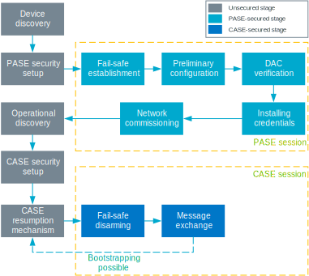

.. _ug_matter_overview_commissioning:
.. _ug_matter_network_topologies_commissioning:

Matter network commissioning
############################

.. contents::
   :local:
   :depth: 2

The commissioning in Matter is a process of joining a device to a fabric (operational network).

Commissioning device roles
**************************

The process takes place between the following devices:

* Commissioner device, which is the Matter controller that is carrying out the commissioning.
* Commissionee device, which is the Matter accessory device that is being added to the fabric.

Commissioning prerequisites
***************************

To start the commissioning procedure, the controller must get the onboarding information from the Matter accessory device.
The data payload includes the following information, among other things:

* 16-bit Vendor ID and 16-bit Product ID
* 12-bit device discriminator
* 27-bit setup passcode
* 8-bit Discovery Capabilities Bitmask

.. _ug_matter_network_topologies_commissioning_onboarding_formats:

Onboarding information formats
==============================

The data payload can be encoded in one of the following ways, either included on-device or in the packaging for the end products (or both):

* Manual Pairing Code - which provides the onboarding information as a sequence of digits that can be used with most Matter commissioners.
* QR Code - which you can scan using the appropriate mobile application for your ecosystem.
* QR Code Payload - which is a alphanumeric code that you can use in command-line tools.
  For testing purposes, it can be printed to the UART console or be shared using an NFC tag.
  This code is represented visually by the QR Code.

Manual Pairing Code must always be supported, while the QR Code is recommended.
Different ecosystems can also define their own methods of providing the discriminator and setup passcode.

Commissioning stages
********************

The commissioning procedure consists of the stages presented on the following figure.
Each is discussed in the following sections.

   Matter commissioning overview

Device discovery
================

The commissioner discovers devices that can be commissioned onto the network.

The devices that are to be commissioned need to let the commissioner know about their existence, that is *advertise* their presence.
This can happen using the following advertising methods:

* Bluetooth® LE - This method is used especially if the node is being added to its first Matter fabric.
* DNS-SD - This method is commonly used if the node is connected to Ethernet or is already a member of a Wi-Fi or Thread network.
* Planned for future releases: Wi-Fi Access Point - This method will use the Wi-Fi Soft-AP functionality and will be used for devices that are not yet members of any network.

The advertisement priority is defined within the Discovery Capabilities Bitmask, provided in the onboarding data.

Security setup with PASE
========================

The commissioner runs the Passcode-Authenticated Session Establishment (PASE) protocol, which is exclusive to the commissioning process.
This protocol is used to establish the first session between devices that take part in commissioning.
The session is established with a passcode provided out-of-band and that is used to derive encryption keys.
This passcode is known only to the commissioner and the commissionee.

There can be only one ongoing PASE sessions at a time.

Establishing fail-safe
======================

The commissioner requests the commissionee to back up its original configuration.
The fail-safe acts as a back-up, but it also starts a timer that sets a limit for the whole commissioning process.
The timer is disabled with the disarming of the fail-safe at the end of commissioning.

Preliminary node configuration
==============================

The commissioner reads the Basic Information Cluster attributes of the commissionee and its device type.
It then configures the commissionee with regulatory information, such as location and country, and the current UTC time.

Device Attestation Certificate verification
===========================================

The commissioner checks whether the commissionee is a certified Matter device.
As part of this verification, the commissioner generates a random 32-bit attestation nonce and sends it to the commissionee, who should return the signed attestation information that includes the nonce.
Usage of a nonce prevents replay attacks against commissioners.
The commissioner then validates the attestation information.

The verification succeeds if the device is able to prove the validity and ownership of the mandatory :ref:`ug_matter_device_attestation` elements.
If the validity and ownership cannot be proven, the verification fails.
The commissioner can then either terminate or continue the commissioning procedure.

Installing operational credentials
==================================

The commissioner installs Node Operational Certificate (NOC) and Operational ID on the commissionee.
The commissionee becomes the new node of the Matter fabric.
The node is identified by a tuple consisting of the Root PK, Fabric ID, and Node ID.
(While the fabric is identified by a tuple consisting of the Root PK and the Fabric ID.)

Network commissioning
=====================

The commissioner provisions the commissionee node with the operational network credentials, either Wi-Fi or Thread, and requests the commissionee to connect to the network.

Operational discovery
=====================

The commissioner discovers the commissionee node on the operational network using DNS-SD.
This way, the commissioner learns the IP address of the node.

Security setup with CASE
========================

The commissioner and the node use the Certificate-Authenticated Session Establishment (CASE) protocol to establish secure communication.
The CASE protocol is in charge of exchanging NOCs to set up a session secured with a new pair of keys.
The CASE connection is reset each time a device breaks the connection.

Disarming fail-safe
===================

The commissioner requests the commissionee node to remove the stored configuration backup.
This also stops the fail-safe timer.

Message exchange
================

The commissioner and the commissionee start exchanging AES-encrypted messages on the operational network.

Commissioning connection scenarios
**********************************

The commissioning stages can take place in one of the following connection scenarios between the commissioner and the commissionee:

* Concurrent connection commissioning flow -- where it is possible to have two network connections simultaneously: one on the operational network and one on the commissioning channel.
* Non-concurrent connection commissioning flow -- where the connection to the operational network immediately breaks the connection on the commissioning channel.

This is because the commissioning process can take place over a different network interface (for example Bluetooth LE) than the interface used for connection with the operational network (for example Thread or Wi-Fi).

Commissioning results
*********************

At the end of the commissioning procedure, the device that has successfully joined the Matter fabric will have the following information configured:

* New instance name, constructed using the fabric ID and the node ID (assigned by the commissioner)
* New Node Operational Certificate for the Matter fabric it has joined
* New Private Key for NOC
* New Access Control List
* Information about operational network
