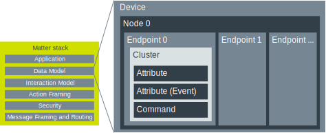
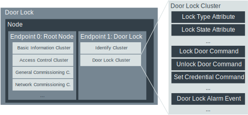

.. _ug_matter_overview_data_model:

Matter Data Model and device types
##################################

.. contents::
   :local:
   :depth: 2

.. ug_matter_data_model_desc_start

The Data Model layer describes the supported remote operations of a Matter node using the concepts of attributes, commands and events, grouped into logical blocks called clusters.
The clusters included in the `Matter Application Cluster Specification <CSA Specifications Download Request_>`_ have well-defined scope and behavior to assure interoperability between Matter nodes developed by different vendors.
A cluster can be abstract, meaning that it can underlie several device types to reduce the time and cost of introducing new product categories to Matter.

   Data Model layer overview

.. ug_matter_data_model_desc_end

Nodes
   Each device is composed of one or more nodes, which are complete implementations of a Matter application functionality on a single stack.
   Nodes are identifiable with a unique network address on a single network.
   They can communicate directly with other nodes in the network.

Endpoints
   Each node is composed of one or more endpoints, which contain feature sets of single device functionalities.
   For example, in a voice-controlled door lock device, one endpoint could include the feature set for operating the bolt, while the other endpoint could include the feature set for handling a temperature sensor.

   .. note::
      Endpoint 0 is always reserved for Matter's Utility Clusters.
      This is the only mandatory endpoint for each Matter device.

Clusters
   Endpoints are composed of one or more clusters, which group attributes, commands and events that together make up each single feature in a set.
   For example, in an endpoint for operating a door bolt, one cluster could group attributes for moving the bolt to open or closed position, while other could group attributes for controlling alarms in case the door is opened in unauthorized way.

   Clusters can be of the following types:

   * Server -- responsible for holding values for Attributes, Commands, and Events.
   * Client -- responsible for performing interactions with other Server Clusters.

   The supported Matter application clusters are described in the Application Cluster Specification, available from the `CSA Specifications Download Request`_ page.
   Sets of clusters on one or more endpoint can form a :ref:`device type <ug_matter_device_types>`, that is an officially defined collection of requirements that is conformant with the Device Library Specification.

Attributes
   Attributes are data entities that represent a physical quantity or state.
   They are stored in the Matter device's memory, but can also be calculated dynamically on demand.

Commands
   Commands are actions that can be used to trigger some behavior on other devices.
   For example, in a door lock device the lock door command can be used to trigger such action on a physical device.

Events
   Events are a type of attributes that communicate device state changes.
   They can also be treated as historical data records of something that happened on the device in the past.

Data Model example: Door Lock
*****************************

The following figure illustrates the Data Model structure of a common door lock device.

   Data Model Door Lock example

Each Matter node must ensure that its Endpoint 0 satisfies the requirements of the Root Node device type.
This device type enforces the availability of clusters used in the process of :ref:`Matter commissioning <ug_matter_overview_commissioning>` and further administering of a Matter node.

Besides the Root Node endpoint, the door lock device provides Endpoint 1, which implements the Door Lock Device Type functionality as defined in the Matter Device Library Specification.
This device type enforces the availability of the ``Identify`` and ``DoorLock`` clusters.

Identify cluster
================

The ``Identify`` cluster is a cluster shared across many device types.
It provides commands that allow a user to trigger a special effect, such as blinking an LED, that helps find the physical location of the device.

DoorLock cluster
================

The ``DoorLock`` cluster is a large cluster that contains many attributes, commands, and events for managing and operating a smart lock.

Examples of the attributes are the following:

 * ``LockType`` - A constant that assigns the device to one of the known lock categories.
 * ``LockState`` - An attribute that renders the current state of the lock: locked, unlocked, or moving from one position to another.

Examples of the commands are the following:

 * ``LockDoor`` and ``UnlockDoor`` - For remotely operating the lock.
 * ``SetCredential`` - For configuring the lock to require a specified credential, such as PIN code, to unlock the door.

An example of the event is ``DoorLockAlarm``, which records occurrences of critical states of the lock.
Examples of the critical states are jamming the lock or exceeding the limit of wrong PIN code entries.

.. _ug_matter_device_types:

Matter device types
*******************

A Matter device type is an officially defined collection of requirements for one or more endpoints.
Device types are intended to ensure interoperability of different device brands on the market.

All device types are defined in the Device Library Specification, which is available from the `CSA Specifications Download Request`_ page.
Each device type definition is composed of the following elements:

* Device type ID
* Device type revision
* One or more mandatory clusters, including each cluster's minimum revision

The device type definition in the Device Library specification can change over time.
The changes are tracked using the Device Type Revision value, which is initially set to ``1``.
Changes do not modify how the device works, but only improve its functionality.

A device type can require other device types for its composition, making it a *composed device type*.

Device type overview
********************

The following tables list the *application device types* that are supported in Matter.

* The description for each device type is taken from the Device Library Specification.
* The state of the device specifies whether a device type can be subject to certification.
  The `Provisional` state indicates that the device type implementation is not yet fully tested and certified, even though the implementation may be ready and you can use it on your own risk.
* The dedicated sample column provides the link to the sample in the |NCS| that implements the given device type, if available.

You can add support for device types without a dedicated sample in the |NCS| by using the :ref:`matter_template_sample` and following the :ref:`ug_matter_creating_accessory` user guide, which describes how to edit clusters of a Matter application.

.. _ug_matter_device_types_lighting:

Lighting device types
=====================

+-------------------+------------------------------------------------------------------------------+---------------------+---------------------------------------+
| Device type       | Description (from Device Library Specification)                              | State of the device | Dedicated sample in the |NCS|         |
+===================+==============================================================================+=====================+=======================================+
| On/Off Light      | The On/Off Light is a lighting device that is capable of being switched on   | Certifiable         |                                       |
|                   | or off by means of a bound controller device such as an on/off light switch  |                     |                                       |
|                   | or a non-color controller. In addition, an on/off light is also capable      |                     |                                       |
|                   | of being switched by means of a bound occupancy sensor.                      |                     |                                       |
+-------------------+------------------------------------------------------------------------------+---------------------+---------------------------------------+
| Dimmable Light    | A Dimmable Light is a lighting device that is capable of being switched on   | Certifiable         | :ref:`matter_light_bulb_sample`       |
|                   | or off and the intensity of its light adjusted by means of a bound           |                     |                                       |
|                   | controller device such as a dimmer switch or a non-color controller.         |                     |                                       |
|                   | In addition, a Dimmable Light device is also capable of being switched       |                     |                                       |
|                   | by means of a bound occupancy sensor.                                        |                     |                                       |
+-------------------+------------------------------------------------------------------------------+---------------------+---------------------------------------+
| Color Temperature | A Color Temperature Light is a lighting device that is capable of being      | Certifiable         |                                       |
| Light             | switched on or off, the intensity of its light adjusted, and its color       |                     |                                       |
|                   | adjusted by means of a bound controller device such as a color controller.   |                     |                                       |
|                   | The color temperature light supports adjustment of color by means of color   |                     |                                       |
|                   | temperature.                                                                 |                     |                                       |
+-------------------+------------------------------------------------------------------------------+---------------------+---------------------------------------+
| Extended Color    | An Extended Color Light is a lighting device that is capable of being        | Certifiable         |                                       |
| Light             | switched on or off, the intensity of its light adjusted, and its color       |                     |                                       |
|                   | adjusted by means of a bound controller device such as a color controller.   |                     |                                       |
|                   | The device supports adjustment of color by means of hue/saturation,          |                     |                                       |
|                   | enhanced hue, color looping, XY coordinates, and color temperature.          |                     |                                       |
|                   | In addition, the extended color light is also capable of being switched      |                     |                                       |
|                   | by means of a bound occupancy sensor.                                        |                     |                                       |
+-------------------+------------------------------------------------------------------------------+---------------------+---------------------------------------+

.. _ug_matter_device_types_plugs_outlets:

Smart Plugs/Outlets device types
================================

+-------------------+------------------------------------------------------------------------------+---------------------+---------------------------------------+
| Device type       | Description (from Device Library Specification)                              | State of the device | Dedicated sample in the |NCS|         |
+===================+==============================================================================+=====================+=======================================+
| On/Off Plug-in    | An On/Off Plug-in Unit is a device that is capable of being switched on      | Certifiable         |                                       |
| Unit              | or off by means of a bound controller device such as an on/off light switch  |                     |                                       |
|                   | or a non-color controller. The On/Off Plug-in Unit is then capable of having |                     |                                       |
|                   | a non-communicating light attached to it.                                    |                     |                                       |
+-------------------+------------------------------------------------------------------------------+---------------------+---------------------------------------+
| Dimmable Plug-In  | A Dimmable Plug-In Unit is a device that is capable of being switched on     | Certifiable         |                                       |
| Unit              | or off and have its level adjusted by means of a bound controller device     |                     |                                       |
|                   | such as a dimmer switch or a non-color controller. The device is then        |                     |                                       |
|                   | capable of having a non-communicating light attached to it.                  |                     |                                       |
+-------------------+------------------------------------------------------------------------------+---------------------+---------------------------------------+
| Pump              | A Pump device is a pump that may have variable speed. It may have optional   | Certifiable         |                                       |
|                   | built-in sensors and a regulation mechanism. It is typically used            |                     |                                       |
|                   | for pumping fluids like water.                                               |                     |                                       |
+-------------------+------------------------------------------------------------------------------+---------------------+---------------------------------------+
| Water Valve       | A Water Valve is a device that is capable of being switched on and off       | Certifiable         |                                       |
|                   | and performing flow measurements.                                            |                     |                                       |
+-------------------+------------------------------------------------------------------------------+---------------------+---------------------------------------+
| Mounted On/Off    | A Mounted On/Off Control is a fixed device that provides power to another    | Certifiable         |                                       |
| Control           | device that is plugged into it, and is capable of switching that provided    |                     |                                       |
|                   | power on or off.                                                             |                     |                                       |
+-------------------+------------------------------------------------------------------------------+---------------------+---------------------------------------+
| Mounted Dimmable  | A Mounted Dimmable Load Control is a fixed device that provides power        | Certifiable         |                                       |
| Load Control      | to another device that is plugged into it, and is capable of being           |                     |                                       |
|                   | switched on or off and have its level adjusted.                              |                     |                                       |
+-------------------+------------------------------------------------------------------------------+---------------------+---------------------------------------+
| Irrigation System | An irrigation system is used to control a group of irrigation zones to water | Certifiable         |                                       |
|                   | the landscape. A physical irrigation system typically has a set of electrical|                     |                                       |
|                   | terminals to which in-ground water valves are connected so that the system   |                     |                                       |
|                   | can actuate them.                                                            |                     |                                       |
+-------------------+------------------------------------------------------------------------------+---------------------+---------------------------------------+

.. _ug_matter_device_types_switches_controls:

Switches and Controls device types
==================================

+-------------------+------------------------------------------------------------------------------+---------------------+---------------------------------------+
| Device type       | Description (from Device Library Specification)                              | State of the device | Dedicated sample in the |NCS|         |
+===================+==============================================================================+=====================+=======================================+
| On/Off Light      | An On/Off Light Switch is a controller device that,                          | Certifiable         |                                       |
| Switch            | when bound to a lighting device such as an on/off light, is capable of       |                     |                                       |
|                   | being used to switch the device on or off. The on/off light switch is also   |                     |                                       |
|                   | capable of being configured when bound to a suitable configuration device.   |                     |                                       |
+-------------------+------------------------------------------------------------------------------+---------------------+---------------------------------------+
| Dimmer Switch     | A Dimmer Switch is a controller device that, when bound to a lighting device | Certifiable         | :ref:`matter_light_switch_sample`     |
|                   | such as a dimmable light, is capable of being used to switch the device on   |                     |                                       |
|                   | or off and adjust the intensity of the light being emitted. A Dimmer Switch  |                     |                                       |
|                   | device is also capable of being configured when bound to a suitable          |                     |                                       |
|                   | configuration device.                                                        |                     |                                       |
+-------------------+------------------------------------------------------------------------------+---------------------+---------------------------------------+
| Color Dimmer      | A Color Dimmer Switch is a controller device that, when bound to a lighting  | Certifiable         |                                       |
| Switch            | device such as a color light, is capable of being used to adjust the color   |                     |                                       |
|                   | of the light being emitted. A Color Dimmer Switch device is also capable     |                     |                                       |
|                   | of being configured when bound to a suitable configuration device.           |                     |                                       |
+-------------------+------------------------------------------------------------------------------+---------------------+---------------------------------------+
| Control Bridge    | A Control Bridge is a controller device that, when bound to a lighting       | Certifiable         |                                       |
|                   | device such as a color light, is capable of being used to switch the device  |                     |                                       |
|                   | on or off, adjust the intensity of the light being emitted and adjust        |                     |                                       |
|                   | the color of the light being emitted. In addition, a Control Bridge device   |                     |                                       |
|                   | is capable of being used for setting scenes.                                 |                     |                                       |
+-------------------+------------------------------------------------------------------------------+---------------------+---------------------------------------+
| Pump Controller   | A Pump Controller device is capable of configuring and controlling           | Certifiable         |                                       |
|                   | a Pump device.                                                               |                     |                                       |
+-------------------+------------------------------------------------------------------------------+---------------------+---------------------------------------+
| Generic Switch    | General-purpose switch that can have more than two positions.                | Certifiable         |                                       |
|                   | A controller can use a generic switch to control any other device            |                     |                                       |
|                   | by subscribing to or polling changes of the current switch position.         |                     |                                       |
+-------------------+------------------------------------------------------------------------------+---------------------+---------------------------------------+

.. _ug_matter_device_types_sensors:

Sensor device types
===================

+-------------------+------------------------------------------------------------------------------+---------------------+------------------------------------------+
| Device type       | Description (from Device Library Specification)                              | State of the device | Dedicated sample in the |NCS|            |
+===================+==============================================================================+=====================+==========================================+
| Contact Sensor    | A Contact Sensor device reports boolean state (open/close                    | Certifiable         | :ref:`matter_contact_sensor_sample`      |
|                   | or contact/no-contact).                                                      |                     |                                          |
+-------------------+------------------------------------------------------------------------------+---------------------+------------------------------------------+
| Light Sensor      | A Light Sensor device is a measurement and sensing device that is capable    | Certifiable         |                                          |
|                   | of measuring and reporting the intensity of light being emitted              |                     |                                          |
|                   | by a light source.                                                           |                     |                                          |
+-------------------+------------------------------------------------------------------------------+---------------------+------------------------------------------+
| Occupancy Sensor  | An Occupancy Sensor is a measurement and sensing device that is capable      | Certifiable         |                                          |
|                   | of measuring and reporting the occupancy state in a designated area.         |                     |                                          |
+-------------------+------------------------------------------------------------------------------+---------------------+------------------------------------------+
| Temperature       | A Temperature Sensor device reports measurements of temperature.             | Certifiable         | :ref:`matter_temperature_sensor_sample`, |
| Sensor            |                                                                              |                     | :ref:`matter_weather_station_app`        |
+-------------------+------------------------------------------------------------------------------+---------------------+------------------------------------------+
| Pressure Sensor   | A Pressure Sensor device measures and periodically reports the pressure      | Certifiable         | :ref:`matter_weather_station_app`        |
|                   | of a fluid.                                                                  |                     |                                          |
+-------------------+------------------------------------------------------------------------------+---------------------+------------------------------------------+
| Flow Sensor       | A Flow Sensor device measures and periodically reports the flow rate         | Certifiable         |                                          |
|                   | of a fluid.                                                                  |                     |                                          |
+-------------------+------------------------------------------------------------------------------+---------------------+------------------------------------------+
| Humidity Sensor   | A Humidity Sensor (in most cases a Relative Humidity Sensor) reports         | Certifiable         | :ref:`matter_weather_station_app`        |
|                   | humidity measurements.                                                       |                     |                                          |
+-------------------+------------------------------------------------------------------------------+---------------------+------------------------------------------+
| On/Off Sensor     | An On/Off Sensor is a measurement and sensing device that, when bound        | Certifiable         |                                          |
|                   | to a lighting device such as a color light, is capable of being used         |                     |                                          |
|                   | to switch the device on or off.                                              |                     |                                          |
+-------------------+------------------------------------------------------------------------------+---------------------+------------------------------------------+
| Smoke/CO Alarm    | A Smoke/CO Alarm device is capable of sensing smoke, carbon monoxide,        | Certifiable         |                                          |
|                   | or both. It is capable of issuing a visual and audible alert to indicate     |                     |                                          |
|                   | elevated concentration of smoke or carbon monoxide. Smoke/CO Alarms          |                     |                                          |
|                   | are capable of monitoring themselves and issuing visual and audible alerts   |                     |                                          |
|                   | for hardware faults, critical low battery conditions, and end of service.    |                     |                                          |
|                   | Optionally, some of the audible alerts can be temporarily silenced.          |                     |                                          |
|                   | Smoke/CO Alarms are capable of performing a self-test which performs         |                     |                                          |
|                   | a diagnostic of the primary sensor and issuing a cycle of the audible        |                     |                                          |
|                   | and visual life safety alarm indications.                                    |                     |                                          |
+-------------------+------------------------------------------------------------------------------+---------------------+------------------------------------------+
| Air Quality       | An Air Quality Sensor is a device designed to monitor and measure various    | Certifiable         |                                          |
| Sensor            | parameters related to the quality of ambient air in indoor or outdoor        |                     |                                          |
|                   | environments.                                                                |                     |                                          |
+-------------------+------------------------------------------------------------------------------+---------------------+------------------------------------------+
| Water Freeze      | A Water Freeze Detector is capable of rating and reporting the risk of water | Certifiable         |                                          |
| Detector          | freeze based on the external factors such as temperature, humidity or        |                     |                                          |
|                   | pressure.                                                                    |                     |                                          |
+-------------------+------------------------------------------------------------------------------+---------------------+------------------------------------------+
| Water Leak        | A Water Leak Detector is capable of sensing and reporting if a water leak    | Certifiable         |                                          |
| Detector          | was detected or not.                                                         |                     |                                          |
+-------------------+------------------------------------------------------------------------------+---------------------+------------------------------------------+
| Rain Sensor       | A Rain Sensor is capable of sensing and reporting if rain fall was           | Certifiable         |                                          |
|                   | detected or not.                                                             |                     |                                          |
+-------------------+------------------------------------------------------------------------------+---------------------+------------------------------------------+
| Soil Sensor       | A Soil Sensor is capable of sensing and reporting the soil measurements,     | Certifiable         |                                          |
|                   | such as moisture and optionally the temperature.                             |                     |                                          |
+-------------------+------------------------------------------------------------------------------+---------------------+------------------------------------------+

.. _ug_matter_device_types_closures:

Entry Control device types
==========================

+-------------------+------------------------------------------------------------------------------+---------------------+---------------------------------------+
| Device type       | Description (from Device Library Specification)                              | State of the device | Dedicated sample in the |NCS|         |
+===================+==============================================================================+=====================+=======================================+
| Door Lock         | A Door Lock is a device used to secure a door. It is possible to actuate     | Certifiable         | :ref:`matter_lock_sample`             |
|                   | a door lock either by means of a manual or a remote method.                  |                     |                                       |
+-------------------+------------------------------------------------------------------------------+---------------------+---------------------------------------+
| Door Lock         | A Door Lock Controller is a device capable of controlling a door lock.       | Certifiable         |                                       |
| Controller        |                                                                              |                     |                                       |
+-------------------+------------------------------------------------------------------------------+---------------------+---------------------------------------+
| Window Covering   | A Window Covering is a device used to control absolute position of window    | Certifiable         | :ref:`matter_window_covering_sample`  |
|                   | cover.                                                                       |                     |                                       |
+-------------------+------------------------------------------------------------------------------+---------------------+---------------------------------------+
| Window Covering   | A Window Covering Controller is a device that controls an automatic window   | Certifiable         |                                       |
| Controller        | covering.                                                                    |                     |                                       |
+-------------------+------------------------------------------------------------------------------+---------------------+---------------------------------------+
| Closure           | A Closure is an element that seals an opening, such as a window, door,       | Certifiable         |                                       |
|                   | cabinet, wall, facade, ceiling, or roof. It may contain one or more          |                     |                                       |
|                   | instances of a Closure Panel device type on separate child endpoints of the  |                     |                                       |
|                   | Closure parent.                                                              |                     |                                       |
+-------------------+------------------------------------------------------------------------------+---------------------+---------------------------------------+
| Closure Panel     | A Closure Panel is a device that represents a single panel aspect            | Certifiable         |                                       |
|                   | of a Closure device type. This panel can be used to express the translation, |                     |                                       |
|                   | rotation or modulation.                                                      |                     |                                       |
+-------------------+------------------------------------------------------------------------------+---------------------+---------------------------------------+
| Closure Controller| A Closure Controller is a device that controls a Closure device type.        | Certifiable         |                                       |
+-------------------+------------------------------------------------------------------------------+---------------------+---------------------------------------+

.. _ug_matter_device_types_hvac:

HVAC device types
=================

+-------------------+------------------------------------------------------------------------------+---------------------+---------------------------------------+
| Device type       | Description (from Device Library Specification)                              | State of the device | Dedicated sample in the |NCS|         |
+===================+==============================================================================+=====================+=======================================+
| Thermostat        | A Thermostat device is capable of having either built-in or separate sensors | Certifiable         | :ref:`matter_thermostat_sample`       |
|                   | for temperature, humidity or occupancy. It allows the desired temperature to |                     |                                       |
|                   | be set either remotely or locally. The thermostat is capable of sending      |                     |                                       |
|                   | heating and/or cooling requirement notifications to a heating/cooling unit   |                     |                                       |
|                   | (for example, an indoor air handler) or is capable of including a mechanism  |                     |                                       |
|                   | to control a heating or cooling unit directly.                               |                     |                                       |
+-------------------+------------------------------------------------------------------------------+---------------------+---------------------------------------+
| Fan               | A Fan device capable of controlling a fan in a heating or cooling system.    | Provisional         |                                       |
+-------------------+------------------------------------------------------------------------------+---------------------+---------------------------------------+
| Air Purifier      | An Air Purifier is a standalone device that is designed to clean the air in  | Certifiable         |                                       |
|                   | a room. It has a fan to control the air speed while it is operating.         |                     |                                       |
|                   | Optionally, it can report on the condition of its filters.                   |                     |                                       |
+-------------------+------------------------------------------------------------------------------+---------------------+---------------------------------------+
| Thermostat        | A Thermostat Controller is a device capable of controlling a Thermostat.     | Certifiable         |                                       |
| Controller        |                                                                              |                     |                                       |
+-------------------+------------------------------------------------------------------------------+---------------------+---------------------------------------+

.. _ug_matter_device_types_appliance:

Appliance device types
======================

+--------------------+------------------------------------------------------------------------------+---------------------+---------------------------------------+
| Device type        | Description (from Device Library Specification)                              | State of the device | Dedicated sample in the |NCS|         |
+====================+==============================================================================+=====================+=======================================+
| Laundry Washer     | A Laundry Washer represents a device that is capable of laundering consumer  | Certifiable         |                                       |
|                    | items. Any laundry washer product may utilize this device type.              |                     |                                       |
+--------------------+------------------------------------------------------------------------------+---------------------+---------------------------------------+
| Refrigerator       | A Refrigerator represents a device that contains one or more cabinets that   | Certifiable         |                                       |
|                    | are capable of chilling or freezing food. Examples of consumer products that |                     |                                       |
|                    | may make use of this device type include refrigerators, freezers, and wine   |                     |                                       |
|                    | coolers.                                                                     |                     |                                       |
+--------------------+------------------------------------------------------------------------------+---------------------+---------------------------------------+
| Room Air           | A Room Air Conditioner is a device with the primary function of controlling  | Certifiable         |                                       |
| Conditioner        | the air temperature in a single room.                                        |                     |                                       |
+--------------------+------------------------------------------------------------------------------+---------------------+---------------------------------------+
| Temperature        | A Temperature Controlled Cabinet only exists composed as part of another     | Certifiable         |                                       |
| Controlled         | device type. It represents a single cabinet chilling or freezing food        |                     |                                       |
| Cabinet            | in a refrigerator, freezer, wine chiller or other similar device.            |                     |                                       |
+--------------------+------------------------------------------------------------------------------+---------------------+---------------------------------------+
| Dishwasher         | A Dishwasher is a device that is generally installed in residential homes    | Certifiable         |                                       |
|                    | and is capable of washing dishes, cutlery, and other items associated        |                     |                                       |
|                    | with food preparation and consumption. The device can be permanently         |                     |                                       |
|                    | installed or portable and can have variety of filling and draining methods.  |                     |                                       |
+--------------------+------------------------------------------------------------------------------+---------------------+---------------------------------------+
| Laundry Dryer      | A Laundry Dryer represents a device that is capable of drying laundry items. | Certifiable         |                                       |
+--------------------+------------------------------------------------------------------------------+---------------------+---------------------------------------+
| Cook Surface       | A Cook Surface device type represents a heating object on a cooktop          | Certifiable         |                                       |
|                    | or other similar device.                                                     |                     |                                       |
+--------------------+------------------------------------------------------------------------------+---------------------+---------------------------------------+
| Cooktop            | A Cooktop is a cooking surface that heats food either by transferring        | Certifiable         |                                       |
|                    | currents from an electromagnetic field located below the glass surface       |                     |                                       |
|                    | directly to the magnetic induction cookware placed above or through          |                     |                                       |
|                    | traditional gas or electric burners.                                         |                     |                                       |
+--------------------+------------------------------------------------------------------------------+---------------------+---------------------------------------+
| Oven               | An Oven represents a device that contains one or more cabinets,              | Certifiable         |                                       |
|                    | and optionally a single cooktop, that are all capable of heating food.       |                     |                                       |
+--------------------+------------------------------------------------------------------------------+---------------------+---------------------------------------+
| Extractor Hood     | An Extractor Hood is a device that is generally installed above a cooking    | Certifiable         |                                       |
|                    | surface in residential kitchens. An Extractor Hood’s primary purpose is to   |                     |                                       |
|                    | reduce odors that arise during the cooking process by either extracting      |                     |                                       |
|                    | the air above the cooking surface or by recirculating and filtering it. It   |                     |                                       |
|                    | may also contain a light for illuminating the cooking surface.               |                     |                                       |
+--------------------+------------------------------------------------------------------------------+---------------------+---------------------------------------+
| Microwave Oven     | A Microwave Oven is a device with the primary function of heating foods      | Certifiable         |                                       |
|                    | and beverages using a magnetron.                                             |                     |                                       |
+--------------------+------------------------------------------------------------------------------+---------------------+---------------------------------------+

.. _ug_matter_device_types_robotic:

Robotic device types
======================

+--------------------+------------------------------------------------------------------------------+---------------------+---------------------------------------+
| Device type        | Description (from Device Library Specification)                              | State of the device | Dedicated sample in the |NCS|         |
+====================+==============================================================================+=====================+=======================================+
| Robotic Vacuum     | A Robotic Vacuum Cleaner is a device that is capable of cleaning consumer    | Certifiable         |                                       |
| Cleaner            | floor.                                                                       |                     |                                       |
+--------------------+------------------------------------------------------------------------------+---------------------+---------------------------------------+

.. _ug_matter_device_types_energy:

Energy device types
===================

+--------------------+------------------------------------------------------------------------------+---------------------+---------------------------------------+
| Device type        | Description (from Device Library Specification)                              | State of the device | Dedicated sample in the |NCS|         |
+====================+==============================================================================+=====================+=======================================+
| Electric Vehicle   | An EVSE (Electric Vehicle Supply Equipment) is a device that allows an EV    | Certifiable         |                                       |
| Supply Equipment   | (Electric Vehicle) to be connected to the mains electricity supply to allow  |                     |                                       |
|                    | it to be charged                                                             |                     |                                       |
+--------------------+------------------------------------------------------------------------------+---------------------+---------------------------------------+
| Water Heater       | A Water Heater is a device that is installed to heat water for showers,      | Certifiable         |                                       |
|                    | baths etc.                                                                   |                     |                                       |
+--------------------+------------------------------------------------------------------------------+---------------------+---------------------------------------+
| Solar Power        | A Solar Power device is a device that allows a solar panel array, associated | Certifiable         |                                       |
|                    | controller and, if appropriate, inverter, to be monitored and controlled     |                     |                                       |
|                    | by Energy Management System.                                                 |                     |                                       |
+--------------------+------------------------------------------------------------------------------+---------------------+---------------------------------------+
| Battery Storage    | A Battery Storage device is a device that allows a DC battery, an associated | Certifiable         |                                       |
|                    | controller, and an AC inverter, to be monitored and controlled by            |                     |                                       |
|                    | an Energy Management System in order to manage the peaks and troughs         |                     |                                       |
|                    | of supply and demand, and/or to optimize cost of the energy consumed         |                     |                                       |
|                    | in premises.                                                                 |                     |                                       |
+--------------------+------------------------------------------------------------------------------+---------------------+---------------------------------------+
| Heat Pump          | A Heat Pump device is a device that uses electrical energy to heat either    | Certifiable         |                                       |
|                    | spaces or water tanks using ground, water or air as the heat source.         |                     |                                       |
+--------------------+------------------------------------------------------------------------------+---------------------+---------------------------------------+
| Meter Reference    | A Meter Reference Point device provides details about tariffs and metering.  | Certifiable         |                                       |
| Point              |                                                                              |                     |                                       |
+--------------------+------------------------------------------------------------------------------+---------------------+---------------------------------------+
| Electrical Energy  | An Electrical Energy Tariff is a device that defines a tariff                | Certifiable         |                                       |
| Tariff             | for the consumption or production of electrical energy.                      |                     |                                       |
+--------------------+------------------------------------------------------------------------------+---------------------+---------------------------------------+
| Electrical Meter   | An Electrical Meter device meters the electrical energy being imported       | Certifiable         |                                       |
|                    | and/or exported for billing purposes.                                        |                     |                                       |
+--------------------+------------------------------------------------------------------------------+---------------------+---------------------------------------+
| Electrical Utility | An Electrical Utility Meter device provides utility account information,     | Certifiable         |                                       |
| Meter              | as well as optional details about tariffs and metering.                      |                     |                                       |
+--------------------+------------------------------------------------------------------------------+---------------------+---------------------------------------+

.. _ug_matter_device_types_media:

Media device types
==================

+-------------------+------------------------------------------------------------------------------+---------------------+---------------------------------------+
| Device type       | Description (from Device Library Specification)                              | State of the device | Dedicated sample in the |NCS|         |
+===================+==============================================================================+=====================+=======================================+
| Speaker           | A Speaker is a device that is capable of turning on and off the speaker and  | Certifiable         |                                       |
|                   | adjusting the volume.                                                        |                     |                                       |
+-------------------+------------------------------------------------------------------------------+---------------------+---------------------------------------+
| Basic Video Player| A Basic Video Player represents a device that is able to play media          | Certifiable         |                                       |
|                   | to a physical output or to a display screen which is part of the device.     |                     |                                       |
|                   | A device has playback controls (play, pause, etc.) and keypad remote controls|                     |                                       |
|                   | (up, down, number input), but is not able to launch content and is not       |                     |                                       |
|                   | a content app platform.                                                      |                     |                                       |
+-------------------+------------------------------------------------------------------------------+---------------------+---------------------------------------+
| Casting Video     | A Casting Video Player represents a device that is able to play media        | Certifiable         |                                       |
| Player            | to a physical output or to a display screen which is part of the device.     |                     |                                       |
|                   | A device has basic controls for playback (play, pause, etc.) and keypad      |                     |                                       |
|                   | input (up, down, number input), and is able to launch content.               |                     |                                       |
+-------------------+------------------------------------------------------------------------------+---------------------+---------------------------------------+
| Content App       | A Content App is usually an application built by a Content Provider.         | Certifiable         |                                       |
|                   | A Casting Video Player with a Content App Platform is able to launch Content |                     |                                       |
|                   | Apps and represent these apps as separate endpoints.                         |                     |                                       |
+-------------------+------------------------------------------------------------------------------+---------------------+---------------------------------------+
| Casting Video     | A Casting Video Client is a client that can launch content on a Casting      | Certifiable         |                                       |
| Client            | Video Player, for example a Smart Speaker or a Content Provider phone app.   |                     |                                       |
+-------------------+------------------------------------------------------------------------------+---------------------+---------------------------------------+
| Video Remote      | A Video Remote Control is a client that can control a Video Player,          | Certifiable         |                                       |
| Control           | for example, a traditional universal remote control.                         |                     |                                       |
+-------------------+------------------------------------------------------------------------------+---------------------+---------------------------------------+

.. _ug_matter_device_types_network_infrastructure:

Network Infrastructure device types
===================================

+-------------------+------------------------------------------------------------------------------+---------------------+---------------------------------------+
| Device type       | Description (from Device Library Specification)                              | State of the device | Dedicated sample in the |NCS|         |
+===================+==============================================================================+=====================+=======================================+
| Network           | A Network Infrastructure Manager provides interfaces that allow              | Certifiable         |                                       |
| Infrastructure    | for the management of the Wi-Fi, Thread, and Ethernet networks underlying    |                     |                                       |
| Manager           | a Matter deployment.                                                         |                     |                                       |
+-------------------+------------------------------------------------------------------------------+---------------------+---------------------------------------+
| Thread Border     | A Thread Border Router device type provides interfaces for querying          | Certifiable         |                                       |
| Router            | and configuring the associated Thread network.                               |                     |                                       |
+-------------------+------------------------------------------------------------------------------+---------------------+---------------------------------------+

.. _ug_matter_device_types_camera:

Camera device types
===================

+-------------------+------------------------------------------------------------------------------+---------------------+---------------------------------------+
| Device type       | Description (from Device Library Specification)                              | State of the device | Dedicated sample in the |NCS|         |
+===================+==============================================================================+=====================+=======================================+
| Camera            | A Camera device is a camera that provides interfaces for controlling         | Certifiable         |                                       |
|                   | and transporting captured media, such as Audio, Video or Snapshots.          |                     |                                       |
+-------------------+------------------------------------------------------------------------------+---------------------+---------------------------------------+
| Camera Controller | A Camera controller device is a device that provides interfaces              | Certifiable         |                                       |
|                   | for controlling and managing camera devices.                                 |                     |                                       |
+-------------------+------------------------------------------------------------------------------+---------------------+---------------------------------------+
| Floodlight Camera | A Floodlight Camera device is a composite device which combines a camera     | Certifiable         |                                       |
|                   | and a light, primarily used in security use cases.                           |                     |                                       |
+-------------------+------------------------------------------------------------------------------+---------------------+---------------------------------------+
| Video Doorbell    | A Video Doorbell device is a composite device which combines a camera        | Certifiable         |                                       |
|                   | and a switch to provide a doorbell with Video and Audio streaming.           |                     |                                       |
+-------------------+------------------------------------------------------------------------------+---------------------+---------------------------------------+
| Intercom          | An Intercom is a device which provides two-way on demand communication       | Certifiable         |                                       |
|                   | facilities between devices. For example it includes room to room systems     |                     |                                       |
|                   | in house, or the entry door to individual units in multi-tenant buildings.   |                     |                                       |
+-------------------+------------------------------------------------------------------------------+---------------------+---------------------------------------+
| Audio Doorbell    | An Audio Doorbell device is composed in all cases with a generic switch      | Certifiable         |                                       |
|                   | to provide a doorbell with Audio only streaming.                             |                     |                                       |
+-------------------+------------------------------------------------------------------------------+---------------------+---------------------------------------+
| Snapshot Camera   | A Snapshot Camera device is a camera which can only support retrieving still | Certifiable         |                                       |
|                   | images on-demand via the Capture Snapshot command in the Camera AV Stream    |                     |                                       |
|                   | Management cluster.                                                          |                     |                                       |
+-------------------+------------------------------------------------------------------------------+---------------------+---------------------------------------+
| Chime             | A Chime device is a device which can play from a range of pre-installed      | Certifiable         |                                       |
|                   | sounds and is typically used with a Doorbell, Audio Doorbell, or Video       |                     |                                       |
|                   | Doorbell.                                                                    |                     |                                       |
+-------------------+------------------------------------------------------------------------------+---------------------+---------------------------------------+
| Doorbell          | A Doorbell device is a switch which when pressed usually causes a Chime      | Certifiable         |                                       |
|                   | device to activate.                                                          |                     |                                       |
+-------------------+------------------------------------------------------------------------------+---------------------+---------------------------------------+

.. _ug_matter_device_types_utility:

Utility device types
====================

+-------------------+------------------------------------------------------------------------------+---------------------+---------------------------------------+
| Device type       | Description                                                                  | State of the device | Dedicated sample in the |NCS|         |
+===================+==============================================================================+=====================+=======================================+
| Bridged node      | The Matter bridge node is a device capable of representing non-Matter        | Certifiable         | :ref:`matter_bridge_app`              |
|                   | bridged devices those are connected to a foreign network as dynamic          |                     |                                       |
|                   | endpoints. The bridge node represents the functionalities of bridged devices |                     |                                       |
|                   | according to adequate Matter device type.                                    |                     |                                       |
+-------------------+------------------------------------------------------------------------------+---------------------+---------------------------------------+
