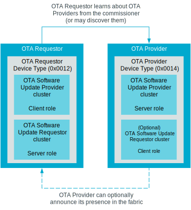
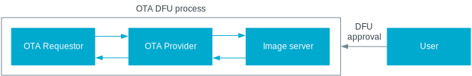

.. _ug_matter_overview_dfu:

Matter OTA
##########

.. contents::
   :local:
   :depth: 2

The Matter Over-The-Air is a process that allows a Matter device in a Matter fabric to update its firmware.
The `Matter Core Specification <CSA Specifications Download Request_>`_ requires that each device implements a method for firmware update for security reasons.
Matter OTA provides a convenient way to fulfill this requirement.

This page provides an overview of the Matter OTA process and mentions :ref:`ug_matter_overview_dfu_image_nordic`.
In this process, recommended for Matter accessory devices, the software image is provided by another Matter node, which acquired information about the image and downloaded it from a centralized and reliable source.
The download takes place over a special transfer protocol and user consent is required for the image to be applied on the target Matter device.

The Matter OTA is just one of the possible firmware update methods.
You can also implement a custom solution.
For example, the `nrfconnect platform <dedicated Matter fork_>`_ for Matter comes with a solution that lets you update the firmware outside of the Matter network, using Bluetooth LE and the :ref:`Simple Management Protocol <dfu_smp_readme>`.
The conceptual details of this solution are outside the scope of this page.
For detailed information about how to perform an update over Bluetooth LE, see :doc:`matter:nrfconnect_examples_software_update`.

.. _ug_matter_overview_dfu_roles:

Matter OTA roles
****************

The following roles participate in the Matter OTA process:

OTA Requestor
   Any Matter device that is going to have its firmware updated.
   This role corresponds to the OTA Requestor :ref:`device type <ug_matter_overview_data_model>`, which implements the client role for the OTA Software Update Provider cluster and the server role for the OTA Software Update Requestor cluster.

   The OTA Requestor can only receive information about available software updates from the OTA Provider.
   Because of this, it may implement a mechanism to discover providers and query the OTA Provider periodically about new software images using the mandatory polling mechanism.
   However, it can also receive information about the OTA Providers from the commissioner during :ref:`ug_matter_overview_commissioning`.

   The OTA Requestor is typically implemented on accessories (for example, embedded devices built using the |NCS|).

OTA Provider
   The device that provides the image for the OTA update.
   This role corresponds to the OTA Provider device type, which implements the server role for the OTA Software Update Provider cluster, and optionally the client role for the OTA Software Update Requestor cluster.
   Any device on the fabric can assume this role, as long as it has access to the Internet or to the database with links to software images.

   The OTA Provider learns about new software images using any custom mechanism provided by the device manufacturer.
   It can also learn about new software updates from the :ref:`ug_matter_device_dcl`, if it supports querying the DCL.

   After the OTA Provider learns about a new software image, it downloads it to its internal cache.
   Then, once requested, it sends the image to the OTA Requestor using Matter's :ref:`ug_matter_overview_dfu_image_bdx`.

   The OTA Provider can announce its presence to OTA Requestors on the fabric.
   The OTA Requestor can also learn about the OTA Providers on the fabric during commissioning or through dynamic discovery.

   The OTA Provider is typically implemented on smart home hubs from ecosystem providers.

   Matter OTA roles

The following parties can also be seen as participating in the process:

Image Server
   This is usually a server set up by the vendor who creates the software image.
   Information about the software image URI is then typically provided in the :ref:`ug_matter_device_dcl`.

User
   Provides approvals for the OTA process.
   Some OTA Requestors can directly ask the user for approval for applying an OTA update, for example using GUI or a network hub.
   If asking directly is not possible, the approval request can be delegated to OTA Providers.

   Parties to the Matter OTA process

.. _ug_matter_overview_dfu_reqs:

Matter OTA requirements
***********************

For the Matter OTA process to happen, the following conditions must be met:

* Both the OTA Requestor and OTA Provider must be members of the same fabric.
* The OTA Requestor must be aware of the OTA Provider.
* A source of software image must be available to the OTA Provider, for example DCL.
* The software image must have a newer version than the firmware currently in use on the OTA Requestor.
* The OTA Requestor must query the OTA Provider periodically about new software images using the polling mechanism.

.. _ug_matter_overview_dfu_process:

Matter OTA process
******************

The following chart shows a simplified overview of the Matter OTA process.
For detailed description, see the Matter Core Specification.

The Matter OTA image download always happens in the background, without affecting the device's normal operation.

.. msc::
   hscale = "1.3";
   Req [label="OTA Requestor"],Pro [label="OTA Provider"],Serv [label="Image server"],User [label="User"];
   Req rbox Pro [label="Commissioning into the same fabric"];
   |||;
   Pro=>Serv [label="Connection to server"];
   |||;
   --- [label="Two alternatives for OTA Provider discovery"];
   Req<=Pro [label="Option 1\nPresence announcement"];
   |||;
   Req=>Pro [label="Option 2\nDynamic discovery of OTA Providers"];
   ---;
   |||;
   Req rbox Req [label="Selection of OTA Provider"];
   |||;
   Req=>Pro [label="Querying starts"];
   Pro=>Serv [label="OTA Provider\nlearns about new image"];
   |||;
   Pro<=Serv [label="Image downloaded\nover HTTP"];
   |||;
   Req<=Pro [label="Image downloaded\nover BDX"];
   |||;
   Req>>Pro [label="Notification\nof completed download"];
   Pro<=User [label="Update approval"];
   Req<=Pro [label="Authorization of update"];
   |||;
   Req rbox Req [label="Update applied"];
   Req>>Pro [label="Notification\nof successful update"];
   Pro>>User [label="Notification\nof successful update"];

.. _ug_matter_overview_dfu_image:

Matter OTA image structure and transfer
***************************************

The software image transmitted during the Matter OTA process must meet specific structure requirements for it to be transferred and applied correctly.

All software images for the Matter OTA must contain a standardized header, which is used by the OTA Provider to validate the image before it is sent to the OTA Requestor.
The header includes several types of information, including the software version, Vendor ID, and Product ID.

The software image must use fixed encoding and it must include the mandatory fields listed in the following table.

.. _table:

+-----------------------+--------+-----------------------------------------------+------------------------------------------------------------------------------------------------------------------------------------------------------+
| Field name            | Type   | Characteristics                               | Description                                                                                                                                          |
+=======================+========+===============================================+======================================================================================================================================================+
| ``FileIdentifier``    | uint32 | Fixed-width, little-endian-encoded, unsigned. | Identifies the OTA image file at its beginning.                                                                                                      |
+-----------------------+--------+-----------------------------------------------+------------------------------------------------------------------------------------------------------------------------------------------------------+
| ``TotalSize``         | uint64 |                                               | Indicates the total size in bytes of the _entire_ file.                                                                                              |
+-----------------------+--------+-----------------------------------------------+------------------------------------------------------------------------------------------------------------------------------------------------------+
| ``HeaderSize``        | uint32 |                                               | Indicates the total size of the TLV-encoded header field.                                                                                            |
+-----------------------+--------+-----------------------------------------------+------------------------------------------------------------------------------------------------------------------------------------------------------+
| ``Header``            | TLV    | TLV encoding type and value.                  | Includes the `ota-image-header-struct` with a predefined order. See section 11.20.2.4 of the `Matter Core Specification`_ for more information.      |
+-----------------------+--------+-----------------------------------------------+------------------------------------------------------------------------------------------------------------------------------------------------------+
| ``Payload``           | n/a    | Software image contents.                      | Includes the new software to be installed on the OTA Requestor. When using the |NCS|, this field also includes `Nordic Matter platform additions`_.  |
+-----------------------+--------+-----------------------------------------------+------------------------------------------------------------------------------------------------------------------------------------------------------+

.. _ug_matter_overview_dfu_image_nordic:

Nordic Matter platform additions
================================

When building a Matter application for :doc:`nRF Connect platform <matter:nrfconnect_platform_overview>`, the Matter OTA image is one of the build :ref:`output files <app_build_output_files>`.
The default location of the software image is :file:`matter.ota` in the build directory.
The `Payload` field of the software image includes :file:`dfu_multi_image.bin` file, which is :ref:`another output file <app_build_output_files_other>` of the build process.

The :file:`dfu_multi_image.bin` file is an archive file that includes a CBOR manifest and a collection of user-selected update components.
The CBOR manifest contains identifiers and sizes of the included update components to allow a user to successfully unpack the archive.
The default update components are firmware images for all MCU cores.

During the Matter OTA firmware update process, the downloaded Matter OTA image is saved to external flash using the :ref:`lib_dfu_multi_image` and :ref:`lib_dfu_target` libraries.
The DFU multi-image library uses `zcbor`_ for parsing the CBOR header.
Applying the software image requires rebooting to :ref:`MCUboot <mcuboot:mcuboot_ncs>` bootloader which installs the new firmware.

.. _ug_matter_overview_dfu_image_tlv:

Matter TLV encoding format
==========================

Tag-Length-Value (TLV) is a format used for encoding simple structured data in a byte string.
It encodes values as TLV elements, where each element has one of the following types:

* Primitive type with integers or strings.
* Container type with collections of other TLV elements.
  The container type can be a structure, an array, or a list.

.. _ug_matter_overview_dfu_image_bdx:

Bulk Data Exchange Protocol (BDX)
=================================

For transferring the software image, Matter uses its own internal Bulk Data Exchange (BDX) protocol.
Its main purpose is to facilitate exchanging data between Matter nodes.

The protocol is based on Trivial File Transfer Protocol (TFTP).
BDX does not require transferred file to have any specific format, but it allows to attach arbitrary metadata to the file.
When used for OTA transfers, OTA Provider sends the URI to OTA Requestor using the ``bdx://<node-id>/<file-name>`` format, where *<node-id>* corresponds to the Node ID of the OTA Requestor that is to receive the image, and *<file-name>* is an arbitrary file path that uniquely identifies the software image file on the node.
