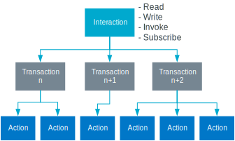

.. _ug_matter_overview_int_model:

Matter Interaction Model and interaction types
##############################################

.. contents::
   :local:
   :depth: 2

.. ug_matter_int_model_desc_start

The Interaction Model layer defines what interactions can be performed between a client and a server device.
The node that initiates the interaction is called *initiator* (typically, a client device), and the node that is the recipient of the interaction is called *target* (typically, a server device).

.. ug_matter_int_model_desc_end

The following interaction types belong to the Interaction Model:

Read
   This interaction is used get the value of attributes or events.

Write
   This interaction is used to modify attribute values.

Invoke
   This interaction is used to send commands.

Subscribe
   This interaction is used to create subscription with a target in order to receive data reports from the target periodically instead of polling for data.
   Subscriptions can be related to attributes and events.

Each interaction is made of transactions, which in turn are made of actions.
Each action can be conveyed by one (`n`) or more messages (`n, n+1`).

   Interaction structure

.. _ug_matter_overview_int_model_example:

Interaction examples: Door Lock
*******************************

The following sections present examples of the interaction types described above.
The examples use an imaginary Matter controller as the interaction initiator and a door lock device as the interaction target.

Read interaction
================

The read interaction can be used by the Matter controller to read one or more attributes or events from the :ref:`Data Model layer <ug_matter_overview_data_model>` of the door lock device.
For example, the Matter controller can read the ``LockType`` attribute of the ``DoorLock`` cluster to display an adequate icon to the user.
The following diagram presents actions that need to be exchanged in order to complete this interaction.

.. msc::
   hscale="1.6";

   Ctrl [label="Matter Controller"],
   Lock [label="Door Lock"];

   Ctrl => Lock [label="Read Request:\nEndpoint1.DoorLock.LockType"];
   |||;
   Ctrl << Lock [label="Report Data:\nMagnetic"];

Write interaction
=================

The write interaction can be used to modify one or more attributes of the door lock device.
For example, the Matter controller can change the ``OperatingMode`` attribute of the ``DoorLock`` cluster to put the lock in the privacy mode in which the door can only be unlocked manually from inside the building.
The following diagram presents actions that need to be exchanged in order to complete this interaction.

.. msc::
   hscale="1.6";

   Ctrl [label="Matter Controller"],
   Lock [label="Door Lock"];

   Ctrl => Lock [label="Write Request:\nEndpoint1.DoorLock.OperatingMode=Privacy"];
   |||;
   Ctrl << Lock [label="Write Response:\nSUCCESS"];

Invoke interaction
==================

The invoke interaction allows the Matter controller to invoke one of the commands from the :ref:`Data Model layer <ug_matter_overview_data_model>` of the door lock device.
For example, the Matter controller can use the ``UnlockDoor`` command of the ``DoorLock`` cluster to remotely unlock the door.
The following diagram presents actions that need to be exchanged in order to complete this interaction.

.. note::
   This is a special case of the invoke interaction, a *Timed interaction*, which requires two more messages to be exchanged before the actual command is sent.
   These two messages are needed to make sure that an attacker cannot intercept and replay the command later to unlock the door when the house owner is away.

.. msc::
   hscale="1.6";

   Ctrl [label="Matter Controller"],
   Lock [label="Door Lock"];

   Ctrl => Lock [label="Timed Request:\nTimeout=5 seconds"];
   |||;
   Ctrl << Lock [label="Status Response:\nSUCCESS"];
   |||;
   Ctrl => Lock [label="Invoke Request:\nDoorLock.UnlockDoor(pin=1234)"];
   |||;
   Ctrl << Lock [label="Invoke Response:\nSUCCESS"];

Subscribe interaction
=====================

The subscribe interaction can be used to monitor the state of one or more attributes or events of the door lock device.
For example, the Matter controller can subscribe to the ``LockState`` attribute of the ``DoorLock`` cluster to receive notifications whenever the door is unlocked by another user.
The diagram below presents actions that need to be exchanged in order to complete this interaction.

.. note::
   This is a long-running interaction that consists of multiple transactions executed until either side stops responding or responds with a failure status.

.. msc::
   hscale="1.6";

   Ctrl [label="Matter Controller"],
   Lock [label="Door Lock"],
   User [label="User"];

   Ctrl rbox Lock [label="Subscribe Transaction"];

   Ctrl => Lock [label="Subscribe Request:\nDoorLock.LockState"];
   |||;
   Ctrl <= Lock [label="Report Data:\nLocked"];
   |||;
   Ctrl >> Lock [label="Status Response:\nSUCCESS"];
   |||;
   Ctrl << Lock [label="Subscribe Response:\nSUCCESS"];
   ...;

   Ctrl rbox Lock [label="Report Transaction"];
   Lock <= User [label="Manually opens the door"];
   Ctrl <= Lock [label="Report Data:\nUnlocked"];
   Ctrl >> Lock [label="Status Response:\nSUCCESS"];
   ...;
