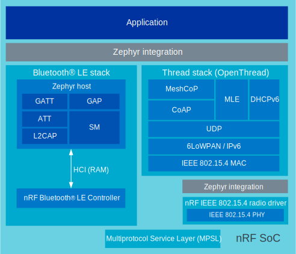

.. _ug_matter_overview_architecture_integration:

Matter integration in the |NCS|
###############################

.. contents::
   :local:
   :depth: 2

Matter is included in the |NCS| as one of the submodule repositories managed with the :ref:`zephyr:west` tool, using a `dedicated Matter fork`_.
That is, the code used for the |NCS| and Matter integration is stored in the Matter repository (nRF Connect platform) and is compiled when building one of the available :ref:`matter_samples`.

.. figure:: images/matter_components_integration_ncs.svg
   :alt: A graphical depiction of the |NCS| repository structure

   The |NCS| repository structure

Both instances depend on each other, but their development is independent to ensure that they both support the latest stable version of one another.
The fork is maintained and verified as a part of the |NCS| release process as an :ref:`OSS repository <dm_repo_types>`.

The Matter repository fetched into the fork also includes documentation files.
A selection of these pages is included in the |NCS| documentation under the :ref:`matter_index` tab.

.. _ug_matter_overview_architecture_integration_stack:

Matter stack in the |NCS|
*************************

Matter is located on the top application layer of the integration model, looking from the networking point of view.
The |NCS| and Zephyr provide the Bluetooth® LE, Thread, and Wi-Fi stacks, which must be integrated with the Matter stack using a special intermediate layer.
In case of Matter over Thread, the |NCS|'s Multiprotocol Service Layer (MPSL) driver allows running Bluetooth LE and Thread concurrently on the same radio chip.

.. figure:: images/matter_nrfconnect_overview_simplified_ncs.svg
   :alt: nRF Connect platform in Matter

   nRF Connect platform in Matter

For detailed description, see the :doc:`matter:nrfconnect_platform_overview` page in the Matter documentation.

.. _ug_matter_overview_architecture_integration_designs:

Matter platform designs (System-on-Chip, multiprotocol)
*******************************************************

Matter in the |NCS| supports the *System-on-Chip, multiprotocol* platform designs, available with the related network stack on Nordic Semiconductor devices in the |NCS|.
For more information about the multiprotocol feature, see :ref:`ug_multiprotocol_support`.

.. _ug_matter_overview_architecture_integration_designs_thread:

Matter over Thread
==================

In this design, the Matter stack, the OpenThread stack, and the Bluetooth LE stack run on a single SoC.

This platform design is suitable for the following development kits:

.. table-from-rows:: /includes/sample_board_rows.txt
   :header: heading
   :rows: nrf52840dk_nrf52840, nrf5340dk_nrf5340_cpuapp_and_cpuapp_ns, nrf54l15pdk_nrf54l15_cpuapp

The design differences between the supported SoCs are the following:

* On the nRF5340, SoC the network core runs both the Bluetooth LE Controller and the 802.15.4 IEEE Radio Driver.
* On the nRF52840 and nRF54L15 SoCs, all components are located on the application core.

   Multiprotocol Thread and Bluetooth LE architecture on nRF52 Series and nRF54L Series devices

.. figure:: ../../thread/overview/images/thread_platform_design_nRF53_multi.svg
   :alt: Multiprotocol Thread and Bluetooth LE architecture (nRF53)

   Multiprotocol Thread and Bluetooth LE architecture on nRF53 Series devices

.. _ug_matter_overview_architecture_integration_designs_wifi:

Matter over Wi-Fi
=================

In this design, the Matter stack, the Wi-Fi stack, and the Bluetooth LE stack run on a single SoC.

This platform design is suitable for the following development kits:

.. table-from-rows:: /includes/sample_board_rows.txt
   :header: heading
   :rows: nrf7002dk_nrf5340_cpuapp, nrf5340dk_nrf5340_cpuapp

For this design, the Wi-Fi driver on the application core communicates with the external nRF7002 Wi-Fi 6 Companion IC over QSPI or SPI:

* For the ``nrf5340dk/nrf5340/cpuapp``, nRF7002 support is added using ``nrf7002ek`` shield connected through SPI.
* For the ``nrf7002dk/nrf5340/cpuapp``, nRF7002 is connected with the nRF5340 SoC through QSPI.

.. figure:: images/matter_platform_design_nRF53_wifi.svg
   :alt: Multiprotocol Wi-Fi and Bluetooth LE architecture (nRF53 with the nRF7002 Wi-Fi 6 Companion IC)

   Multiprotocol Wi-Fi and Bluetooth LE architecture (nRF53 with the nRF7002 Wi-Fi 6 Companion IC)

.. _ug_matter_overview_architecture_integration_designs_switchable:

Switchable Matter over Wi-Fi and Matter over Thread
===================================================

In this design, the Matter stack, the OpenThread stack, the Wi-Fi stack, and the Bluetooth LE stack run on a single SoC.

.. include:: ../../../../../samples/matter/lock/README.rst
   :start-after: matter_door_lock_sample_thread_wifi_switch_desc_start
   :end-before: matter_door_lock_sample_thread_wifi_switch_desc_end

For an example of how this design works, see the :ref:`matter_lock_sample_wifi_thread_switching` feature in the Matter door lock sample.

This platform design is suitable for the following development kits:

.. table-from-rows:: /includes/sample_board_rows.txt
   :header: heading
   :rows: nrf5340dk_nrf5340_cpuapp

This design is only available for the ``nrf5340dk/nrf5340/cpuapp`` with the ``nrf7002ek`` shield.
The Wi-Fi driver on the application core communicates through SPI with the external nRF7002 EK shield, which works as the Wi-Fi 6 Companion IC.

   Multiprotocol Wi-Fi/Thread and Bluetooth LE architecture (nRF53 with the nRF7002 EK shield as the Wi-Fi 6 Companion IC)
