.. _ug_nrfconnect_manufacturer_cluster_editor_tool:

Nrfconnect Matter Manufacturer Cluster Editor tool
##################################################

.. contents::
   :local:
   :depth: 2

This guide describes how to use the Nrfconnect Matter Manufacturer Cluster Editor tool to create a new cluster or extend an existing cluster.

Overview
********
The Nrfconnect Matter Manufacturer Cluster Editor tool is a tool that allows you to edit the Matter clusters or create an extension to the existing cluster from Matter Device Type Library Specification.
The Matter device type library specification defines clusters that are common for all manufacturers and can be used as a base for devices.
However, sometimes it is necessary to create a new cluster for the specific device, or extend an existing cluster to add new attributes, commands, or events that are specific to the device.
Moreover, if the desired device type is not listed in the Matter device type library specification, it can be created as a new device type, and included in the project.

This guide describes how to run the tool, and its visual interfaces to create a new cluster, add extension to the existing cluster and create a new device type.

The tool supports the following features:

   * Creating new manufacturer-specific cluster that contains attributes, commands, and events.
   * Creating an extensions to the existing clusters defined in the Matter Device Type Library Specification.
   * Adding new enumerations and structures.
   * Creating a new device type that is not listed in the Matter Device Type Library Specification.

As a result of the editing, the tool generates a new XML file with the cluster definition or an extension to the existing cluster.
The XML file can be used as an argument for the :ref:`ug_matter_gs_tools_matter_west_commands_append` command to add the new cluster to the Matter ZCL database.

The guide was divided into the following sections:

* :ref:`ug_nrfconnect_manufacturer_cluster_editor_tool_downloading_installing`, which describes how to download, install and launch the tool on your machine.
* :ref:`ug_nrfconnect_manufacturer_cluster_editor_tool_basic_functionalities`, which describes the basic functionalities of UI and mechanisms of the tool.
* :ref:`ug_nrfconnect_manufacturer_cluster_editor_tool_creating_new_cluster`, which describes how to create a new cluster, add commands, attributes, and events, and save it as an XML file.
* :ref:`ug_nrfconnect_manufacturer_cluster_editor_tool_creating_cluster_extension`, which describes how to create a cluster extension, add commands, attributes, and events, and save it as an XML file.
* :ref:`ug_nrfconnect_manufacturer_cluster_editor_tool_creating_new_device_type`, which describes how to create a new device type, assign required or optional clusters to it, and require Attributes, Commands, and Events.

Apart from this guide, you can learn about tool functionalities directly from the tool interface.
Please hoover your mouse over each element in the tool to see a dedicated tooltip with the information about the element.

For example, the following tooltip describes the :guilabel:`Code` element in the :guilabel:`Cluster` tab:

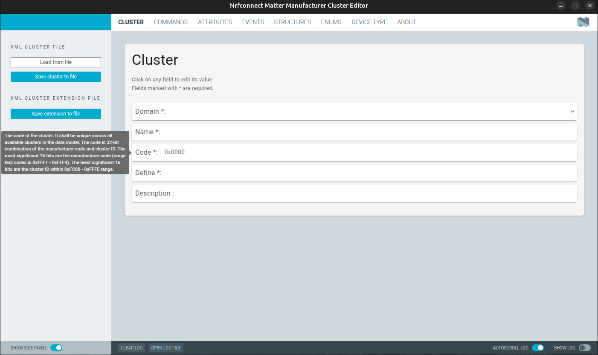

To see an example of the tool usage, please refer to the :ref:`ug_matter_gs_custom_clusters_create_xml_file` user guide.

Requirements
************

To take advantage of this guide, you need to be familiar with the :ref:`ug_matter_architecture` and Matter Device Type Library Specification.

.. _ug_nrfconnect_manufacturer_cluster_editor_tool_downloading_installing:

Downloading, installing and launching
*************************************

.. include:: /includes/matter_manufacturer_cluster_editor_note.txt

To download the preview version of the tool and install it, complete the following steps:

   1. Download the preview version of the tool from the |NCS| sdk-connectedhomeip release artifacts manually, or using one of the following commands depending on your operating system:

      .. tabs::

        .. group-tab:: Windows

            .. code-block:: console

                curl -L https:/github.com/nrfconnect/sdk-connectedhomeip/releases/download/v3.0.0/nrfconnect-matter-manufacturer-cluster-editor_win64.zip -o nrfconnect-matter-manufacturer-cluster-editor_win64.zip

        .. group-tab:: macOS (x86_64)

            .. code-block:: console

                curl -L https:/github.com/nrfconnect/sdk-connectedhomeip/releases/download/v3.0.0/nrfconnect-matter-manufacturer-cluster-editor_macos.zip -o nrfconnect-matter-manufacturer-cluster-editor_macos.zip

        .. group-tab:: macOS (ARM64)

            .. code-block:: console

                curl -L https:/github.com/nrfconnect/sdk-connectedhomeip/releases/download/v3.0.0/nrfconnect-matter-manufacturer-cluster-editor_macos_arm64.zip -o nrfconnect-matter-manufacturer-cluster-editor_macos_arm64.zip

        .. group-tab:: Linux

            .. code-block:: console

                curl -L https:/github.com/nrfconnect/sdk-connectedhomeip/releases/download/v3.0.0/nrfconnect-matter-manufacturer-cluster-editor_linux.zip -o nrfconnect-matter-manufacturer-cluster-editor_linux.zip

   #. Unzip the downloaded archive using one of the following commands depending on your operating system:

      .. tabs::

        .. group-tab:: Windows

            .. code-block:: console

                unzip nrfconnect-matter-manufacturer-cluster-editor_win64.zip
                ./nrfconnect-matter-manufacturer-cluster-editor.exe

        .. group-tab:: macOS

            .. code-block:: console

                unzip nrfconnect-matter-manufacturer-cluster-editor_macos.zip
                ./nrfconnect-matter-manufacturer-cluster-editor.app/Contents/MacOS/nrfconnect-matter-manufacturer-cluster-editor

        .. group-tab:: macOS (ARM64)

            .. code-block:: console

                unzip nrfconnect-matter-manufacturer-cluster-editor_macos_arm64.zip
                ./nrfconnect-matter-manufacturer-cluster-editor.app/Contents/MacOS/nrfconnect-matter-manufacturer-cluster-editor

        .. group-tab:: Linux

            .. code-block:: console

                unzip nrfconnect-matter-manufacturer-cluster-editor_linux.zip
                chmod +x nrfconnect-matter-manufacturer-cluster-editor.Appfigure
                ./nrfconnect-matter-manufacturer-cluster-editor.Appfigure

   #. Run the tool using one of the following commands depending on your operating system:

      .. tabs::

        .. group-tab:: Windows

            .. code-block:: console

                ./nrfconnect-matter-manufacturer-cluster-editor.exe

        .. group-tab:: macOS

            .. code-block:: console

                ./nrfconnect-matter-manufacturer-cluster-editor.app/Contents/MacOS/nrfconnect-matter-manufacturer-cluster-editor

        .. group-tab:: macOS (ARM64)

            .. code-block:: console

                ./nrfconnect-matter-manufacturer-cluster-editor.app/Contents/MacOS/nrfconnect-matter-manufacturer-cluster-editor

        .. group-tab:: Linux

            .. code-block:: console

                chmod +x nrfconnect-matter-manufacturer-cluster-editor.Appfigure
                ./nrfconnect-matter-manufacturer-cluster-editor.Appfigure

.. _ug_nrfconnect_manufacturer_cluster_editor_tool_basic_functionalities:

Basic functionalities
*********************

The tool is created based on the Shared commodities for developing nRF Connect for Desktop applications.
The UI is aligned with the nRF Connect for Desktop application, so if you are familiar with the nRF Connect for Desktop, you will feel comfortable using the tool.

Side panel
==========

On the left side of the tool, you can see the navigation panel with the following elements:

* A name bar on the top of the panel with the name of the cluster.
  It represents a name of the cluster, and the name of the file, where the cluster is saved.
  You can change the name of the cluster by clicking on the name bar and typing a new name.
  The new name shall be unique across all available clusters in the Matter Device Type Library Specification.

* A :guilabel:`XML cluster file` section contains two buttons:

  * :guilabel:`Load from file` button, which loads the cluster definition or cluster extension from the XML file.
  * :guilabel:`Save cluster to file` button, which saves the current cluster definition to the XML file.
    This button can be used only the new cluster.

* A :guilabel:`XML cluster extension file` tab, which contains the button :guilabel:`Save extension to file`, which checks the difference between the current cluster and the loaded cluster extension and saves the difference to the XML file.

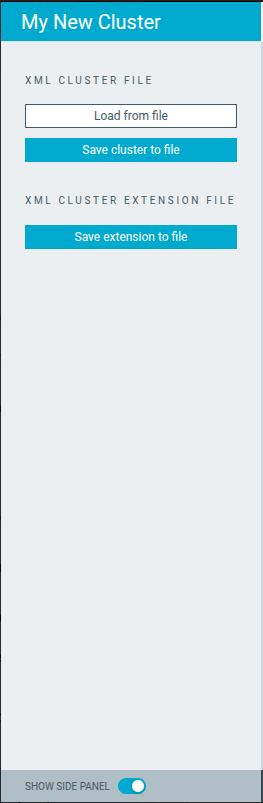

You can use the :guilabel:`Show side panel` toggle button to show or hide the side panel.

Loading the cluster file
------------------------

An XML file that contains the cluster definition or cluster extension can be loaded by clicking the :guilabel:`Load from file` button.
Please use the system file dialog to select the XML cluster file.
If the file contains more than one cluster, the tool shows the list of available clusters in the context menu.

For example:

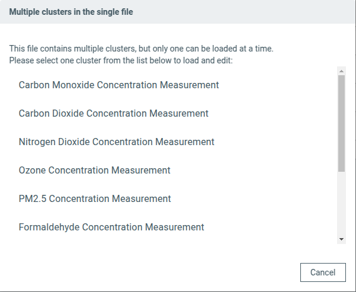

Please select the cluster from the list to load a specific cluster definition or cluster extension.

After loading the cluster file, all tabs are populated with the data from the loaded cluster.

Saving the cluster file
-----------------------

The cluster file can be saved to the file using the :guilabel:`Save cluster to file` button.
Please use the system file dialog to select the path and file name to save the cluster.

Saving the cluster extension file
---------------------------------

The cluster extension file can be saved to the file using the :guilabel:`Save extension to file` button.
Please use the system file dialog to select the path and file name to save the cluster extension.

The tool checks the difference between the current cluster and the loaded cluster extension and saves the difference to the XML file.
If there is no difference, the tool shows the message that there is no data to create a cluster extension.

Main panel
==========

The main panel is the center part of the tool and contains separate tabs for each element of the XML cluster file.
It contains the following elements:

* :guilabel:`Cluster` tab, which contains the cluster definition, its description, and the code.
* :guilabel:`Commands` tab, which contains the assigned to the cluster commands.
* :guilabel:`Attributes` tab, which contains the assigned to the cluster attributes.
* :guilabel:`Events` tab, which contains the assigned to the cluster events.
* :guilabel:`Enums` tab, which contains the assigned to the cluster enums.
* :guilabel:`Structs` tab, which contains the assigned to the cluster structs.
* :guilabel:`Device type` tab, which contains the definition of the device type.

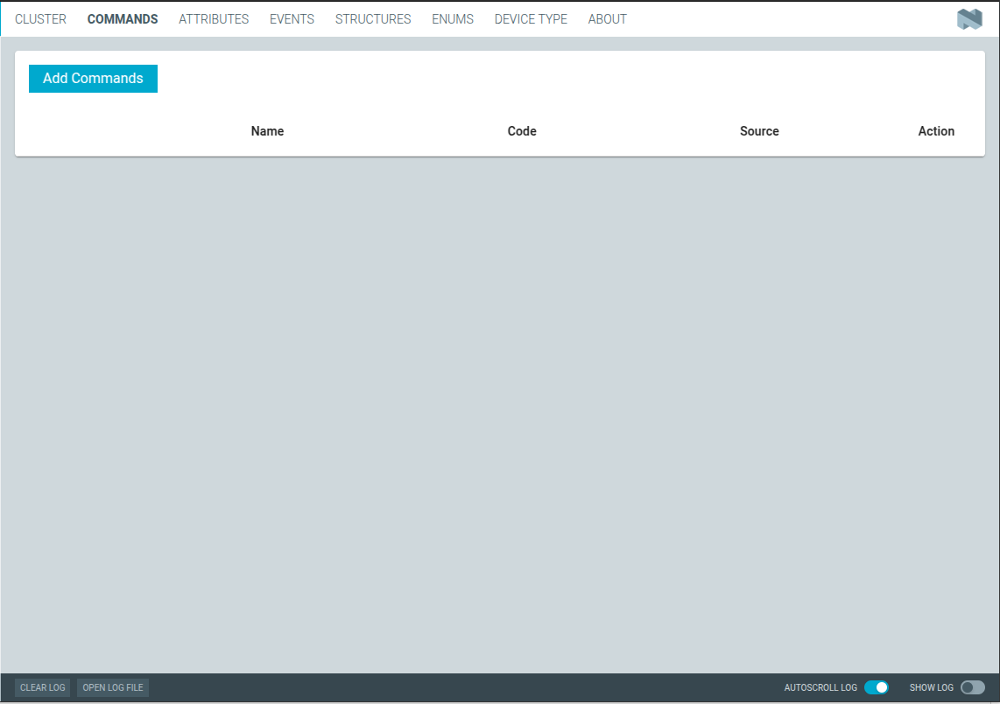

The :guilabel:`Cluster` and :guilabel:`Device type` tabs consist of fields that can be edited directly in the opened window.
The :guilabel:`Commands`, :guilabel:`Attributes`, :guilabel:`Events`, :guilabel:`Enums`, and :guilabel:`Structs` tabs consist of the table with the list of elements.
You can add, edit or delete the elements in the table using the edit box interface after clicking on the edit button in the table.

Edit box
--------

The edit box is a dialog window that allows you to edit the selected element in the table after clicking the :guilabel:`Pencil` button icon on each row of the table or :guilabel:`Add` button in the top of the table.

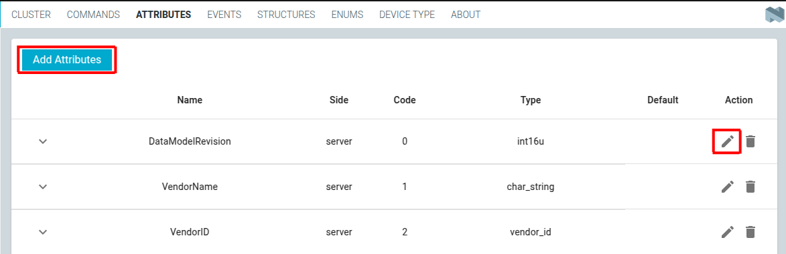

To remove the row in the table, you need to click the :guilabel:`Trash` button icon which is located under each element in the list.

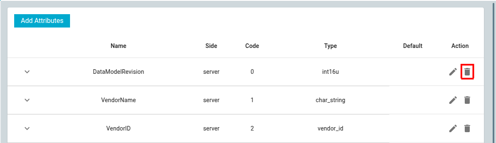

The edit box content depends on the type of the page, but in general it contains the following elements:

* Fields to be filled with the specific information about the element.
* Additional buttons to add a element-specific inner information.
  For example, the :guilabel:`Access` button in the edit box dialog window of the :guilabel:`Attributes` tab allows to add a access control information for the attribute.

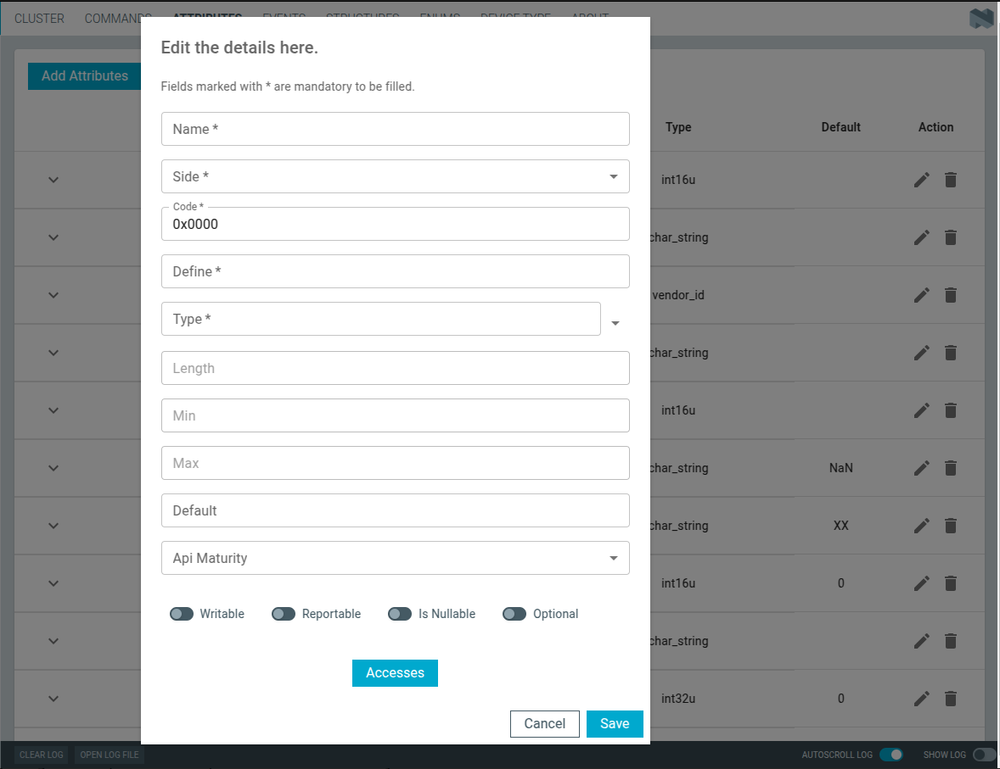

You must fill in all required fields marked with the asterisk before saving the element.
If at least one of the required fields is not filled, you will see the error message while trying to save the element.

After clicking the additional buttons in the edit box, you will see new dialog with the list of elements.

To add a new element, you need to click the :guilabel:`Add` button icon in the top of the list.
To remove an element, you need to click the :guilabel:`Trash` button icon which is located under each element in the list.

For example, the :guilabel:`Access` button in the edit box dialog window of the :guilabel:`Attributes` tab allows to add a access control information for the attribute.

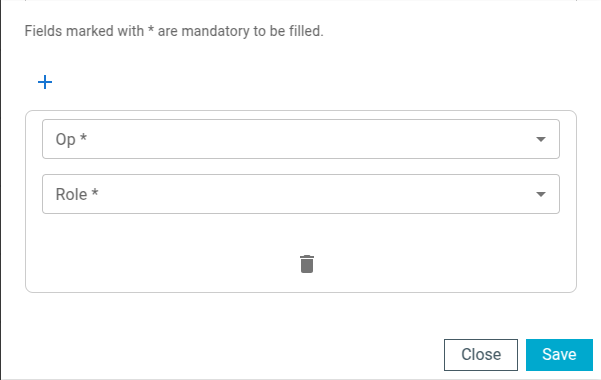

The number visible on the right upper corner of the additional button represents the current number of elements in the list.

For example:

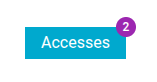

Details
-------

Each row in the table can be expanded to see the details of the element.
Each element has a dedicated details implementation, so the details content depends on the type of the element.

To see the details of the element, you need to click the :guilabel:`arrow` icon button in the left side of the row.

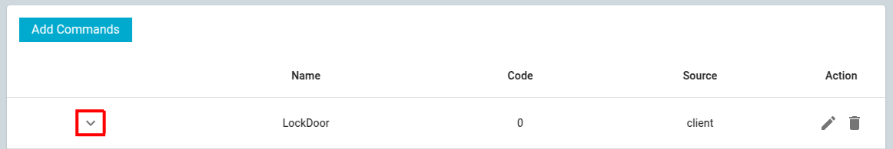

The following elements can be displayed in the details depending on the type of the element and its content:

* Various text fields with a specific information about the element.

  For example:

  .. figure:: images/matter_cluster_tool/matter_cluster_tool_edit_box_details_text_field.png
     :alt: Edit box details text field

* List of additional elements.
  You can click the button in this field to open a dedicated dialog with the list of elements.

  For example:

  .. figure:: images/matter_cluster_tool/matter_cluster_tool_edit_box_details_list.png
     :alt: Edit box details list

  .. figure:: images/matter_cluster_tool/matter_cluster_tool_edit_box_details_list_dialog.png
     :alt: Edit box details list dialog

* List of boolean elements set to true.

  For example, nullable, reportable and optional elements are set to true:

  .. figure:: images/matter_cluster_tool/matter_cluster_tool_edit_box_details_boolean.png
     :alt: Edit box details boolean

* List of IDs of the clusters to which the element belongs.

  For example:

  .. figure:: images/matter_cluster_tool/matter_cluster_tool_edit_box_details_clusters.png
     :alt: Edit box details clusters

.. _ug_nrfconnect_manufacturer_cluster_editor_tool_creating_new_cluster:

Creating a new Matter cluster
*****************************

In this section, you can learn how to create a new Matter cluster using the Manufacturer Cluster Editor tool and save it as an XML file.
To create a new cluster definition, please follow these steps:

.. rst-class:: numbered-step

Navigate to the :guilabel:`Cluster` tab
=======================================

In this tab, fill in the required fields marked with the asterisk.
Optionally, you can fill in the optional fields.
To see tooltips for the fields, please hoover your mouse over the field.

.. rst-class:: numbered-step

Add commands, attributes and events to the cluster
==================================================

In this step, navigate one by one to the :guilabel:`Commands`, :guilabel:`Attributes`, and :guilabel:`Events` tabs and add the required elements to the cluster.
Use the :guilabel:`Add` button in the top of each element tab to add a new element to the cluster.
Please see the :ref:`ug_nrfconnect_manufacturer_cluster_editor_tool_basic_functionalities` section to learn how to add a new element to the cluster.

.. rst-class:: numbered-step

Add enums and structs
=====================

In this step, navigate one by one to the :guilabel:`Enums` and :guilabel:`Structs` tabs and add the required elements.
The enums and structs does not belong to the cluster, but they can be assigned to one or more clusters.
Please see the :ref:`ug_nrfconnect_manufacturer_cluster_editor_tool_basic_functionalities` section to learn how to add a new element to the cluster.

.. rst-class:: numbered-step

Save the cluster
================

In this step, save the cluster to the file using the :guilabel:`Save cluster to file` button.

.. _ug_nrfconnect_manufacturer_cluster_editor_tool_creating_cluster_extension:

Creating a cluster extension
****************************

In this section, you can learn how to create a cluster extension using the Manufacturer Cluster Editor tool and save it as an XML file.
To create a cluster extension, please follow these steps:

.. rst-class:: numbered-step

Load an existing cluster definition
===================================

In this step, load the existing cluster definition using the :guilabel:`Load from file` button.
Please use the system file dialog to select the XML cluster file.
If the file contains more than one cluster, the tool shows the list of available clusters in the context menu.

.. rst-class:: numbered-step

Add commands, attributes and events to the cluster
==================================================

In this step, navigate one by one to the :guilabel:`Commands`, :guilabel:`Attributes`, and :guilabel:`Events` tabs and add the required elements to the cluster.
Use the :guilabel:`Add` button in the top of each element tab to add a new element to the cluster.
Please see the :ref:`ug_nrfconnect_manufacturer_cluster_editor_tool_basic_functionalities` section to learn how to add a new element to the cluster.

.. rst-class:: numbered-step

Add enums and structs
=====================

In this step, navigate one by one to the :guilabel:`Enums` and :guilabel:`Structs` tabs and add the required elements.
The enums and structs does not belong to the cluster, but they can be assigned to one or more clusters.
Please see the :ref:`ug_nrfconnect_manufacturer_cluster_editor_tool_basic_functionalities` section to learn how to add a new element to the cluster.

.. rst-class:: numbered-step

Save the cluster extension
==========================

In this step, save the cluster extension to the file using the :guilabel:`Save extension to file` button.

.. _ug_nrfconnect_manufacturer_cluster_editor_tool_creating_new_device_type:

Creating a new device type
**************************

In this section, you can learn how to create a new device type using the Manufacturer Cluster Editor tool and save it as an XML file.
To create a new device type, please follow these steps:

.. rst-class:: numbered-step

Navigate to the :guilabel:`Device type` tab
===========================================

In this step, fill in the required fields marked with the asterisk.
Optionally, you can fill in the optional fields.
To see tooltips for the fields, please hoover your mouse over the field.

.. rst-class:: numbered-step

Add required clusters to the device type
========================================

In this step, use the :guilabel:`Add Cluster assignment to device type` button to add the required clusters to the device type.
You will see the dialog window with the all fields to be filled in.

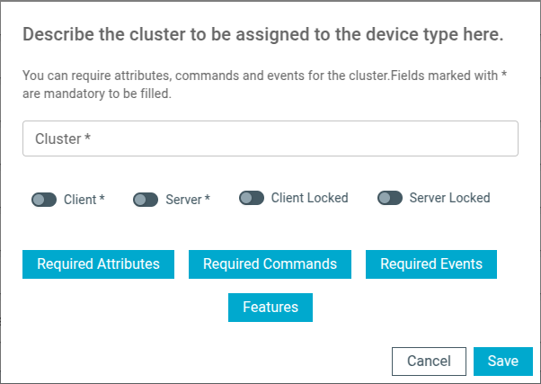

You can click on the buttons in the dialog window to assign required Attributes, Commands and Events by the cluster.
To assign a new element, click on the :guilabel:`cross` icon button and write the exact name of the each element.

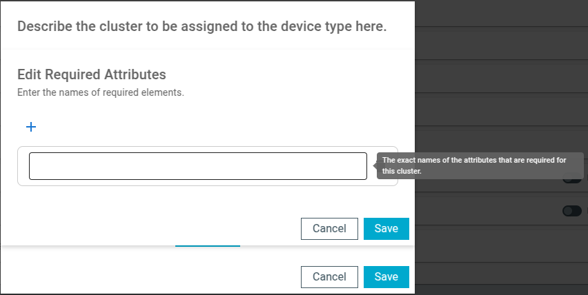

You can also specify the features of the device type by clicking on the :guilabel:`Features` button.
In the new dialog window, click on the :guilabel:`cross` icon button to add a new feature, and fill in the code and name of the feature.

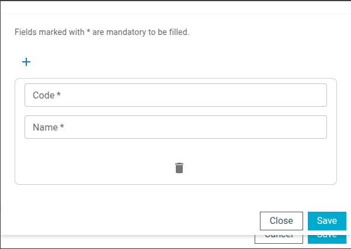

.. rst-class:: numbered-step

Save the device type
====================

In this step, save the cluster extension to the file using the :guilabel:`Save extension to file` or :guilabel:`Save cluster type to file` button depending on the purpose of the file.
