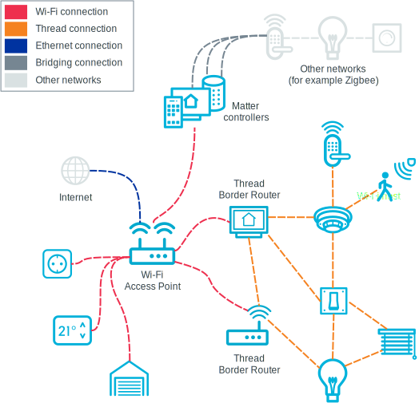

.. _ug_matter_overview_network_topologies:

Matter network topology and concepts
####################################

.. contents::
   :local:
   :depth: 2

Matter network can be composed of Ethernet, Wi-Fi, and Thread devices.
Matter joins these devices together within the local Matter fabric (infrastructure), which allows devices to talk to each other using the same Matter application layer, despite using different network technologies underneath.
All communication is achieved over IPv6, although the Matter network is capable of running in the absence of IPv6 infrastructure connected to the Internet, for example within a firewalled network.
Bluetooth® LE can be used for commissioning of a Matter device to the Matter network.

.. _ug_matter_network_topologies_structure:

Matter network topology
***********************

The Matter network topology refers to the structure of connections between Matter devices and IPv6 networks.
Different IPv6 networks can communicate with each other through central hubs, for example Thread Border Router or Wi-Fi Access Point.

Matter allows for connecting with external networks based on other protocols, such as Zigbee, through Matter bridges.

The following figure illustrates a generic Matter topology example with two Thread Border Router devices, including one with an optional connection to Internet, and three Wi-Fi devices in the upper part of the figure acting as Matter bridges for other protocol devices.

   Matter topology example

.. _ug_matter_network_topologies_concepts:

Matter network concepts
***********************

The Matter network is using the following concepts, listed in alphabetical order:

Binding
  A feature that allows establishing a relationship between Matter endpoints on a single or two separate Matter nodes.
  The relationships are described by binding entries stored persistently in the device memory and managed by the Binding Cluster.
  Bindings are used to assign target or targets of a client cluster on the node, so that the device knows which remote device it should act upon.
  The behavior induced by establishing a binding is application-defined and is not limited anyhow by the Matter Core Specification, which opens the way for different custom scenarios.
  For example, you can create a relationship in which a button press on light switch device results in changing the state of one or group of light bulb devices.

Bridge
  A network device used for exposing mesh networking devices that are not compatible with Matter to a Matter network (for example, Zigbee devices).
  Such *bridged devices* can then work with Matter devices in a fabric and communicate on different application layers.
  The bridge makes sure that the connection between Matter and non-Matter devices is secured.

Controller
  |matter_controller_def|
  For more information, see the following section.

Edge Router
  A network device used for ensuring interoperability of different IPv6 networks that are supported by Matter.
  The main task of an Edge Router is coordinating cross-network communication.
  Multiple Edge Routers can operate within a network to ensure no-single-point-of-failure approach.
  Examples of Edge Routers include Thread Border Router and Wi-Fi Access Point.

Fabric
  This is a logical set of nodes that communicate with each other and can belong to different networks.
  The devices in a fabric share the same :ref:`root of trust <ug_matter_network_topologies_concepts_security>` and configuration state and are identifiable with a unique 64-bit Fabric ID.

Multi-fabric
  A Matter feature that allows to commission a Matter node to different fabrics (each of which has an administrator of its own) and to communicate with other devices within these fabrics.
  This feature is crucial for ensuring interoperability of multiple applications and ecosystems out of the box.
  It can also be referred to as *multi-admin*.
  See :ref:`ug_matter_overview_multi_fabrics` for more information.

Node
  A single instance of a Matter device, available on an IPv6 network after commissioning with a Node ID and security credentials.
  A node can be commissioned to multiple separate fabrics and have multiple administrators using the Multiple Fabrics feature, and thus have multiple Node IDs.
  Nodes in Matter support home automation bridging, which allows to implement other home automation technologies, transports, and link layers.
  Each node has assigned a unique 64-bit Node ID, a 16-bit Vendor ID (VID), statically allocated by the CSA, a 16-bit Product ID (PID), and a 16-bit Group ID (GID), which identifies a set of nodes across a fabric.

OTA Provider
  A Matter node that can respond to queries from the OTA Requestor node about available software update images and provide OTA Requestor with the update packages during the Over-the-Air (OTA) software update process.

OTA Requestor
  A Matter node that can request information about available software update images to the OTA Provider node and receive update packages from it during the OTA software update process.
  An OTA Requestor can also handle announcements about the available OTA Providers in the Matter network.

.. _ug_matter_configuring_controller:

Matter controller
=================

|matter_controller_def|

.. matter_controller_start

The following figure shows the available Matter controllers in the |NCS|.

.. figure:: images/matter_setup_controllers_generic.png
   :width: 600
   :alt: Controllers used by Matter

   Controllers used by Matter

.. matter_controller_end

The Matter controller interacts with the accessory devices using the following protocols:

* Bluetooth LE during the commissioning process - to securely pass the network credentials and provision the accessory device into the Thread network during commissioning.
  At this stage, the controller has the commissioner role.
  When the commissioning has completed, the device has joined the IPv6 network and is equipped with all information needed to securely operate in the Matter network with other IPv6 devices.
  For more information about the commissioning process, see :ref:`ug_matter_network_topologies_commissioning`.
* Regular IPv6 communication after the accessory device joins the Thread or Wi-Fi network - to interact with each other by exchanging application messages.
  For example, to report temperature measurements of a sensor.

The following Matter controllers can be used for testing Matter applications based on the |NCS|:

* **Recommended:** CHIP Tool for Linux or macOS
* CHIP Tool for Android

These controller types are compatible with the |NCS| implementation of Matter.
For information about how to build and configure them, see the pages in the :ref:`ug_matter_gs_testing` section.
In the Matter upstream repository, you can find information and resources for implementing `other controller setups`_ (for example, mobile Matter controller for iOS).
