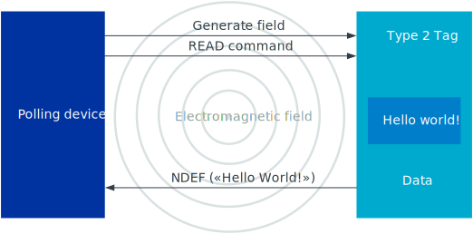

.. _ug_nfc:

Near Field Communication (NFC)
##############################

.. contents::
   :local:
   :depth: 2

Near Field Communication (NFC) is a technology for wireless transfer of small amounts of data between two devices.
It uses very simple communication protocols and, therefore, allows quicker connection than Bluetooth® Low Energy.
However, because NFC uses magnetic induction to enable communication, the devices must be very close (< 10 cm) to connect.

The following image gives a simplified overview of how NFC works.
See the following sections for more information about the depicted components.

   Simplified overview of how NFC can be used

Technical specifications for NFC are available from the `NFC Forum specification overview`_.

.. _ug_nfc_programming:

Programming and reading tags
****************************

NFC supports different modes of operation.
In reader/writer mode, one of the NFC devices (the *polling device*) is active and requests and reads data from the other device (the *tag*).
The NFC tag is passive.
It does not generate an electromagnetic field, but it modulates the field that is generated by the polling device.
The tag contains data, such as a URL, which can be read and written by the polling device.

Most of Nordic Semiconductor's nRF5 Series devices contain a peripheral called NFC tag.
This peripheral works in NFC-A technology and supports the "listen" communication mode.
Listen mode means that the tag "listens to" (or waits for) polling devices, but it does not actively start a connection.

Programming a tag
=================

The |NCS| provides libraries and modules to emulate two types of tag protocol stacks:

* :ref:`nrfxlib:type_2_tag` - based on the `NFC Forum Type 2 Tag specification <NFC Forum specification overview_>`_
* :ref:`nrfxlib:type_4_tag` - based on the `NFC Forum Type 4 Tag specification <NFC Forum specification overview_>`_

These stacks are available as precompiled linkable libraries in the :ref:`nrfxlib repository <nrfxlib:nfc>`.
They provide functions to enable the NFC tag and configure the tag data.
See :ref:`nrfxlib:type_2_tag` and :ref:`nrfxlib:type_4_tag` for more information.
The API of the libraries is described in :ref:`API documentation (Type 2 Tag) <nfc_api_type2>` and :ref:`API documentation (Type 4 Tag) <nfc_api_type4>`.

Both libraries use the NFCT driver module from `nrfx`_ to access the NFCT hardware.
See :ref:`nrfxlib:nfc_integration_notes` for information on how to use the libraries in |NCS|.

Reading a tag
=============

To read data from an NFC tag, a polling device (also called NFC Reader Device) is needed.
In most cases, this will be a mobile device with an NFC interface, such as a smartphone or a tablet.

However, if you want to work in a fully embedded environment, you can use an Arduino-compatible NFC shield together with an nRF5 Development Kit to create your own polling device.
With the NFC shield connected, you can use libraries like the :ref:`st25r3911b_nfc_readme` library to read the raw data of a Type 2 Tag and the :ref:`nfc_t2t_parser_readme` to process the raw data.
To interact with Type 4 Tag data, use the :ref:`nfc_t4t_hl_procedure_readme` library.

See :ref:`lib_nfc_t2t` for all provided libraries for Type 2 Tag, and :ref:`lib_nfc_t4t` for all provided libraries for Type 4 Tag.

.. _ug_nfc_ndef:

NFC Data Exchange Format (NDEF)
*******************************

NFC communication uses NFC Data Exchange Format (NDEF) messages to exchange data.
NDEF is a binary format that is commonly used in NFC devices (like smartphones) and NFC tags.

The main data container defined by NDEF is called an *NDEF message*.
NDEF messages consist of one or more NDEF records of different types.
The type indicates the kind of data that the record contains, and the series of record types in a message defines the message type.
For example, a URI message contains one record that encodes a URL string.

See :ref:`ug_nfc_ndef_format` for detailed information on how NDEF messages are built up.

The |NCS| provides libraries for generating and encoding NDEF messages and records, and for parsing them.
There are libraries for specific message and record types as well as a generic generator that you can use to easily implement other standardized records and messages or even create your own records.

See :ref:`lib_nfc_ndef` for all provided libraries.

If you use the provided libraries, you do not need deep knowledge of the NDEF specification to start using NFC.

.. _ug_nfc_ndef_format:

NDEF message and record format
==============================

NDEF data is structured in messages.
Each message consists of one or more records, which are made up of a header and the record payload.
The :ref:`ug_nfc_ndef_format_header` contains metadata about, amongst others, the payload type and length.
The :ref:`ug_nfc_ndef_format_payload` constitutes the actual content of the record.

.. figure:: images/ndef_msg.svg
   :alt: Structure of an NDEF message and record

   Structure of an NDEF message and record

.. _ug_nfc_ndef_format_header:

Record header
-------------

The NDEF record header consists of the following fields:

.. list-table::
   :header-rows: 1

   * - Field
     - Length
     - Required
     - Description
   * - Flags and TNF
     - 1 byte
     - yes
     - See :ref:`ug_nfc_ndef_format_flags`.
   * - Type Length
     - 1 byte
     - yes
     - Specifies the length of the payload type field.
       Required, but may be zero.
   * - Payload Length
     - 1 or 4 bytes
     - yes
     - Specifies the length of the payload.
       Either 1 byte or 4 byte long, depending on the SR flag. Required, but may be zero.
   * - ID Length
     - 1 byte
     - no
     - Required if the IL flag is set.
       Specifies the size of the Payload ID field.
   * - Payload Type
     - variable
     - no
     - Required if the Type Length is > 0.
       Specifies the type of the NDEF record payload.
   * - Payload ID
     - variable
     - no
     - Required if the IL flag is set and the ID Length is > 0.
       Specifies the ID of the NDEF record payload.

.. _ug_nfc_ndef_format_flags:

Flags and TNF
-------------

   Flags and TNF byte

The Flags and TNF byte contains the following flags:

MB (Message Begin) and ME (Message End):
   Specify the position of the NDEF record within the message.
   The MB flag is set for the first record in the message.
   Similarly, the ME flag is set for the last record in the message.
   If a record is the only record in a message, both flags are set.
CF (Chunk Flag):
   Used for chunked payloads (a payload that is partitioned into multiple records).
   Set in all chunks of the record except for the last one.
   Note, however, that chunking is not supported by this library.
SR (Short Record):
   Used to determine the size of the payload length field.
   If the flag is set, the Payload Length occupies 1 byte; otherwise it is 4 bytes long.
   Note that the NDEF generator supports a Payload Length of 4 bytes only at the moment.
IL (ID Length present):
   Indicates whether an ID Length field is present in the header.
   If the flag is set, the ID Length field is present.
TNF (Type Name Format):
   Specifies the structure of the Payload Type field and how to interpret it.
   The following values are allowed (square brackets contain documentation reference related to the specific type):

   +-------+------------------------------------+
   | Value | Type Name Format                   |
   +=======+====================================+
   | 0x00  | Empty                              |
   +-------+------------------------------------+
   | 0x01  | NFC Forum well-known type [NFC RTD]|
   +-------+------------------------------------+
   | 0x02  | Media-type [RFC 2046]              |
   +-------+------------------------------------+
   | 0x03  | Absolute URI [RFC 3986]            |
   +-------+------------------------------------+
   | 0x04  | NFC Forum external type [NFC RTD]  |
   +-------+------------------------------------+
   | 0x05  | Unknown                            |
   +-------+------------------------------------+
   | 0x06  | Unchanged                          |
   +-------+------------------------------------+
   | 0x07  | Reserved                           |
   +-------+------------------------------------+

.. _ug_nfc_ndef_format_payload:

Record payload
==============

The content of the payload is application-specific and related to the type of the record.
For example, in URI records, the payload contains a web address of the page that the polling device should open.

Note that the payload of an NDEF record can contain a nested NDEF message.
This nested message must be a full NDEF message, consisting of one or multiple NDEF records with the appropriate setting of MB and ME flags.

.. _ug_nfc_tnep:

Tag NDEF Exchange Protocol (TNEP)
*********************************

The Tag NDEF Exchange Protocol (TNEP) is an application-level protocol for sending or retrieving application data units between a polling (reader) device and an NFC tag.
The data units are NFC Data Exchange Format (NDEF) messages.

The protocol operates between the NDEF application layer and the tag.
The tag must use a protocol that supports the NDEF Read and Write procedure (thus one of the NFC Forum tag types except for Type 1 Tag).
The polling device must support this protocol to be able to perform reading and writing of NDEF messages on the tag.

TNEP supports NFC tags of all NFC Forum tag types from Type 2 Tag to Type 5 Tag.
The polling device communicates with the tag using a protocol that works with the specific tag type.

The |NCS| provides libraries to implement TNEP for both the polling device and the tag.
See :ref:`lib_nfc_tnep` for all provided libraries.
