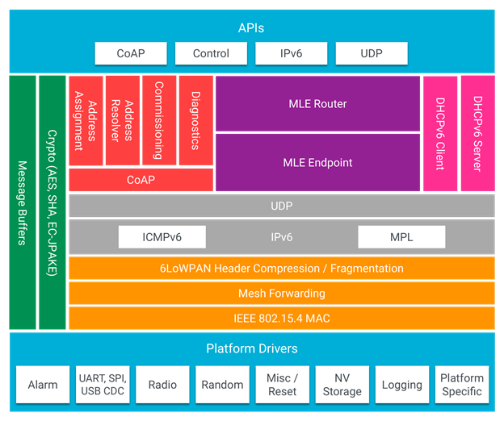

.. _ug_thread_architectures:

OpenThread architectures
########################

.. contents::
   :local:
   :depth: 2

This page describes the OpenThread stack architecture and platform designs that are possible with the OpenThread network stack on Nordic Semiconductor devices in the |NCS|.

The designs are described from the least complex to the most complex, starting with System-on-Chip designs.
These are simple applications that consist of a single chip running a single protocol or multiple protocols.
Co-processor designs, on the other hand, require two processors.
The nRF SoC acts as a network co-processor, while the application is running on a much more powerful host processor.

.. _openthread_stack_architecture:

OpenThread stack architecture
*****************************

OpenThread's portable nature makes no assumptions about platform features.
OpenThread provides the hooks to use enhanced radio and cryptography features, reducing system requirements, such as memory, code, and compute cycles.
This can be done per platform, while retaining the ability to default to a standard configuration.

   OpenThread architecture adapted from `openthread.io <OpenThread system architecture_>`_

.. _ug_thread_architectures_designs_soc_designs:

System-on-Chip designs
**********************

A single-chip solution uses the RFIC (the IEEE 802.15.4 in case of Thread) and the processor of a single SoC.

In these designs, OpenThread and the application layer run on the same local processor.

.. _thread_architectures_designs_soc_designs_single:

Single-chip, single protocol (SoC)
==================================

In this design, the only wireless protocol that is used is Thread.
OpenThread and the application layer run on the same processor.
The application uses the OpenThread APIs and IPv6 stack directly.

This SoC design is most commonly used for applications that do not make heavy computations or are battery-powered.

This design has the following advantages:

* The radio and the general MCU functionalities are combined into one chip, resulting in a low cost.
* Power consumption is lower than in all other designs.
* Complexity is lower than in all other designs.

It has the following disadvantages:

* For some use cases, the nRF52 Series and nRF53 Series MCUs can be too slow (for example, when the application does complex data processing).
* The application and the network share flash and RAM space, which can limit the application functionality.
* Might require external flash for DFU if the secondary application slot does not fit in the primary memory because of increased application size.

.. figure:: images/thread_platform_design_soc.svg
   :alt: Thread-only architecture (nRF52)

   Thread-only architecture on nRF52 Series devices

.. figure:: images/thread_platform_design_nRF53.svg
   :alt: Thread-only architecture (nRF53)

   Thread-only architecture on nRF53 Series devices

This platform design is suitable for the following development kits:

.. table-from-rows:: /includes/sample_board_rows.txt
   :header: heading
   :rows: nrf52840dk_nrf52840, nrf52833dk_nrf52833, nrf5340dk_nrf5340_cpuapp_and_cpuapp_ns, nrf21540dk_nrf52840

.. _thread_architectures_designs_soc_designs_multiprotocol:

Single-chip, multiprotocol (SoC)
================================

nRF52 and nRF53 Series devices support multiple wireless technologies, including IEEE 802.15.4 and Bluetooth® Low Energy (Bluetooth LE).

In a single-chip, multiprotocol design, the application layer and OpenThread run on the same processor.

This design has the following advantages:

* It leverages the benefits of a highly integrated SoC, resulting in low cost and low power consumption.
* It allows to run Thread and Bluetooth LE simultaneously on a single chip, which reduces the overall BOM cost.

It has the following disadvantages:

* Bluetooth LE activity can degrade the connectivity on Thread if not implemented with efficiency in mind.

.. figure:: images/thread_platform_design_multi.svg
   :alt: Multiprotocol Thread and Bluetooth LE architecture (nRF52)

   Multiprotocol Thread and Bluetooth LE architecture on nRF52 Series devices

.. figure:: images/thread_platform_design_nRF53_multi.svg
   :alt: Multiprotocol Thread and Bluetooth LE architecture (nRF53)

   Multiprotocol Thread and Bluetooth LE architecture on nRF53 Series devices

For more information about the multiprotocol feature, see :ref:`ug_multiprotocol_support`.

This platform design is suitable for the following development kits:

.. table-from-rows:: /includes/sample_board_rows.txt
   :header: heading
   :rows: nrf52840dk_nrf52840, nrf52833dk_nrf52833, nrf5340dk_nrf5340_cpuapp_and_cpuapp_ns

.. _thread_architectures_designs_cp:

Co-processor designs
********************

In co-processor designs, the application runs on one processor (the host processor) and communicates with another processor that provides the Thread radio.
The communication happens through a serial connection using a standardized host-controller protocol (Spinel).
See :ref:`ug_thread_communication` for more information on the communication.

OpenThread runs on either the radio processor or the host processor, depending on whether a network co-processor (NCP) design or a radio co-processor (RCP) design is chosen.

.. _thread_architectures_designs_cp_ncp:

Network co-processor (NCP)
==========================

.. note::
   This platform design is currently discontinued by the |NCS|.

In the standard NCP design, the full OpenThread stack runs on the processor that provides the Thread radio (the *network processor*), and the application layer runs on a host processor.
The host processor is typically more capable than the network processor, but it has greater power demands.
The host processor communicates with the network processor through a serial interface (typically UART or SPI) over the `Spinel protocol`_.

This design is useful for gateway devices or devices that have other processing demands, like IP cameras and speakers.

This design has the following advantages:

* The higher-power host can sleep, while the lower-power network processor remains active to maintain its place in the Thread network.
* Since the network processor is not tied to the application layer, development and testing of applications is independent of the OpenThread build.
* When choosing an advanced and powerful host processor, applications can be very complex.
* Only the network stack and a thin application reside on the network processor, which reduces the cost of the chip.
  RAM and flash usage are usually smaller than in a single-chip solution.

It has the following disadvantages:

* This is a more expensive option, because it requires a host processor for the application.

   Network co-processor architecture

.. note::
    |connection_options_limited|

.. _thread_architectures_designs_cp_rcp:

Radio co-processor (RCP)
========================

This is a variant of the NCP design where the core of OpenThread runs on the host processor, with only a minimal "controller" running on the device with the Thread radio.
In this design, the host processor typically does not sleep, to ensure reliability of the Thread network.

This design is useful for devices that are less sensitive to power constraints.

This design has the following advantages:

* OpenThread can use the resources on the more powerful host processor.
* When choosing an advanced and powerful host processor, applications can be very complex.
* It is possible to use a radio co-processor that is less capable than what is needed in the NCP design, which reduces the cost.

It has the following disadvantages:

* The host processor must be woken up on each received frame, even if a frame must be forwarded to the neighboring device.
* The RCP solution can be less responsive than the NCP solution, due to the fact that each frame or command must be communicated to the host processor over the serial link.

.. figure:: images/thread_platform_design_rcp.svg
   :alt: Radio co-processor architecture

   Radio co-processor architecture

.. note::
    |connection_options_limited|

This platform design is suitable for the following development kits:

.. table-from-rows:: /includes/sample_board_rows.txt
   :header: heading
   :rows: nrf52840dk_nrf52840, nrf52833dk_nrf52833, nrf21540dk_nrf52840

.. _thread_architectures_designs_cp_uart:

UART recommendations for co-processor designs
=============================================

Use the following recommended default UART settings for a configuration based on :ref:`thread_architectures_designs_cp` architecture:

* Bit rate: 1000000
* Start bits: 1
* Data bits: 8
* Stop bits: 1
* No parity
* Flow Control: Hardware

Flow control
   UART Hardware Flow Control is recommended in Nordic Semiconductor's solution.
   Using Software Flow Control is neither recommended nor implemented.

Hardware reset
   Use the Arduino-style hardware reset, where the DTR signal is coupled to the RES pin through a 0.01 µF capacitor.
   This causes the co-processor to automatically reset whenever the serial port is opened.

   .. note::
      This hardware reset method is not used in Nordic Semiconductor's solution.
      Dedicate one of your host pins to control the RES pin on the co-processor, so that you can easily perform a hardware reset if necessary.

Recommended UART signals
------------------------

The following UART signals are used in the Nordic Semiconductor's solution:

* RX
* TX
* CTS
* RTS
* DTS (optional, not used)
* RES

----

|Google_CCLicense|
The source page is available `here <OpenThread system architecture_>`_.

.. |connection_options_limited| replace:: Spinel connections through SPI and USB are not currently available in the |NCS|.
