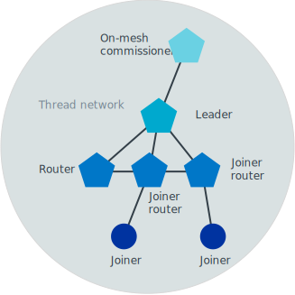
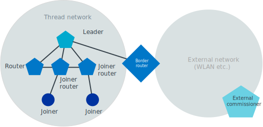

.. _thread_ot_commissioning:

OpenThread commissioning
########################

.. contents::
   :local:
   :depth: 2

Commissioning is the process that allows a new Thread device to join a Thread network.
The new device must be authenticated and authorized to become part of the network.

In the commissioning process, devices have different :ref:`thread_ot_commissioning_roles`.
The whole process can happen within the Thread network (connectivity within the Thread network) or can involve devices that are outside the network (other network provides connectivity, for example Ethernet or Wi-Fi).
This is the main difference between :ref:`thread_ot_commissioning_types_on-mesh` and :ref:`thread_ot_commissioning_types_external`, respectively.
The whole commissioning process benefits from :ref:`several security measures <thread_ot_commissioning_roles_authentication>`, especially the DTLS protocol.

.. _thread_ot_commissioning_roles:

Commissioning roles
*******************

During the commissioning process, the devices involved are assigned one of the following roles:

* *Leader* - Watches over the network configuration, allows Commissioner Candidate to become Commissioner, and ensures there is only one active Commissioner.
* *Commissioner Candidate* - Role for a device capable of becoming the Commissioner, but has not yet been assigned the role of Commissioner.
* *Commissioner* - Authenticates the Joiner and provides it with network credentials required to join the network.
  The Commissioner can be part of the network or it can be outside the network (see :ref:`thread_ot_commissioning_types`).
* *Joiner* - Role for a new device that wants to join the Thread network.
  It exchanges messages with the Commissioner through the directly connected Joiner Router that serves as a proxy.
* *Joiner Router* - Role for a router device that is one hop away from the Joiner device in the Thread network and is the sole device connected with the Joiner.
  Responds to the Discovery Request of the Joiner.
  Moreover, when chosen by the Joiner, it passes subsequent communication in a secure manner.
* *Border Router* - Role for a device that forwards data between a Thread network and a non-Thread network.
  For this purpose, it is equipped with at least two interfaces, for example Wi-Fi, Ethernet, LTE, or other interface in addition to Thread.
  The Border Router can also be an interface for the Commissioner.

  The Border Router role is usually combined with the *Border Agent* function, which accepts :ref:`petitions <thread_ot_commissioning_phases>` from the Commissioner candidate.
  It also relays commissioning messages between Thread Network and a Commissioner.
  If a Commissioner is a part of the network, the same node is both the Commissioner and the Border Agent.

Once a device is assigned one of the roles in the network, it can combine it with other roles.
An exception is the Joiner role, which is exclusive to the Joiner and cannot be combined with other roles.
For example:

* Border Router can also have the Joiner Router role in :ref:`thread_ot_commissioning_types_external`.
* Joiner Router can also have the Commissioner role in :ref:`thread_ot_commissioning_types_on-mesh`.

For details about scenarios that include devices with multiple roles, see `Thread Group's Commissioning White Paper`_.

See :ref:`thread_ot_commissioning_cli` for the list of commands used to assign the commissioning roles.

.. _thread_ot_device_types:

Device types
============

OpenThread distinguishes between different device types depending on what roles a device can take in the Thread network.

Full Thread Device (FTD)
  An FTD can be both a router and an end device.
  Its radio is always on.

Minimal Thread Device (MTD)
  An MTD is always an end device.
  It forwards all messages to its parent.

  There are two important subtypes:

  Minimal End Device (MED)
   A MED keeps its transceiver always on.

  Sleepy End Device (SED)
   A SED is usually off and wakes occasionally to receive messages from its parent.

  Synchronized Sleepy End Device (SSED)
   A SSED is an enhanced SED.
   It transmits less data than SED and relies on receiving messages from its parent only in specified time intervals.

For more information, see `Device Types on OpenThread portal`_.

SED vs SSED activity
--------------------

.. thread_ssed_description_start

A Thread Synchronized Sleepy End Device (SSED) is synchronized with its parent router and uses the radio only at scheduled intervals, by using the Coordinated Sampled Listening (CSL) feature introduced as one of `Thread 1.2 Base Features`_.
During those intervals, the device waits for the router to send it any data related to the desired device activity.
The SSED does require sending packets occasionally to keep synchronization with the router.
However, unlike a regular SED, an SSED does not actively communicate with the router by polling and goes into the idle mode in-between the scheduled activity periods.
If there is no application-related traffic for a longer period of time, the SSED sends a data poll request packet to synchronize with the parent.
Overall, the SSED features further reduce energy consumption of the device and generate less data traffic compared to a standard Thread SED.

.. figure:: images/thread_sed_ssed_comparison.svg
   :alt: Comparison of Thread SED and Thread SSED radio activity

   Comparison of Thread SED and Thread SSED radio activity

.. thread_ssed_description_end

.. _thread_ot_commissioning_types:

Commissioning scenarios
***********************

The commissioning in OpenThread can be either on-mesh or external.
Native commissioning is not supported by OpenThread.

.. _thread_ot_commissioning_types_on-mesh:

On-mesh Thread commissioning
============================

In the on-mesh Thread commissioning, the commissioning takes place inside the Thread network.
The Thread Leader approves a Commissioner connected either to the Thread network (on-mesh Commissioner) or to a Thread device, and accepts it into the Thread network.
The Border Agent then authenticates it.
After authentication, the Commissioner instructs the Joiner Router to transfer Thread network credentials to the Joiner.

In this type of commissioning, Thread network credentials are transferred between devices over the radio.
At the end of its own authentication process, the Joiner :ref:`joins <thread_ot_commissioning_phases_joining>` the Thread network and becomes an active device that communicates with other Thread devices.

For security purposes, the on-mesh Thread commissioning requires exchanging a DTLS handshake between Commissioner and Joiner.
See :ref:`thread_ot_commissioning_roles_authentication` for more information.

   On-mesh Thread commissioning

For information about how to configure on-mesh Thread Commissioning, see :ref:`thread_ot_commissioning_configuring_on-mesh`.

.. _thread_ot_commissioning_types_external:

External Thread commissioning
=============================

In the external Thread commissioning, the commissioning involves a Commissioner device connected to a network other than the Thread network, like Wi-Fi or Ethernet.
This external Commissioner (for example, a mobile phone) commissions new devices onto the network using the Thread Border Router as forwarding interface.

For security purposes, the external Thread commissioning requires exchanging a DTLS handshake.
The following DTLS sessions are established:

* Between Commissioner and Border Agent
* Between Commissioner and Joiner

See :ref:`thread_ot_commissioning_roles_authentication` for related information.

   External Thread commissioning

.. _thread_ot_commissioning_phases:

Commissioning phases
********************

The commissioning process includes petitioning and joining.

.. _thread_ot_commissioning_phases_petitioning:

Petitioning
===========

Petitioning concerns the Commissioner role.

Petitioning occurs in both commissioning scenarios. The Commissioner Candidate that is either connected to an external network (external candidate) or is part of the network (on-mesh candidate) must petition the Leader of the Thread network through the Border Agent to become the only authorized Commissioner.

The petitioning involves up to two phases:

1. (External commissioning only) The potential Commissioner exchanges a DTLS authentication handshake with the Thread Border Router to prove its eligibility and set up a secure connection.
#. (Both scenarios) The potential Commissioner sends a petition to the Thread Leader through the Thread Border Router.

The Leader accepts the petition based on only one criterium: whether there is already an active Commissioner in the Thread network.
If there is none, the petition is accepted.
If the petition is rejected, a rejection message is sent with the ID of the active Commissioner.

After the petition is accepted by the Leader, the following actions occur:

1. (External commissioning only) The connection is established and all subsequent communication between the Commissioner and other Thread devices is done through the Border Agent.
#. (Both scenarios) The new Commissioner becomes the only authorized Commissioner.
#. (Both scenarios) A periodic message is sent to keep the secure commissioning session open.

.. _thread_ot_commissioning_phases_joining:

Joining
=======

Joining concerns the Joiner role.

Joining occurs in both commissioning scenarios.
It involves the following phases:

1. The Joiner, that is a potential new device in the Thread network, sends a Discovery Request message on every channel.
#. The Joiner Router receives the message and answers with the Discovery Response message.
   This message contains network identifiers and Steering Data in the payload.
#. The Joiner uses the information received from the Joiner Router to discover the correct network to connect to.

After the Joiner received the payload from the Joiner Router, the following actions occur:

1. The connection is established.
#. The secure communication session continues, with a periodic message sent to keep it open.

.. _thread_ot_commissioning_roles_authentication:

Security, authentication, and credentials
*****************************************

To avoid a situation in which rogue devices join the Thread network, the communication between Commissioner and Joiner (in both scenarios) and Commissioner and Border Agent (in external commissioning) is secured with the Datagram Transport Layer Security (DTLS) authentication protocol session.
The session is established automatically.

The communication between Joiner and Joiner Router is also secured, but only when the Joiner Router sends network credentials to the Joiner using a one-time key generated by the Commissioner.

During commissioning, the on-mesh Thread Commissioner possesses the network master key by default, while the external Thread Commissioner never gains possession of the network master key.

The commissioning uses the following passwords and credentials:

* *Commissioning Credential* - Passphrase known by the Leader and shared with the Commissioner of the network.

  .. note::
        The Commissioning Credential has 6 bytes minimum and 255 bytes maximum and is composed in the UTF-8 format, without character exclusions.

* *Commissioning Key (PSKc)* - Preshared key for the Commissioner based on the Commissioning Credential, which is used to establish the Commissioner Session between the Commissioner and Border Agent.
  All devices in the Thread network store the PSKc.
* *Joining Device Credential (PSKd)* - Passphrase for authenticating a new Joiner device, used to establish a secure session between the Commissioner and the Joiner.
  When encoded in binary, this passphrase is referred to as preshared key for the device.

  .. note::
        The Joining Device Credential is composed of at least 6 and no more than 32 uppercase alphanumeric ASCII characters (base32-thread, 0 to 9 and A to Y, with the exclusion of I, O, Q, and Z).

For details and a full overview of security credentials, see the `Thread Specification`_, table 8.2.

.. _thread_ot_commissioning_cli:

Commissioning commands
**********************

See the following pages in the `OpenThread CLI Reference`_ on GitHub for an overview of available CLI commands that can be used for commissioning:

* `Commissioner CLI commands`_
* `Joiner CLI commands`_

.. _thread_ot_commissioning_configuring_on-mesh:

Configuring on-mesh Thread commissioning
****************************************

You can configure on-mesh Thread commissioning using the :ref:`ot_cli_sample` sample or the :ref:`ot_coprocessor_sample` sample with two devices to form a Thread network.
One device will act as a Commissioner and the other will be a Joiner.

.. comment out until content is moved
  .. note::
    Before you start the configuration process, make sure you are familiar with :ref:`Thread commissioning concepts <thread_ot_commissioning>`, especially :ref:`thread_ot_commissioning_types_on-mesh`.

.. _thread_ot_commissioning_configuring_on-mesh_requirements:

Requirements
============

To configure on-mesh Thread commissioning, you need at least two development kits that are compatible with either the CLI or the Co-processor samples.
Check the sample documentation pages for the list of compatible development kits.

.. _thread_ot_commissioning_configuring_on-mesh_flashing:

.. rst-class:: numbered-step

Programming the DKs
===================

Program both development kits with the :ref:`ot_cli_sample` sample or program both of them with the :ref:`ot_coprocessor_sample` sample.
See the sample's page for details.

After programming the DKs and turning them on, both devices will be precommissioned and will form a Thread network.
This network needs to be manually disabled.

.. _thread_ot_commissioning_configuring_on-mesh_disabling:

.. rst-class:: numbered-step

Disabling the Thread network
============================

The |NCS|'s Thread CLI and Co-processor samples come with the autostart feature, which means that the devices will form the network automatically without user intervention.
To properly observe the commissioning process, it is recommended to form a new Thread network manually.

To disconnect from the network before starting the commissioning process, run the following command on both devices for the sample of your choice:

.. tabs::

   .. group-tab:: CLI

      .. code-block:: console

         uart:~$ ot thread stop

   .. group-tab:: Coprocessor

      .. code-block:: console

         wpanctl:device_if> leave
         Leaving current WPAN. . .

.. _thread_ot_commissioning_configuring_on-mesh_forming:

.. rst-class:: numbered-step

Setting up the Commissioner
===========================

One of the two devices must become the Leader and Commissioner of the randomly generated network.
Complete the following steps for the sample of your choice:

1. Form a network by running the following commands:

   .. tabs::

      .. group-tab:: CLI

         .. code-block:: console

            uart:~$ ot dataset init new
            Done
            uart:~$ ot dataset commit active
            Done
            uart:~$ ot ifconfig up
            Done
            uart:~$ ot thread start
            Done

      .. group-tab:: NCP

         .. code-block:: console

            wpanctl:leader_if> form "My_Network" -c 11
            Forming WPAN "My_Network" as node type "router", channel:11
            Successfully formed!

#. View the newly generated network settings by running the following command:

   .. tabs::

      .. group-tab:: CLI

         .. code-block:: console

            uart:~$ ot dataset
            Active Timestamp: 1
            Channel: 23
            Channel Mask: 07fff800
            Ext PAN ID: 36dd32babd209538
            Mesh Local Prefix: fd51:51f2:fb58:c849/64
            Master Key: 0278f75cb81f04834f09b5fc095852d6
            Network Name: OpenThread-8299
            PAN ID: 0x8299
            PSKc: 658f3f958bade7db07a36c3fbf2fa2c9
            Security Policy: 0, onrcb
            Done

      .. group-tab:: NCP

         .. code-block:: console

            wpanctl:leader_if> status
            leader_if => [
                  "NCP:State" => "associated"
                  "Daemon:Enabled" => true
                  "NCP:Version" => "OPENTHREAD/20191113-01053-g07f430dac; NONE; Oct  7 2020 14:54:25"
                  "Daemon:Version" => "0.08.00d (0.07.01-347-gf2e1501; Oct  7 2020 11:40:50)"
                  "Config:NCP:DriverName" => "spinel"
                  "NCP:HardwareAddress" => [F4CE368F9ED56701]
                  "NCP:Channel" => 11
                  "Network:NodeType" => "leader"
                  "Network:Name" => "My_Network"
                  "Network:XPANID" => 0x7ADF737288F9FCB0
                  "Network:PANID" => 0xC4BB
                  "IPv6:MeshLocalAddress" => "fd7a:df73:7288:0:29a8:87b5:3fb7:5142"
                  "IPv6:MeshLocalPrefix" => "fd7a:df73:7288::/64"
                  "com.nestlabs.internal:Network:AllowingJoin" => false
            ]

#. Retrieve the ``EUI64`` identifier from the Joiner by running the following command:

   .. tabs::

      .. group-tab:: CLI

         .. code-block:: console

            uart:~$ ot eui64
            f4ce3687a6e4f6e8
            Done

      .. group-tab:: NCP

         .. code-block:: console

            wpanctl:joiner_if> getprop NCP:HardwareAddress
            NCP:HardwareAddress = [F4CE36710E768C63]

#. Enable the Commissioner role in the Leader device by running the following command:

   .. tabs::

      .. group-tab:: CLI

         .. code-block:: console

            uart:~$ ot commissioner start
            Done

      .. group-tab:: NCP

         .. code-block:: console

            wpanctl:leader_if> commissioner start
            Commissioner started

#. Set up a preshared key for the Joiner device by running the following command:

   .. tabs::

      .. group-tab:: CLI

         .. code-block:: console

            uart:~$ ot commissioner joiner add f4ce3687a6e4f6e8 N0RD1C
            Done

      .. group-tab:: NCP

         .. code-block:: console

            wpanctl:leader_if> commissioner joiner-add F4CE36710E768C63 3600 N0RD1C
            Added Joiner F4:CE:36:71:0E:76:8C:63, timeout:3600, PSKd:"N0RD1C"

   See :ref:`thread_ot_commissioning_roles_authentication` for encoding limitations.

.. _thread_ot_commissioning_configuring_on-mesh_joining:

.. rst-class:: numbered-step

Adding the Joiner
=================

Now that the Commissioner is ready, complete the following steps for the sample of your choice:

1. Start the joining process in the Joiner device by running the following commands:

   .. tabs::

      .. group-tab:: CLI

         .. code-block:: console

            uart:~$ ot ifconfig up
            Done
            uart:~$ ot joiner start N0RD1C
            Done

         After a couple of seconds, the following message appears:

         .. code-block:: console

            Join success

      .. group-tab:: NCP

         .. code-block:: console

            wpanctl:joiner_if> joiner --join N0RD1C
            Starting joiner commissioning, PSKd:"N0RD1C" ...
            Successfully joined!

   The Joiner starts broadcasting Discovery Requests on all available channels.
   When the Commissioner receives a Discovery Request, it responds to the sender.
   After the response, a DTLS session is established to securely authenticate the Joiner and exchange the network credentials.
#. After a successful joining process, attach the newly added device to the Thread network by running the following command:

   .. tabs::

      .. group-tab:: CLI

         .. code-block:: console

            uart:~$ ot thread start
            Done

         This command starts the Thread network and automatically attaches the device to it.

      .. group-tab:: NCP

         .. code-block:: console

            wpanctl:joiner_if> attach
            Resuming saved WPAN. . .

Both devices are now able to ping each other.
