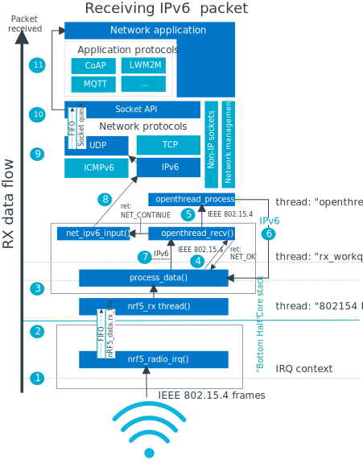

.. _openthread_integration:

OpenThread integration
######################

.. contents::
   :local:
   :depth: 2

This page explains how the OpenThread stack is integrated with Zephyr and |NCS|.
It describes the location of components in the file structure, threads and synchronization primitives used, and the network traffic flow.

Overview
********

The OpenThread stack is integrated with the Zephyr RTOS through the L2 layer.
See :ref:`zephyr:network_stack_architecture` for more information.

The OpenThread integration in the L2 layer uses the nRF variant of the :ref:`zephyr:ieee802154_interface` radio driver, which is located underneath the L2 layer.
It can also optionally use Zephyr's IP stack, which is located above it.

Alternatively, you can use the OpenThread API and IPv6 stack directly.
This approach provides less flexibility when porting applications though, because the OpenThread API might not be available for all architectures.

To decide which approach to use for your application, consider the following alternatives:

Using Zephyr's OpenThread integration and IP stack
  This approach is used by default.

  Zephyr's IP stack can use Zephyr's L3 layer, which makes it easy to port the application.
  With this approach, your application can use UDP, TCP, and ICMP built on top of Zephyr's IP stack.

  The disadvantage of this approach is the reception path.
  IP packets must traverse both the OpenThread L3 layer and Zephyr's L3 layer to reach the BSD socket.

Using the OpenThread API and IPv6 stack directly
  For simple applications, using the OpenThread API and IPv6 stack directly can be a good approach.

  The OpenThread API contains built-in support for higher-level protocols like UDPv6 and CoAP.
  Using the OpenThread API directly reduces the overhead, because IP packets do not need to go through Zephyr's stack.
  Handling them directly results in a more energy-efficient application with faster packet handling.

  The disadvantage of this approach is limited portability and functionality.
  Higher-level protocols provided by OpenThread are not as full-featured compared to those implemented in Zephyr.
  For example, the CoAP implementation does not support observers and the block transfer functionality, and the TCP protocol is not implemented in OpenThread.

Threads
*******

The OpenThread network stack uses the following threads:

* ``openthread`` - Responsible for receiving IEEE 802.15.4 frames during reception.
  When the reassembled frames are an application IPv6 packet, the thread calls :c:func:`ot_receive_handler`, which injects the packet back to the L2 layer using :c:func:`net_recv_data`, so that it can later reach Zephyr's IP stack.
  During the transmission, the thread's job is to handle the previously scheduled OpenThread tasklet that contains the message to be sent.
* ``rx_workq`` - Responsible for receiving L2 frames and directing them either to the OpenThread process or Zephyr's IP stack during reception, depending on whether the frame is an IEEE 802.15.4 frame or an IPv6 packet.
* ``tx_workq`` - Responsible for receiving the UDP packet, scheduling the OpenThread tasklet for transmission, and unlocking the ``openthread`` thread by giving the semaphore.
* ``workqueue`` - Responsible for invoking the radio driver API to schedule a transmission.
* ``802154 RX`` - Responsible for the upper half processing of the radio frame reception (that is, the core stack part).
  Works on objects of type :c:struct:`nrf5_802154_rx_frame` that are put to the :c:type:`nrf5_data.rx_fifo` from the RX IRQ context.
  The thread is responsible for creating the :c:struct:`net_pkt` structure and passing it to the upper layer with :c:func:`net_recv_data`.

Apart from these threads, the OpenThread stack also uses one or more :ref:`application threads <threads_v2>`.
These threads execute the application logic.

File system and shim layer
**************************

The OpenThread network stack components are located in the following directories:

* OpenThread stack: :file:`modules/lib/openthread/`
* OpenThread shim layer:

  * Thread entry point function, callbacks, utils, L2 registration: :file:`zephyr/subsys/net/l2/openthread/`
  * OpenThread platform layer location: :file:`zephyr/subsys/net/lib/openthread/platform/`

The responsibilities of the OpenThread shim layer are as follows:

* Translating the data into Zephyr's native :c:struct:`net_pkt` structure.
* Providing the OpenThread thread body and synchronization API.
* Providing :c:func:`openthread_send` and :c:func:`openthread_recv` calls that are registered as the L2 interface API.
* Providing a way to initialize the OpenThread stack.
* Implementing callback functions used by the OpenThread stack.

The nRF IEEE 802.15.4 radio driver is located in the following directories:

* nRF IEEE 802.15.4 radio driver shim layer: :file:`zephyr/drivers/ieee802154/` (:file:`ieee802154_nrf5.c` and :file:`ieee802154_nrf5.h`)
* nRF IEEE 802.15.4 radio driver: :file:`modules/hal/nordic/drivers/nrf_radio_802154`

Radio driver's RX and TX connections
====================================

The RX connection of the radio driver is established through the interrupt handler.
The interrupt handler is registered using Zephyr's mechanism with ``NRF_802154_INTERNAL_RADIO_IRQ_HANDLING=0`` defined.
The registered IRQ handler uses Zephyr's FIFO to pass the IEEE 802.15.4 frame on.
The ``802154 RX`` thread runs on the highest cooperative priority and waits for this FIFO.
When a new frame appears, the thread continues with the processing.

The TX connection of the radio driver uses the workqueue, which calls the radio driver to schedule the transmission.
Then the RTC IRQ is used to send the frame over the air.

Traffic flow
************

The traffic flow is not fully symmetrical for the reception (RX) and the transmission (TX) cases.

RX traffic flow
===============

The following figure shows the RX traffic flow when the application is using the :ref:`BSD socket API <bsd_sockets_interface>`.

   OpenThread application RX data flow

The numbers in the figure correspond to the step numbers in the following data receiving (RX) processing flow:

1.  A network data packet is received by the nRF IEEE 802.15.4 radio driver.
2.  The device driver places the received frame in the FIFO with :c:func:`nrf_802154_received_timestamp_raw`.
    The receive queues also act as a way to separate the data processing pipeline ("Bottom Half") from the core stack part, as the device driver is running in an interrupt context and it must do its processing as fast as possible.
3.  The ``802154 RX`` radio driver thread does the core stack processing of the received IEEE 802.15.4 radio frame.
    As a result, it puts a work item with :c:func:`net_recv_data` to have the frame processed.
4.  The work queue thread ``rx_workq`` calls the registered handler for every queued frame.
    In this case, the registered handler :c:func:`openthread_recv` checks if the frame is of the IEEE 802.15.4 type.
    If this is the case, it inserts the frame into :c:struct:`rx_pkt_fifo` and returns ``NET_OK``.
5.  The ``openthread`` thread gets a frame from the FIFO and processes it.
    It also handles the IP header compression and reassembly of fragmented traffic.
6.  As soon as the thread detects a valid IPv6 packet that needs to be handled by the higher layer, it calls the registered callback :c:func:`ot_receive_handler`.
    This callback creates a buffer for a :c:struct:`net_pkt` structure that is going to be passed to Zephyr's IP stack.
    It also calls :c:func:`net_recv_data` to have the :c:struct:`net_pkt` structure processed.
7.  This time the :c:func:`openthread_recv` called by the workqueue returns ``NET_CONTINUE``.
    This indicates that the valid IPv6 packet is present and needs to be processed by Zephyr's higher layer.
8.  :c:func:`net_ipv6_input` passes the packet to the next higher layer.
9.  The packet is passed to the L3 processing.
    If the packet is IP-based, the L3 layer processes the IPv6 packet.
10. A socket handler finds an active socket to which the network packet belongs and puts it in a queue for that socket, in order to separate the networking code from the application.
11. The application receives the data and can process it as needed.

    .. tip::
        The application should use the :ref:`BSD socket API <bsd_sockets_interface>` to create a socket that will receive the data.

TX traffic flow
===============

The following figure shows the TX traffic flow when the application is using the :ref:`BSD socket API <bsd_sockets_interface>`.

.. figure:: images/zephyr_netstack_openthread-tx_sequence.svg
   :alt: OpenThread Application TX data flow
   :figclass: align-center

   OpenThread Application TX data flow

The numbers in the figure correspond to the step numbers in the following data transmitting (TX) processing flow:

1. The application uses the :ref:`BSD socket API <bsd_sockets_interface>` when sending the data.
   However, direct interaction with the OpenThread API is possible, for example to use its CoAP implementation.
2. The application data is prepared for sending to the kernel space and copied to internal :c:struct:`net_buf` structures.
3. Depending on the socket type, a protocol header is added in front of the data.
   For example, if the socket is a UDP socket, a UDP header is constructed and placed in front of the data.
4. A UDP :c:struct:`net_pkt` structured is queued to be processed with :c:func:`process_tx_packet`.
   In the call chain, the :c:func:`openthread_send` is called.
   It converts the :c:struct:`net_pkt` to the :c:struct:`otMessage` format and invokes :c:func:`otIp6Send`.
   In this step, the message is processed by the OpenThread stack.
5. The tasklet to schedule the transmission is posted and the semaphore that unlocks the ``openthread`` thread is given.
   Mac and Submac operations take place.
6. The ``openthread`` thread creates and schedules a work item used to transmit the IEEE 802.15.4 frame.
7. The nRF IEEE 802.15.4 radio driver sends the packet.
