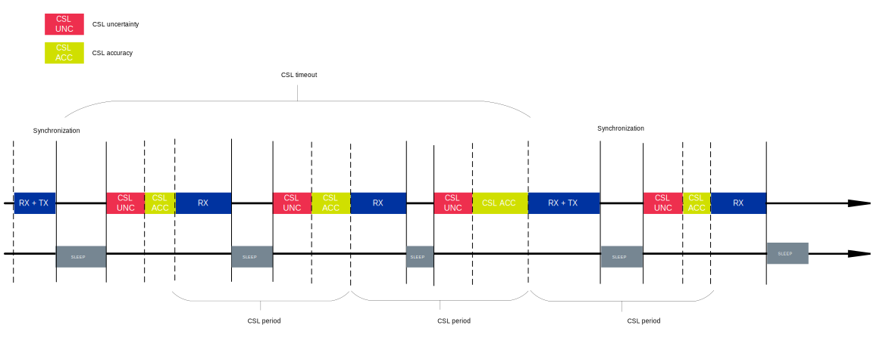

.. _thread_sed_ssed:

Sleepy End Device types in Thread
#################################

.. contents::
   :local:
   :depth: 2

Sleepy End Devices (SEDs) and Synchronized Sleepy End Devices (SSEDs) are both Minimal Thread Devices (MTDs).
Unlike Full Thread Devices (FTDs), MTDs do not maintain a routing table and are typically low-power devices that are not always on.

For more information, see the :ref:`thread_types_mtd` section in the :ref:`thread_device_types` documentation.

The SEDs and SSEDs are often used as one of the measures to :ref:`optimize power consumption <app_power_opt>`.

Sleepy End Device
*****************

SEDs are MTDs that sleep most of the time in order to minimize the power consumption.
They communicate with the Thread network by occasionally polling the parent Router for any pending data.

The :kconfig:option:`CONFIG_OPENTHREAD_POLL_PERIOD` Kconfig handles the SED configuration by configuring the polling period.
A higher polling frequency results in lower latency (better responsiveness), but also higher power consumption.

The polling period can also be configured in runtime.
See the ``pollperiod`` command in the OpenThread `CLI reference <OpenThread CLI Reference - pollperiod command_>`_.

Synchronized Sleepy End Device
******************************

SSEDs are MTDs that are further optimized for power consumption.
A Thread SSED is synchronized with its parent Router and uses the radio only at scheduled intervals.
It does this by using the :ref:`thread_ug_supported_features_csl` feature (introduced as one of the `Thread 1.2 Base Features`_).
During those intervals, the device waits for the Router to send it any data related to the desired device activity.
This reduces the network traffic (since there is no polling) and the power consumption (since the radio is off most of the time).

An SSED does require sending packets occasionally to keep synchronization with the Router.
However, unlike a regular SED, an SSED does not actively communicate with the Router by polling and it goes into the idle mode between the scheduled activity periods.
If there is no application-related traffic for an extended period of time, the SSED sends a data poll request packet to synchronize with the parent.

The |NCS| provides the following Kconfig options that let you enable CSL and specify the CSL parameters:

* :kconfig:option:`CONFIG_OPENTHREAD_CSL_RECEIVER` - Enables SSED child mode.
* :kconfig:option:`CONFIG_OPENTHREAD_CSL_AUTO_SYNC` - Enables the CSL autosynchronization feature.
* :kconfig:option:`CONFIG_OPENTHREAD_CSL_TIMEOUT` - Sets the default CSL timeout in seconds.

The following Kconfig options affect the size of the receive window, and thus also affect the device's power consumption:

* :kconfig:option:`CONFIG_OPENTHREAD_CSL_RECEIVE_TIME_AHEAD` - Sets the CSL receiver wake up margin in microseconds.
* :kconfig:option:`CONFIG_OPENTHREAD_MIN_RECEIVE_ON_AHEAD` - Sets the minimum receiving time before start of MAC header.
* :kconfig:option:`CONFIG_OPENTHREAD_MIN_RECEIVE_ON_AFTER` - Sets the minimum receiving time after start of MAC header.
* :kconfig:option:`CONFIG_OPENTHREAD_PLATFORM_CSL_UNCERT` - Sets the fixed uncertainty of the device for scheduling CSL Transmissions in units of 10 microseconds.

Additionally, you must configure the ``period`` CLI parameter to enable CSL.
For more information on using the CLI to configure parameters for CSL, see the ``csl`` command in the OpenThread `CLI reference <OpenThread CLI Reference - csl command_>`_.

.. _thread_ssed_fine_tuning:

SSED fine tuning
================

SSED devices are synchronized with the parent router and are scheduled to work at specific time.
During the attach process, the child SSED device receives these parameters from the parent router.
You must apply the configuration of the SSED child device on the parent router, which in turn impacts the power consumption of the child SSED device.
You must carefully adjust the SSED parameters, such as the ``CSL Window edges`` configuration, for each SSED device individually.
This ensures reliable reception and minimizes power consumption.
To tune the SSED device on the parent router, you can use the following Kconfig options:

* CSL uncertainty - :kconfig:option:`CONFIG_OPENTHREAD_PLATFORM_CSL_UNCERT`
* CSL accuracy - :kconfig:option:`CONFIG_NRF5_DELAY_TRX_ACC` (or :kconfig:option:`CONFIG_IEEE802154_NRF5_DELAY_TRX_ACC` while using :ref:`OpenThread with Zephyr L2 Networking Layer <ug_thread_configuring_basic>`)

The following figure shows the time diagram of an SSED device working.

   SSED time diagram

.. note::
    The reliability and power consumption of an SSED strongly depend on support from the parent side, in particular the quality of CSL accuracy and CSL uncertainty configuration.
    If parent support is limited or inaccurate, communication can become unreliable, leading to additional message exchanges that increase network traffic and power consumption.
    In deployed networks, the parent can be any Thread Router in range (from any vendor) or a commercial smart hub acting as a Thread Border Router.
    Because the SSED’s environment and selected parent cannot be predicted, the system cannot guarantee fully optimized behavior in every deployment.

The ``CSL uncertainty`` represents the maximum deviation between the actual arrival time of a transmission and the expected transmission time, as calculated by the local radio clock, regardless of the time elapsed.
The value of ``CSL uncertainty`` is specified in units of 10 microseconds.
A smaller value of ``CSL uncertainty`` reduces the device's power consumption, but it also increases the risk of missing transmissions from the parent router.

In theory, the ``CSL uncertainty`` should be set to ``1`` (equivalent to 10 microseconds) to ensure that the device is always ready to receive data.
However, in practice, this value is higher due to the following reasons:

* The use of crystal oscillator (for example, 32.768 kHz) without an additional clock multiplier, limits the resolution of time ticks to ~30.5 microseconds.
  This assumes ±31 us of uncertainty, however, it can be reduced to ±16 if the platform code is carefully designed.
* If you are using the OpenThread implementation of CSL scheduling, then the uncertainty may be higher due to the known `OpenThread CSL issue`_.
* MCU interrupt handling may introduce additional uncertainty of a few microseconds.
* Bugs in the network stack may cause some sporadic timing deviations, and instead of fixing this bugs, you could decide to increase the uncertainty to compensate for them.

All above factors add up linearly to the ``CSL uncertainty`` value.
The requirement of the ``CSL uncertainty`` is ``20``, equivalent to 200 microseconds, and this value captures all the above factors and additional minor reasons.

The ``CSL accuracy`` refers to the accuracy of the device's oscillator in ppm.
This accuracy is necessary to ensure that the SSED device wakes up and is ready to receive data precisely when its parent router is scheduled to transmit.
If the accuracy is too low (for example, if the Kconfig value is too high, meaning the oscillator is less precise), the device may wake up too early, which increases power consumption.
While this ensures reliable reception, it also increases the time the radio is active, leading to higher power consumption and reduced battery life.
On the other hand, if the accuracy is set too high (for example, if the Kconfig value is too low, meaning the oscillator is very precise), the device may wake up too late to compensate for possible timing errors.

The impact of ``CSL accuracy`` increases with each ``CSL period`` until the next synchronization with the parent router.
Synchronization with the parent router occurs either when receiving a packet or after the ``CSL timeout`` value has elapsed.
This means that the greater the ``CSL accuracy`` value, the higher the device's power consumption will be for longer ``CSL timeout`` values.

To determine the appropriate value for CSL accuracy, you must verify the actual frequency accuracy of the device's crystal oscillator.

According to the crystal oscillator's datasheet, you should consider the following factors:

* Frequency tolerance
* Operating temperature range
* Aging effects

For example, on the nRF52840 DK, the `NX3215SA-32.768K-STD-MUA-9 <NX3215SA-32.768K-STD-MUA-9 datasheet_>`_ is used, and according to the datasheet, the crystal unit has frequency tolerance of ±20 ppm.
The datasheet also states that the frequency tolerance is provided at the operating temperature of +25°C.
The crystal oscillator is exposed to the aging effects, which means that the frequency tolerance may change over time.
The NX3215SA-32.768K-STD-MUA-9 specification states that the maximum aging effects are ±3 ppm/year.

Thus, the lowest possible frequency tolerance is ±20 ppm + ±3 ppm = ±23 ppm.
The :kconfig:option:`CONFIG_NRF5_DELAY_TRX_ACC` (or :kconfig:option:`CONFIG_IEEE802154_NRF5_DELAY_TRX_ACC` while using :ref:`OpenThread with Zephyr L2 Networking Layer <ug_thread_configuring_basic>`) Kconfig value should not be lower than ``23``.

The total frequency tolerance is calculated as the sum of the frequency tolerance and the aging effects within the operating temperature range.
Moreover, the following additional factors must be considered:

* All random deviations are assumed to be according to a Gaussian distribution.
  This includes frequency tolerance, aging effects, and all other deviations
* For the product's lifetime, it is assumed that the value listed in the datasheet has been reached.
* For the temperature range, it is assumed that the temperature value can be anywhere in between the min and max values.

Therefore, it is important to balance the accuracy setting.
It should be low enough to guarantee reliable communication, but not so low that it unnecessarily increases power consumption.
The `IEEE 802.15.4-2015 standard`_ directive requires that the oscillator accuracy is within 40 ppm, so the :kconfig:option:`CONFIG_NRF5_DELAY_TRX_ACC` should not be greater than 40 ppm to be compliant with the standard.

Comparison of SED and SSED
**************************

Compared to an SED, an SSED has no drawbacks for transmission and provides reduced power consumption and network traffic.

Based on the SED and SSED characteristics, use SSED for cases that meet one or more of the following criteria:

* You need a small latency (ensured by small poll period for SEDs or small CSL Period for SSEDs).
  As a general rule, SSED is a viable option and may decrease power consumption if the CSL Period is small (less than 20 seconds) and the parent has decent CSL Accuracy.
* You want to have similar or smaller power consumption than with SED.
* You want to reduce over-the-air radio traffic in an environment with many SEDs.

In short, SSEDs are viable only when the additional application code and complexity to handle the more frequent polling are justified by the lower power usage or less intensive radio channel usage (or both).
Additionally, the SSEDs are dependent on the parent's CSL configuration, what makes SEDs a more predictable option.

For example, one specific market application of SSEDs could be window coverings.
For this use case to work as an SSED, the blinds must be very responsive (for example, with a latency within 500 ms), while the data must be very rarely exchanged between the controller device and the window covering device.

You can see the difference in power consumption on the :ref:`Thread power consumption <thread_power_consumption>` page.

.. figure:: overview/images/thread_sed_ssed_comparison.svg
   :alt: Comparison of Thread SED and Thread SSED radio activity

   Comparison of Thread SED and Thread SSED radio activity
