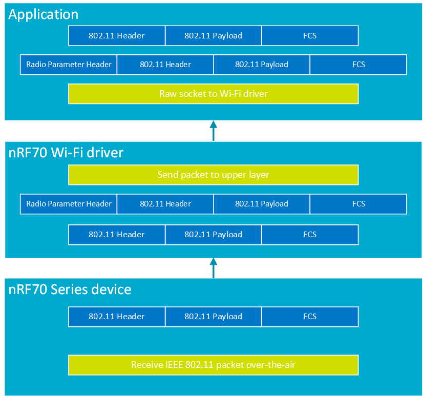

.. _ug_nrf70_developing_promiscuous_packet_reception:

Raw IEEE 802.11 packet reception using Promiscuous mode
#######################################################

.. contents::
   :local:
   :depth: 2

The nRF70 Series devices support Promiscuous mode.
Promiscuous mode of operation is only supported in connected Station mode.
In Promiscuous mode of operation, all received IEEE 802.11 packets that belong to the connected Basic Service Set (BSS) are sent to the receiving application by the nRF Wi-Fi driver.

.. _ug_nrf70_developing_enabling_promiscuous_mode_feature:

Enabling Promiscuous mode
*************************

To use the Promiscuous mode feature in your applications, you must enable the :kconfig:option:`CONFIG_NRF70_PROMISC_DATA_RX` Kconfig option in the project configuration.

.. _ug_nrf70_developing_promiscuous_mode_operation:

Promiscuous mode operation
**************************

The nRF70 Series device supports raw 802.11 packet reception from a specific BSSID to which the device is connected in Station mode, when Promiscuous mode is enabled for the nRF Wi-Fi driver.
Promiscuous mode setting can be enabled when the nRF70 Series device operates in Station mode, however, raw IEEE 802.11 packets in Promiscuous mode are only received when the nRF70 Series device connects to a specific BSSID and operates as a connected station.

The ``net_eth_promisc_mode`` functional API can be used to enable or disable Promiscuous mode in the nRF Wi-Fi driver as required by the application.
The ``NET_REQUEST_ETHERNET_SET_PROMISC_MODE`` network management API can also be used to enable or disable Promiscuous mode.
However, it is recommended to use the functional API ``net_eth_promisc_mode`` for enabling or disabling Promiscuous mode in the nRF Wi-Fi driver.

The following table provides the parameter details for the ``net_eth_promisc_mode`` API which is used to enable or disable Promiscuous mode for raw packet reception.

.. list-table:: Wi-Fi raw packet reception API parameter details
   :header-rows: 1

   * - API parameter
     - Description
   * - iface
     - Network interface on which Promiscuous mode is to be enabled.
   * - enable
     - Boolean value to enable or disable Promiscuous mode.

Promiscuous packets are only received in connected Station mode.
Therefore, Promiscuous mode always operates in the channel where the Station mode device is connected to the BSSID.

You can refer to the relevant structure in the following header file:
:file:`nrfxlib/nrf_wifi/fw_if/umac_if/inc/default/fmac_structs.h`.

.. _ug_nrf70_developing_promiscuous_mode_receive_packet_metadata:

Promiscuous mode receive packet metadata
****************************************

The IEEE 802.11 packet that is captured by the nRF70 Series device will be prepended with a proprietary header ``raw_rx_pkt_header``, which contains the following information about the received 802.11 packet:

.. list-table:: Wi-Fi packet reception header elements
   :header-rows: 1

   * - Parameter name
     - Type
     - Description
   * - frequency
     - unsigned short
     - Provides the current frequency at which the packet was received.
       The frequency element can be used to compute the packet receive channel.
   * - signal
     - signed short
     - Signal strength of the received packet.
   * - rate_flags
     - unsigned char
     - Provides data on whether the received 802.11 packet is a legacy, HT, VHT, or HE packet.
   * - rate
     - unsigned char
     - Provides the data rate at which the packet was received.
       It can be a ``legacy rate`` or an ``MCS rate`` based on the ``rate_flags`` value.

.. _ug_nrf70_developing_promiscuous_mode_receive_operation:

Promiscuous mode receive operation
**********************************

An IEEE 802.11 packet captured by the nRF70 Series device in Promiscuous mode will be sent up to the nRF Wi-Fi driver, which will prepend a radio information header to the received packet and present the resulting set to the user application.
To receive the captured traffic in Promiscuous mode, the user application layer needs to open a raw socket to the nRF Wi-Fi driver.

The following figure illustrates the packet structure and IEEE 802.11 packet sniffer operational flow:

   IEEE 802.11 packet sniffer operational flow

.. _ug_nrf70_developing_promiscuous_mode_receive_operation_filter_setting:

Promiscuous mode receive operation filter configuration
*******************************************************

The type of IEEE 802.11 receive packets that the application receives can be configured using the filter ``NET_REQUEST_WIFI_PACKET_FILTER`` net management command.
The nRF Wi-Fi driver has to be configured to operate in Monitor mode or Promiscuous mode for setting packet filter settings.
The application can choose to receive 802.11 management packets, 802.11 control packets, 802.11 data packets or a combination of the three types of 802.11 packets.

See the :ref:`wifi_shell_sample` sample for more information on configuring the filter settings for raw packet reception through shell commands.

The following table lists example shell commands and a network management API that are used to configure packet filter settings for sniffer operation.

.. list-table:: Wi-Fi packet reception filter setting network management API
   :header-rows: 1

   * - Network management API
     - Wi-Fi shell command
     - Example usage
     - Description
   * - net_mgmt(NET_REQUEST_PACKET_FILTER)
     - ``wifi packet_filter -i<interface instance> <configuration>``
     - ``wifi packet_filter -i1 -m``
     - Configure interface instance 1 to receive management frames.
   * - net_mgmt(NET_REQUEST_PACKET_FILTER)
     - ``wifi packet_filter -i<interface instance> <configuration>``
     - ``wifi packet_filter -i1 -mc``
     - Configure interface instance 1 to receive management and control frames.
   * - net_mgmt(NET_REQUEST_PACKET_FILTER)
     - ``wifi packet_filter -i<interface instance> <configuration>``
     - ``wifi packet_filter -i1 -a``
     - Configure interface instance 1 to receive management, control, and data frames.
   * - net_mgmt(NET_REQUEST_PACKET_FILTER)
     - ``wifi packet_filter -i<interface instance> <configuration> <buffer length>``
     - ``wifi packet_filter -i1 -b 256``
     - Configure interface instance 1 to allow reception of packets of length up to 256 bytes or less.

.. _ug_nrf70_developing_promiscuous_mode_receive_operation_with_tx_injection:

Promiscuous mode receive operation in conjunction with TX injection
*******************************************************************

TX injection mode can be enabled concurrently with Promiscuous mode on the nRF70 Series device.

TX injection mode allows the transmission of a raw 802.11 transmit packet.
Raw IEEE 802.11 packets are packets that are not modified by the 802.11 Medium Access Control (MAC) layer during transmission by the nRF70 Series device.

To use the TX injection mode in your application, you need to enable the :kconfig:option:`CONFIG_NRF70_RAW_DATA_TX` Kconfig option in the project configuration.

TX injection mode can be enabled during runtime by invoking the API ``net_eth_txinjection_mode``.
The API has the following parameters as described below.

.. list-table:: TX injection mode API
   :header-rows: 1

   * - Parameter name
     - Type
     - Description
   * - iface
     - struct net_if
     - Network interface structure
   * - enable
     - boolean
     - Parameter to enable or disable TX injection mode.
       ``1`` enables TX injection mode and ``0`` disables TX injection mode.
