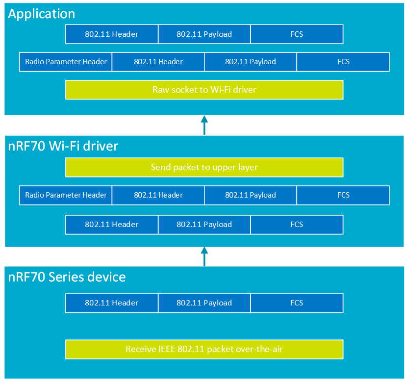

.. _ug_nrf70_developing_raw_ieee_80211_packet_reception:

Raw IEEE 802.11 packet reception using Monitor mode
###################################################

.. contents::
   :local:
   :depth: 2

The nRF70 Series devices support Monitor mode.
You must configure the nRF70 device in Monitor mode to operate it as an 802.11 wireless packet sniffer.

In this mode, the device listens on a configured channel and receives all IEEE 802.11 traffic, including traffic from all BSSIDs operating on that channel.
The device then prepends the captured traffic with metadata before passing it to the application layer using raw sockets.
The raw RX header contains parameters of the received packet, including data rate, signal strength, reception frequency, and packet type (whether it is Legacy, HT, VHT, or HE).

.. _ug_nrf70_developing_enabling_802.11_monitor_mode:

Enabling Monitor mode
*********************

To use the Monitor mode in your application, you need to enable the :kconfig:option:`CONFIG_NRF70_RAW_DATA_RX` Kconfig option in the project configuration.

.. _ug_nrf70_developing_monitor_mode_operation:

Monitor mode operation
**********************

Monitor mode can be enabled or disabled on the nRF70 Series device at runtime, using the ``NET_REQUEST_WIFI_MODE`` network management runtime API.
This runtime API can be used to disable the Monitor mode in the nRF Wi-Fi driver, when the packet sniffer operation is no longer required in the user application.

Monitor mode on the nRF70 device cannot operate concurrently with other modes, such as Station mode or SoftAP mode.

You must configure the operating Wi-Fi channel on which the nRF70 device will monitor and receive 802.11 packets.
When the device operates in Monitor mode, all 802.11 packets received on the configured channel will be sent up the stack by the nRF70 Series device and the nRF Wi-Fi driver.

To set the desired channel for 802.11 packet reception, use the ``NET_REQUEST_WIFI_CHANNEL`` runtime network management API.
The channel configuration runtime network management API can be used to set the channel after setting the nRF70 Series device in Monitor mode.

See the :ref:`wifi_shell_sample` sample for more information on configuring the mode and channel settings for raw packet reception through shell commands.

The following table lists the shell commands and network management APIs that are used to enable Monitor and TX injection mode, and to select the desired Wi-Fi channel:

.. list-table:: Wi-Fi packet reception network management APIs
   :header-rows: 1

   * - Network management APIs
     - Wi-Fi shell command
     - Example usage
     - Description
   * - net_mgmt(NET_REQUEST_WIFI_MODE)
     - ``wifi mode -i<interface instance> <configuration>``
     - ``wifi mode -i1 -m``
     - Configure interface instance 1 to Monitor mode
   * - net_mgmt(NET_REQUEST_WIFI_MODE)
     - ``wifi mode -i<interface instance> <configuration>``
     - ``wifi mode -i1 -s``
     - Change interface instance 1 to Station mode
   * - net_mgmt(NET_REQUEST_WIFI_CHANNEL)
     - ``wifi channel -i<interface instance> <channel number to set>``
     - ``wifi channel -i1 -c6``
     - Set the raw transmission channel to ``6`` for interface 1

.. _ug_nrf70_developing_monitor_mode_receive_packet_metadata:

Monitor mode receive packet metadata
************************************

The IEEE 802.11 packet that is captured by the nRF70 Series device will prepend a proprietary header ``raw_rx_pkt_header``, which contains the following information about the received 802.11 packet:

.. list-table:: Wi-Fi packet reception header elements
   :header-rows: 1

   * - Parameter name
     - Type
     - Description
   * - frequency
     - unsigned short
     - Provides the current frequency at which the packet was received.
       The frequency element can be used to compute the packet receive channel.
   * - signal
     - signed short
     - Signal strength of the received packet.
   * - rate_flags
     - unsigned char
     - Provides data on whether the received 802.11 packet is a legacy, HT, VHT, or HE packet.
   * - rate
     - unsigned char
     - Provides the data rate at which the packet was received.
       It can be a ``legacy rate`` or an ``MCS rate`` based on the ``rate_flags`` value.

You can refer to the relevant structure at :file:`nrfxlib/nrf_wifi/fw_if/umac_if/inc/default/fmac_structs.h` - for the raw RX header.

.. _ug_nrf70_developing_monitor_mode_receive_operation:

Monitor mode receive operation
******************************

An IEEE 802.11 packet captured by the nRF70 Series device in Monitor mode will be sent up to the nRF Wi-Fi driver, which will prepend a radio information header to the received packet and present the resulting set to the user application.
To receive the captured traffic in Monitor mode, the user application layer needs to open a raw socket to the nRF Wi-Fi driver.

The following figure illustrates the packet structure and IEEE 802.11 packet sniffer operational flow:

   IEEE 802.11 packet sniffer operational flow

.. _ug_nrf70_developing_monitor_mode_receive_operation_filter_setting:

Monitor mode receive operation filter configuration
***************************************************

The type of IEEE 802.11 receive packets that the application receives can be configured using the filter ``NET_REQUEST_WIFI_PACKET_FILTER`` Wi-Fi management command.
The nRF Wi-Fi driver must be configured to operate in Monitor mode or Promiscuous mode for setting packet filter settings.
The application can choose to receive 802.11 management packets, 802.11 control packets, 802.11 data packets, or a combination of the three types of 802.11 packets.

See the :ref:`wifi_shell_sample` sample for more information on configuring the filter settings for raw packet reception through shell commands.

The following table lists example shell commands and a network management API that are used to configure packet filter settings for sniffer operation.

.. list-table:: Wi-Fi packet reception filter setting network management API
   :header-rows: 1

   * - Network management API
     - Wi-Fi shell command
     - Example usage
     - Description
   * - net_mgmt(NET_REQUEST_PACKET_FILTER)
     - ``wifi packet_filter -i<interface instance> <configuration>``
     - ``wifi packet_filter -i1 -m``
     - Configure interface instance 1 to receive management frames.
   * - net_mgmt(NET_REQUEST_PACKET_FILTER)
     - ``wifi packet_filter -i<interface instance> <configuration>``
     - ``wifi packet_filter -i1 -mc``
     - Configure interface instance 1 to receive management and control frames.
   * - net_mgmt(NET_REQUEST_PACKET_FILTER)
     - ``wifi packet_filter -i<interface instance> <configuration>``
     - ``wifi packet_filter -i1 -a``
     - Configure interface instance 1 to receive management, control, and data frames.
   * - net_mgmt(NET_REQUEST_PACKET_FILTER)
     - ``wifi packet_filter -i<interface instance> <configuration> <buffer length>``
     - ``wifi packet_filter -i1 -b 256``
     - Configure interface instance 1 to allow reception of packets of length up to 256 bytes or less.

.. _ug_nrf70_developing_monitor_mode_receive_operation_with_tx_injection:

Monitor mode receive operation in conjunction with TX injection
***************************************************************

TX injection mode can be enabled for operation when the nRF70 Series device is configured to operate in Monitor mode.

TX injection mode allows the transmission of a raw 802.11 transmit packet.
Raw IEEE 802.11 packets are packets that are not modified by the 802.11 Medium Access Control (MAC) layer during transmission by the nRF70 Series device.

To use the TX injection mode in your application, you need to enable the :kconfig:option:`CONFIG_NRF70_RAW_DATA_TX` Kconfig option in the project configuration.

TX injection mode can be enabled during runtime by invoking the API ``net_eth_txinjection_mode``.
The API has the following parameters as described below.

.. list-table:: TX injection mode API
   :header-rows: 1

   * - Parameter name
     - Type
     - Description
   * - iface
     - struct net_if
     - Network interface structure
   * - enable
     - boolean
     - Parameter to enable or disable TX injection mode.
       ``1`` enables TX injection mode and ``0`` disables TX injection mode.
