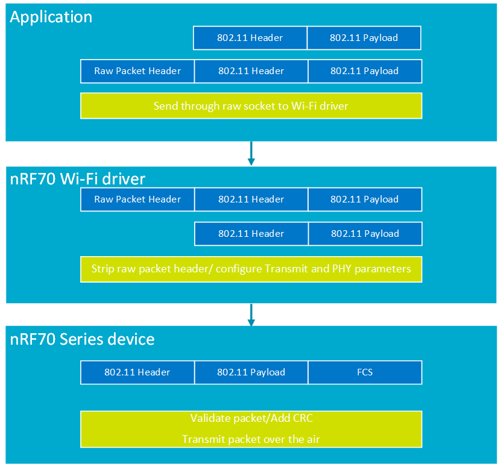

.. _ug_nrf70_developing_raw_ieee_80211_packet_transmission:

Raw IEEE 802.11 packet transmission
###################################

.. contents::
   :local:
   :depth: 2

The nRF70 Series device supports the transmission of raw IEEE 802.11 packets.
Raw IEEE 802.11 packets are packets that are not modified by the 802.11 Medium Access Control (MAC) layer during transmission by the nRF70 Series device.

It is the responsibility of the application that intends to send the raw 802.11 packet to construct and provide a fully-conformant 802.11 packet along with the required set of packet TX and PHY parameters.
The MAC layer on the nRF70 Series device will transmit the raw 802.11 packets over-the-air using the provided packet data, TX, and PHY parameters.

.. _ug_nrf70_developing_enabling_raw_packet_transmit_feature:

Enabling raw packet transmit feature
************************************

To use the raw packet transmit feature in your applications, you must enable the :kconfig:option:`CONFIG_NRF700X_RAW_DATA_TX` Kconfig option in the project configuration.

.. _ug_nrf70_developing_tx_injection_mode:

TX injection mode
*****************

The nRF70 Series device supports raw 802.11 packet transmission when TX injection mode is enabled in the nRF Wi-Fi® driver.
To enable the TX injection mode of operation, you can use the ``NET_REQUEST_WIFI_MODE`` network management runtime API.
This API can be used to disable TX injection mode in the driver when raw 802.11 packet transmission is not required by the application.

TX injection mode can be enabled when the nRF70 Series device operates in Station mode, both when it is operating in a connected Station mode or in a non-connected Station mode (not connected to an Access Point (AP)).

When TX injection mode is enabled, you need to configure the operating channel.
This channel will be used as the default transmit channel when the nRF70 device operates in a non-connected Station mode.
When the device operates in Station mode connected to an AP on a given channel, the same channel will be used for raw 802.11 packet transmission.

To set the desired channel for raw 802.11 packet transmission, you can use the ``NET_REQUEST_WIFI_CHANNEL`` network management API.

See the :ref:`wifi_shell_sample` sample for more information on configuring mode and channel settings for raw packet transmission through shell commands.

The following table lists the shell commands and network management APIs used to switch between operational modes and set channels:

.. list-table:: Wi-Fi raw packet transmission network management APIs
   :header-rows: 1

   * - Network management APIs
     - Wi-Fi shell command
     - Example usage
     - Description
   * - net_mgmt(NET_REQUEST_WIFI_MODE)
     - ``wifi mode -i<interface instance> <configuration>``
     - ``wifi mode -i1 -st``
     - Configure interface instance 1 to Station with TX injection mode
   * - net_mgmt(NET_REQUEST_WIFI_MODE)
     - ``wifi mode -i<interface instance> <configuration>``
     - ``wifi mode -i1 -s``
     - Configure interface instance 1 to Station mode
   * - net_mgmt(NET_REQUEST_WIFI_CHANNEL)
     - ``wifi channel -i<interface instance> <channel number to set>``
     - ``wifi channel -i1 -c6``
     - Set the raw transmission channel to ``6`` for interface 1 to be used in non-connected Station mode

.. _ug_nrf70_developing_tx_injection_mode_usage_requirements:

TX injection mode usage requirements
************************************

The raw packet to be transmitted by an application must be a fully conformant IEEE 802.11 packet and must ensure that:

* The packet has a valid 802.11 MAC header.
* The Frame Check Sequence (FCS) is not added to the packet by the application and is concatenated by the nRF70 Series device.

.. note::
   If the packet is not a properly framed 802.11 packet, it will be dropped by the nRF70 Series device and will not be transmitted over-the-air.

Additionally, the raw packet must provide transmit parameters that inform the nRF70 Series Wi-Fi device driver on how the packet must be transmitted.
It must also provide a packet marker identifying itself as a special packet, which must be handled differently by the nRF70 series Wi-Fi driver.
The transmit parameters and the packet marker together form the raw packet transmit header.
The raw packet transmit header is prepended to the 802.11 conformant raw packet before the packet is passed to the nRF Wi-Fi driver by the application.

The following table lists the raw packet transmit header elements:

.. list-table:: Wi-Fi raw packet transmission header elements
   :header-rows: 1

   * - Transmit and PHY parameters
     - Description
   * - magic_num
     - Magic number to identify a raw packet. It is set to ``0x12345678``.
   * - data_rate
     - Data rate at which a packet is to be transmitted. It depends on the ``tx_mode`` parameter. If ``tx_mode`` is set to legacy mode, the data rate is the number provided. If ``tx_mode`` is set to HT, VHT, or HE mode, the data rate is the MCS rate.
   * - packet_length
     - Packet length of the 802.11 raw packet, excluding the raw transmit packet header length.
   * - tx_mode
     - Mode describing if the packet is VHT, HT, HE, or Legacy.
   * - queue
     - Wi-Fi access category mapping for packet.
   * - raw_tx_flag
     - Flag indicating raw packet transmission. This is reserved for driver use.

You can refer to the relevant structures at:

:file:`nrfxlib/nrf_wifi/fw_if/umac_if/inc/default/fmac_structs.h/raw_tx_pkt_header` - for the raw packet header.

:file:`nrfxlib/nrf_wifi/fw_if/umac_if/inc/default/fmac_structs.h/nrf_wifi_fmac_ac` - for setting the ``queue`` parameter in the raw packet transmit header.

:file:`nrfxlib/nrf_wifi/fw_if/umac_if/inc/default/fmac_structs.h/nrf_wifi_fmac_rawtx_mode` - for setting the ``tx_mode``  parameter in the raw packet transmit header.

.. _ug_nrf70_developing_raw_packet_transmit_operation:

Raw 802.11 packet transmit operation
************************************

The raw packet data has to be encompassed in an 802.11 packet and prepended with the raw transmit header before it is transmitted through raw socket to the nRF70 Wi-Fi device driver for transmission.
The packet is forwarded to the nRF70 Series device, which transmits the packet over-the-air.
All 802.11 MAC layer rules for the 802.11 packet (such as, link-layer acknowledgements, retransmissions) are handled by the nRF70 Series device.

The following figure illustrates the packet structure and raw packet operation flow:

   Raw packet transmit packet structure and raw packet operation flow

.. _ug_nrf70_developing_operating_channel_for_raw_packet_transmission:

Operating channel for raw packet transmission
*********************************************

The channel configuration for raw packet transmission will be applied as follows:

* Non-connected Station with TX injection mode configured and channel not set: The raw packet is transmitted on channel 1.
* Non-connected Station with TX injection mode configured and channel set by the user: The raw packet is transmitted on configured channel.
* Connected Station with TX injection mode configured: The raw packet is transmitted on the channel on which the device is connected to the AP.
* Station disconnected from the AP and TX injection mode configured (channel configured before connection to the AP): The raw packet is transmitted on the configured channel
* Station disconnected from the AP and TX injection mode configured (channel not configured before connection to the AP): The raw packet is transmitted on channel 1 (fallback channel).

.. note::
   You must explicitly configure the channel for raw packet transmission when the device operates in non-connected Station mode. The device will use a fallback channel for raw packet transmission if one is not configured.
