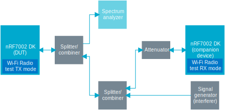

.. _ug_wifi_adaptivity_test_procedure:

EN 301 893 V2.1.1 based adaptivity test procedure
#################################################

.. contents::
   :local:
   :depth: 2

This section describes two methods of adaptivity testing, using the Wi-Fi® Shell and Wi-Fi Radio test samples.

The test requirements and methods for adaptivity (channel access mechanism) are described in EN 301 893 V2.1.1:

* Test requirements in Section 4.2.7 Adaptivity (channel access mechanism)
* Test method in Section 5.4.9 Adaptivity (channel access mechanism)

The nRF7002 device is a supervised device and complies with EN 301 893, clause 4.2.7.3.2.4, Table 8.

The following figure shows a test setup for adaptivity verification using two nRF7002 Development Kit (DK)s.

   Test set up for verifying the adaptivity of nRF7002 DK

The :term:`Device Under Test (DUT)` is an nRF7002 DK configured to a transmit (TX) mode through the following samples:

* Wi-Fi Shell sample that can connect to an access point and run DUT TX through a zperf session.
  For details, see :ref:`ug_using_wifi_shell_sample`.

* Wi-Fi Radio test sample which includes an internal traffic source used for the transmitted packets.

The companion device is an optional nRF7002 DK or :term:`Evaluation Kit (EK)` configured as a receiving device through the Wi-Fi Radio test sample.
It only acts as a monitoring device for the transmissions from the DUT.
This device can be omitted if the monitoring of the transmissions is accomplished by the spectrum analyzer.
A Wi-Fi sniffer or any other compliant Wi-Fi device capable of monitoring Wi-Fi traffic can also be used.

The following test procedure is recommended:

1. Validate the test setup as shown in Test set up for verifying the adaptivity of nRF7002 DK.
#. Set up the companion device for monitoring traffic on the required channel used by the DUT.
   If the monitoring device is another nRF7002 DK or EK, see :ref:`ug_wifi_radio_test_for_per_measurements` for setting it up in the receive mode for monitoring.
   Omit the transmit part of the instructions as the DUT will be configured to transmit continuously.

#. Set up the DUT to transmit on the required channel or mode either using the Wi-Fi Shell sample or the Wi-Fi Radio test sample.

   * DUT as Wi-Fi Shell sample running UDP TX

     .. toggle::

        Set up the DUT to transmit on the required channel or mode using the Wi-Fi Shell sample.

        The nRF7002 Wi-Fi device is designed for low-power IoT applications, featuring a low-power host device with low processing frequency and memory.
        When connected to an access point in infrastructure mode and utilizing the suggested User Datagram Protocol (UDP) transmit traffic, the DUT cannot maintain full transmission queues due to host limitations.

        This leads to misleading results, despite the underlying channel access mechanism's compliance with the defined IEEE 802.11 standards.
        To achieve the required transmit packet duty cycle above 30%, it is necessary to limit the device to a lower data rate, such as 6 Mbps or MCS0.

        Example command on the access point side:

        .. code-block:: bash

           iperf -s -i 1 -u

        Example commands on the DUT side for fixing data rate to 6 Mbps:

        .. code-block:: bash

           wifi connect -s <SSID> -k <key_management> -p <passphrase>
           nrf70 util tx_rate 0 6
           zperf udp upload 192.168.1.20 5001 20 1k 20M

   * DUT as Wi-Fi Radio test sample

     .. toggle::

        Set up the DUT to transmit on the required channel or mode using the Wi-Fi Radio test sample.

        Use the Wi-Fi Radio test sample in transmit mode, which is built on top of the core Wi-Fi driver and firmware.
        This includes CSMA/CA, random backoff, and CCA engines, ensuring compliance with all transmission protocols defined in the IEEE 802.11 standards.

        Any set of the TX commands given in :ref:`ug_wifi_radio_sample_for_transmit_tests` can be used for this testing based on required parameters.

        The following example shows how to run a continuous (OFDM) TX traffic sequence in 11a mode:

        * Channel: 100
        * Payload length: 1000 bytes
        * Inter-frame gap: 200 µs
        * Data rate: 54 Mbps

        Execute the following sequence of commands:

        .. code-block:: bash

           uart:~$ wifi_radio_test init 100
           uart:~$ wifi_radio_test tx_pkt_tput_mode 0
           uart:~$ wifi_radio_test tx_pkt_rate 54
           uart:~$ wifi_radio_test tx_pkt_len 1000
           uart:~$ wifi_radio_test tx_pkt_gap 0
           uart:~$ wifi_radio_test tx_pkt_num -1
           uart:~$ wifi_radio_test tx 1
