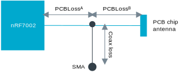

.. _ug_wifi_antenna_gain_compensation:

Antenna gain compensation
#########################

.. contents::
   :local:
   :depth: 2

Determine the accurate TX power on the nRF70 Series development platforms by taking into account the antenna gain of the PCB chip antenna and the corresponding PCB losses for various RF bands.
This facilitates the interpretation of the transmit power measurements.

Kconfig parameter values are used as inputs to the host software to compensate for the transmit power based on the gain of the antenna.

To find the Kconfig value, subtract the PCB losses ``PCBLoss`` from the antenna gain ``AntGain`` and round up the result to the nearest whole number:

.. math::

   \text{Kconfig value} = \text{AntGain} - \text{PCBLoss}

The PCB loss is defined as follows:

.. math::

   \text{PCBLoss} = \text{PCBLossA} + \text{Coax loss for conducted testing}

.. math::

   \text{PCBLoss} = \text{PCBLossA} + \text{PCBLossB for radiated testing}

The Coax loss is the loss in dB from the point on the PCB where a coaxial cable or equivalent is connected to the I/O connector of the measuring equipment.

The following figure shows the different losses between the nRF7002 and the PCB chip antenna or SMA.

   PCB losses

The following table shows an example of how to calculate the Kconfig parameter values.

+-------------------+---------------------------+----------------------+--------------+--------------+--------------------+
| Bands             | Kconfig parameter         | Frequency range (MHz)| AntGain (dB) | PCBLoss (dB) | Kconfig value (dB) |
+===================+===========================+======================+==============+==============+====================+
| ANTGAIN_2G        | NRF70_ANT_GAIN_2G         | 2402 to 2494         | 3.38         | 0.54         | 3                  |
+-------------------+---------------------------+----------------------+--------------+--------------+--------------------+
| ANTGAIN_5G_BAND1  | NRF70_ANT_GAIN_5G_BAND1   | 5150 to 5350         | 2.74         | 1.60         | 2                  |
+-------------------+---------------------------+----------------------+--------------+--------------+--------------------+
| ANTGAIN_5G_BAND2  | NRF70_ANT_GAIN_5G_BAND2   | 5470 to 5730         | 2.46         | 1.84         | 1                  |
+-------------------+---------------------------+----------------------+--------------+--------------+--------------------+
| ANTGAIN_5G_BAND3  | NRF70_ANT_GAIN_5G_BAND3   | 5730 to 5895         | 1.77         | 1.51         | 1                  |
+-------------------+---------------------------+----------------------+--------------+--------------+--------------------+

Setting antenna gain parameters
*******************************

The Kconfig parameters and their default values are defined in the :file:`<ncs_repo>/zephyr/drivers/wifi/nrf_wifi/Kconfig.nrfwifi` file.
To compensate for antenna gains, set the following Kconfig parameters in the project :file:`prj.conf` configuration file.

* :kconfig:option:`CONFIG_NRF70_ANT_GAIN_2G` = ``<ant gain value>``
* :kconfig:option:`CONFIG_NRF70_ANT_GAIN_5G_BAND1` = ``<ant gain value>``
* :kconfig:option:`CONFIG_NRF70_ANT_GAIN_5G_BAND2` = ``<ant gain value>``
* :kconfig:option:`CONFIG_NRF70_ANT_GAIN_5G_BAND3` = ``<ant gain value>``

The Kconfig parameters can also be set in a relevant overlay file or entered as command-line arguments to the CMake build.
