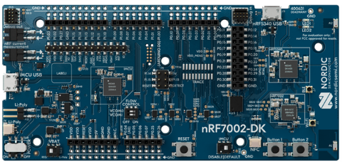
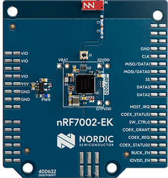
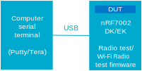
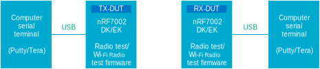
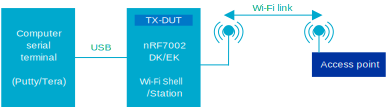
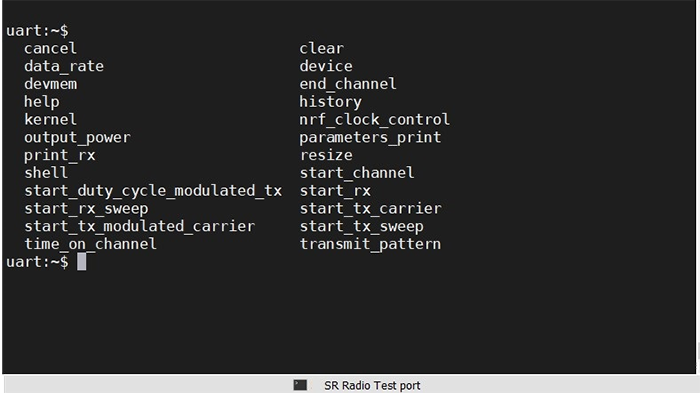
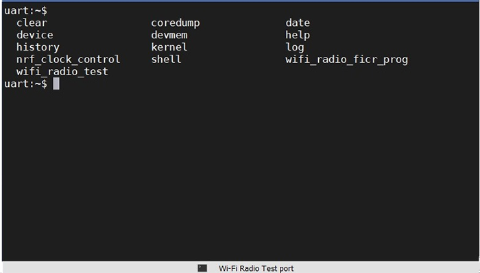

.. _ug_wifi_test_setup:

Test setup
##########

.. contents::
   :local:
   :depth: 2

An overview of software test samples, hardware development platforms, test modes, and firmware configurations is provided to help prepare your device for regulatory testing.

Test samples
************

You can use the software test samples available in the |NCS| for regulatory testing of the nRF70 Series devices.

Wi-Fi Radio test sample
=======================

The Wi-Fi® Radio test sample is used to configure and control the Wi-Fi radio on the nRF70 Series device.
The Wi-Fi Radio test firmware supports the configuration of the Wi-Fi radio in specific modes and with various TX and RX parameters to test its performance.

For an overall description, see :ref:`wifi_radio_sample_desc`.
The sub-commands that can be used to configure the radio are described in Wi-Fi :ref:`wifi_radio_subcommands`.
For more information on using the sample for regulatory testing, see :ref:`Using the Wi-Fi Radio test sample <ug_wifi_radio_test_sample>`.

Wi-Fi Shell sample
==================

The Wi-Fi Shell sample runs on the :term:`Device Under Test (DUT)` and allows the control of Wi-Fi functionality through a shell interface.
The sample allows the DUT to connect to a Wi-Fi access point device and expose a shell interface through a UART console to run relevant Wi-Fi Shell commands.

The Wi-Fi Shell sample has an option to set a static IP address for the DUT at build time by configuring the :file:`prj.conf` file.
If the :term:`Dynamic Host Configuration Protocol (DHCP)` resolution fails, this IP address will be used by the device when connecting to the access point.

For an overall description, see :ref:`wifi_shell_sample` sample.
For more information on using the sample for regulatory testing, see :ref:`Using the Wi-Fi Shell sample <ug_using_wifi_shell_sample>`.

Wi-Fi Station sample
====================

The Wi-Fi Station (STA) sample demonstrates how to add Wi-Fi functionality to applications programmatically.
The sample allows the DUT to connect to a Wi-Fi access point device and gives visual indication of a connected state through a blinking LED and of a not connected state through the LED not lighting up.

The Wi-Fi Station sample has an option to set a static IP address for the DUT at build time by configuring the :file:`prj.conf` file.
If the DHCP resolution fails, this IP address is used by the device when connecting to the access point.

For an overall description, see :ref:`wifi_station_sample` sample.
For more information on using the sample for regulatory testing, see :ref:`Using the Wi-Fi Station sample <ug_using_wifi_station_sample>`.

Radio test (short-range) sample
===============================

The Radio test (short-range) sample demonstrates how to configure and test the performance of a 2.4 GHz radio (Bluetooth® Low Energy, IEEE 802.15.4 and proprietary).

The Radio test firmware supports the configuration of 2.4 GHz radio in specific modes and with various TX and RX parameters to test its performance.

For an overall description, see :ref:`radio_test` sample.
For more information on using the sample for regulatory testing, see :ref:`Using the Radio test (short-range) sample <ug_using_short_range_sample>`.

Test hardware
*************

Use the nRF70 Series hardware development platforms for regulatory testing.

The nRF70 Series includes the following platforms:

* nRF7002 :term:`Development Kit (DK)` – A single-board solution featuring the Wi-Fi 6 capabilities of the nRF7002 companion IC and the nRF5340 :term:`System on Chip (SoC)`.
* nRF7002 :term:`Evaluation Kit (EK)` – A shield board used for evaluating the nRF7002 companion IC.
  The EK is compatible with the nRF52840, nRF5340, and nRF91 DKs through its Arduino connector.

For hardware information, see the user guides `nRF7002 DK Hardware`_ and `nRF7002 EK Hardware`_.
For more information on the boards in nRF Connect for Desktop, see :ref:`Getting started with nRF70 Series <ug_nrf7002_gs>`.

   nRF7002 DK, top view

    nRF7002 EK, top view

Test modes
**********

Set up the nRF70 Series hardware development platforms in test configurations for both non-signaling and signaling mode.
These two test modes are used to execute regulatory certification test cases.

Non-signaling mode
==================

This section describes Wi-Fi test setup using applications that do not require the nRF7002 device to be associated with an access point or test equipment supporting Wi-Fi access point mode.

TX test setup for packet generation
-----------------------------------

The following testbed setup is used for performing Wi-Fi and short-range RF based transmitter testing.

   Testbed setup for RF based transmitter testing

RX test setup for PER measurement
---------------------------------

The following testbed setup is used for performing Wi-Fi and short-range :term:`Packet Error Rate (PER)` based TX/RX testing.

   Testbed setup for PER based TX/RX testing

As an alternative, you can replace the TX-DUT with an appropriate Vector Signal Generator (VSG), for example Rohde and Schwarz CMW-500.

TX test setup for adaptivity testing
------------------------------------

For information on TX testing (adaptivity), see :ref:`ug_wifi_adaptivity_test_procedure`.

Signaling mode
==============

This section describes Wi-Fi test setup using applications that require the nRF7002 to be associated with an access point or test equipment supporting Wi-Fi Access Point mode.

   Testbed setup with access point

Firmware setup
**************

This describes the flashing, running, and use of the appropriate console ports while using test applications on the nRF7002 DK or EK.

Programming firmware in the nRF7002 setup
=========================================

Before you begin, make sure you have the nRF Util tool installed on your computer.
See `Installing nRF Util`_ and `Installing and upgrading nRF Util commands`_ for instructions on how to install the nRF Util device utility.

To program firmware in the nRF7002 DK or EK setup, complete the following steps.

1. Connect your computer to the nRF7002 kit with a USB cable.
#. Switch the nRF7002 kit ON.
#. Open a command prompt window.
#. If the read back protection mechanism on the DK or EK is enabled, use the following command to unlock the device and disable the read back protection mechanism before loading the firmware:

   .. code-block:: console

       $ nrfutil device recover

   .. note::
      Firmware loading returns an error if the read back protection mechanism is enabled.

#. To program the relevant hex (binaries) to the application core on the nRF7002 DK or EK, copy in the following commands excluding the dollar sign:

   * For Wi-Fi Radio test in combined mode:

     .. code-block:: console

        $ nrfutil device program --firmware merged.hex --core Application --options chip_erase_mode=ERASE_ALL,reset=RESET_SYSTEM

   * For Station (STA), Shell, and stand-alone Wi-Fi Radio test samples:

     .. code-block:: console

        $ nrfutil device program --firmware merged.hex --core Application --options chip_erase_mode=ERASE_ALL,reset=RESET_SYSTEM

#. Program the relevant hex (binaries) to the network core on the nRF7002 DK:

   .. code-block:: console

      $  nrfutil device program --firmware merged_CPUNET.hex --core Network --options chip_erase_mode=ERASE_ALL,reset=RESET_SYSTEM

#. To run the firmware on the nRF7002 DK or EK, reset the device.
   You can press the **RESET** button, use the ``reset`` command in nRF Util, or power cycle the development kit.

   .. note::
      Set the baud rate to 115,200 bps.
      For more information, see :ref:`ug_wifi_test_setup_vcom_settings`.

.. _ug_wifi_test_setup_vcom_settings:

VCOM settings
=============

Use a baud rate setting of 115,200 bps.

To choose the correct COM port to interact with the network core on the nRF7002 DK or EK, connect your computer to the nRF7002 board with a USB cable and enter the following command in the command prompt window:

.. code-block:: console

    $ nrfutil device list

Typically, VCOM0 is connected to the nRF5340 network core running a Radio test (short-range) and VCOM1 is connected to the nRF5340 application core running a Wi-Fi Radio test.
Verify the mapping of the COM ports based on the available commands for each port, see Short-range Radio test port, Wi-Fi Radio test port, and the following example:

.. code-block:: console

    $ nrfutil device list
    1050753610
    product         J-Link
    board version   PCA10143
    ports           /dev/ttyACM4, vcom: 0   // This is for Radio Test, note baud rate is 115200bps
                    /dev/ttyACM5, vcom: 1   // This is for Wi-Fi Radio Test, note baud rate is 115200bps
    traits          devkit, jlink, seggerUsb, serialPorts, usb

   Found 1 supported device(s)

   Short-range Radio test port

   Wi-Fi Radio test port
