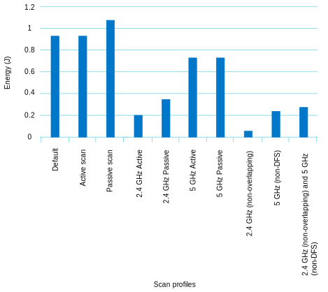
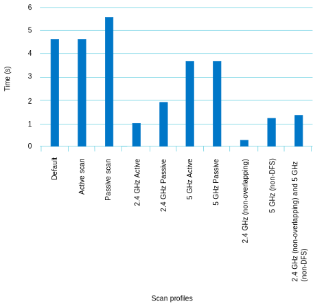

.. _ug_nrf70_developing_scan_operation:

Optimizing scan operation
#########################

.. contents::
   :local:
   :depth: 2

This guide demonstrates how the scan operation can be optimized on the nRF70 Series ICs.

Wi-Fi scanning
**************

Scanning is the process by which a Wi-Fi® device can discover Access Points (APs) in its vicinity.
The device can use the results of the scan to:

* Choose a suitable AP to connect to.

* Identify a probable candidate AP to roam to in the future.

* Provide location services.

Scanning can be done using one of the following methods:

* **Active:** During an active scan, the device transmits probe requests on different channels and listens for a probe response from APs.

* **Passive:** During a passive scan, the device listens for beacons sent periodically by APs on different channels.

Active scans are quicker than passive scans.
However, active scans require more instantaneous power for transmitting probe requests.

Regulatory domain rules enforce what channels can be scanned as well as whether an active scan can be performed on a particular channel.
For more information on regulatory support, see :ref:`ug_nrf70_developing_regulatory_support`.

An Active scan on a channel is preferable if:

* Allowed by regulatory rules

* The device can source the required power to transmit probe requests

If either of the above conditions cannot be met, then passive scans must be used.

Scan operation with nRF70 Series ICs
************************************

The nRF70 Series ICs can be used as scan-only devices and are an ideal solution for applications that require accurate location information based on Wi-Fi network scanning.
They provide a reduced and more deterministic code memory footprint by limiting the functionality to only scanning.

The nRF70 Series ICs control the scan operation using various controls, such as:

* Band filtering: Controls the Wi-Fi frequency bands to be scanned (for example, 2.4 GHz, 5 GHz, or both) on the nRF7000 and nRF7002 ICs.

* Forced passive scan: Forces a passive scan on all channels.

* Active dwell time control: Controls the time spent scanning on an active channel.

* Passive dwell time control: Controls the time spent scanning on a passive channel.

* Channel control: Controls the channels to be scanned.

* SSID filtering: Controls the SSIDs to be scanned.

* Scan result limit control: Controls the number of scan results returned to an application.

The above controls can be used individually or in combination to achieve:

* Optimized scanning behavior - It can be used by applications based on their requirements and the conditions of the environment where an end product is expected to be deployed.

* Reduced processing overhead

* Faster scan times

* Reduced power consumption

Scan API
********

The scan API can be used to implement features such as scan functionality and controlled scan provided by the nRF70 Series ICs.

You can find the scan API reference, :c:member:`wifi_mgmt_ops.scan`, in :ref:`zephyr:wifi_mgmt` in the Zephyr documentation.

For more details on the usage of the scan API, see the :ref:`wifi_scan_sample` sample.

Memory optimizations
********************

Scan-only builds are optimized for memory compared to regular Wi-Fi builds (for example, by supporting :abbr:`STA (Station)` mode).
This is achieved by:

* Compiling out the WPA supplicant module

* Compiling out non-scan related functionality in the nRF Wi-Fi driver

* Removing the need for network data buffers

You can use the :kconfig:option:`CONFIG_WIFI_MGMT_SCAN_SSID_FILT_MAX` Kconfig option to fine-tune the memory size.
This option can set the maximum number of SSIDs that can be specified for SSID filtering.

Power and Timing optimizations
******************************

The scan controls can be used to achieve power and scan time optimizations on the nRF70 Series ICs.
The default scan operation is a wildcard scan (all SSIDs) across all supported bands and all regulatory allowed channels.

For world regulatory domain (default), a typical scan (defined below) takes around 4.6 s and draws around 55 mA current.

* 2.4 GHz - 940 ms

  Channels 1–11: Active scan (Dwell time: 50 ms)

  Channels 12–14: Passive scan (Dwell time: 130 ms)

* 5 GHz - 3640 ms

  Channels 36–48, 52–64, 100–144, 149–177: Passive scan (Dwell time: 130 ms)

For other regulatory domains, for example, the U.S., the scan time varies as per its regulatory rules.

The following controls can fine-tune the time taken and power consumed by a scan operation:

.. list-table::
   :header-rows: 1

   * - Feature
     - Configuration parameters
   * - Band filtering
     - | Build time:
       | :kconfig:option:`CONFIG_WIFI_MGMT_SCAN_BANDS`
       | Run time:
       | :c:member:`wifi_scan_params.bands`
   * - Forced passive scan
     - | Run time:
       | :c:member:`wifi_scan_params.scan_type`
   * - Active dwell time
     - | Run time:
       | :c:member:`wifi_scan_params.dwell_time_active`
   * - Passive dwell time
     - | Run time:
       | :c:member:`wifi_scan_params.dwell_time_passive`
   * - Channel control
     - | Build time:
       | :kconfig:option:`CONFIG_WIFI_MGMT_SCAN_CHAN`
       | Run time:
       | :c:member:`wifi_scan_params.chan`
   * - Skip locally administered MAC addresses
     - | Build time:
       | :kconfig:option:`CONFIG_WIFI_NRF70_SKIP_LOCAL_ADMIN_MAC`

Scan robustness
***************

The scan robustness (the number of APs scanned) can be controlled by using the following controls:

.. list-table::
   :header-rows: 1

   * - Feature
     - Configuration parameters
   * - Active dwell time
     - | Run time:
       | :c:member:`wifi_scan_params.dwell_time_active`
   * - Passive dwell time
     - | Run time:
       | :c:member:`wifi_scan_params.dwell_time_passive`

Impact of scan controls
***********************

The following table provides a summary of the impact of the different scan controls on various parameters (limited to the Zephyr networking stack, nRF Wi-Fi driver, and Wi-Fi IC):

.. list-table::
   :header-rows: 1

   * - Scan control
     - Power consumption
     - Time taken
     - Memory usage
     - Scan quality
   * - Band filtering
     - ✔
     - ✔
     - N/A
     - ✖
   * - Forced passive scan
     - ✔
     - ✖
     - N/A
     - N/A
   * - Decreasing active dwell time
     - ✔
     - ✔
     - N/A
     - ✖
   * - Increasing active dwell time
     - ✖
     - ✖
     - N/A
     - ✔
   * - Decreasing passive dwell time
     - ✔
     - ✔
     - N/A
     - ✖
   * - Increasing passive dwell time
     - ✖
     - ✖
     - N/A
     - ✔
   * - Channel filtering
     - ✔
     - ✔
     - N/A
     - ✖
   * - SSID filtering
     - N/A
     - N/A
     - ✔
     - N/A

.. Note::
   The Scan result limiting control can potentially be used to reduce memory requirements at the application level by allowing the applications to provision for a fixed number of scan results.

Scan profiles and their performance
***********************************

The following table lists some typical scan profiles based on the world regulatory domain and their performance values:

.. list-table::
   :header-rows: 1

   * - Profile
     - Definition
     - Time (t) in seconds
     - Average current (i) in mA
     - Energy consumption (E) in joules
   * - Default
     - All supported bands and channels
     - 4.65
     - 55.33
     - 0.926224
   * - Active scan
     - Use active scanning where allowed
     - 4.65
     - 55.33
     - 0.926224
   * - Passive scan
     - Force passive scanning on all channels
     - 5.58
     - 53.70
     - 1.078726
   * - 2.4 GHz Active
     - Scan only 2.4 GHz band using active scanning where allowed
     - 1
     - 57.45
     - 0.20682
   * - 2.4 GHz Passive
     - Scan only 2.4 GHz band forcing passive scanning on all channels
     - 1.85
     - 51.87
     - 0.345454
   * - 5 GHz Active
     - Scan only 5 GHz band using active scanning where allowed
     - 3.70
     - 54.29
     - 0.723143
   * - 5 GHz Passive
     - Scan only 5 GHz band forcing passive scanning on all channels
     - 3.70
     - 54.29
     - 0.723143
   * - 2.4 GHz (non-overlapping)
     - Scan only non-overlapping channels (1, 6, 11) in the 2.4 GHz band
     - 0.208
     - 62.10
     - 0.0465
   * - 5 GHz (non-DFS)
     - Scan only non-DFS channels (36, 40, 44, 48, 149, 153, 157, 161, 165) in the 5 GHz band
     - 1.20
     - 54.49
     - 0.235397
   * - 2.4 GHz (non-overlapping) and 5 GHz (non-DFS)
     - Scan only non-overlapping channels (1, 6, 11) in the 2.4 GHz band and non-DFS channels (36, 40, 44, 48, 149, 153, 157, 161, 165) in the 5 GHz band
     - 1.356
     - 55.88
     - 0.272784

The following formula shows the calculation of energy consumption:

.. math::

  E = i * t * V / 1000

where ``V = 3.6 V`` denotes the voltage for the nRF70 Series devices.

The following figures show the comparison of energy consumption and scan time for different profiles.

   Comparison of energy consumption for different profiles

   Comparison of scan time for different profiles
