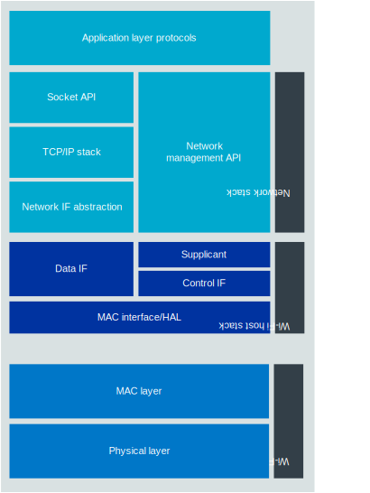

Wi-Fi overview
##############

.. _ug_wifi_overview:

.. contents::
   :local:
   :depth: 2

Wi-Fi® is a half-duplex packet-based protocol operating on a fixed channel, using CSMA/CA for channel access.
Two network modes, infrastructure and peer-to-peer, are supported.
The infrastructure mode is by far the most common mode, where multiple stations (STAs) communicate with an access point (AP), identified through its service set identifier (SSID).
In addition, multiple APs can be used to service a SSID in order to improve coverage, but any individual STA will only be connected to a single AP at any time.
In the infrastructure mode, the AP is the network coordinator, using regular transmission of beacon packets for the purpose of coordinating all connected STAs.
The most common variant of peer-to-peer mode used is Wi-Fi Direct.

Wi-Fi is an Internet Protocol (IP) based network, with every device (AP or STA) having a unique 48-bit MAC address.
Since the radio frequency (RF) communication channel is unreliable, a number of mechanisms are used in an attempt to achieve reliability not typically present in wired networks.

Firstly, multiple modulation schemes are used, with selection dependent on the prevailing RF channel conditions.
Secondly, forward error correction (FEC) is used when the data is encoded.
This adds redundancy which can be used at the receiver in an attempt to recover the original data content.

Multiple schemes (and rates) are available, depending on the version of the standard in use and the channel conditions.
Acknowledgements (ACKs) are used for unicast packet transmissions, with every successful packet reception resulting in an ACK transmission back to the originator confirming reception.

The RF medium also necessitates security to achieve privacy of the over-the-air packet transmissions.
Again, multiple schemes are available depending on the version of the standard in use, though over time the older schemes tend to be deprecated as vulnerabilities emerge.
The schemes are referred to as Wi-Fi Protected Access (WPA), with WPA3 being the latest version (mandated for all new Wi-Fi Alliance certifications).

.. _ug_wifi_stack:

Wi-Fi Protocol stack
********************

The IEEE 802.11 specifications only define the PHY and MAC layers of the Wi-Fi protocol, with the remaining upper layers being common with other IP-based technologies, in particular Ethernet (IEEE 802.3).

The following diagram details the full Wi-Fi protocol stack:

   Wi-Fi protocol stack

Network stack
=============

At the top of the stack are application orientated network protocols, for example Matter, MQTT, and LwM2M.
These are agnostic with respect to the underlying communication protocols.
The next level down is the TCP/IP stack, common to all IP-based communication protocols, such as Wi-Fi, Ethernet, and Thread.

Wi-Fi host stack
================

Under the common network stack is the first Wi-Fi centric layer, the Wi-Fi host stack.
There are two logical parts to the Wi-Fi host stack, namely the Wi-Fi driver and the supplicant.

Wi-Fi driver
------------
The Wi-Fi driver is responsible for presenting APIs for interfacing with the network stack and the supplicant, as well as handling communication with the Wi-Fi baseband, including managing any physical transport layers, for example SPI and USB.

Supplicant
----------

The supplicant is primarily responsible for implementing the authentication phase of WPA (WPA2/WPA3).
Authentication deals with security before association, and is typically divided into two categories of algorithm, Personal and Enterprise.

* Personal authentication uses the pre-shared key (PSK) approach, which is usually presented to the end user as a network passphrase.

* Enterprise security uses the 802.1X authentication protocol, and typically involves user certificates and a centralized authentication server, for example RADIUS.

Apart from WPA authentication, the supplicant performs other duties in Wi-Fi associated with joining a network such as network scanning, key exchange, and roaming support.
The supplicant used with nRF70 Series devices is a Zephyr port of `WPA Supplicant`_.

Wi-Fi baseband
==============

The Wi-Fi baseband consists of the bottom two layers of the protocol stack, namely the Medium Access Control (MAC) layer and the Physical (PHY) layer. These two layers are fully specified in the IEEE 802.11 standard.

.. _wifi_mac_layer:

MAC layer
---------

Key features handled by the MAC layer include the following:

* Channel access and Quality-of-Service (QoS).
* Packet acknowledgment, re-transmissions, and rate adaption.
* Packet level security.
* Power save.

Channel access is based on the Channel Sense Multiple Access/Collision Avoidance (CSMA/CA) protocol.
This mechanism is essentially a *listen before talk* approach, including various rules associated with energy thresholds and back-off times.
QoS is achieved through four traffic priority levels, which in turn map to back-off rules in the channel access mechanism.

Packet acknowledgment involves sending an ACK packet for every unicast frame, or a block ACK for a sequence of aggregated unicast frames.
Failure to receive an ACK for a transmitted packet will result in a number of re-transmissions, using more robust transmission parameters as necessary.
Rate adaption is the long-term adaption of the transmission parameters at the originating device to minimize the probability of requiring a re-transmission.

Packet level security deals with performing symmetric encryption at the MAC frame level.
The encryption algorithm in WPA is known as TKIP and uses the RC4 cipher, while WPA2 and WPA3 use encryption algorithms based on the AES cipher, with either 128 or 256-bit key lengths.
WPA3 introduced an enhanced authentication scheme known as Simultaneous Authentication of Equals (SAE).
WPA3 is now mandated and is a prerequisite for Wi-Fi Alliance certification.

Power save is the mechanism to enable network clients (STAs) to periodically enter a very low power state whereby they can shut down the majority of the transceiver functionality without risking any missed traffic.
This has traditionally been coordinated by the AP using a mechanism referred to as Delivery Traffic Indication Message (DTIM).
This message is a periodic indication to every STA on the network of whether there is pending receive traffic.
It is carried in a predetermined subset of the beacons so that a connected STA only needs to wake up to receive this message and based on this information, either return to sleep or initiate receiving of the pending traffic buffered by the AP.
With the advent of Wi-Fi 6, an alternative power save mechanism, known as Target Wake Time (TWT), has been introduced .
This mechanism also enables STAs to enter a low power sleep state with receive traffic being buffered at the AP, but with much more flexibility in terms of the sleep interval.

Physical layer
--------------

The Physical layer is the final layer before the data is presented on the medium (radio frequency channel) and is primarily responsible for modulation and demodulation.
Various techniques are employed in the PHY to facilitate reliability, with forward error correction (FEC) being the most powerful.
Two main schemes are used, namely Binary Convolutional Codes (BCC) and Low Density Parity Check (LDPC) codes, the latter being introduced in Wi-Fi 5.
Both schemes add redundancy at the transmitter to improve demodulation reliability in the presence of reduced Signal to Noise Ratios (SNRs).
LDPC can operate down to approximately two dB lower SNR than BCC.

As well as adding certain levels of redundancy through using FEC, the modulation scheme itself can be adjusted to meet the prevailing channel conditions.
The modulation scheme effectively determines the amount of information sent in each unit of channel bandwidth.
As the information increases, so does the SNR requirement (which in turn results in a reduction in operating range).
The combination of modulation and FEC code rate is called Modulation and Coding Scheme (MCS).

The next parameter to affect the information rate is channel bandwidth.
The narrowest supported channel in Wi-Fi is 20 MHz, while the widest is 160 MHz with the latest variants of the IEEE 802.11 specification.
320 MHz channels will be introduced in Wi-Fi 7.

The final rate determiner is the number of concurrent spatial streams.
It exploits Multiple Input Multiple Output (MIMO) techniques through having multiple antennas and hence, multiple independent RF channels between the units communicating.
Up to eight spatial streams are supported, as well as other beamforming schemes that target resilience over throughput.

The combination of channel bandwidth, the MIMO order, the modulation scheme, and the FEC coding rate leads to a *PHY rate*, which is the maximum data rate possible, ignoring all overheads introduced by higher layers (for example, packet headers and acknowledgements).
The range of supported rates is vast, ranging from 86 Mbps for a single antenna 20 MHz solution up to 9.6 Gbps for a 160 MHz eight antennas solution.

Wi-Fi has traditionally been single user (SU) based, which means that during any particular on-air packet transmission, the communication is between two users (excluding broadcast/multicast scenarios where the same information is delivered to multiple users).
With the advent of Wi-Fi 6 (and to some extent Wi-Fi 5), multiuser (MU) support has been introduced.
Through both MIMO and Orthogonal Frequency Division Multiple Access (OFDMA) techniques (and even a combination of both), it is now possible to send unique information to multiple users in the same on-air packet transmission, both in the downlink and uplink direction.

.. _ug_wifi_certification:

Wi-Fi certification
*******************

The Wi-Fi Alliance offers full `certification program <Wi-Fi Certification_>`_ that validates the interoperability of a Wi-Fi end product with other Wi-Fi Certified equipment.
The program offers three different paths of certification to Contributor-level `members of the Wi-Fi Alliance <Join Wi-Fi Alliance_>`_.
Implementer-level members can take advantage of the program by implementing Wi-Fi modules that have been previously certified by a Contributor-level member, for example one of the `Nordic third-party modules`_.

For details about the Wi-Fi certification program and the available paths for the nRF70 Series, read the `Wi-Fi Alliance Certification for nRF70 Series`_ document.

For instructions on how to specifically use the QuickTrack certification path, see the :ref:`wifi_wfa_qt_app_sample` page.
