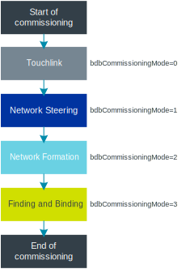
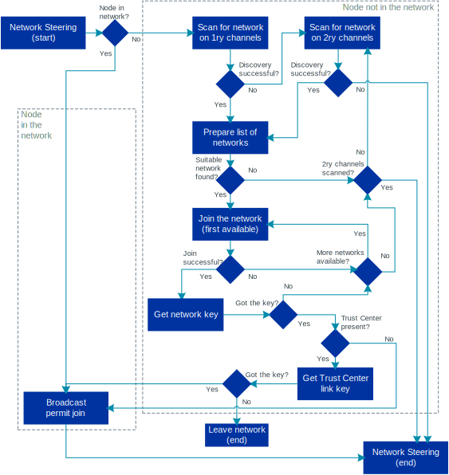
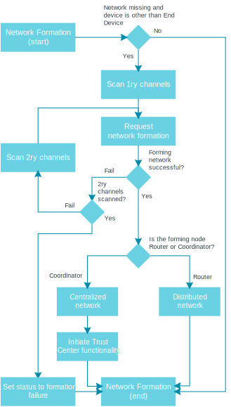
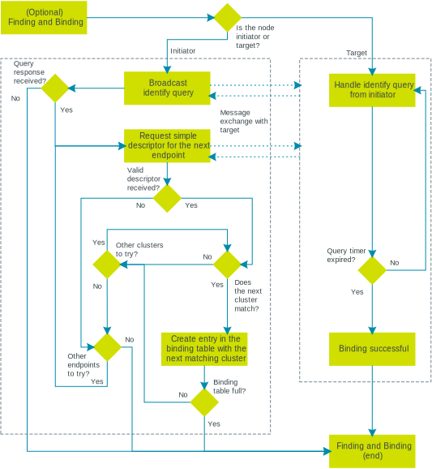

.. _ug_zigbee_commissioning:

Zigbee commissioning
####################

.. contents::
   :local:
   :depth: 2

Commissioning is a process that allows a new Zigbee device to join a Zigbee network.
The device is configured into the network, so that it can start communicating with other network nodes.
If there is no network to join, the commissioning procedure ensures that a new network is created.

You can configure Zigbee commissioning in the |NCS| by setting parameters before the start of the :ref:`nrfxlib:zboss`.
For more information, see the `Support for Zigbee commissioning`_ section in the ZBOSS stack documentation.

.. _zigbee_commissioning_start:

Start of commissioning
**********************

There are several ways the commissioning process can be started, according to the `Zigbee Specification <CSA Specifications Download Request_>`_:

* Automatically after device initialization.
* With a user action, for example a button press or a command.
* Over the air, using a mechanism defined in the Identify cluster.

In the ZBOSS stack, the commissioning can be started using one of the following options:

* `zboss_start()`_ that initializes the stack and starts the BDB commissioning procedure with the default modes (Network Steering, Network Formation, Finding and Binding).
* `bdb_start_top_level_commissioning()`_ that should be started after the stack initialization (for example, from the ZBOSS signal handler) and requires providing the commissioning mode's `zb_bdb_commissioning_mode_mask_e`_ mask.

For more information, see the `Stack commissioning start sequence`_ section in the ZBOSS stack documentation.

In the |NCS|, the application can use :ref:`lib_zigbee_signal_handler` to handle the ZBOSS signals and start the commissioning.

.. _zigbee_commissioning_modes:

Commissioning modes
*******************

Zigbee commissioning is organized into four different modes:

* Touchlink commissioning (optional; not supported in the |NCS|)
* Network Steering
* Network Formation
* Finding and Binding (optional)

These modes are triggered by the top-level commissioning procedure.
The procedure goes through one or more modes, depending on the bits specified in the ``bdbCommissioningMode`` mask (``0`` through ``3``).
A node can have one or more of these bits set.

The following figure shows a generic scenario where all modes are used, together with their corresponding ``bdbCommissioningMode`` mask bits:

   Generic top-level Zigbee commissioning procedure

This top-level procedure defines the intended order of execution of Zigbee commissioning modes.
The commissioning procedure is common for all device roles, but some modes might not be executed for a given role.
For example, Network Formation is not executed for End Devices.

See the following sections for details about each mode.

.. _zigbee_commissioning_modes_touchlink:

Touchlink
=========

.. note::
      The Touchlink mode is optional in Zigbee and is not supported in the |NCS|.

The Touchlink mode allows commissioning of devices in close proximity to each other, which means that the key criterium for this mode is the signal strength.
It involves an initiator device and a target device, where the initiator is a member of an existing Zigbee network or it can form a new network.
Once the network is created, the initiator looks for the target on four channels by sending InterPAN frames.
When the target is found, the initiator can create a local binding with a remote endpoint or request adding the remote endpoint to a group.
The target first identifies itself with the initiator and then receives requests from it and responds to them.

Touchlink only supports `Distributed security network`_ and it is provided as a ZCL cluster, which needs to be implemented on both the initiator and the target devices.

.. _zigbee_commissioning_modes_ns:

Network Steering
================

The Network Steering mode is used for finding open networks that a device can attempt to join or open a network for a specified period of time.

   Zigbee Network Steering procedure

How the node acts in this mode depends on whether the node is in a Zigbee network or not:

* If the node is already a member of a Zigbee network, it opens the network and then closes it after the specified period of time (180 seconds by default).
  The opening of the network is triggered when any of the Router or Coordinator nodes broadcasts the permit join request.
* If the node is not a member of a Zigbee network, it scans channels for an open network to associate with.
  Once it finds a suitable network, it attempts to join it and get the credentials.
  If the node finds more than one available network, it will attempt to join one of them, one by one.

If the node does not find a network to join and it has either the Coordinator or the Router role, it can attempt to form a new network (see `Network Formation`_).
If the node has the End Device role, its commissioning procedure stops here.

If the node finds a network to join, it can continue to the `Finding and Binding`_ procedure if it is requested with the appropriate bit mask value.

The new device must be authenticated and authorized to become part of the network.
For this purpose, it needs credentials, which usually take form of a network key.
For `Centralized security network`_, the authentication and authorization also involves establishing a unique Trust Center Link Key (TCLK).

Network Steering in the |NCS|
   In the ZBOSS stack, Network Steering is started using the `ZB_BDB_NETWORK_STEERING`_ bit mask.

   In the |NCS|, Network Steering for a node on a network can be started using the following additional options:

   * When running the :ref:`Zigbee Coordinator sample <zigbee_network_coordinator_sample>`, you can press the associated button.
   * If you are using the :ref:`lib_zigbee_shell` library in your application, you can use the ``bdb start`` command.
     This command always starts Network Steering for the Router role.
     For the Coordinator role, this command only starts Network Steering when the device is in the network; when not in the network, ``bdb start`` starts Network Formation.

.. _zigbee_commissioning_modes_nf:

Network Formation
=================

The Network Formation mode is available only to Coordinators and Routers, because End Devices are not capable of forming a Zigbee network.

   Zigbee Network Formation procedure

In this mode, the node has not found a network to join during the Network Steering mode, and so it attempts to form a new network.
Depending on the node role:

* A Coordinator forms a centralized security network.
* If configured for forming a network, a Router forms a distributed security network.

If Network Formation is successful, you can add nodes to the new network using `Network Steering`_.
If unsuccessful, the commissioning procedure stops here.

Network Formation in the |NCS|
   In the ZBOSS stack, Network Formation is started using the `ZB_BDB_NETWORK_FORMATION`_ bit mask.

   In the |NCS|, when using the :ref:`lib_zigbee_signal_handler` and the application implements the Zigbee Coordinator role, the Network Formation procedure is started right after the stack initialization.

Centralized security network
----------------------------

The centralized security network is started by the Zigbee Coordinator node, which assumes the Trust Center functionality.
As such, it is responsible for managing the security and authorization in the network.
In the centralized security network, only the Trust Center can provide the network key to the joining device.
This happens by using a link key specific to the joining device.
The link key is exchanged with the Trust Center, which allows for encrypting packets exchanged between the Trust Center and the new node.
This way, only the Trust Center and the new node can decrypt the packages exchanged between them.
Initially, the link key value can be defined in one of the following ways:

* Calculated based on the joining device's install code.
* Predefined in the specification: ``"ZigBeeAlliance09"``.

The link key value can be updated from the initial value by requesting a new key from the Trust Center.

Distributed security network
----------------------------

The distributed security network is formed by Routers and does not have a centralized node that manages security in the network.
In this network type, all Routers are equal and there is no root of trust between them.
Each Router can provide the network key to the joining device.
This happens by using a distributed security global link key.
The link key value is provided as a result of a successful end product certification.

.. _zigbee_commissioning_modes_fb:

Finding and Binding
===================

After the node joins a network, it can undergo the Finding and Binding procedure.
With this procedure, you can establish a connection between corresponding endpoints on two different nodes automatically.
As a result, new binding table entries are created and the nodes do not have to use the device addresses to communicate, but can rely on connections between the same endpoints in their respective cluster binding tables.

   Zigbee Finding and Binding procedure

Finding and Binding can be started automatically (using the ``bdbCommissioningMode`` mask) or manually.
The process involves two device types: target and initiator.
The device type is defined by the endpoint cluster class implemented on the device.
Depending on the device type:

* The target node identifies itself and responds to queries from the initiator.
* The initiator starts Finding and Binding and periodically searches for endpoints on the target.
  When it receives a response, it identifies the endpoint on target with a ZDO simple descriptor request and creates connections with the clusters corresponding to the ones on the initiator.
  This connection can either be a binding (entry in the binding table) or a grouping (addition of the target node address to the address group).
  The procedure is performed using ZDO simple descriptor requests and responses for each endpoint pair, for each matching Zigbee cluster client and server pair for the endpoint.

Finding and Binding can be terminated if there are no corresponding clusters on the target node.

Finding and Binding in the |NCS|
   In the ZBOSS stack, Finding and Binding is started using the `ZB_BDB_FINDING_N_BINDING`_ bit mask.

   Apart from the BDB top-level procedure API, you can use the `zb_bdb_finding_binding_initiator()`_ function to manually control which binding table entries are to be created.
   For more information, see the `BDB Commissioning API`_ section in the ZBOSS stack documentation.

End of commissioning
********************

The top-level commissioning procedure ends when all the requested commissioning modes are done or the commissioning procedure stops.
