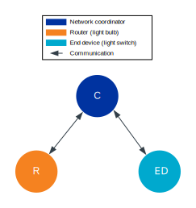
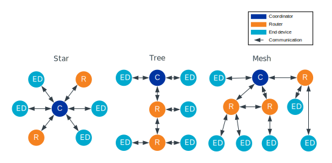

.. _ug_zigee_qsg:

Zigbee quick start guide
########################

.. contents::
   :local:
   :depth: 2

This guide demonstrates some of the basic concepts of the Zigbee network using the |NCS| and the |nRFVSC|.
It guides you through the installation of the required tools and programming of the required samples.

Overview
********

As part of this guide, we are going to program three Zigbee samples onto three different development kits in order to set up a basic Zigbee network composed of three devices, or nodes.
A node is "a testable implementation of a Zigbee application on a single stack with a single network address, and on a single network".

   Zigbee star topology setup for this guide

The figure shows the Zigbee network star topology we are going to set up.
In this topology, the nodes have the following responsibilities:

* Zigbee Coordinator initiates and maintains the devices on the network.
  It also chooses the key network parameters.
  The coordinator's radio is continuously listening for frames.
* Zigbee Router extends the range of the network.
  For this reason, the router has the radio enabled at all times.
  However, in the star topology it is not moving packets through the network.
* Zigbee End Device receives messages from the parent device, in this case the coordinator.

Each of the samples we are going to use for forming the network is based on the single-chip, single-protocol architecture, uses the default configuration (that is without any additional sample extensions enabled) and has a clearly defined role:

* :ref:`Zigbee network coordinator <zigbee_network_coordinator_sample>` demonstrates the Zigbee Coordinator role and supports only the network steering commissioning mechanism.
* :ref:`Zigbee light bulb <zigbee_light_bulb_sample>` demonstrates the Zigbee Router role and implements the Dimmable Light device specification, as defined in the Zigbee Home Automation public application profile.
* :ref:`Zigbee light switch <zigbee_light_switch_sample>` demonstrates the Zigbee End Device role and implements the Dimmer Switch device specification, as defined in the Zigbee Home Automation public application profile.
  Once commissioned into the network, it looks for devices with the implemented Level Control and On/Off clusters and can control the one that answers first.

All these samples also implement the Basic and Identify clusters, which are the basic Zigbee clusters.

Zigbee topologies
=================

Depending on the available device types and their number, Zigbee supports the following network topologies:

* Star topology - where the coordinator communicates directly with the end devices and no routers are actively present, meaning they are either not present or not routing packets within the network.
* Tree topology - where routers are located beyond their mutual radio range and are not able to communicate with each other.
  However, unlike in the star topology, the routers continue to move packets through the network.
* Mesh topology - which allows full peer-to-peer communication.

   Zigbee topology types

In every Zigbee topology, each router and end device that joins the Zigbee network after its creation by the coordinator needs a parent device.
When a device wants to join the network, it sends a beacon request to scan for available devices.
The devices that can route the packets respond with beacons.
Based on different factors of responses, such as signal strength, the new device selects the parent.

For end devices, the parent device, either a coordinator or a router, can store information meant for them.
This is required because the end devices do not receive packets directly from other devices.
Each packet meant for an end device needs to go through its parent, and the end devices need to regularly request and respond to packets from the parents.
For example, in the |NCS| the Zigbee light switch device requests packets from the parent every three seconds.
The end device does not route packets.
It can also disable its radio to reduce the power consumption between the regular packet requests if the Sleepy End Device behavior is enabled.

Detailed reading
================

If you want to learn more about Zigbee topics and terminology mentioned in this guide, read the following pages:

* :ref:`ug_zigbee_architectures` page to learn more about the Zigbee architecture available in the |NCS|
* `Common ZCL terms and definitions`_ section in the ZBOSS user guide
* Zigbee topologies in section 1.1.4 of the `Zigbee Specification <CSA Specifications Download Request_>`_
* :ref:`zigbee_ug_sed` section on the :ref:`ug_zigbee_configuring` page

Requirements
************

For this quick start guide, you need *three* development kits of the following types:

.. table-from-rows:: /includes/sample_board_rows.txt
   :header: heading
   :rows: nrf52840dk_nrf52840, nrf52833dk_nrf52833, nrf5340dk_nrf5340_cpuapp, nrf21540dk_nrf52840

You can mix different development kits.

.. note::

   Make sure that you have three development kits before proceeding to the next steps.

Software requirements
=====================

For this quick start guide, we will install the following software:

* Toolchain Manager - An application for installing the full |NCS| toolchain.
* Microsoft's |VSC| - The recommended IDE for the |NCS|.
* |nRFVSC| - An add-on for |VSC| that allows you to develop applications for the |NCS|.
* nRF Command Line Tools - A set of mandatory tools for working with the |NCS|.
* SEGGER J-Link - Tool for handling the serial connection.

.. rst-class:: numbered-step

Set up the software
*******************

The following steps are a simplified version of the |NCS|'s :ref:`gs_assistant` procedure.

To set up the required software, complete the following steps:

1. Install the Toolchain Manager app:

   a. `Download nRF Connect for Desktop`_ for your operating system.
   #. Install and run the tool on your machine.
   #. In the **APPS** view, click :guilabel:`Install` next to Toolchain Manager.

   The app is installed on your machine, and the :guilabel:`Install` button changes to :guilabel:`Open`.
#. Open the Toolchain Manager in nRF Connect for Desktop.
#. Click :guilabel:`SETTINGS` in the navigation bar to specify where you want to install the |NCS|.
   Then, in :guilabel:`SDK Environments`, click the :guilabel:`Install` button next to the |NCS| version that you want to install.
   The |NCS| version of your choice is installed on your machine.
#. Click the :guilabel:`Open VS Code` button.
   The installation wizard checks whether you have the following software installed:

   * Microsoft's |VSC|
   * |nRFVSC|
   * nRF Command Line Tools (with SEGGER J-Link)

   If any of these items is missing, you are taken to its installation page to complete the setup.
   At the end of the process, the |VSC| main window opens.

.. rst-class:: numbered-step

Program the samples
*******************

To program the samples, complete the following steps:

.. |sample_path_vsc| replace:: :file:`nrf/samples/zigbee/network_coordinator`

.. |vsc_sample_board_target_line| replace:: see the `Requirements`_ section for the list of available build target names.
   For the purpose of this quick start guide, leave the default values for other options.

.. include:: ../../includes/vsc_build_and_run.txt

#. Program the application to the board:

   a. Connect your development kit using the serial port.
   #. In the :guilabel:`Connected Devices View`, click :guilabel:`Refresh Connected Devices`.
      Your development kit appears on the list.
   #. In the :guilabel:`Actions View`, click :guilabel:`Flash`.

      .. figure:: images/zigbee_qsg_vsc_flash.png
         :alt: nRF Connect for Visual Studio Code - Refresh Connected Devices and Flash buttons

   When the programming is done, the **LED 3** on the development kit turns on to indicate that the Zigbee network is open.
   After some time, it turns off and the Zigbee network needs to be reopened (see below).
#. Add the light switch application.
   Repeat steps 3 to 9 for the Zigbee light switch sample.
   The path to the application files is :file:`nrf/samples/zigbee/light_switch`.
#. Add the light bulb application.
   Repeat steps 3 to 9 for the Zigbee light bulb sample.
   The path to the application files is :file:`nrf/samples/zigbee/light_bulb`.
   The **LED 4** turns on when the application is started.
#. Press **Button 1** on the development kit programmed with the network coordinator sample to reopen the Zigbee network.
   After some time, the devices join the Zigbee network.
   On the development kit programmed with the light bulb sample, **LED 3** turns on when the light bulb joins the network.
   On the development kit programmed with the light switch sample, **LED 3** turns on when the device joins the network and **LED 4** turns on when the light switch finds a light bulb to control.

Reopening the network
   If you find that you are having issues with your devices joining the Zigbee network, it may be because the network needs to be reopened manually.
   If the network is open, then **LED 3** on the development kit programmed with the network coordinator sample will be on.
   If **LED 3** is not on, then the network is closed and needs to be reopened again.

   To reopen the network, press **Button 1** on the development kit that has been programmed as the network coordinator.
   The network remains open for 180 seconds by default at startup, and after **Button 1** is pressed. After 180 seconds have passed, the network will close and need to be re-opened.

   For more information, see the :ref:`User interface <zigbee_network_coordinator_user_interface>` section from the :ref:`Zigbee Network coordinator <zigbee_light_switch_sample>` sample.

.. rst-class:: numbered-step

Test the network
****************

After forming the Zigbee network, test the interaction between the devices:

1. Press **Button 2** once on the development kit programmed with the light switch sample to turn off the light bulb's **LED 4**.
#. Press **Button 1** once on the development kit programmed with the light switch sample to turn on the light bulb's **LED 4**.
#. Press and hold **Button 2** on the development kit programmed with the light switch sample to decrease the light bulb's **LED 4** brightness.
#. Press and hold **Button 1** on the development kit programmed with the light switch sample to increase the light bulb's **LED 4** brightness.

What to do next
***************

After you complete this quick start guide, we recommend that you get familiar with the following topics:

* If you want to start configuring samples:

  * :ref:`ug_zigbee_configuring`
  * :ref:`ug_zigbee_configuring_libraries`
  * :ref:`ug_zigbee_other_ecosystems`
  * Zigbee sample variants - see :ref:`Zigbee sample <zigbee_samples>` pages

* If you want to test a multiprotocol solution, see :ref:`zigbee_light_switch_sample_nus` of the light switch sample.
* If you want to start developing for co-processor designs:

  * :ref:`ug_zigbee_platform_design_ncp`
  * `NCP Host documentation`_

* If you want to learn more about ZBOSS:

  * ZBOSS user guide - see `API documentation`_
  * :ref:`ug_zigee_adding_clusters`
