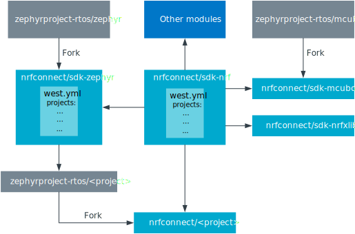

.. _dm_code_base:

nRF Connect SDK code base
#########################

.. contents::
   :local:
   :depth: 2

The source code, libraries, and tools that compose the |NCS| are entirely hosted in a set of :ref:`ncs_git_intro` repositories, which are managed using Zephyr's :ref:`ncs_west_intro` tool.
All |NCS| repositories are publicly hosted on the `nrfconnect GitHub organization`_, and accessible to both individual users and companies.

Some notable repositories include:

* `sdk-nrf`_ repository - Contains applications, samples, libraries, and drivers that are specifically targeted at Nordic Semiconductor devices.
* `sdk-nrfxlib`_ repository - Contains closed-source libraries and modules in binary format.
  See the :doc:`nrfxlib documentation <nrfxlib:README>`.
* `sdk-zephyr`_ repository - Contains a fork of the `Zephyr`_ project, which provides samples, libraries, and drivers for a wide variety of devices, including Nordic Semiconductor devices.
  See the :doc:`documentation <zephyr:index>` in Nordic Semiconductor's Zephyr fork.

  .. note::

     The `sdk-zephyr`_ repository is a :term:`soft fork` that Nordic Semiconductor maintains.
     It is not the same as Zephyr SDK, which is a set of :ref:`installation tools <gs_installing_toolchain>` used while installing the |NCS|.

* `sdk-mcuboot`_ repository - Contains a fork of the `MCUboot`_ project, which provides a secure bootloader application.
  You can find the fork in :file:`bootloader/mcuboot` after obtaining the |NCS| source code.
  See the :doc:`documentation <mcuboot:index-ncs>` in Nordic Semiconductor's MCUboot fork.

All repositories with the prefix ``sdk`` contain the |NCS| firmware and code.
See :ref:`dm_repo_types` for more information.

Every |NCS| release consists of a combination of all included repositories at different revisions.
See the :ref:`repos_and_revs` section for a comprehensive list of repositories and their current revisions.
The revision of each of those repositories is determined by the current revision of the main (manifest) repository ``sdk-nrf``.

.. _ncs_west_git_intro:

Git and west
************

Basic familiarity with Git and west is required to understand the architecture of the repository set and to work with the |NCS|.

.. _ncs_git_intro:

Git
===

`Git`_ is a free and open source distributed version control system that allows managing the changes in the code or other collections of information (set of files) over time.

Git offers a lot of flexibility in how users manage changes, and repositories are easily duplicated.
In the |NCS|, forking is the agreed-upon Git workflow.
To contribute, the official public repository in GitHub is forked.

A fork can be hosted on any server, including a public Git hosting site like `GitHub`_.
It is, however, important to differentiate between the generic concept of a fork and GitHub's concept of a `GitHub fork`_.
When you create a GitHub fork, GitHub copies the original repository and tags the downstream repository (the fork) with a flag that allows users to send pull requests from the fork to its upstream repository.
GitHub also supports creating forks without linking them to the upstream repository.
See the `GitHub documentation <GitHub duplicate_>`_ for information about how to do this.

.. _ncs_west_intro:

West
====

The Zephyr project includes a tool called west.
The |NCS| uses :ref:`west <zephyr:west>` to manage the combination of multiple Git repositories and versions.

Some of west's features are similar to those provided by :term:`submodules <Submodule>` of Git and Google's Repo tool.
But west also includes custom features required by the Zephyr project that were not sufficiently supported by the existing tools.

West's workspace contains exactly one :ref:`manifest repository <zephyr:west-basics>`, which is a main Git repository containing a `west manifest file`_.
Additional Git repositories in the workspace managed by west are called projects.
The manifest repository controls which commits to use from the different projects through the manifest file.
In the |NCS|, the main repository `sdk-nrf`_ contains a west manifest file :file:`west.yml`, that determines the revision of all other repositories.
This means that `sdk-nrf`_ acts as the manifest repository, while the other repositories are projects.

When developing in the |NCS|, your application will use libraries and features from folders that are cloned from different repositories or projects.
The west tool keeps control of which commits to use from the different projects.
It also makes it fairly simple to add and remove modules.

.. _dm_repo_types:

Repository types
****************

There are two main types of Git repositories in the |NCS| repository set:

nRF repositories
  These repositories have the following characteristics:

  * Created, developed, and maintained by Nordic.
  * Usually licensed for use on Nordic products only.

  nRF repositories are stand-alone and have no upstreams, since they are unique to the |NCS|.
  Some examples of repositories of this type are:

  * `sdk-nrf`_: The main repository for Nordic-developed software.
  * `sdk-nrfxlib`_: A repository containing linkable libraries developed by Nordic.

OSS repositories
  These repositories have the following characteristics:

  * Created and maintained by Nordic.
  * Soft forks of open-source projects.
  * Typically contain a small set of changes that are specific to |NCS|.
  * Updated ("upmerged") regularly with the latest changes from the open source project.

  OSS repositories are typically soft forks of an upstream open source project, which Nordic maintains in order to keep a small set of changes that do not belong, or have not been merged, to the upstream official open-source repository.
  For example:

  * `sdk-zephyr`_ is a soft fork (and therefore a downstream) of the upstream official `Zephyr repository`_.
  * `sdk-mcuboot`_ is a soft fork (and therefore a downstream) of the upstream official `MCUboot repository`_.

  See also :ref:`dm-oss-downstreams` and :ref:`dm-oss-userdata` for more information about how these repositories are maintained.

From Zephyr perspective, all these repositories are considered :ref:`external modules <zephyr:modules>`.

.. _dm_repo_structure:

Repository structure
********************

The |NCS| uses :ref:`west <zephyr:west>` to manage the combination of repositories and versions.

A :ref:`manifest repository <zephyr:west-manifests>`, `sdk-nrf`_, contains a file in its root folder, :file:`west.yml`, which lists all other repositories (west projects) included in the |NCS|.
The |NCS| repository structure has a star topology, with the `sdk-nrf`_ repository being the center of the star and all other repositories being west projects that are managed by :file:`west.yml`.
This is equivalent to topology T2 in the :ref:`west documentation <zephyr:west-basics>`.

   The |NCS| repository structure

The figure above depicts the |NCS| repository structure.
A central concept with this repository structure is that each revision (in Git terms) of the `sdk-nrf`_ repository completely determines the revisions of all other
repositories (that is, the west projects).
This means that the linear Git history of this manifest repository also determines the history of the repository set in its entirety, thanks to the :file:`west.yml` `west manifest file`_ being part of the manifest repository.

West reads the contents of the manifest file to find out which revisions of the project repositories are to be checked out every time ``west update`` is run.
In this way, you can decide to work with a specific |NCS| release either by initializing a new west installation at a particular tag or by checking out the corresponding tag for a release in an existing installation and then updating your project repositories to the corresponding state with ``west update``.
Alternatively, you can work with the latest state of development by using the main branch of the `sdk-nrf`_ repository, updating it with Git regularly and using ``west update`` to update the project repositories every time the manifest repository changes.
More information about manifests can be found in the :ref:`west manifest section <zephyr:west-manifests>` of the Zephyr documentation.

.. _dm-revisions:

Versions and revisions
**********************

The |NCS| version numbers are assigned based on very specific criteria.
They follow the ``MAJOR.MINOR.PATCH`` pattern (also further called as ``X.Y.Z``), with possible additional postfixes depending on the release.

+-------------------------------+----------------------------------------------------------------------------+-------------------------------------------------------------------------------------------------+
| Release type                  | Release critera                                                            | Comments                                                                                        |
+===============================+============================================================================+=================================================================================================+
| ``MAJOR``                     | Introduces a large number of substantial changes across the board          | Major version number is increased rarely and the release is accompanied by a migration guide.   |
+-------------------------------+----------------------------------------------------------------------------+-------------------------------------------------------------------------------------------------+
| ``MINOR``                     | Introduces one or more new functionalities.                                | Version number is increased every time a major release is cut.                                  |
|                               |                                                                            | Minor releases are the default types of an |NCS| release.                                       |
|                               |                                                                            | The new functionalities may break exisiting APIs.                                               |
+-------------------------------+----------------------------------------------------------------------------+-------------------------------------------------------------------------------------------------+
| ``PATCH``                     | Introduces bugfixes or minor changes to the existing functionalities.      | Patch releases only address functional issues and do not introduce new functionalities.         |
+-------------------------------+----------------------------------------------------------------------------+-------------------------------------------------------------------------------------------------+
| ``MAJOR.MINOR.99``            | The ``99`` added at the end of the version number indicates                | The number can be used between minor, major, or patch releases.                                 |
|                               | that the version string is a point in between two releases.                |                                                                                                 |
|                               | Such version does not belong to a release and corresponds to the           |                                                                                                 |
|                               | current state of development.                                              |                                                                                                 |
+-------------------------------+----------------------------------------------------------------------------+-------------------------------------------------------------------------------------------------+
| ``MAJOR.MINOR.PATCH-devN``    | Development tag, marked through a postfix added to the end of the version. | ``-devN`` version might not be subjected to the same amount of testing                          |
|                               | Indicates a snapshot of the development state that is created to highlight | as the |NCS| release.                                                                           |
|                               | the introduction of a new piece of functionality.                          |                                                                                                 |
+-------------------------------+----------------------------------------------------------------------------+-------------------------------------------------------------------------------------------------+

There are two fundamental revisions that are relevant to most |NCS| users:

* The ``main`` branch of the `sdk-nrf`_ repository
* Any Git tag (that is, release, release candidate or development tag) of the `sdk-nrf`_ repository

The ``main`` branch of the `sdk-nrf`_ repository always contains the latest development state of the |NCS| (``MAJOR.MINOR.99``).
Since all development is done openly, you can use it if you are not particularly concerned about the stability and want to track the latest changes that are being merged continuously into different repositories.

The |NCS| revision entry changes every time a Git commit is merged into the `sdk-nrf`_ repository.
The revision of the SDK is considered to be equivalent to the repository revision of ``sdk-nrf``, because it is the :ref:`manifest repository <zephyr:west-manifests>`.
This means that, by virtue of containing the `west manifest file`_, its revision uniquely identifies the revisions of all other repositories included in the SDK.

Git tags
========

The Git tags correspond to official releases tested and signed by the Nordic engineers.
The format for nRF repositories is as follows::

  vX.Y.Z(-rcN)

Where ``X``, ``Y`` and ``Z`` are the ``MAJOR``, ``MINOR`` and ``PATCH`` version respectively.
A release candidate postfix ``-rcN`` can be optionally attached if the tag identifies a candidate instead of the actual release.

The Git tags are composed as follows::

  vX.Y.Z(-rcN|-devN)

Tags without a suffix correspond to official releases tested and signed by Nordic Semiconductor engineers.
A release candidate suffix ``-rcN`` is attached if the tag identifies a candidate instead of the actual release.

.. dev_tag_definition_start

In between releases, there might be development tags.
These are identified by a ``-devN`` suffix included after the |NCS| version, for example ``v1.9.99-dev1`` for the main branch or ``v1.9.2-dev1`` for the release branch.
Such versions indicate a snapshot of the development state that is created to highlight the introduction of a new piece of functionality.
Unlike an |NCS| release, a ``-devN`` version may or may not have received the same amount of testing.

.. dev_tag_definition_end

In the case of OSS repositories, the git tag format reuses the upstream project's version along with some |NCS| specific postfixes::

  vX.Y.Z-ncsN(-rcM)

In this format, ``X``, ``Y`` and ``Z`` are the ``MAJOR``, ``MINOR`` and ``PATCH`` versions of the upstream project, and ``-ncsN`` is used to identify the number of |NCS| releases based on that particular version.

.. _dm-oss-downstreams:

OSS repositories downstream project history
*******************************************

As described in :ref:`dm_repo_types`, the |NCS| contains OSS repositories, which are based on third-party, open-source Git repositories and may contain additional patches not present upstream.
Examples include `sdk-zephyr`_ and `sdk-mcuboot`_, which have upstream open-source projects used as a basis for downstream repositories distributed with the |NCS|.
This section describes how the history of these OSS repositories is maintained, and how they are synchronized with their upstreams.

The short logs for these downstream patches contain ``[nrf xyz]`` at the beginning, for different ``xyz`` strings.
This makes their different purposes downstream clearer, and makes them easier to search for and see in ``git log``.
The current values of ``[nrf xyz]`` are:

* ``[nrf mergeup]``- Periodic merges of the upstream tree
* ``[nrf fromlist]``- Patches which have upstream pull requests, including any later revisions
* ``[nrf noup]``- Patches which are specific to the |NCS|
* ``[nrf fromtree]``- Patches which have been cherry-picked from an upstream tree

.. note::
    The downstream project history is periodically rewritten.
    This is important to prevent the number of downstream patches included in a specific |NCS| release from increasing forever.
    A repository's history is typically only rewritten once for every |NCS| release.

To make incorporating new history into your own forks easier, a new point in the downstream |NCS| history is always created which has an empty ``git diff`` with the previous version.
The empty diff means you can always use:

* ``git merge`` to get the rewritten history merged into your own fork without errors
* ``git rebase --onto`` or ``git cherry-pick`` to reapply any of your own patches cleanly before and after the history rewrite
* ``git cherry`` to list any additional patches you may have applied to these projects to rewrite history as needed

Additionally, both the old and new histories are committed sequentially into the ``revision`` fields for these projects in the :file:`nrf/west.yml` west manifest file.
This means you can always combine ``git bisect`` in the ``nrf`` repository with ``west update`` at each bisection point to diagnose regressions and the rest.

.. _dm-oss-userdata:

Userdata associated with OSS repositories
*****************************************

The west manifest file :file:`nrf/west.yml` contains ``userdata`` values for some OSS repository projects.

This section documents these values and their purpose.
However, they are mainly meant for internal use and are safe to ignore.

See :ref:`zephyr:west-project-userdata` for general information about the west ``userdata`` feature.

In the |NCS|, each ``userdata`` value has this format:

.. code-block:: YAML

   ncs:
     upstream-url: https://...
     upstream-sha: GIT_SHA
     compare-by-default: <true|false>

These fields are used to track some extra OSS repository metadata.
The metadata is present for projects which are not included in the |NCS| directly from the Zephyr project's manifest in :file:`zephyr/west.yml`.
Repository maintainers use this metadata while synchronizing the |NCS| fork of each repository with its upstream repository.

The meaning of each ``userdata`` field is:

* ``upstream-url`` - Git URL that the project is synchronized against
* ``upstream-sha`` - Most recent Git SHA in the ``upstream-url`` repository which is included in the |NCS| fork of the repository
* ``compare-by-default`` - If ``true``, internal |NCS| synchronization tooling will include information related to this repository by default
