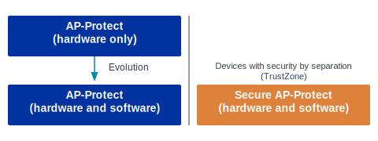

.. _app_approtect:

Managing access port protection
###############################

.. contents::
   :local:
   :depth: 2

.. app_approtect_info_start

Several Nordic Semiconductor SoCs or SiPs supported in the |NCS| offer an implementation of the access port protection mechanism (AP-Protect).
When enabled, this mechanism blocks the debugger from read and write access to all CPU registers and memory-mapped addresses.
Accessing these registers and addresses again requires disabling the mechanism and erasing the flash.

.. app_approtect_info_end

.. _app_approtect_general_reference:
.. _app_approtect_implementation_overview:

Implementation overview
***********************

Nordic Semiconductor devices implement access port protection using the following mechanisms:

AP-Protect controlled by hardware
   * Protection is controlled only by the ``UICR.APPROTECT`` register.
   * Devices ship with AP-Protect disabled (debug access open).
   * Used on nRF9160 and older HW build codes of nRF52 Series devices.

AP-Protect controlled by hardware and software
   * Protection is controlled by both the ``UICR.APPROTECT`` register and software.
     For the |NCS|, the software side is handled using Kconfig options.
   * Devices ship with AP-Protect enabled (debug access blocked) and it re-enables on every hard reset.
   * Used on nRF53, nRF54L, nRF91x1, and newer HW build codes of nRF52 Series devices.

Secure AP-Protect
   * An additional protection layer for SoCs or SiPs that support `ARM TrustZone`_ and different :ref:`app_boards_spe_nspe`.
   * Protection is controlled by the ``UICR.SECUREAPPROTECT`` register and software (nRF9160 is an exception).
     For the |NCS|, the software side is handled using Kconfig options.
   * Devices ship with Secure AP-Protect either enabled or disabled, depending on the device.
   * When enabled, it blocks access only to the Secure Processing Environment (SPE), while allowing non-secure debugging.
   * Works alongside standard AP-Protect.
   * Available on nRF5340, nRF54L, and nRF91 Series devices.

The following figure illustrates the relationship between the implementation types:

See the following sections for more information about the available implementation types.

.. note::
   Some devices also support ``UICR.ERASEPROTECT``, which prevents the ``ERASEALL`` command from executing and stops the device from being erased.
   ``UICR.ERASEPROTECT`` is independent of access port protection.
   If both AP-Protect and ``UICR.ERASEPROTECT`` are enabled, the device cannot be unlocked or recovered.
   After ``ERASEALL``, ``UICR.ERASEPROTECT`` is disabled by default; you cannot program it to a disabled state.
   See the hardware documentation for your specific device for details about ``UICR.ERASEPROTECT`` availability and configuration.

Flow for AP-Protect controlled by hardware
==========================================

This flow applies to the nRF9160 and older HW build codes of nRF52 Series devices.

By default, AP-Protect is disabled.
To enable it, write ``Enabled`` to ``UICR.APPROTECT`` and reset the device.

.. msc::

   hscale = "1.5";
   Debugger, "CTRL-AP", Device, NVM;

   Debugger->"CTRL-AP"     [label="Connect"];
   "CTRL-AP"--Device       [label="Access open (AP-Protect disabled by default)"];
   ...;
   --- [label="To enable AP-Protect:"];
   ...;
   Debugger->NVM           [label="Program UICR.APPROTECT to enabled state"];
   Debugger->"CTRL-AP"     [label="Issue any reset to load the new AP-Protect configuration"];
   "CTRL-AP"--Device       [label="Access blocked (AP-Protect enabled)"];

To disable AP-Protect, issue an ``ERASEALL`` command using CTRL-AP.
If ``UICR.ERASEPROTECT`` is enabled on your device, ``ERASEALL`` will not execute.
This command erases the flash, RAM, and UICR (including ``UICR.APPROTECT``), and hard resets the device.

.. msc::

   hscale = "1.5";
   Debugger, "CTRL-AP", Device, NVM;

   Debugger->"CTRL-AP"     [label="Connect"];
   "CTRL-AP"--Device       [label="Access closed (AP-Protect enabled)"];
   ...;
   --- [label="To disable AP-Protect:"];
   ...;
   Debugger->"CTRL-AP"     [label="Issue ERASEALL"];
   "CTRL-AP"--Device       [label="Wait until ERASEALL command is executed"];
   Device->"CTRL-AP"       [label="AP-Protect disabled"];
   "CTRL-AP"->Debugger     [label="Full debug access granted"];

Flow for AP-Protect controlled by hardware and software
=======================================================

This flow applies to nRF53, nRF54L, nRF91x1, and newer HW build codes of nRF52 Series devices.

By default, AP-Protect is enabled.
To disable it on the hardware side, issue an ``ERASEALL`` command.
To disable it on the software side, make sure that ``UICR.APPROTECT`` is programmed to a disabled state and the firmware disables AP-Protect.
The disabling in software in the |NCS| is handled using Kconfig options.

.. msc::
    hscale = "1.5";
    Debugger, "CTRL-AP", Device, Firmware, NVM;

    Debugger->"CTRL-AP"     [label="Connect"];
    "CTRL-AP"--Device       [label="Access blocked (AP-Protect enabled by default)"];
    ...;
    --- [label="To disable AP-Protect:"];
    ...;
    Debugger->"CTRL-AP"     [label="Issue ERASEALL"];
    "CTRL-AP"--Device       [label="Wait until ERASEALL command is executed"];
    Device->"CTRL-AP"       [label="AP-Protect disabled on the hardware side"];
    "CTRL-AP"->Debugger     [label="Full debug access granted, but any reset re-enables AP-Protect"];
    ...;
    --- [label="To keep AP-Protect permanently disabled (after any reset):"];
    ...;
    Debugger->"CTRL-AP"     [label="Issue ERASEALL"];
    "CTRL-AP"--Device       [label="Wait until ERASEALL command is executed"];
    Debugger->NVM           [label="Configure UICR.APPROTECT to allow debugging (device-specific)"];
    Debugger->NVM           [label="Program firmware that disables AP-Protect in software"];
    Device box NVM          [label="On every reset the device does the following:"];
    NVM->Device             [label="Internal boot mechanism loads the AP-Protect configuration from UICR"];
    NVM->Device             [label="Firmware disables AP-Protect in software"];
    Device->Debugger        [label="Debug access is open"];

To enable AP-Protect, write ``Enabled`` to ``UICR.APPROTECT`` and reset the device.

.. msc::
    hscale = "1.5";
    Debugger, "CTRL-AP", Device, Firmware, NVM;

    Debugger->"CTRL-AP"     [label="Connect"];
    "CTRL-AP"--Device       [label="Access open (AP-Protect disabled)"];
    ...;
    --- [label="To enable AP-Protect:"];
    ...;
    Debugger->NVM           [label="Configure UICR.APPROTECT to enabled state (device-specific)"];
    Debugger->"CTRL-AP"     [label="Issue any type of reset"];
    "CTRL-AP"--Device       [label="Access blocked (AP-Protect enabled)"];

.. _secure_approtect_support:

Flow for Secure AP-Protect
==========================

This flow applies to TrustZone-enabled devices (nRF5340, most nRF54L Series devices, nRF91 Series devices, with nRF9160 being an exception) when Secure AP-Protect is enabled.
Such devices use :ref:`Trusted Firmware-M (TF-M) <ug_tfm>` and :ref:`security by separation <app_boards_spe_nspe>`, where a Secure Processing Environment (SPE) is isolated from the Non-Secure Processing Environment (NSPE).

While AP-Protect blocks access to all CPU registers and memories, Secure AP-Protect limits the CPU access to the NSPE side only.
This allows debugging of the NSPE, while the SPE debugging is blocked.

Secure AP-Protect works alongside standard AP-Protect:

- AP-Protect blocks access to all CPU registers and memories.
  This means that you have to unlock AP-Protect to debug the NSPE code.
- Secure AP-Protect limits access to the CPU to only NSPE access.
  This means that the CPU is entirely unavailable while it is running the code in the SPE, and only non-secure registers and address-mapped resources can be accessed.

By default, the Secure AP-Protect can be either enabled or disabled, depending on the device.

To disable it on the hardware side, issue an ``ERASEALL`` command.
To disable it on the software side, make sure that ``UICR.SECUREAPPROTECT`` is programmed to a disabled state and the firmware disables Secure AP-Protect.
The disabling in software in the |NCS| is handled using Kconfig options.

.. msc::
    hscale = "1.5";
    Debugger, "CTRL-AP", Device, "NVM in NSPE", "NVM in SPE";

    Debugger->"CTRL-AP"      [label="Connect"];
    "CTRL-AP"--"NVM in SPE"  [label="NVM access blocked (Secure AP-Protect enabled on the device, AP-Protect disabled)"];
    "CTRL-AP"->"NVM in NSPE" [label="NSPE access allowed"];
    Debugger->"CTRL-AP"      [label="Debug NSPE code"];
    "CTRL-AP"->"NVM in NSPE" [label="Read/write non-secure memory"];
    ...;
    --- [label="To disable Secure AP-Protect and unlock SPE debugging:"];
    ...;
    Debugger->"CTRL-AP"       [label="Issue ERASEALL"];
    "CTRL-AP"--Device         [label="Wait until ERASEALL command is executed"];
    Debugger->"NVM in SPE"    [label="Configure UICR.SECUREAPPROTECT and UICR.APPROTECT to allow debugging (device-specific)"];
    Debugger->"NVM in SPE"    [label="Program firmware that disables Secure AP-Protect in software"];
    Debugger->"CTRL-AP"       [label="Issue any type of reset"];
    Device->Debugger          [label="Full SPE + NSPE debug access, but any reset re-enables Secure AP-Protect"];
    ...;
    --- [label="To keep Secure AP-Protect permanently disabled (after any reset):"];
    ...;
    Debugger->"CTRL-AP"     [label="Issue ERASEALL"];
    "CTRL-AP"--Device       [label="Wait until ERASEALL command is executed"];
    Debugger->"NVM in SPE"  [label="Configure UICR.SECUREAPPROTECT and UICR.APPROTECT to allow debugging (device-specific)"];
    Debugger->"NVM in SPE"  [label="Program firmware that disables Secure AP-Protect in software"];
    Device box "NVM in SPE" [label="On every reset the device does the following:"];
    "NVM in SPE"->Device    [label="Internal boot mechanism loads the Secure AP-Protect configuration from UICR"];
    "NVM in SPE"->Device    [label="Firmware disables Secure AP-Protect in software"];
    Device->Debugger        [label="Full SPE + NSPE debug access"];

When the Secure AP-Protect is disabled, write ``Enabled`` to ``UICR.SECUREAPPROTECT`` and reset the device to enable it.

.. msc::
    hscale = "1.5";
    Debugger, "CTRL-AP", Device, "NVM in NSPE", "NVM in SPE";

    Debugger->"CTRL-AP"      [label="Connect"];
    "CTRL-AP"--"NVM in SPE"  [label="NVM access open (Secure AP-Protect disabled on the device, AP-Protect disabled)"];
    "CTRL-AP"->"NVM in SPE"  [label="NSPE and SPE debug access allowed"];
    Debugger->"CTRL-AP"      [label="Debug NSPE and SPE code"];
    "CTRL-AP"->"NVM in SPE"  [label="Read/write non-secure and secure memory"];
    ...;
    --- [label="To enable Secure AP-Protect and lock SPE debugging:"];
    ...;
    Debugger->"NVM in SPE"    [label="Configure UICR.SECUREAPPROTECT and UICR.APPROTECT to disallow debugging of SPE (device-specific)"];
    Debugger->"NVM in SPE"    [label="Program firmware that enables Secure AP-Protect in software"];
    Debugger->"CTRL-AP"       [label="Issue any type of reset"];
    Device->Debugger          [label="SPE debug access locked"];
    Debugger->"CTRL-AP"       [label="Debug NSPE code"];
    "CTRL-AP"->"NVM in NSPE"  [label="Read/write non-secure memory"];

.. _app_approtect_ncs:
.. _app_approtect_ncs_lock:
.. _app_approtect_ncs_user_handling:
.. _app_approtect_ncs_use_uicr:
.. _app_approtect_uicr_approtect:
.. _app_secure_approtect:
.. _app_secure_approtect_uicr_approtect:
.. _app_approtect_device_series:

Configuring AP-Protect per device
*********************************

The following sections provide device-specific information about AP-Protect configuration.

.. _app_approtect_nrf91_series:

nRF91 Series
============

.. tabs::

   .. tab:: nRF9160

      .. list-table:: nRF9160 AP-Protect support
         :header-rows: 1
         :align: center
         :widths: auto

         * - AP-Protect (hardware only)
           - AP-Protect (hardware and software)
           - Secure AP-Protect
           - HW documentation
         * - ✔
           - ✗
           - ✔
           - `Debugger access protection for nRF9160`_

      .. note::
         This device supports ``UICR.ERASEPROTECT``, which might prevent the ``ERASEALL`` command from executing when AP-Protect is enabled.
         See hardware documentation for more information.

      On the nRF9160, AP-Protect and Secure AP-Protect are *hardware-only*; there are no |NCS| Kconfig options for this device.
      Both mechanisms are controlled solely by writing to the UICR using nRF Util.
      For more information about the ``nrfutil device protection-set`` command, see `Configuring readback protection`_ in the nRF Util documentation.

      **Enabling AP-Protect:**

      To enable hardware AP-Protect, write ``Enabled`` to ``UICR.APPROTECT`` using the following nRF Util command:

      .. code-block:: console

         nrfutil device protection-set All

      This command enables the hardware AP-Protect and hard resets the device.

      **Enabling Secure AP-Protect:**

      To enable hardware Secure AP-Protect, use the following nRF Util command:

      .. code-block:: console

         nrfutil device protection-set SecureRegions

      This command enables the hardware Secure AP-Protect and hard resets the device.

      **Keeping AP-Protect disabled after hard reset:**

      To keep AP-Protect disabled after hard reset, issue an ``ERASEALL`` command using the following nRF Util command:

      .. code-block:: console

         nrfutil device recover

      The device is automatically unlocked after erase.
      No changes in firmware are required because the nRF9160 does not use software AP-Protect.

      **Production programming:**

      For the devices that are in a production environment, it is highly recommended to lock the ``UICR.APPROTECT`` and ``UICR.SECUREAPPROTECT`` registers to prevent unauthorized access to the device.
      If the access port protection is configured this way, it cannot be disabled without erasing the non-volatile memory.

      Check also the following documentation pages for more information:

      * `Unlocking nRF91`_
      * `Enabling device protection on nRF91`_
      * `Checking AP-Protect status on nRF91`_

   .. tab:: nRF9161

      .. list-table:: nRF9161 AP-Protect support
         :header-rows: 1
         :align: center
         :widths: auto

         * - AP-Protect (hardware only)
           - AP-Protect (hardware and software)
           - Secure AP-Protect
           - HW documentation
         * - ✗
           - ✔
           - ✔
           - `AP-Protect for nRF9161`_

      .. note::
         |errata36_approtect|

      .. note::
         This device supports ``UICR.ERASEPROTECT``, which might prevent the ``ERASEALL`` command from executing when AP-Protect is enabled.
         See hardware documentation for more information.

      .. nrf9161_approtect_tab_start

      **Configuring AP-Protect and Secure AP-Protect on the software side:**

      The following Kconfig options configure AP-Protect and Secure AP-Protect on the software side in the |NCS|.

      .. list-table:: nRF91x1 AP-Protect software configuration options in the |NCS|
         :header-rows: 1
         :align: center
         :widths: auto

         * - Desired AP-Protect state
           - Kconfig option
           - Description
         * - Enabled
           - :kconfig:option:`CONFIG_NRF_APPROTECT_LOCK`
           - | With this Kconfig option set, the MDK locks AP-Protect in ``SystemInit()`` at every boot.
             | It also prevents CPU from disabling AP-Protect in software.
             | UICR is not modified by this Kconfig option.
             |
             | For multi-image boot, this option needs to be set in *the first image* (like a secure bootloader). Otherwise, the software AP-Protect will be opened for subsequent images.
             | You can set this option manually for each image or use sysbuild's :kconfig:option:`SB_CONFIG_APPROTECT_LOCK` Kconfig option to set it for all images at once.
         * - Authenticated
           - :kconfig:option:`CONFIG_NRF_APPROTECT_USER_HANDLING`
           - | With this Kconfig option set, AP-Protect is left enabled and it is up to the user-space code to handle unlocking the device if needed.
             | Reopening the AHB-AP must be configured in firmware and it must be preceded by a handshake operation over UART, CTRL-AP Mailboxes, or some other communication channel.
             |
             | You can use this Kconfig option for example to implement the authenticated debug and lock. See the SoC or SiP hardware documentation for more information.
             |
             | For multi-image boot, this option needs to be set for *all images*. The default value is to open the device. This allows the debugger to be attached to the device.
             | You can set this option manually for each image or use sysbuild's :kconfig:option:`SB_CONFIG_APPROTECT_USER_HANDLING` Kconfig option to set it for all images at once.
         * - Disabled
           - :kconfig:option:`CONFIG_NRF_APPROTECT_USE_UICR`
           - | This option is set to ``y`` by default in the |NCS|.
             | You can start debugging the firmware without additional steps needed.
             |
             | With this Kconfig option set, AP-Protect follows the UICR register. If UICR is open (``UICR.APPROTECT`` disabled), AP-Protect is disabled.

      .. list-table:: nRF91x1 Secure AP-Protect software configuration options in the |NCS|
         :header-rows: 1
         :align: center
         :widths: auto

         * - Desired Secure AP-Protect state
           - Kconfig option or method
           - Description
         * - Enabled
           - :kconfig:option:`CONFIG_NRF_SECURE_APPROTECT_LOCK`
           - | With this Kconfig option set, the MDK locks Secure AP-Protect in ``SystemInit()`` at every boot.
             | For hardware protection, the ``UICR.SECUREAPPROTECT`` register must be written using the nRF Util command (see below).
             |
             | For multi-image boot, this option needs to be set in *the first image* (like a secure bootloader). Otherwise, the software Secure AP-Protect will be opened for subsequent images.
             | You can set this option manually for each image or use sysbuild's :kconfig:option:`SB_CONFIG_SECURE_APPROTECT_LOCK` Kconfig option to set it for all images at once.
         * - Authenticated
           - :kconfig:option:`CONFIG_NRF_SECURE_APPROTECT_USER_HANDLING`
           - | With this Kconfig option set, Secure AP-Protect is left enabled and you can handle its state at a later stage.
             | You can use this option for example to implement the authenticated debug and lock. See the SoC or SiP hardware documentation for more information.
             |
             | For multi-image boot, this option needs to be set for *all images*. The default value is to open the device. This allows the debugger to be attached to the device.
             | You can set this option manually for each image or use sysbuild's :kconfig:option:`SB_CONFIG_SECURE_APPROTECT_USER_HANDLING` Kconfig option to set it for all images at once.
         * - Disabled
           - :kconfig:option:`CONFIG_NRF_SECURE_APPROTECT_USE_UICR`
           - | This option is set to ``y`` by default in the |NCS|.
             | You can start debugging the SPE without additional steps needed.
             |
             | With this Kconfig option set, Secure AP-Protect follows the UICR register. If UICR is open (``UICR.SECUREAPPROTECT`` disabled), Secure AP-Protect is disabled.

      **Enabling AP-Protect on the hardware side:**

      To enable AP-Protect on the hardware side, write ``Enabled`` to ``UICR.APPROTECT`` using the following nRF Util command:

      .. code-block:: console

         nrfutil device protection-set All

      This command enables AP-Protect on the hardware side and hard resets the device.
      You then need to program firmware that handles the software lock (:kconfig:option:`CONFIG_NRF_APPROTECT_LOCK`).

      **Enabling Secure AP-Protect on the hardware side:**

      To enable Secure AP-Protect on the hardware side, use the following nRF Util command:

      .. code-block:: console

         nrfutil device protection-set SecureRegions

      This command enables Secure AP-Protect on the hardware side and hard resets the device.
      You then need to program firmware that handles the software lock (:kconfig:option:`CONFIG_NRF_SECURE_APPROTECT_LOCK`).

      For more information about the ``nrfutil device protection-set`` command, see `Configuring readback protection`_ in the nRF Util documentation.

      .. note::
         With devices that use software AP-Protect, nRF Util cannot enable hardware Secure AP-Protect if the software Secure AP-Protect is already enabled.
         If you encounter errors with nRF Util, make sure that software AP-Protect and software Secure AP-Protect are disabled.

      **Keeping AP-Protect disabled after hard reset:**

      If you want to keep the AP-Protect disabled after hard reset, you must flash firmware that writes ``SwDisable`` to ``APPROTECT.DISABLE`` during boot (``SwDisable`` to ``SECUREAPPROTECT.DISABLE`` during boot for Secure AP-Protect).
      In the |NCS|, :kconfig:option:`CONFIG_NRF_APPROTECT_USE_UICR` and :kconfig:option:`CONFIG_NRF_SECURE_APPROTECT_USE_UICR` (enabled by default) handle the software unlock.

      **Forcing AP-Protect to be disabled after hard reset:**

      To force AP-Protect to be disabled after hard reset, issue an ``ERASEALL`` command using the following nRF Util command:

      .. code-block:: console

         nrfutil device recover

      The device is automatically unlocked after erase.

      **Production programming:**

      For the devices that are in a production environment, it is highly recommended to lock the ``UICR.APPROTECT`` and ``UICR.SECUREAPPROTECT`` registers to prevent unauthorized access to the device.
      If the access port protection is configured this way, it cannot be disabled without erasing the non-volatile memory.

      Check also the following documentation pages for more information:

      * `Unlocking nRF91`_
      * `Enabling device protection on nRF91`_
      * `Checking AP-Protect status on nRF91`_

      .. nrf9161_approtect_tab_end

   .. tab:: nRF9151

      .. list-table:: nRF9151 AP-Protect support
         :header-rows: 1
         :align: center
         :widths: auto

         * - AP-Protect (hardware only)
           - AP-Protect (hardware and software)
           - Secure AP-Protect
           - HW documentation
         * - ✗
           - ✔
           - ✔
           - `AP-Protect for nRF9151`_

      .. note::
         |errata36_approtect|

      .. include:: ./ap_protect.rst
         :start-after: .. nrf9161_approtect_tab_start
         :end-before: .. nrf9161_approtect_tab_end

   .. tab:: nRF9131

      .. list-table:: nRF9131 AP-Protect support
         :header-rows: 1
         :align: center
         :widths: auto

         * - AP-Protect (hardware only)
           - AP-Protect (hardware and software)
           - Secure AP-Protect
           - HW documentation
         * - ✗
           - ✔
           - ✔
           - *Documentation not yet available*

      .. note::
         |errata36_approtect|

      .. include:: ./ap_protect.rst
         :start-after: .. nrf9161_approtect_tab_start
         :end-before: .. nrf9161_approtect_tab_end

.. _app_approtect_nrf54l_series:

nRF54L Series
=============

.. tabs::

   .. tab:: nRF54L15

      .. list-table:: nRF54L15 AP-Protect support
         :header-rows: 1
         :align: center
         :widths: auto

         * - AP-Protect (hardware only)
           - AP-Protect (hardware and software)
           - Secure AP-Protect
           - HW documentation
         * - ✗
           - ✔
           - ✔
           - `AP-Protect for nRF54L15`_

      .. note::
         This device supports ``UICR.ERASEPROTECT``, which might prevent the ``ERASEALL`` command from executing when AP-Protect is enabled.
         See hardware documentation for more information.

      .. nrf54l15_approtect_tab_kconfigs_standard_start

      **Configuring AP-Protect and Secure AP-Protect on the software side:**

      The following Kconfig options configure AP-Protect and Secure AP-Protect on the software side in the |NCS|:

      .. list-table:: AP-Protect software configuration options in the |NCS|
         :header-rows: 1
         :align: center
         :widths: auto

         * - Desired AP-Protect state
           - Kconfig option
           - Description
         * - Enabled
           - :kconfig:option:`CONFIG_NRF_APPROTECT_LOCK`
           - | With this Kconfig option set, the MDK locks AP-Protect in ``SystemInit()`` at every boot.
             | It also prevents CPU from disabling AP-Protect in software.
             | UICR is not modified by this Kconfig option.
             |
             | For multi-image boot, this option needs to be set in *the first image* (like a secure bootloader). Otherwise, the software AP-Protect will be opened for subsequent images.
             | You can set this option manually for each image or use sysbuild's :kconfig:option:`SB_CONFIG_APPROTECT_LOCK` Kconfig option to set it for all images at once.
         * - Authenticated
           - :kconfig:option:`CONFIG_NRF_APPROTECT_USER_HANDLING`
           - | With this Kconfig option set, AP-Protect is left enabled and it is up to the user-space code to handle unlocking the device if needed.
             | Reopening the AHB-AP must be configured in firmware and it must be preceded by a handshake operation over UART, CTRL-AP Mailboxes, or some other communication channel.
             |
             | You can use this Kconfig option for example to implement the authenticated debug and lock. See the SoC or SiP hardware documentation for more information.
             |
             | For multi-image boot, this option needs to be set for *all images*. The default value is to open the device. This allows the debugger to be attached to the device.
             | You can set this option manually for each image or use sysbuild's :kconfig:option:`SB_CONFIG_APPROTECT_USER_HANDLING` Kconfig option to set it for all images at once.
         * - Disabled
           - :kconfig:option:`CONFIG_NRF_APPROTECT_DISABLE`
           - | This option is set to ``y`` by default in the |NCS|.
             | You can start debugging the firmware without additional steps needed.

      .. nrf54l15_approtect_tab_kconfigs_standard_end

      .. nrf54l15_approtect_tab_kconfigs_secure_start

      .. list-table:: Secure AP-Protect software configuration options in the |NCS|
         :header-rows: 1
         :align: center
         :widths: auto

         * - Desired Secure AP-Protect state
           - Kconfig option
           - Description
         * - Enabled
           - :kconfig:option:`CONFIG_NRF_SECURE_APPROTECT_LOCK`
           - | With this Kconfig option set, the MDK locks Secure AP-Protect in ``SystemInit()`` at every boot.
             | For hardware protection, the ``UICR.SECUREAPPROTECT`` register must be written using the nRF Util command (see below).
             |
             | For multi-image boot, this option needs to be set in *the first image* (like a secure bootloader). Otherwise, the software Secure AP-Protect will be opened for subsequent images.
             | You can set this option manually for each image or use sysbuild's :kconfig:option:`SB_CONFIG_SECURE_APPROTECT_LOCK` Kconfig option to set it for all images at once.
         * - Authenticated
           - :kconfig:option:`CONFIG_NRF_SECURE_APPROTECT_USER_HANDLING`
           - | With this Kconfig option set, Secure AP-Protect is left enabled and it is up to the user-space code to handle unlocking the device if needed.
             | You can use this option for example to implement the authenticated debug and lock. See the SoC or SiP hardware documentation for more information.
             |
             | For multi-image boot, this option needs to be set for *all images*. The default value is to open the device. This allows the debugger to be attached to the device.
             | You can set this option manually for each image or use sysbuild's :kconfig:option:`SB_CONFIG_SECURE_APPROTECT_USER_HANDLING` Kconfig option to set it for all images at once.
         * - Disabled
           - :kconfig:option:`CONFIG_NRF_SECURE_APPROTECT_DISABLE`
           - | This option is set to ``y`` by default in the |NCS|.
             | You can start debugging the SPE without additional steps needed.

      .. nrf54l15_approtect_tab_kconfigs_secure_end

      .. nrf54l15_approtect_tab_start

      **Enabling AP-Protect on the hardware side:**

      To enable AP-Protect on the hardware side, write ``Enabled`` to ``UICR.APPROTECT`` using the following nRF Util command:

      .. code-block:: console

         nrfutil device protection-set All

      This set of commands enables AP-Protect on the hardware side and hard resets the device.
      You then need to program firmware that handles the software lock (:kconfig:option:`CONFIG_NRF_APPROTECT_LOCK`).

      **Enabling Secure AP-Protect on the hardware side:**

      To enable Secure AP-Protect on the hardware side, write ``Enabled`` to ``UICR.SECUREAPPROTECT`` using the following nRF Util command:

      .. code-block:: console

         nrfutil device protection-set SecureRegions

      This command enables Secure AP-Protect on the hardware side and hard resets the device.
      You then need to program firmware that handles the software lock (:kconfig:option:`CONFIG_NRF_SECURE_APPROTECT_LOCK`).

      For more information about the ``nrfutil device protection-set`` command, see `Configuring readback protection`_ in the nRF Util documentation.

      .. note::
         With devices that use software AP-Protect, nRF Util cannot enable hardware Secure AP-Protect if the software Secure AP-Protect is already enabled.
         If you encounter errors with nRF Util, make sure that software AP-Protect and software Secure AP-Protect are disabled.

      **Keeping AP-Protect disabled after hard reset:**

      If you want to keep the AP-Protect disabled after hard reset, you must flash firmware that opens the `debugger signals in Tamper Controller <nRF54L15 Debugger signals_>`_.
      In the |NCS|, :kconfig:option:`CONFIG_NRF_APPROTECT_DISABLE` and :kconfig:option:`CONFIG_NRF_SECURE_APPROTECT_DISABLE` (enabled by default) handle the software unlock.

      **Forcing AP-Protect to be disabled after hard reset:**

      To force AP-Protect to be disabled after hard reset, issue an ``ERASEALL`` command using the following nRF Util command:

      .. code-block:: console

         nrfutil device recover

      The device is automatically unlocked after erase.

      **Production programming:**

      For the devices that are in a production environment, it is highly recommended to lock the ``UICR.APPROTECT`` and ``UICR.SECUREAPPROTECT`` registers to prevent unauthorized access to the device. If the access port protection is configured this way, it cannot be disabled without erasing the non-volatile memory.

      Check also the following documentation pages for more information:

      * `Disabling AP-Protect on nRF54L`_
      * `Enabling device protection on nRF54L`_
      * `Checking AP-Protect status on nRF54L`_

      .. nrf54l15_approtect_tab_end

   .. tab:: nRF54L10

      .. list-table:: nRF54L10 AP-Protect support
         :header-rows: 1
         :align: center
         :widths: auto

         * - AP-Protect (hardware only)
           - AP-Protect (hardware and software)
           - Secure AP-Protect
           - HW documentation
         * - ✗
           - ✔
           - ✔
           - `AP-Protect for nRF54L10 <AP-Protect for nRF54L15_>`_

      .. include:: ./ap_protect.rst
         :start-after: .. nrf54l15_approtect_tab_kconfigs_standard_start
         :end-before: .. nrf54l15_approtect_tab_kconfigs_standard_end

      .. include:: ./ap_protect.rst
         :start-after: .. nrf54l15_approtect_tab_kconfigs_secure_start
         :end-before: .. nrf54l15_approtect_tab_kconfigs_secure_end

      .. include:: ./ap_protect.rst
         :start-after: .. nrf54l15_approtect_tab_start
         :end-before: .. nrf54l15_approtect_tab_end

   .. tab:: nRF54L05

      .. list-table:: nRF54L05 AP-Protect support
         :header-rows: 1
         :align: center
         :widths: auto

         * - AP-Protect (hardware only)
           - AP-Protect (hardware and software)
           - Secure AP-Protect
           - HW documentation
         * - ✗
           - ✔
           - ✔
           - `AP-Protect for nRF54L05 <AP-Protect for nRF54L15_>`_

      .. include:: ./ap_protect.rst
         :start-after: .. nrf54l15_approtect_tab_kconfigs_standard_start
         :end-before: .. nrf54l15_approtect_tab_kconfigs_standard_end

      .. include:: ./ap_protect.rst
         :start-after: .. nrf54l15_approtect_tab_kconfigs_secure_start
         :end-before: .. nrf54l15_approtect_tab_kconfigs_secure_end

      .. include:: ./ap_protect.rst
         :start-after: .. nrf54l15_approtect_tab_start
         :end-before: .. nrf54l15_approtect_tab_end

   .. tab:: nRF54LM20

      .. list-table:: nRF54LM20 AP-Protect support
         :header-rows: 1
         :align: center
         :widths: auto

         * - AP-Protect (hardware only)
           - AP-Protect (hardware and software)
           - Secure AP-Protect
           - HW documentation
         * - ✗
           - ✔
           - ✔
           - `AP-Protect for nRF54LM20A`_

      .. include:: ./ap_protect.rst
         :start-after: .. nrf54l15_approtect_tab_kconfigs_standard_start
         :end-before: .. nrf54l15_approtect_tab_kconfigs_standard_end

      .. include:: ./ap_protect.rst
         :start-after: .. nrf54l15_approtect_tab_kconfigs_secure_start
         :end-before: .. nrf54l15_approtect_tab_kconfigs_secure_end

      .. include:: ./ap_protect.rst
         :start-after: .. nrf54l15_approtect_tab_start
         :end-before: .. nrf54l15_approtect_tab_end

   .. tab:: nRF54LV10A

      .. list-table:: nRF54LV10A AP-Protect support
         :header-rows: 1
         :align: center
         :widths: auto

         * - AP-Protect (hardware only)
           - AP-Protect (hardware and software)
           - Secure AP-Protect
           - HW documentation
         * - ✗
           - ✔
           - ✔
           - `AP-Protect for nRF54LV10A`_

      .. include:: ./ap_protect.rst
         :start-after: .. nrf54l15_approtect_tab_kconfigs_standard_start
         :end-before: .. nrf54l15_approtect_tab_kconfigs_standard_end

      .. include:: ./ap_protect.rst
         :start-after: .. nrf54l15_approtect_tab_kconfigs_secure_start
         :end-before: .. nrf54l15_approtect_tab_kconfigs_secure_end

      .. include:: ./ap_protect.rst
         :start-after: .. nrf54l15_approtect_tab_start
         :end-before: .. nrf54l15_approtect_tab_end

   .. tab:: nRF54LS05

      .. list-table:: nRF54LS05 AP-Protect support
         :header-rows: 1
         :align: center
         :widths: auto

         * - AP-Protect (hardware only)
           - AP-Protect (hardware and software)
           - Secure AP-Protect
           - HW documentation
         * - ✗
           - ✔
           - ✗
           - *Documentation not yet available*

      .. note::
         This device supports ``UICR.ERASEPROTECT``, which might prevent the ``ERASEALL`` command from executing when AP-Protect is enabled.
         See hardware documentation for more information.

      **Configuring AP-Protect on the software side:**

      The following Kconfig options configure AP-Protect on the software side on nRF54LS05 in the |NCS|:

      .. include:: ./ap_protect.rst
         :start-after: .. nrf54l15_approtect_tab_kconfigs_standard_start
         :end-before: .. nrf54l15_approtect_tab_kconfigs_standard_end

      **Enabling AP-Protect on the hardware side:**

      To enable AP-Protect on the hardware side, write ``Enabled`` to ``UICR.APPROTECT`` using the following nRF Util command:

      .. code-block:: console

         nrfutil device protection-set All

      This set of commands enables AP-Protect on the hardware side and hard resets the device.
      You then need to program firmware that handles the software lock (:kconfig:option:`CONFIG_NRF_APPROTECT_LOCK`).

      For more information about the ``nrfutil device protection-set`` command, see `Configuring readback protection`_ in the nRF Util documentation.

      **Keeping AP-Protect disabled after hard reset:**

      If you want to keep the AP-Protect disabled after hard reset, you must flash firmware that opens the `debugger signals in Tamper Controller <nRF54L15 Debugger signals_>`_.
      In the |NCS|, :kconfig:option:`CONFIG_NRF_APPROTECT_DISABLE` (enabled by default) handles the software unlock.

      **Forcing AP-Protect to be disabled after hard reset:**

      To force AP-Protect to be disabled after hard reset, issue an ``ERASEALL`` command using the following nRF Util command:

      .. code-block:: console

         nrfutil device recover

      The device is automatically unlocked after erase.

      **Production programming:**

      For the devices that are in a production environment, it is highly recommended to lock the ``UICR.APPROTECT`` register to prevent unauthorized access to the device. If the access port protection is configured this way, it cannot be disabled without erasing the non-volatile memory.

      Check also the following documentation pages for more information:

      * `Disabling AP-Protect on nRF54L`_
      * `Enabling device protection on nRF54L`_
      * `Checking AP-Protect status on nRF54L`_

.. _app_approtect_nrf54h_series:

nRF54H Series
=============

.. tabs::

   .. tab:: nRF54H20

      .. list-table:: nRF54H20 AP-Protect support
         :header-rows: 1
         :align: center
         :widths: auto

         * - AP-Protect (hardware only)
           - AP-Protect (hardware and software)
           - Secure AP-Protect
           - HW documentation
         * - ✔*
           - ✔*
           - ✗
           - n/a

      .. note::
         This device supports ``UICR.ERASEPROTECT``, which might prevent the ``ERASEALL`` command from executing when AP-Protect is enabled.

      nRF54H20 is a special case not matching other devices.
      On nRF54H20, AP-Protect is only controlled by the UICR on the hardware side.
      This hardware module is only managed through :ref:`IronSide SE firmware <ug_nrf54h20_ironside>`, not by the standard |NCS| Kconfig options.
      See the :ref:`nRF54H20-specific UICR.APPROTECT <ug_nrf54h20_ironside_se_uicr_approtect>` documentation for how to configure AP-Protect on this device.

      **Enabling AP-Protect on the hardware side:**

      To enable AP-Protect on the hardware side, write ``Enabled`` to ``UICR.APPROTECT`` using IronSide SE and hard reset the device.
      For configuration details, see the :ref:`nRF54H20-specific UICR.APPROTECT <ug_nrf54h20_ironside_se_uicr_approtect>` documentation.

      **Forcing AP-Protect to be disabled after hard reset:**

      To force AP-Protect to be disabled after hard reset, issue an ``ERASEALL`` command using the following nRF Util command:

      .. code-block:: console

         nrfutil device recover

      The device is automatically unlocked after erase.

.. _app_approtect_nrf53_series:

nRF53 Series
============

.. tabs::

   .. tab:: nRF5340

      .. list-table:: nRF5340 AP-Protect support
         :header-rows: 1
         :align: center
         :widths: auto

         * - AP-Protect (hardware only)
           - AP-Protect (hardware and software)
           - Secure AP-Protect
           - HW documentation
         * - ✗
           - ✔
           - ✔
           - `AP-Protect for nRF5340`_

      .. note::
         This device supports ``UICR.ERASEPROTECT``, which might prevent the ``ERASEALL`` command from executing when AP-Protect is enabled.
         See hardware documentation for more information.

      **Configuring AP-Protect and Secure AP-Protect on the software side:**

      The following Kconfig options configure AP-Protect and Secure AP-Protect on the software side in the |NCS|:

      .. list-table:: nRF5340 AP-Protect software configuration options in the |NCS|
         :header-rows: 1
         :align: center
         :widths: auto

         * - Desired AP-Protect state
           - Kconfig option
           - Description
         * - Enabled
           - :kconfig:option:`CONFIG_NRF_APPROTECT_LOCK`
           - | With this Kconfig option set, the MDK locks AP-Protect in ``SystemInit()`` at every boot.
             | It also prevents CPU from disabling AP-Protect in software.
             | UICR is not modified by this Kconfig option.
             |
             | For multi-image boot, this option needs to be set in *the first image* (like a secure bootloader). Otherwise, the software AP-Protect will be opened for subsequent images.
             | You can set this option manually for each image or use sysbuild's :kconfig:option:`SB_CONFIG_APPROTECT_LOCK` Kconfig option to set it for all images at once.
         * - Authenticated
           - :kconfig:option:`CONFIG_NRF_APPROTECT_USER_HANDLING`
           - | With this Kconfig option set, AP-Protect is left enabled and it is up to the user-space code to handle unlocking the device if needed.
             | Reopening the AHB-AP must be configured in firmware and it must be preceded by a handshake operation over UART, CTRL-AP Mailboxes, or some other communication channel.
             |
             | You can use this Kconfig option for example to implement the authenticated debug and lock. See the SoC or SiP hardware documentation for more information.
             |
             | For multi-image boot, this option needs to be set for *all images*. The default value is to open the device. This allows the debugger to be attached to the device.
             | You can set this option manually for each image or use sysbuild's :kconfig:option:`SB_CONFIG_APPROTECT_USER_HANDLING` Kconfig option to set it for all images at once.
         * - Disabled
           - :kconfig:option:`CONFIG_NRF_APPROTECT_USE_UICR`
           - | This option is set to ``y`` by default in the |NCS|.
             | You can start debugging the firmware without additional steps needed.
             |
             | With this Kconfig option set, AP-Protect follows the UICR register. If UICR is open (``UICR.APPROTECT`` disabled), AP-Protect is disabled.

      The following Kconfig options configure Secure AP-Protect on the nRF5340 in the |NCS| when you are using TF-M:

      .. list-table:: nRF5340 Secure AP-Protect software configuration options in the |NCS|
         :header-rows: 1
         :align: center
         :widths: auto

         * - Desired Secure AP-Protect state
           - Kconfig option
           - Description
         * - Enabled
           - :kconfig:option:`CONFIG_NRF_SECURE_APPROTECT_LOCK`
           - | With this Kconfig option set, the MDK locks Secure AP-Protect in ``SystemInit()`` at every boot.
             | For hardware protection, the ``UICR.SECUREAPPROTECT`` register must be written using the nRF Util command (see below).
             |
             | For multi-image boot, this option needs to be set in *the first image* (like a secure bootloader). Otherwise, the software Secure AP-Protect will be opened for subsequent images.
             | You can set this option manually for each image or use sysbuild's :kconfig:option:`SB_CONFIG_SECURE_APPROTECT_LOCK` Kconfig option to set it for all images at once.
         * - Authenticated
           - :kconfig:option:`CONFIG_NRF_SECURE_APPROTECT_USER_HANDLING`
           - | With this Kconfig option set, Secure AP-Protect is left enabled and it is up to the user-space code to handle unlocking the device if needed, for example for authenticated debugging of the SPE.
             |
             | For multi-image boot, this option needs to be set for *all images*. The default value is to open the device. This allows the debugger to be attached to the device.
             | You can set this option manually for each image or use sysbuild's :kconfig:option:`SB_CONFIG_SECURE_APPROTECT_USER_HANDLING` Kconfig option to set it for all images at once.
         * - Disabled
           - :kconfig:option:`CONFIG_NRF_SECURE_APPROTECT_USE_UICR`
           - | This option is set to ``y`` by default in the |NCS|.
             | You can start debugging the SPE without additional steps needed.
             |
             | With this Kconfig option set, Secure AP-Protect follows the UICR register. If UICR is open (``UICR.SECUREAPPROTECT`` disabled), Secure AP-Protect is disabled.

      **Enabling AP-Protect on the hardware side:**

      To enable AP-Protect on the hardware side on both cores, write ``Enabled`` to ``UICR.APPROTECT`` using the following nRF Util command:

      .. code-block:: console

         nrfutil device protection-set All --core Network
         nrfutil device protection-set All

      The order of the commands is important.
      This set of commands enables the hardware AP-Protect (and Secure AP-Protect) and hard resets the device.

      **Enabling Secure AP-Protect on the hardware side:**

      To enable Secure AP-Protect on the hardware side, use the following nRF Util command with the serial number of your device:

      .. code-block:: console

         nrfutil device protection-set SecureRegions --core Application --serial-number <serial_number>

      This command enables Secure AP-Protect on the hardware side for the application core and hard resets the device.
      nRF5340 only supports Secure AP-Protect for the application core.
      You can check the serial number of your device by running the ``nrfutil device list`` command.

      For more information about the ``nrfutil device protection-set`` command, see `Configuring readback protection`_ in the nRF Util documentation.

      .. note::
         With devices that use software AP-Protect, nRF Util cannot enable hardware Secure AP-Protect if the software Secure AP-Protect is already enabled.
         If you encounter errors with nRF Util, make sure that software AP-Protect and software Secure AP-Protect are disabled.

      **Keeping AP-Protect disabled after hard reset:**

      If you want to keep the AP-Protect disabled after hard reset, you must flash firmware that writes ``SwDisable`` to ``APPROTECT.DISABLE`` during boot (``SwDisable`` to ``SECUREAPPROTECT.DISABLE`` during boot for Secure AP-Protect).
      In the |NCS|, :kconfig:option:`CONFIG_NRF_APPROTECT_USE_UICR` and :kconfig:option:`CONFIG_NRF_SECURE_APPROTECT_USE_UICR` (enabled by default) handle the software unlock.

      **Forcing AP-Protect to be disabled after hard reset:**

      To force AP-Protect to be disabled after hard reset, issue an ``ERASEALL`` command using the following nRF Util command:

      .. code-block:: console

         nrfutil device recover

      The device is automatically unlocked after erase.

      **Production programming:**

      For the devices that are in a production environment, it is highly recommended to lock the ``UICR.APPROTECT`` and ``UICR.SECUREAPPROTECT`` registers to prevent unauthorized access to the device. If the access port protection is configured this way, it cannot be disabled without erasing the flash memory.

      Check also the following documentation pages for more information:

      * `Disabling AP-Protect on nRF5340`_
      * `Enabling device protection on nRF5340`_
      * `AP-Protect and ERASEPROTECT troubleshooting for nRF5340`_

.. _app_approtect_nrf52_series:

nRF52 Series
============

.. note::
   In the tables below, "depending on HW build code" means that the AP-Protect support is different depending on the build code of the device.
   Check the hardware documentation for the build code differences.

.. tabs::

   .. tab:: nRF52840

      .. list-table:: nRF52840 AP-Protect support
         :header-rows: 1
         :align: center
         :widths: auto

         * - AP-Protect (hardware only)
           - AP-Protect (hardware and software)
           - Secure AP-Protect
           - HW documentation
         * - ✔
           - ✔ (depending on HW build code)
           - ✗
           - `AP-Protect for nRF52840`_

      .. nrf52840_approtect_tab_start

      **Configuring AP-Protect on the software side:**

      The following Kconfig options configure AP-Protect on the nRF52 Series devices in the |NCS|:

      .. list-table:: AP-Protect software configuration options in the |NCS|
         :header-rows: 1
         :align: center
         :widths: auto

         * - Desired AP-Protect state
           - Kconfig option
           - Description
           - Applicability
         * - Enabled
           - :kconfig:option:`CONFIG_NRF_APPROTECT_LOCK`
           - | With this Kconfig option set, the MDK locks AP-Protect in ``SystemInit()`` at every boot.
             | It also prevents CPU from disabling AP-Protect in software.
             | UICR is not modified by this Kconfig option.
           - Only HW build codes supporting AP-Protect controlled by hardware and software
         * - Disabled
           - :kconfig:option:`CONFIG_NRF_APPROTECT_USE_UICR`
           - | This option is set to ``y`` by default in the |NCS|.
             | You can start debugging the firmware without additional steps needed.
             |
             | With this Kconfig option set, AP-Protect follows the UICR register. If UICR is open (``UICR.APPROTECT`` disabled), AP-Protect is disabled.
           - All HW build codes

      **Enabling AP-Protect on the hardware side:**

      To enable AP-Protect on the hardware side, write ``Enabled`` to ``UICR.APPROTECT`` to lock the register and reset the device.
      For example, you can use the following nRF Util command:

      .. code-block:: console

         nrfutil device protection-set All

      This command enables AP-Protect on the hardware side and hard resets the device.
      For HW build codes supporting AP-Protect controlled by hardware and software, you then need to program firmware that handles the software lock (:kconfig:option:`CONFIG_NRF_APPROTECT_LOCK`).
      For more information about this command, see `Configuring readback protection`_ in the nRF Util documentation.

      **Keeping AP-Protect disabled after hard reset:**

      If your device supports hardware and software AP-Protect and you want to keep the AP-Protect disabled after hard reset, you must flash firmware that writes ``SwDisable`` to ``APPROTECT.DISABLE`` during boot.
      In the |NCS|, :kconfig:option:`CONFIG_NRF_APPROTECT_USE_UICR` handles the software unlock.

      **Forcing AP-Protect to be disabled after hard reset:**

      To keep AP-Protect disabled after hard reset, issue an ``ERASEALL`` command using the following nRF Util command:

      .. code-block:: console

         nrfutil device recover

      The device is automatically unlocked after erase.

      .. nrf52840_approtect_tab_end

   .. tab:: nRF52833

      .. list-table:: nRF52833 AP-Protect support
         :header-rows: 1
         :align: center
         :widths: auto

         * - AP-Protect (hardware only)
           - AP-Protect (hardware and software)
           - Secure AP-Protect
           - HW documentation
         * - ✔
           - ✔ (depending on HW build code)
           - ✗
           - `AP-Protect for nRF52833`_

      .. include:: ./ap_protect.rst
         :start-after: .. nrf52840_approtect_tab_start
         :end-before: .. nrf52840_approtect_tab_end

   .. tab:: nRF52832

      .. list-table:: nRF52832 AP-Protect support
         :header-rows: 1
         :align: center
         :widths: auto

         * - AP-Protect (hardware only)
           - AP-Protect (hardware and software)
           - Secure AP-Protect
           - HW documentation
         * - ✔
           - ✔ (depending on HW build code)
           - ✗
           - `AP-Protect for nRF52832`_

      .. include:: ./ap_protect.rst
         :start-after: .. nrf52840_approtect_tab_start
         :end-before: .. nrf52840_approtect_tab_end

   .. tab:: nRF52820

      .. list-table:: nRF52820 AP-Protect support
         :header-rows: 1
         :align: center
         :widths: auto

         * - AP-Protect (hardware only)
           - AP-Protect (hardware and software)
           - Secure AP-Protect
           - HW documentation
         * - ✔
           - ✔ (depending on HW build code)
           - ✗
           - `AP-Protect for nRF52820`_

      .. include:: ./ap_protect.rst
         :start-after: .. nrf52840_approtect_tab_start
         :end-before: .. nrf52840_approtect_tab_end

   .. tab:: nRF52811

      .. list-table:: nRF52811 AP-Protect support
         :header-rows: 1
         :align: center
         :widths: auto

         * - AP-Protect (hardware only)
           - AP-Protect (hardware and software)
           - Secure AP-Protect
           - HW documentation
         * - ✔
           - ✔ (depending on HW build code)
           - ✗
           - `AP-Protect for nRF52811`_

      .. include:: ./ap_protect.rst
         :start-after: .. nrf52840_approtect_tab_start
         :end-before: .. nrf52840_approtect_tab_end

   .. tab:: nRF52810

      .. list-table:: nRF52810 AP-Protect support
         :header-rows: 1
         :align: center
         :widths: auto

         * - AP-Protect (hardware only)
           - AP-Protect (hardware and software)
           - Secure AP-Protect
           - HW documentation
         * - ✔
           - ✔ (depending on HW build code)
           - ✗
           - `AP-Protect for nRF52810`_

      .. include:: ./ap_protect.rst
         :start-after: .. nrf52840_approtect_tab_start
         :end-before: .. nrf52840_approtect_tab_end

   .. tab:: nRF52805

      .. list-table:: nRF52805 AP-Protect support
         :header-rows: 1
         :align: center
         :widths: auto

         * - AP-Protect (hardware only)
           - AP-Protect (hardware and software)
           - Secure AP-Protect
           - HW documentation
         * - ✔
           - ✔ (depending on HW build code)
           - ✗
           - `AP-Protect for nRF52805`_

      .. include:: ./ap_protect.rst
         :start-after: .. nrf52840_approtect_tab_start
         :end-before: .. nrf52840_approtect_tab_end
