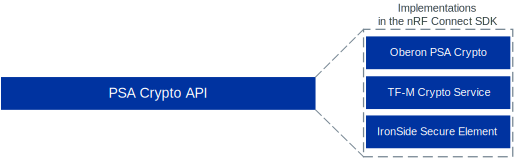

.. _ug_crypto_architecture:

Cryptographic architecture overview
###################################

.. contents::
   :local:
   :depth: 2

The cryptographic subsystem in the |NCS| is based on the `PSA Certified Crypto API`_ standard (PSA Crypto API), which is one of the `PSA Certified APIs <Embedded and IoT Security Specifications and Implementations_>`_.
The PSA Crypto API is a cryptographic standard that offers a unified interface for cryptographic operations across different hardware platforms.

PSA Crypto API architecture
***************************

The following figure shows the general architecture of PSA Crypto:

   PSA Crypto standard architecture

In this figure:

* Application calls the PSA Crypto implementation through the PSA Crypto API.
* The PSA Crypto API implementation is an abstraction layer that manages cryptographic operations, key handling, and driver coordination.
  The implementations can be different, but they should all conform to the PSA Crypto API standard.
* Cryptographic driver is a specialized component that implements specific cryptographic algorithms or provides access to hardware accelerators.
* Storage integration provides persistent and secure storage capabilities through standardized PSA Secure Storage APIs.
  It implements storage interfaces that allow the PSA Crypto implementation to securely store and retrieve keys, ensuring proper protection of sensitive material throughout its lifecycle.
* Hardware platform is the physical device with security features, such as cryptographic hardware engines or secure storage.

.. _ug_crypto_architecture_interaction_flow:

Component interaction flow
==========================

When an application makes a call to the PSA Crypto API, the following interaction flow occurs between the architecture components:

1. The application or protocol stack initiates a cryptographic operation by calling a function in the PSA Crypto API, such as ``psa_cipher_encrypt()`` or ``psa_sign_message()``.
2. The PSA Crypto implementation receives the request and performs initial parameter validation to ensure the request is properly formatted and contains valid parameters.
3. Based on the specific operation requested, the implementation selects the most appropriate crypto driver.
   Hardware drivers are typically prioritized when available, with software drivers serving as fallbacks.
4. If the operation involves cryptographic keys, the implementation coordinates with the storage integration to securely retrieve the necessary key material.
   Keys are handled using `Key Identifiers`_ to maintain security and prevent direct exposure of key material to the application.
5. The implementation delegates the actual cryptographic processing to the selected crypto driver.
   The driver performs the requested operation using either hardware acceleration or software algorithms.
6. The driver returns the operation result to the PSA Crypto implementation, which performs any necessary post-processing and validation.
7. The implementation returns the final result to the application through the PSA Crypto API, completing the cryptographic operation.

.. _ug_crypto_architecture_implementation_standards:

Implementations in the |NCS|
****************************

The |NCS| follows the PSA Crypto standard through two major API implementations: Oberon PSA Crypto and TF-M Crypto Service.
They are designed for use without and with Trusted Firmware-M (TF-M), respectively, and have different security requirements.
Additionally, the |NCS| includes the nRF54H20-specific IronSide Secure Element implementation.

All implementations are based on the `sdk-oberon-psa-crypto`_ library, which offers a lightweight PSA Crypto API implementation optimized for resource-constrained microcontrollers.

   PSA Crypto API implementations in the |NCS|

.. note::
   Depending on the implementation you are using, the |NCS| build system uses different versions of the PSA Crypto API.

   .. ncs-include:: ../psa_certified_api_overview.rst
      :start-after: psa_crypto_support_tfm_build_start
      :end-before: psa_crypto_support_tfm_build_end

.. _ug_crypto_architecture_implementation_standards_oberon:

Oberon PSA Crypto implementation
================================

The Oberon PSA Crypto implementation provides a direct PSA Crypto API interface for applications that do not require Trusted Firmware-M (TF-M).
The Oberon PSA Crypto is a library that serves as the central component managing cryptographic operations and driver selection.

   Oberon PSA Crypto implementation

The Oberon PSA Crypto acts as the implementation provider, directly exposing the PSA Crypto API to applications.
Each driver can implement support for different subsets of cryptographic algorithms, providing software support for algorithms that hardware cannot support.

This implementation standard is suitable for applications that prioritize simplicity and do not require the additional security isolation provided by TF-M.
It offers direct access to cryptographic functionality with minimal overhead, making it ideal for resource-constrained applications.

Driver selection in the Oberon PSA Crypto implementation
--------------------------------------------------------

The following figure shows the driver library selection through the driver wrapper, one of the internal modules of Oberon PSA Crypto:

.. figure:: ../images/psa_certified_api_lib_selection.svg
   :alt: Oberon PSA Crypto driver library selection
   :align: center

   Oberon PSA Crypto driver library selection

For more information about the driver selection, see :ref:`crypto_drivers`.

Storage integration for the Oberon PSA Crypto implementation
------------------------------------------------------------

When using the Oberon PSA Crypto implementation, persistent keys from the PSA Crypto API can be stored in the |NCS| using one of the following storage mechanisms:

* Zephyr's :ref:`Secure storage <zephyr:secure_storage>` subsystem - Zephyr-specific implementation of the functions defined in the `PSA Certified Secure Storage API`_.
* |NCS|'s :ref:`trusted_storage_readme` library - which provides features like integrity, confidentiality, and authenticity of the stored data without using the TF-M Platform Root of Trust (PRoT).

For more information, see :ref:`secure_storage_in_ncs`.

.. _ug_crypto_architecture_implementation_standards_tfm:

TF-M Crypto Service implementation
==================================

The TF-M Crypto Service implementation provides PSA Crypto API access through Trusted Firmware-M for applications that require enhanced security through hardware-enforced separation.

   TF-M Crypto Service implementation

In this architecture, TF-M implements the secure cryptographic service using the existing Oberon PSA Core and its associated drivers within the secure environment.
Additionally, TF-M integrates key storage using its internal mechanisms, offering secure key management through :ref:`Internal Trusted Storage <ug_tfm_services_its>` and :ref:`Protected Storage <tfm_partition_ps>`.

This implementation leverages TF-M's Secure Processing Environment (SPE) to isolate cryptographic operations from the Non-Secure Processing Environment (NSPE).
TF-M is built on top of TrustZone technology and isolates the PSA Crypto API as non-secure callable calls into a secure processing environment.
Cryptographic keys are stored and isolated in the SPE, ensuring they are not accessible by the application running in the NSPE.
The cryptographic drivers (nrf_cc3xx, nrf_oberon, and CRACEN) are available within the secure environment, providing consistent cryptographic capabilities.

   TF-M Crypto Service implementation in the NSPE and SPE

This implementation standard is mandatory for applications requiring higher `PSA Certified security levels <PSA Certified IoT Security Framework_>`_ and provides the highest level of security through hardware-enforced isolation.
It ensures that cryptographic operations and key material remain protected even if the non-secure application is compromised.

Driver selection in the TF-M Crypto Service implementation
----------------------------------------------------------

The TF-M Crypto Service implementation uses the same driver selection mechanism as the Oberon PSA Crypto implementation.
For more information about the driver selection, see :ref:`crypto_drivers`.

Storage integration for the TF-M Crypto Service implementation
--------------------------------------------------------------

When using the TF-M Crypto Service implementation, keys from the PSA Crypto API are stored in the |NCS| using both of the following storage mechanisms:

* Internal Trusted Storage (ITS) - One of :ref:`ug_tfm_architecture_rot_services_platform` that provides secure storage within the Trusted Firmware-M environment.
  ITS is the only storage for persistent keys in the TF-M Crypto Service implementation.
* Protected Storage (PS) - One of :ref:`ug_tfm_architecture_rot_services_application` that provides secure storage within the Trusted Firmware-M environment.

For more information about the storage integration for the TF-M Crypto Service implementation, see :ref:`ug_psa_certified_api_overview_secstorage` and :ref:`ug_tfm_services`.

.. _ug_crypto_architecture_implementation_standards_ironside:

IronSide Secure Element implementation
======================================

The IronSide Secure Element (|ISE|) implementation provides a PSA Crypto API interface for applications running on nRF54H20.

   IronSide SE implementation

This implementation provides |ISE| firmware for the :ref:`CRACEN hardware peripheral in the Secure Domain <ug_nrf54h20_secure_domain_cracen>`.
It is designed to provide a robust Root of Trust (RoT) and offload cryptographic operations, key handling, and secure storage.
The firmware implements the cryptographic operations using the existing Oberon PSA Core and the CRACEN driver.

The firmware is provided by Nordic Semiconductor independently from the |NCS| release cycle.
For more information, see the :ref:`IronSide Secure Element <ug_nrf54h20_ironside>` page.

Driver selection in the |ISE| implementation
--------------------------------------------

The |ISE| implementation works only with the :ref:`CRACEN driver <crypto_drivers_cracen>`.
The driver is used indirectly for cryptographic operations, which means that:

* The |ISE| does not follow the :ref:`crypto_drivers_feature_selection` mechanism.
  It instead implements a fixed set of features and algorithms whose configurations cannot be changed by the user.

* The |ISE| does not support the :ref:`software fallback <crypto_drivers_software_fallback>` mechanism to :ref:`nrf_oberon <crypto_drivers_oberon>`.

See :ref:`ug_crypto_supported_features` for the list of supported Oberon PSA Crypto directives in the |ISE|.
