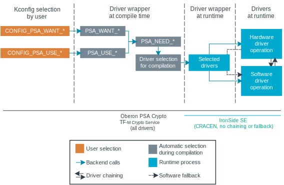

.. _crypto_drivers:
.. _nrf_security_drivers:

Cryptographic drivers
#####################

.. contents::
   :local:
   :depth: 2

The cryptographic drivers provide hardware-accelerated and software-based implementations of cryptographic operations for the |NCS| applications.
The drivers are compatible with the :ref:`Oberon PSA Crypto <ug_crypto_architecture_implementation_standards_oberon>` implementation of the `PSA Certified Crypto API`_ standard.

Driver architecture within Oberon PSA Crypto
********************************************

In the |NCS|, you manage and select the cryptographic drivers using the :ref:`nrf_security` library.
nRF Security provides a unified interface for the :ref:`Oberon PSA Crypto <ug_crypto_architecture_implementation_standards_oberon>` implementation.
It implements the driver wrapper role and determines which driver to use for each cryptographic operation.

In addition to the driver wrapper, the Oberon PSA Crypto implementation also includes the Oberon PSA Core module.
This central component implements the PSA Certified Crypto API and exposes it to applications.
The core module performs parameter validation, handles key management, and forwards calls to the driver wrapper.

The following figure shows the Oberon PSA Crypto implementation with the cryptographic drivers:

   Oberon PSA Crypto with cryptographic drivers

.. psa_crypto_driver_table_start

The cryptographic drivers are organized into hardware and software drivers.
Hardware drivers take precedence over software drivers, which provide fallback options in case the hardware drivers are not available for a wanted cryptographic operation for a given hardware platform.

.. note::
   Do not use the drivers directly.
   Use them only through the :ref:`supported PSA Crypto API implementations <ug_crypto_architecture_implementation_standards>` and nRF Security.
   For configuration steps, see :ref:`psa_crypto_support`.

.. list-table:: PSA Crypto drivers in the |NCS|
   :widths: auto
   :header-rows: 1

   * - Driver
     - Driver type
     - Distribution
     - Supported hardware platforms
     - Description
   * - :ref:`nrf_cc3xx (CC310 and CC312)<crypto_drivers_cc3xx>`
     - Hardware
     - Closed-source binary
     - nRF52840, nRF5340, nRF91 Series devices
     - Drivers for the `CryptoCell 310 <nRF9160 CRYPTOCELL - Arm TrustZone CryptoCell 310_>`_ and `CryptoCell 312 <nRF5340 CRYPTOCELL - Arm TrustZone CryptoCell 312_>`_ hardware accelerators.
   * - :ref:`CRACEN <crypto_drivers_cracen>`
     - Hardware
     - Open-source
     - nRF54L Series devices, nRF54H20
     - | Security subsystem providing hardware acceleration for cryptographic operations through the CRACEN hardware peripheral. For more information, see the :ref:`ug_nrf54l_cryptography`.
       | On nRF54H20, the driver is used indirectly through the :ref:`ug_nrf54h20_ironside`.
   * - :ref:`nrf_oberon <crypto_drivers_oberon>`
     - Software
     - Closed-source binary
     - nRF devices with Arm Cortex®-M0, -M4, or -M33 processors
     - Optimized software library for cryptographic algorithms created by Oberon Microsystems, based on the `sdk-oberon-psa-crypto`_ library.

.. psa_crypto_driver_table_end

.. _crypto_drivers_driver_selection:

Driver selection
****************

The following figure shows a simplified overview of the driver library selection using the driver wrapper:

   Oberon PSA Crypto driver library selection

As shown in this simplified figure, the API calls can go in both directions between the driver wrapper and the drivers.
This represents the following situations:

* `Feature selection`_ - Based on hardware capabilities and cryptographic features you have configured, the driver wrapper selects the most appropriate driver for each cryptographic operation.
* `Software fallback`_ - The Oberon PSA Crypto implementation in the |NCS| provides a transparent fallback mechanism that allows applications to use the software nrf_oberon driver when the hardware acceleration is not available.
* `Driver chaining`_ - Higher-level drivers (like HMAC) can delegate operations to lower-level drivers (like hash functions).
  For example, when an HMAC operation is requested, the HMAC driver might call back to the driver wrapper to use a hardware-accelerated hash function.

These situations are explained in more detail in the following sections.

.. _crypto_drivers_example_flow:

Example of driver selection flow
================================

The following figure demonstrates the driver selection process in more detail:

   Detailed process for Oberon PSA Crypto driver library selection

The figure specifically mentions the CC310 hardware peripheral next to the nrf_cc3xx driver and three random features:

* Feature A - Supported by the nrf_cc3xx driver through the CC310 hardware peripheral and the nrf_oberon driver, but not supported by the CRACEN driver.
  Feature A is enabled in both hardware and software drivers.
* Feature B - Supported only by the nrf_oberon driver.
* Feature C - Supported by the CRACEN driver and the nrf_oberon driver, but not supported by the nrf_cc3xx driver.
  Feature C is disabled for the CRACEN driver in the application configuration.

For the purpose of this example, it is assumed that the application and the target platform are compatible with both the nrf_cc3xx and the CRACEN drivers.
This is different from the real-world scenarios, where the CRACEN driver is only available on the nRF54L Series devices.

When an application initiates a cryptographic operation through the PSA Crypto API, the following steps take place:

1. The Oberon PSA Crypto implementation receives the request and validates the parameters in the Oberon PSA Core module.
#. The Oberon PSA Core module forwards the request to the driver wrapper.
#. The driver wrapper determines which driver to use based on the following criteria:

   * The specific cryptographic operation requested
   * Available hardware capabilities on the platform
   * Configuration priorities

#. The driver wrapper selects the appropriate driver and forwards the request to the driver.
   Using the example of the three features:

   * Feature A - The driver wrapper follows the default configuration process and selects the nrf_cc3xx driver (assuming that the platform supports it.)
     The software nrf_oberon driver could also be chosen, but the nrf_cc3xx driver is given priority because it is hardware-accelerated.
   * Feature B - The driver wrapper selects the software nrf_oberon driver.
     This is because neither the nrf_cc3xx driver nor the CRACEN driver support Feature B.
   * Feature C - The driver wrapper selects the software nrf_oberon driver, following the configuration priority set by the application.
     The CRACEN driver supports this feature, but the user has disabled the hardware driver support for Feature C in the application configuration.

.. _crypto_drivers_feature_selection:

Feature selection
=================

The Oberon PSA Crypto implementation provides a mechanism for configuring each cryptographic operation.
This mechanism uses the ``PSA_WANT_*`` directives for specifying the cryptographic features and ``PSA_USE_*`` directives for selecting the driver for each cryptographic operation.
The driver wrapper then selects the most appropriate driver for each cryptographic operation.

Feature selection in the |NCS|
------------------------------

In Zephyr and the |NCS|, Oberon's ``PSA_WANT_*`` and ``PSA_USE_*`` directives are integrated into the :ref:`Kconfig configuration system <app_build_system>`.
As a result, Oberon's directives are wrapped by Kconfig options ``CONFIG_PSA_WANT_*`` and ``CONFIG_PSA_USE_*``, respectively.
Some of these Kconfig options are defined in Zephyr, while others are defined in the |NCS| in the :ref:`nrf_security` subsystem.
You only need to set the Kconfig options, not the directives.

The following table provides a brief overview of the available directives and their corresponding Kconfig options that you can set:

.. list-table:: Driver configuration directives
   :header-rows: 1

   * - Oberon directive pattern
     - Description
     - Kconfig option pattern
     - Examples of Oberon directives
     - Examples of corresponding Kconfig options
   * - ``PSA_WANT_*``
     - Specify the cryptographic features needed by the application (algorithms, key types, and key sizes).
     - `CONFIG_PSA_WANT_*`_
     - | ``PSA_WANT_KEY_TYPE_AES``
       | ``PSA_WANT_ALG_SHA_256``
     - | :kconfig:option:`CONFIG_PSA_WANT_KEY_TYPE_AES`
       | :kconfig:option:`CONFIG_PSA_WANT_ALG_SHA_256`
   * - ``PSA_USE_*``
     - Select the driver you prefer to use for the cryptographic operation (when available).
     - `CONFIG_PSA_USE_*`_
     - | ``PSA_USE_CC310_KEY_MANAGEMENT_DRIVER``
       | ``PSA_USE_CC310_HASH_DRIVER``
     - | :kconfig:option:`CONFIG_PSA_USE_CC3XX_KEY_MANAGEMENT_DRIVER`
       | :kconfig:option:`CONFIG_PSA_USE_CC3XX_HASH_DRIVER`

.. note::
   - For the complete overview of the available configuration options, see the :ref:`ug_crypto_supported_features` page.
   - On the nRF54H20 SoC, the |ISE| implements a fixed set of features and algorithms that cannot be changed by the user.
     The ``PSA_WANT_*`` and ``PSA_USE_*`` directives are directly implemented within |ISE|.
     Enabling any feature with the corresponding Kconfig options will have no effect.

When you select Kconfig options for the wanted features and drivers, nRF Security checks the Oberon directives to compile the optimal driver selection into the build.
As part of this check, nRF Security uses ``PSA_NEED_*`` macros to combine the settings in Kconfig that represent application requirements (``PSA_WANT_*``) and driver preferences from the user (``PSA_USE_*``).
Because the ``PSA_WANT_*`` directives can be supported by multiple drivers, the ``PSA_USE_*`` directives are useful to narrow down the driver selection.
The ``PSA_NEED_*`` macros are automatically selected.
They control which drivers are compiled and thus available for use at runtime for `Software fallback`_ and `Driver chaining`_.

The following figure shows an overview of this process:

.. _crypto_drivers_software_fallback:

Software fallback
=================

The Oberon PSA Crypto implementation in the |NCS| provides a transparent fallback mechanism that allows applications to use the software nrf_oberon driver when the hardware acceleration is not available.
If a hardware driver does not support a particular operation or key size, the driver wrapper will redirect the call to a software implementation.

The software fallback can happen at runtime and works as follows:

* No software fallback required - If hardware acceleration is enabled and available for the requested features, nRF Security selects the preferred driver for performance and security reasons.
* Software fallback required - If no hardware driver is enabled and available, or if the hardware or the preferred driver do not support the specific cryptographic operation, nRF Security falls back to the software nrf_oberon driver.

The software fallback mechanism to the nrf_oberon driver is enabled by default in the |NCS| for the implementations that support it.
You can :ref:`manually disable the software fallback mechanism <psa_crypto_support_disable_software_fallback>`.
For example, you can do that if you want the cryptographic operations to run in hardware only.

Examples of feature selection and software fallback
===================================================

Click the following expand button to see examples of how nRF Security selects the drivers based on the Kconfig options.

.. toggle::

   * You can configure the application to use CC310 and require the AES-192 key size through the :kconfig:option:`CONFIG_PSA_WANT_AES_KEY_SIZE_192` and :kconfig:option:`CONFIG_PSA_USE_CC3XX_KEY_MANAGEMENT_DRIVER` Kconfig options.
     nRF Security selects the nrf_cc3xx driver if it supports the CCM-AES-192 acceleration with the AES-192 key size.
     The CC310 peripheral does not support AES keys larger than 128 bits, so nRF Security selects the nrf_oberon driver instead, thus automatically setting the ``PSA_NEED_OBERON_KEY_MANAGEMENT_DRIVER`` macro.
     (This is the case of the :ref:`Feature A in the example flow <crypto_drivers_example_flow>`.)
   * You can configure the application to require the SHA-512 hashing functionality through the :kconfig:option:`CONFIG_PSA_WANT_ALG_SHA_512` and :kconfig:option:`CONFIG_PSA_USE_CC3XX_HASH_DRIVER` Kconfig options.
     nRF Security selects the nrf_cc3xx driver if it is available for the hardware platform and if it supports the SHA-512 hashing functionality.
     The CryptoCell-enabled hardware acceleration does not support the SHA-512 hashing functionality, so nRF Security falls back to the nrf_oberon software implementation, thus automatically setting the ``PSA_NEED_OBERON_HASH_DRIVER`` macro.
     (This is the case of the :ref:`Feature B in the example flow <crypto_drivers_example_flow>`.)
   * You can configure the application to require the SHA-256 hashing functionality through the :kconfig:option:`CONFIG_PSA_WANT_ALG_SHA_256` Kconfig option, but set the :kconfig:option:`CONFIG_PSA_USE_CRACEN_HASH_DRIVER` Kconfig option to ``n`` so that the CRACEN driver is not used.
     In this case, the conditions for automatically setting the ``PSA_NEED_CRACEN_HASH_DRIVER`` macro are not met.
     nRF Security selects the nrf_oberon software implementation, thus automatically setting the ``PSA_NEED_OBERON_HASH_DRIVER`` macro.
     (This is the case of the :ref:`Feature C in the example flow <crypto_drivers_example_flow>`.)

Driver chaining
===============

Driver chaining is a feature that allows using multiple cryptographic drivers to delegate functionality between them.
This mechanism enables optimal use of hardware acceleration by combining software and hardware cryptographic drivers.
This allows for complex cryptographic operations that may be only partially supported in hardware.

In driver chaining, a driver that implements more complex algorithms (like HMAC) can delegate less complex algorithms (like SHA-256) to another driver.
This delegation happens between the drivers through the driver wrapper, transparently to the application, and at runtime.
The delegation process follows the same priority rules as the driver selection, preferring hardware implementations when available.

Driver chaining optimizes the mix of software and hardware implementations to achieve the best performance.
At the same time, it ensures all cryptographic operations are supported across different platforms.

Driver chaining in the |NCS|
----------------------------

Driver chaining is handled in the |NCS| at runtime when you :ref:`enable multiple drivers at the same time <psa_crypto_support_multiple_drivers>` and then enable specific :ref:`nrf_oberon driver features in combination with driver features for hardware acceleration <nrf_security_drivers_config_features>`.
The IronSide Secure Element implementation does not support driver chaining.

Common driver chains supported in the nrf_oberon driver include the following cases:

* PAKE → Key Derivation
* Signature → Hash
* Deterministic signature → MAC
* RSA → Hash
* DRBG → AES, MAC, Entropy
* Key Derivation → MAC
* MAC → Hash, AES

The set of drivers available for chaining is determined by the ``PSA_NEED_*`` macros automatically set by nRF Security, as described in :ref:`crypto_drivers_feature_selection`.
Only drivers whose ``PSA_NEED_*`` macros are enabled by nRF Security at compile time can participate in driver chaining.

For example, by enabling the nrf_cc3xx driver and the nrf_oberon driver, you can chain the MAC driver and the hash driver.
The drivers handle this requirement as follows:

1. The MAC driver feature calls back to the PSA crypto driver wrapper APIs to execute the hash calculation.
   This allows nrf_oberon to access hardware-accelerated hash algorithms as long as they are supported and enabled.
#. If a specific hash algorithm is not supported, the enabled hardware-accelerated driver returns ``PSA_ERROR_NOT_SUPPORTED``.
#. The nrf_oberon driver handles the request to calculate hash algorithms unsupported in hardware.

.. _crypto_drivers_overview:

Driver overview
***************

The following sections provide more details about the available cryptographic drivers.

None of these drivers should be used directly.
Use them only through nRF Security or through the dedicated firmware (CRACEN within IronSide Secure Element).

.. _crypto_drivers_cc3xx:
.. _nrf_security_drivers_cc3xx:

nrf_cc3xx driver
================

.. list-table:: nrf_cc3xx driver
   :widths: auto
   :header-rows: 1

   * - Driver
     - Driver libraries
     - Driver type
     - Distribution
     - Supported hardware platforms
   * - nrf_cc3xx
     - :ref:`nrf_cc3xx_platform <nrfxlib:nrf_cc3xx_platform_readme>` and :ref:`nrf_cc3xx_mbedcrypto <nrfxlib:nrf_cc3xx_mbedcrypto_readme>`
     - Hardware
     - Closed-source binaries
     - nRF52840, nRF5340, nRF91 Series devices

The nrf_cc3xx driver includes the ``nrf_cc3xx_platform`` and ``nrf_cc3xx_mbedcrypto`` drivers.
These drivers provide low-level functionalities for hardware-accelerated cryptography using `CryptoCell 310 <nRF9160 CRYPTOCELL - Arm TrustZone CryptoCell 310_>`_ (CC310) and `CryptoCell 312 <nRF5340 CRYPTOCELL - Arm TrustZone CryptoCell 312_>`_ (CC312) hardware peripherals.

* The :ref:`nrf_cc3xx_platform_readme` provides low-level functionality needed by the nrf_cc3xx mbedcrypto library.
* The :ref:`nrf_cc3xx_mbedcrypto_readme` provides low-level integration with the Mbed TLS version provided in the |NCS|.
  It also includes legacy crypto API functions from the Mbed TLS crypto toolbox (prefixed with ``mbedtls_``).

The nrf_cc3xx driver provides support for the following algorithms:

* AES ciphers
* AEAD (CCM on all, GCM only on CC312)
* Chacha20/Poly1306
* SHA-1
* SHA-256
* ECDSA
* ECDH
* Ed25519
* CMAC
* RSA (up to certain key sizes, different on CC310 and CC312)

nrf_cc3xx driver configuration
------------------------------

For configuration details, see the following pages:

* :ref:`psa_crypto_support` (both drivers)
* :ref:`nrf_security_legacy_backend_config` (:ref:`nrf_cc3xx_mbedcrypto_readme` used as legacy backend)

.. note::
      The :ref:`nrfxlib:crypto` in nrfxlib also include the :ref:`nrf_cc310_bl_readme`.
      This library is not used by the nRF Security subsystem.

.. _crypto_drivers_cracen:
.. _nrf_security_drivers_cracen:

CRACEN driver
=============

.. list-table:: CRACEN driver
   :widths: auto
   :header-rows: 1

   * - Driver
     - Driver type
     - Distribution
     - Supported hardware platforms
   * - :ref:`CRACEN <ug_nrf54l_cryptography>`
     - Hardware
     - Open-source
     - nRF54L Series devices, nRF54H20

The CRACEN driver provides entropy and hardware-accelerated cryptography using the Crypto Accelerator Engine (CRACEN) hardware peripheral.
The driver implements the PSA Crypto driver API (``cracen_aead_set_nonce``) and then relies on :ref:`Oberon PSA Crypto <ug_crypto_architecture_implementation_standards>` to implement the PSA API (``psa_aead_set_set_nonce``).

The hardware peripheral is available on the following devices:

* nRF54L Series devices - See :ref:`ug_crypto_supported_features` for supported features and limitations for each device.
  For more information, see the :ref:`ug_nrf54l_cryptography` page.
  For more information about the hardware peripheral, see the CRACEN hardware peripheral page in the device datasheets (for example, `nRF54L15 datasheet <nRF54L15 CRACEN_>`_).

* nRF54H20 - On this platform, the IronSide Secure Element relies on the CRACEN driver and implements a fixed set of features and algorithms that cannot be changed by the user.
  See :ref:`ug_crypto_supported_features` for the list of provided PSA Crypto directives.
  For more information, see the :ref:`ug_nrf54h20_secure_domain_cracen` and the :ref:`ug_nrf54h20_ironside` pages.

CRACEN driver configuration
---------------------------

Depending on the hardware platform:

* For nRF54L Series devices, see :ref:`psa_crypto_support`.
* For the nRF54H20 SoC, you cannot configure the CRACEN driver.
  You must use the CRACEN driver as provided in the IronSide SE firmware bundle.
  See :ref:`ug_nrf54h20_SoC_binaries` for more information.

.. _crypto_drivers_oberon:
.. _nrf_security_drivers_oberon:

nrf_oberon driver
=================

.. list-table:: nrf_oberon driver
   :widths: auto
   :header-rows: 1

   * - Driver
     - Driver type
     - Distribution
     - Supported hardware platforms
   * - :ref:`nrf_oberon <nrfxlib:nrf_oberon_readme>`
     - Software
     - Closed-source binary
     - nRF devices with Arm Cortex®-M0, -M4, or -M33 processors

The :ref:`nrf_oberon_readme` is a software driver provided through `sdk-oberon-psa-crypto`_, a lightweight PSA Crypto API implementation optimized for resource-constrained microcontrollers.
The driver is distributed as a closed-source binary that provides select cryptographic algorithms optimized for use in nRF devices.
This provides faster execution than the original Mbed TLS implementation.

The nrf_oberon driver can act as a `Software fallback`_ for the other drivers.
This feature can be turned on by :ref:`enabling nrf_oberon <psa_crypto_support_enable_nrf_oberon>` or by :ref:`enabling cryptographic operations <ug_crypto_supported_features_operations>` that are not supported by the hardware drivers.

.. note::
   |original_mbedtls_def_note|

The nrf_oberon driver provides support for the following algorithms:

* AES (ECB, CTR, CBC)
* AES CCM
* AES GCM
* Chacha20/Poly1305
* SHA-1
* SHA-2 (SHA-224, SHA-256, SHA-384, SHA-512)
* SHA-3 (SHA3-224, SHA3-256, SHA3-384, SHA3-512)
* SHAKE
* ECDSA (secp224r1, secp256r1, secp384r1, secp521r1)
* ECDH (secp224r1, secp256r1, secp384r1, secp521r1)
* Ed25519/Ed25519ph
* Ed448/Ed448ph
* x25519/x448
* SPAKE2+ (secp256r1)
* ECJPAKE (secp256r1)
* HKDF
* CMAC/HMAC
* RSA (PKCS#1 v1.5 and v2.1) sign and encrypt
* CTR_DRBG/HMAC_DRBG

The nrf_oberon driver also provides Mbed TLS legacy crypto integration for selected features.

nrf_oberon driver configuration
-------------------------------

For configuration details, see the following pages:

* :ref:`psa_crypto_support`
* :ref:`nrf_security_legacy_backend_config` (nrf_oberon used as legacy backend)

API documentation
*****************

| Header files: :file:`subsys/nrf_security/include/psa/crypto_driver_contexts_*.h`

.. doxygengroup:: nrf_security_api_structures
