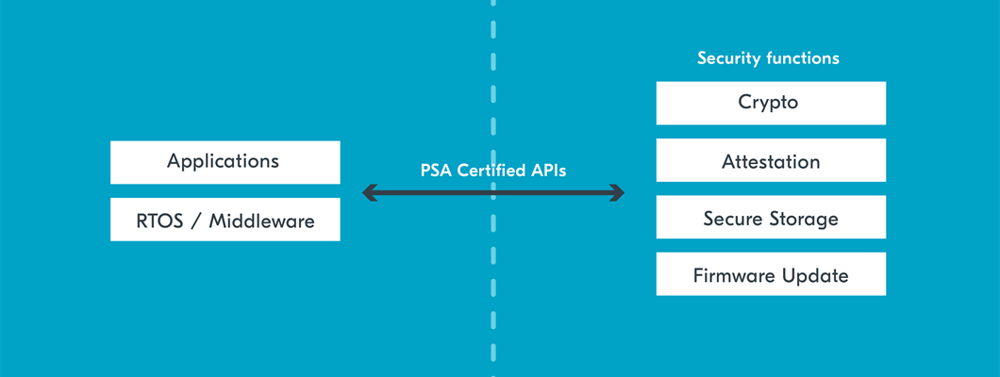

.. _ug_psa_certified_api_overview:

PSA Certified Security Framework overview
#########################################

.. contents::
   :local:
   :depth: 2

The `PSA Certified IoT Security Framework`_ offers a standardized approach to create secure IoT devices, covering everything from analysis to certification.
It also provides free `resources <PSA Certified development resources_>`_ and `training material <PSA Certified foundational training course_>`_ to educate developers about threat modeling, certification, and other security topics.

The framework divides security design into a simple four-step process to guide product developers into implementing the appropriate level of security in their IoT devices:

* Analyze the threats that have the potential to compromise your device and generate a set of security requirements based on these risks.
* Architect the right level of security for your product by using unique security requirements to identify and select components and specifications.
* Implement the trusted components and firmware, making use of high-level APIs to build-in security and create an interface to the hardware Root of Trust (RoT).
* Certify device, platform, or silicon by following independent security evaluation.

This page focuses on the implementation step (specifically the `PSA Certified APIs`_) that establishes the separation between security-critical firmware and application firmware.
To learn more about security by separation, Non-Secure Processing Environment (NSPE) and Secure Processing Environment (SPE), see the :ref:`ug_tfm_security_by_separation` page.

What are PSA Certified APIs
***************************

   PSA Crypto API usage

The `PSA Certified APIs`_ are a set of high-level standardized software interfaces that aim to enhance the security of IoT devices.
They are designed to support a range of different use cases and are organized around the following groups:

* `PSA Certified Crypto API`_
* `PSA Certified Attestation API`_
* `PSA Certified Secure Storage API`_
* `PSA Certified Firmware Update API`_

Using the PSA Certified APIs has the following benefits:

* Enhanced security - PSA Certified APIs enable devices to meet industry-standard security requirements and enhance the overall trustworthiness of IoT devices.
* Implementation agnostic - When using PSA Certified APIs, developers do not need to be concerned about the underlying hardware and software implementation.
* Reduce time-to-market - Using an API standard can accelerate development time and reduce costs associated with developing, testing, and certifying custom solutions.
* Flexible and scalable - The various use cases supported ensure that the PSA Certified APIs can be used across multiple devices, from very simple ones to more complex systems.
* Future-proof - PSA Certified APIs are designed to be updated over time as security threats evolve, ensuring that devices remain secure throughout their lifecycle.

.. _ug_psa_certified_api_overview_supported_apis:

Supported PSA Certified APIs
============================

The following table provides an overview of the PSA Certified APIs support status in the |NCS|:

.. list-table:: PSA Certified APIs support in the |NCS|
   :header-rows: 1
   :widths: auto

   * - PSA Certified API
     - Support status in the |NCS|
     - Latest version supported
   * - `PSA Certified Crypto API`_
     - Supported
     - | `PSA Certified Crypto API 1.3.1`_ for IronSide Secure Element firmware for nRF54H20
       | `PSA Certified Crypto API 1.3.1`_ for :ref:`nRF54L cryptography <ug_nrf54l_cryptography>` and PSA Crypto API builds without TF-M
       | `PSA Certified Crypto API 1.0.0`_ for builds with TF-M
   * - `PSA Certified Attestation API`_
     - Supported
     - `PSA Certified Attestation API 1.0`_
   * - `PSA Certified Secure Storage API`_
     - Supported
     - `PSA Certified Secure Storage API 1.0`_
   * - `PSA Certified Firmware Update API`_
     - Not supported
     - n/a

.. _ug_psa_certified_api_overview_crypto:

PSA Crypto API
**************

This section summarizes some of the features of the PSA Crypto API and how they can be specific to the implementation in the |NCS|.
For a full explanation, see the `PSA Certified Crypto API`_ official documentation.
For definitions of the PSA Crypto API functions, see `crypto.h`_.

Among the advantages of the PSA Crypto API are the following:

* The PSA Crypto API is a single API for all cryptographic drivers, which means that you can use the same functions for the nRF52840, nRF5340, nRF54H20, nRF54L Series and nRF91 Series devices, as well as future ones.
  The API will work for applications with and without Trusted Firmware-M (TF-M).

* The PSA Crypto API will automatically select cryptographic libraries based on project configurations.
  This way, the codebase for cryptography can easily be reused across multiple projects.

The PSA Crypto API is designed to be safe, lowering developers' possibility of introducing vulnerabilities into their end devices.
For example, following the `Keystore interface`_ design goal, the functions in the PSA Crypto API use opaque `Key identifiers`_ to handle keys, so developers do not have to handle keys manually.
See `Key management reference`_ in the PSA Crypto API documentation for a detailed overview.

.. _ug_psa_certified_api_overview_crypto_ncs:

PSA Crypto API in the |NCS|
===========================

The PSA Crypto API is used to request cryptographic operations in the |NCS|.
It is mandatory for use in the |NCS|.

Supported operations include the following:

* Hashing
* Encryption and decryption
* Authenticated encryption
* Signature generation and verification

The PSA Crypto API has the following implementations in the |NCS|:

* :ref:`Oberon PSA Crypto <ug_crypto_architecture_implementation_standards_oberon>` - which provides a direct PSA Crypto API interface for applications that do not require TF-M.
* :ref:`TF-M Crypto Service <ug_crypto_architecture_implementation_standards_tfm>`- which provides PSA Crypto API access through TF-M for applications that require enhanced security.
* :ref:`IronSide Secure Element <ug_crypto_architecture_implementation_standards_ironside>` - which provides PSA Crypto API interface for the :ref:`Secure Domain of nRF54H20 <ug_nrf54h20_secure_domain>`.

Depending on the implementation you are using, the |NCS| build system uses different versions of the PSA Crypto API.

.. psa_crypto_support_tfm_build_start

.. list-table:: PSA Crypto API versions by implementation
   :header-rows: 1
   :widths: auto

   * - Implementation
     - `PSA Crypto API version <PSA Certified Crypto API_>`_
   * - :ref:`Oberon PSA Crypto <ug_crypto_architecture_implementation_standards_oberon>`
     - `v1.3.1 <PSA Certified Crypto API 1.3.1_>`_
   * - :ref:`TF-M Crypto Service <ug_crypto_architecture_implementation_standards_tfm>`
     - `v1.0.0 <PSA Certified Crypto API 1.0.0_>`_
   * - :ref:`IronSide Secure Element <ug_crypto_architecture_implementation_standards_ironside>`
     - `v1.3.1 <PSA Certified Crypto API 1.3.1_>`_

.. psa_crypto_support_tfm_build_end

The implementations in the |NCS| can use different driver libraries, depending on hardware capabilities and user configuration.

.. ncs-include:: crypto/drivers.rst
   :start-after: psa_crypto_driver_table_start
   :end-before: psa_crypto_driver_table_end

For specific cryptographic operations, the PSA Crypto API uses :ref:`the driver configured <psa_crypto_support>` for the given operation.
See :ref:`ug_crypto_supported_features` for a list of supported functionalities for each driver and :ref:`crypto_samples` for usage examples.

.. _ug_psa_certified_api_overview_attestation:

PSA Attestation API
*******************

This section summarizes some of the features of the PSA Attestation API.
For a full explanation, see the `PSA Certified Attestation API`_ official documentation.
See PSA's `initial_attestation.h`_ file for versioning.

See also the official `Device Attestation and Entity Attestation Tokens Explained`_ blog post from PSA Certified, which gives an overview of attestation.
This blog post explains well when to use the PSA Attestation API:

    "Cloud service providers need to make informed judgements on end devices to ensure the data they are providing can be trusted.
    EAT has the capabilities to provide this source of trust, using a cryptographically signed piece of data containing claims that are generated in the device RoT.
    There are many ways it can be useful, but most importantly it can be read by the relying party.
    The relying party can verify the claims made by the device such as:

    * The unique identity of the device
    * Installed software on the device and its integrity status
    * Security assurance and certification status
    * Manufacturer of the device hardware

    Using this information, the relying party can make informed decisions such as whether the device is legitimate and should be onboarded, or what services should be enabled based on its security credentials."

PSA Attestation API in the |NCS|
================================

The Attestation API is mandatory for certification.

See the :ref:`TF-M PSA template <tfm_psa_template>` for reference implementation of the PSA Attestation API in the |NCS|.

.. _ug_psa_certified_api_overview_secstorage:

PSA Secure Storage API
**********************

This section summarizes some of the features of the PSA Secure Storage API and how they can be specific to Nordic Semiconductor hardware.
For a full explanation, see the `PSA Certified Secure Storage API`_ official documentation.
See PSA's `protected_storage.h`_ file for versioning.

The Secure Storage API consists of the following components:

* Internal Trusted Storage - The Internal Trusted Storage API is used internally by the SPE to store data persistently in secure flash.
  It is possible to expose the Internal Trusted Storage API to the NSPE, but it is not recommended.

* Protected Storage - The Protected Storage API is for storing data persistently in secure flash and provides integrity checks to the stored data.
  The Protected Storage API is one of :ref:`ug_tfm_architecture_rot_services_application` and is available in the Non-Secure Callable interface, making the Protected Storage API callable from either the SPE or the NSPE.
  Data in Protected Storage has ownership, so data stored from the SPE is only available to the SPE.

The following table provides an overview over features in Internal Trusted Storage and Protected Storage:

+-----------------------+----------------------------------+-------------------+
|                       |     Internal Trusted Storage     | Protected Storage |
+=======================+==================================+===================+
| Persistent Storage    | Yes                              | Yes               |
+-----------------------+----------------------------------+-------------------+
| Root of Trust (RoT)   | Platform RoT Service             | Application RoT   |
|                       |                                  | Service           |
+-----------------------+----------------------------------+-------------------+
| Available in the SPE  | Yes                              | Yes               |
+-----------------------+----------------------------------+-------------------+
| Available in the NSPE | No (by default - see note below) | Yes               |
+-----------------------+----------------------------------+-------------------+
| Encryption            | No (see note below)              | Yes               |
+-----------------------+----------------------------------+-------------------+
| Integrity Check       | No (see note below)              | Yes               |
+-----------------------+----------------------------------+-------------------+

.. note::

   * The PSA Crypto API is invoked by other APIs that are available from the NSPE.
     For example the PSA Protected Storage API or the PSA Crypto API ``import()`` and ``generate()``.

   * Internal Trusted Storage has experimental support for encryption with the :kconfig:option:`CONFIG_PSA_ITS_ENCRYPTED` Kconfig option set.

PSA Secure Storage API in Nordic hardware and the |NCS|
=======================================================

SoCs from Nordic Semiconductor that come with dedicated hardware components for security (such as `nRF9160's System Protection Unit <nRF9160 System Protection Unit_>`_ or `nRF54L Series' security components <nRF54L15 Security_>`_) have the functionality for `flash <nRF9160 flash access control_>`_ (nRF9160) or `feature <nRF54L15 feature access control_>`_ (nRF54L15) access control, making it possible to configure different features as secure.
Internal Trusted Storage and Protected Storage saves data to the sections of secure flash.
This way, the NSPE cannot directly access data saved by the Internal Trusted Storage API or the Protected Storage API.

Internal Trusted Storage is by default only available from the SPE.

.. note::

   For Nordic SoCs without TF-M's Platform Root of Trust (such as the nRF52832), the :ref:`trusted_storage_readme` library is used for the PSA Certified Secure Storage APIs.

The PSA Protected Storage API implementation is optional for use in the |NCS|.
It does not support storing data to external flash.
Instead, you can configure your application to encrypt data stored to the external flash, for example using the :ref:`ug_psa_certified_api_overview_crypto`.

.. _ug_psa_certified_api_overview_fw_update:

PSA Firmware Update API
***********************

The |NCS| does not implement the PSA Firmware Update API.

Instead, other options are available for the immutable bootloader and the upgradable bootloader.
See :ref:`app_bootloaders` for more information on available bootloaders.

The bootloaders supported in the |NCS| fulfill requirements by PSA Certified, and several of Nordic Semiconductor devices are already among `PSA Certified Nordic Products`_.
