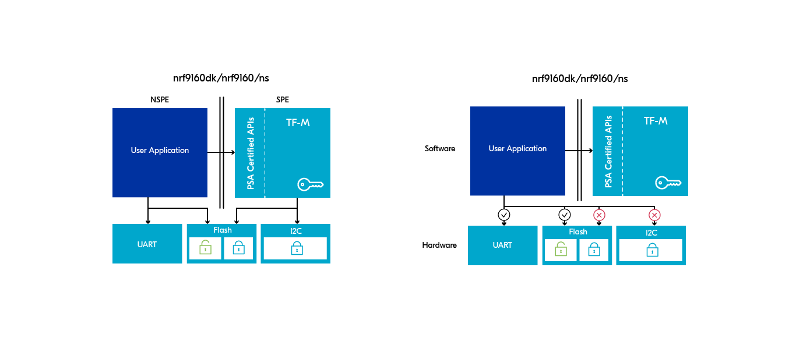
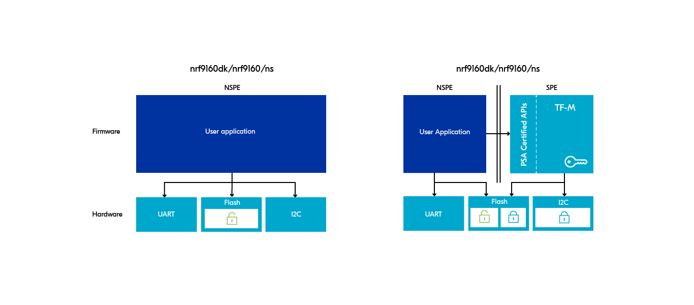

.. _ug_tfm_security_by_separation:

Security by separation and processing environments
##################################################

.. contents::
   :local:
   :depth: 2

The concept of security by separation is the foundation of the `Platform Security Architecture (PSA)`_.
In the :ref:`Trusted Firmware-M architecture <ug_tfm_architecture>`, separating security critical firmware from the application firmware introduces a layer of isolation, increasing the security level of the device.

As stated in the `Trusted Base System Architecture for M (TBSA-M) Specification`_ (section 3.1 Security by Separation): "All use cases rely on the protection of the sensitive assets, for example, private data, cryptographic keys, credentials, and firmware, from disclosure or modification.
This is best achieved by limiting the firmware and hardware that has access to them and separating these assets from the application firmware and hardware."

When developing using the |NCS|, security by separation is achieved by leveraging `ARM TrustZone`_ and the build of two images:

* The Non-Secure image is the main user application, using libraries within the |NCS| and running Zephyr RTOS.
* The Secure image is provided by Trusted Firmware-M.
  It leverages Cortex-M Security Extensions (CMSE) and provides security services to the user application.
  The TF-M build system is integrated with the |NCS|.

With security by separation in use, the two separated sides are often referred to as the following:

* Non-Secure Processing Environment (NSPE) and Secure Processing Environment (SPE)
* Non-Secure and Secure
* Non-Trusted and Trusted

Case study of secure and non-secure images
******************************************

The following case study illustrates the concept of security by separation in the context of a simple application running on an nRF5340 or an nRF9160 device.

Application with no security by separation
==========================================

This use case focuses on a basic application built in the |NCS| using I2C and UART peripherals, where the I2C peripheral is used to interface with a security-critical external device and the sensitive data (secrets) is to be stored in flash memory.

Without security by separation, the user application has access to the entire flash memory address space and all peripherals.

In this scenario, it is possible for bugs or faults introduced in the application firmware to expose access to the memory or peripherals that you want to protect (or to both of them).

   Application with no security by separation

Application with security by separation
=======================================

You can use Trusted Firmware-M to increase the security level of the application.

You can use the PSA Secure Storage API exposed by TF-M to store secrets in memory not accessible to the user application.
In addition, the I2C peripheral can be designated as secure to prevent access from the non-secure application and only expose a defined interface towards the user application.
For example, you can define this interface to allow the user application to perform a specific task (such as retrieving the value of a sensor, locking or unlocking a door, and so on) only under certain conditions that are decided by the code running within the associated partition in TF-M.

For an example of how hardware peripherals can be separated with secure/non-secure access restrictions, see the :ref:`tfm_secure_peripheral_partition` sample.

   Application with security by separation

.. _app_boards_spe_nspe:

Processing environments in the |NCS|
************************************

The :ref:`boards supported by the SDK <app_boards_names>` distinguish entries according which CPU is to be targeted (for multi-core SoCs) and whether the security by separation is to be used or not (addition of the ``*/ns`` :ref:`variant <app_boards_names>` if it is used).

Whenever the ``*/ns`` variant is used, Cortex-M Security Extensions (CMSE) are used and the firmware is split in accordance with the security by separation architecture principle to better protect sensitive assets and code.
The firmware is thus stored in one of two security environments (flash partitions), either Secure Processing Environment (SPE) or Non-Secure Processing Environment (NSPE).
This isolation of firmware is only possible if the underlying hardware supports `ARM TrustZone`_.

   Processing environments in the |NCS|

In Zephyr and the |NCS|, SPE and NSPE are used exclusively in the context of the application core of a multi-core SoC.

Building follows the security by separation principle and depends on the board target.
To take advantage of TF-M and the security it provides, you need to build the user application for the ``*/ns`` board target variant.

.. _app_boards_spe_nspe_cpuapp:

Building for ``cpuapp`` (CMSE disabled)
=======================================

When you build for a board target that uses the ``cpuapp`` :ref:`CPU cluster <app_boards_names>`, but does not use the ``*/ns`` :ref:`variant <app_boards_names>`, you build the firmware for the application core without CMSE.
Because CMSE is disabled, everything in your application is inherently trusted, TF-M is not used and there is no separation of firmware.

.. _app_boards_spe_nspe_cpuapp_ns:

Building for ``*/ns`` (CMSE enabled)
====================================

When you build for a board target that uses the ``*/ns`` :ref:`variant <app_boards_names>`, you build firmware with CMSE.
Your application firmware is built for the Non-Secure Processing Environment and TF-M firmware is automatically included in the build.
The non-trusted application firmware and the trusted TF-M firmware will both be included in the finished hex file, and you have security by separation.

Firmware is separated in the following way:

* SPE implements security-critical functionality and data (including bootloaders) and isolates them from the application software in NSPE.
  It also contains secure firmware running in the secure state.
* NSPE typically implements the user application and communication firmware, among other major components.

The application is built as a non-secure image and TF-M is built as the secure image.
The build system merges both images to form a combined image that will be used for programming or updating the device.

.. note::
   A common misunderstanding comes from the naming of the builds: because "ns" is short for "non-secure", it is easy to think that building for ``nrfd9160dk/nrf9160/ns`` is less secure.
   But it is indeed the other way around!

TF-M enables hardware-supported separation of firmware.
It also implements the `Platform Security Architecture (PSA)`_ API that provides security features for the system, including roots of trust for protecting secrets, platform state, and cryptographic keys.
The API coordinates the communication with the components in NSPE.

More information about SPE and NSPE
===================================

Read the following pages for a better understanding of security by separation in the |NCS|:

* :ref:`debugging_spe_nspe`
* `TF-M documentation`_
