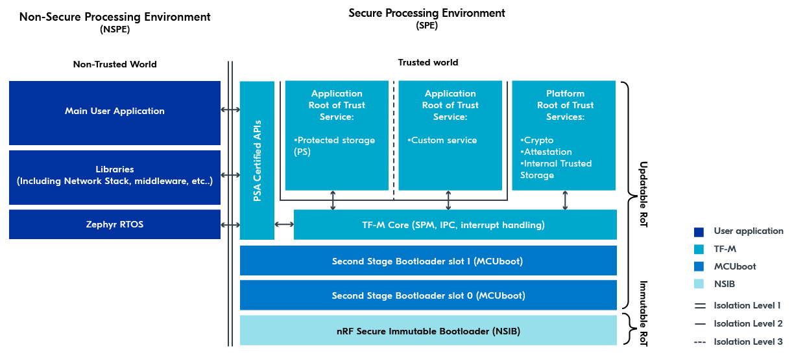

.. _ug_tfm_architecture:
.. _ug_tfm_concepts:

Trusted Firmware-M architecture
###############################

.. contents::
   :local:
   :depth: 2

The following figure gives an overview of functionality and principles in Trusted Firmware-M (TF-M) and the entire firmware architecture in applications implementing TF-M in the |NCS|.

   TF-M architecture overview

The sections that follow describe in brief different concepts mentioned on this figure, mostly related to the Secure Processing Environment (SPE).

For general information about this and other security architectures from Arm, see the `Platform Security Architectures`_ page.

.. _ug_tfm_architecture_spe_nspe:

Secure and Non-Secure Processing environments
*********************************************

The key TF-M concept is the :ref:`security by separation <ug_tfm_security_by_separation>` into the Secure Processing Environment (SPE, Trusted world) and Non-Secure Processing Environments (NSPE, Non-Trusted world).

* The Main User Application, Libraries (Including Network Stack, middleware, and so on), and the Zephyr RTOS seen under the Non-Secure Processing Environment (NSPE) represent the functional application firmware as it is normally known.
* Trusted Firmware-M and bootloader components seen under the Secure Processing Environment (SPE) are isolated from the Non-Secure Processing Environment and implement security-critical functionality.

Multiple levels of isolation can be achieved between the environments through a combination of `ARM TrustZone`_ and other hardware memory protection features.

See :ref:`ug_tfm_security_by_separation` for more information.

.. _ug_tfm_architecture_rots:

Immutable RoT and Updatable RoT
*******************************

TF-M implements two types of :term:`Root of Trust (RoT)` in the :term:`Chain of Trust`:

* Immutable Root of Trust (Immutable RoT) - "The combination of hardware and non-modifiable firmware and data installed during manufacturing" (as per `Trusted Base System Architecture for M (TBSA-M) Specification`_).
  For the nRF5340 and nRF9160 devices, the Immutable RoT consists of an :ref:`immutable_bootloader`, plus certain hardware peripherals such as the Key Management Unit (KMU) and One-Time Programmable (OTP) memory.

* Updatable Root of Trust (Updatable RoT) - The remainder of the components in the SPE.
  This includes amongst other the second stage bootloader, TF-M's Secure Partition Manager (SPM), and the Root of Trust services.

You can read more about RoT and Chain of Trust in the |NCS| in the :ref:`bootloader documentation <ug_bootloader_chain_of_trust>`.
Additional information is also available in the `What is a Root of Trust?`_ blog post on the PSA Certified website.

.. _ug_tfm_architecture_bootloaders:

Immutable Bootloader and Second Stage Bootloader
************************************************

Bootloaders ensure that all software being executed has been authorized and that your application is protected against running altered code.
In addition, a bootloader is required to perform security updates that fix eventual vulnerabilities or adds new security features.

For information about bootloader concepts and bootloaders available in the |NCS|, see the :ref:`app_bootloaders` section, in particular the :ref:`ug_bootloader_mcuboot_nsib`.

.. _ug_tfm_architecture_rot_services:

Application and Platform Root of Trust Services
***********************************************

The SPE has a set of services available for use.
These are known as Root of Trust Services (RoT Services).

All RoT Services are available inside the Secure image.
RoT Services can be made available to the Non-Secure image through the PSA Certified API's Non-Secure Callable Interface, a security mechanism that enables controlled communication between NSPE and SPE.

.. _ug_tfm_architecture_rot_services_platform:

Platform RoT Services
=====================

Defined by the section 7 in the `ARM Platform Security Model 1.1`_, the Platform RoT Services are a set of mandatory RoT Services:

* Crypto: An RoT Service that provides an API to cryptographic operations, such as securely generating, storing, or accessing keys.
  For more information, see :ref:`ug_psa_certified_api_overview_crypto`, the `PSA Certified Crypto API`_ and the :ref:`crypto_samples`.
* Attestation: "The Initial Attestation Service (IAS) provides a signed Initial Attestation Token (IAT).
  The IAT includes the state of the Platform Root-of-Trust, including whether a debug state has been entered, and any claims made by AEP."
  For a detailed explanation of attestation, see `Device Attestation and Entity Attestation Tokens Explained`_ blog post on the PSA Certified website.
* Internal Trusted Storage (ITS): A RoT Service that provides trusted storage of key material in internal flash.

  .. note::
     The PSA Crypto APIs provide functionality to manage keys stored in the PSA ITS.
     Therefore, there is no need to expose PSA ITS as a secure service to the Non-Secure image.

.. _ug_tfm_architecture_rot_services_application:

Application RoT Services
========================

The Application RoT Services are application-specific services, meaning that they can be included if needed by the application.

Some Application RoT Services are pre-defined, but you can add custom Application RoT Services.
For example:

* Protected Storage - A RoT Service that provides secure storage capabilities for non-volatile data present in the NSPE.
  For more information about this service, see :ref:`ug_psa_certified_api_overview_secstorage`, `PSA Certified Secure Storage API 1.0`_ and Zephyr's :zephyr:code-sample:`psa_protected_storage`.
  For information about how to enable it, see :ref:`tfm_partition_ps`.
* Other custom Application RoT Services - See the :ref:`tfm_secure_peripheral_partition` sample that demonstrates how to create a custom Application RoT Service.

The main difference between this Protected Storage API and the ITS API is that ITS is only used from the SPE, while Protected Storage is exposed to the NSPE through the IPC.
See `PSA Certified Secure Storage API 1.0`_ for more information on the difference between them (especially section 1.1, Use Cases and Rationale).

.. note::
   In the TF-M architecture overview figure, a line separates Application RoT Services from the rest of the SPE.
   This separation is described in the :ref:`ug_tfm_architecture_isolation_lvls` section.

.. _ug_tfm_architecture_psa_certified_api:

PSA Certified API
*****************

The Non-Secure image cannot access the Secure image directly.
Instead, the Non-Secure image can call on the `PSA Certified APIs`_ to get access to the Application RoT Services as well as a subset of the Platform RoT Services.

The PSA Certified APIs are exposed to the Non-Secure side using the Non-Secure Callable Interface, a security mechanism that enables controlled communication between NSPE and SPE.
Using this mechanism, the application running in the NSPE can securely communicate with RoT Services in the SPE.
For example, the Non-Secure application can call the `psa_generate_random()`_ function to get a secure random number generated from the Secure image.

For details on the hardware implementation of Non-Secure Callable Interface, see the :term:`System Protection Unit (SPU)` documentation in the respective datasheet.
For example, in the `nRF9160 Product Specification <nRF9160 System Protection Unit_>`_, the `nRF9161 Product Specification <nRF9161 System Protection Unit_>`_, or the `nRF54L15 Datasheet <nRF54L15 Security_>`_, to name a few.

.. note::
   The representation of the NSPE in the TF-M architecture figure at the top of this page serves only to visualize that there are multiple modules inside the Non-Secure image that makes use of PSA Certified APIs.
   TF-M provides only a single entry-point for reaching the Non-Secure Callable interface.

TF-M Core
*********

TF-M Core is the internal TF-M functionality responsible for isolation, communication and execution within SPE and with NSPE.
The user application does not need to directly interface with TF-M Core, because it automatically operates in the background of the TF-M implementation.
For completeness sake, TF-M Core has the following functionalities:

* Uses TF-M's `Secure Partition Manager (SPM) <TF-M Secure Partition Manager_>`_ to configure Secure/Non-Secure flash and memory.
* Uses TF-M's Secure Partition Manager (SPM) to initialize Secure/Non-Secure hardware peripherals
* Uses TF-M's `Inter-Process Communication (IPC) <TF-M Inter-Process Communication_>`_ to allow communication between the Secure and Non-Secure images.
* Uses TF-M's Inter-Process Communication (IPC) to allow communication between services inside the Secure images.
* Handles interrupts in a secure way.
  See TF-M's `Secure Interrupt Integration <TF-M Secure Interrupt Integration_>`_ for more information.

More documentation on TF-M's Inter-Process Communication (IPC) can also be found in the `Trusted Base System Architecture for M (TBSA-M) Specification`_.

.. note::
   The |NCS| v2.1.0 and earlier provided a module called Secure Partition Manager (SPM) to handle the Secure/Non-Secure separation.
   This has the same name as TF-M's Secure Partition Manager (SPM).
   These two modules are not the same.

The TF-M architecture figure at the top of this page visualizes the communication flow with :ref:`ug_tfm_architecture_psa_certified_api` using the arrows to and from TF-M Core.

.. _ug_tfm_architecture_isolation_lvls:

Isolation Levels
****************

The TF-M architecture figure at the top of this page uses several lines as connectors and separators.
These lines represent the isolation levels between different parts of the SPE and between the SPE and the NSPE.

The following table describes the isolation levels in the TF-M architecture, based on the `Trusted Base System Architecture for M (TBSA-M) Specification`_ (section 4.3) and the `FF-M Isolation Rules`_.

.. list-table::
   :header-rows: 1

   * - Isolation Level
     - Description
   * - Level 1
     - | Two security domains
       |
       | SPE isolation
       |
       | SPE is protected from access by Non-Secure application firmware and hardware.
   * - Level 2
     - | Platform RoT isolation
       |
       | Three security domains
       |
       | In addition to Level 1, the Platform RoT is also protected from access by the Application RoT.
   * - Level 3
     - | Three or more security domains
       |
       | Maximum firmware isolation
       |
       | In addition to Level 2, each Secure Partition is sandboxed and only permitted to access its own resources.
       | This protects each Secure Partition from access by other Secure Partitions and protects the SPM from access by any Secure Partition.

In other words:

* Level 1 Isolation is the Secure/Non-Secure separation described in the :ref:`ug_tfm_architecture_spe_nspe` section.
* Level 2 Isolation means that the :ref:`ug_tfm_architecture_rot_services_application` are *unable* to access other parts of the SPE.
* Level 3 Isolation means that the Application RoT Services are unable to access other parts of the SPE *and* other Application RoT Services.
  Level 3 Isolation is :ref:`not supported <ug_tfm_supported_services_isolation>` in the |NCS|.
