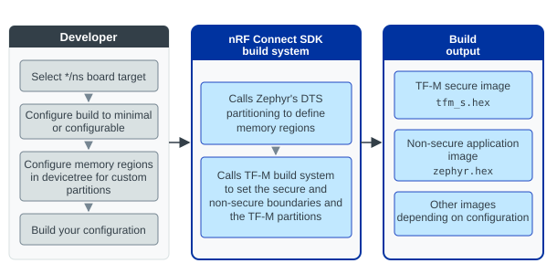

.. _ug_tfm_building:

Building and configuring TF-M
#############################

.. contents::
   :local:
   :depth: 2

TF-M is one of the images that are built as part of a :ref:`multi-image application <ug_tfm_building_secure_services>`.

To build with TF-M, complete the following steps:

1. Select a :ref:`board target supported by TF-M <ug_tfm_building_board_targets>`.
   The board files for these board targets have the :kconfig:option:`CONFIG_BUILD_WITH_TFM` Kconfig option enabled by default.
#. Configure the TF-M build to use the configurable or minimal version.
   By default, TF-M is built with the :ref:`configurable version <tfm_configurable_build>` on most devices.
   The exceptions are :ref:`Thingy:91 <ug_thingy91>` and the :ref:`Thingy:91 X <ug_thingy91x>`, which default to the :ref:`minimal version <tfm_minimal_build>`.
#. If you are using custom devicetree partitions, make sure to update the devicetree files to reflect the custom memory region sizes.
#. Build your application using :ref:`standard building instructions <building>` for the development environment of your choice.

When building with TF-M, the |NCS| build system defines memory regions for the TF-M partitions using Zephyr's :ref:`devicetree-based partitioning <zephyr:dt-guide>`.
The |NCS| build system then calls the :ref:`TF-M build system <tfm_build_system>` to define the TF-M partitions within these memory regions.

The following figure shows a generalized overview of the pre-build configuration and the build-time dependency between the |NCS| and TF-M build systems.

   TF-M build overview

For more information about the devicetree memory regions and TF-M partitions, see :ref:`ug_tfm_partitioning`.
For the description of the build output files, see :ref:`app_build_output_files`.

.. _ug_tfm_building_board_targets:

Board targets supported by TF-M
*******************************

The boards supported by the SDK distinguish entries according to which CPU is to be targeted (for multi-core SoCs) and whether the :ref:`security by separation <ug_tfm_security_by_separation>` is to be used or not (addition of the ``*/ns`` :ref:`variant <app_boards_names>` if it is used).
To build with TF-M in the |NCS|, you must use a board target with the ``*/ns`` variant.

The following table lists the board targets that you can use to build with TF-M.
See :ref:`app_boards_names` for the complete list of boards and board targets supported by the SDK.

.. list-table:: Board targets supported by TF-M
   :header-rows: 1

   * - Hardware platform
     - PCA number
     - Board name
     - TF-M board target
   * - nRF9161 DK
     - PCA10153
     - :zephyr:board:`nrf9161dk <nrf9161dk>`
     - ``nrf9161dk/nrf9161/ns``
   * - nRF9160 DK
     - PCA10090
     - :ref:`nrf9160dk <zephyr:nrf9160dk_nrf9160>`
     - ``nrf9160dk/nrf9160/ns``
   * - nRF9151 DK
     - PCA10171
     - :zephyr:board:`nrf9151dk <nrf9151dk>`
     - ``nrf9151dk/nrf9151/ns``
   * - nRF9131 EK
     - PCA10165
     - :zephyr:board:`nrf9131ek <nrf9131ek>`
     - ``nrf9131ek/nrf9131/ns``
   * - nRF54LV10 DK
     - PCA10188
     - :ref:`nrf54lv10dk<board_nrf54lv10dk>`
     - ``nrf54lv10dk/nrf54lv10a/cpuapp/ns``
   * - nRF54LM20 DK
     - PCA10184
     - :zephyr:board:`nrf54lm20dk <nrf54lm20dk>`
     - | ``nrf54lm20dk/nrf54lm20a/cpuapp/ns``
       | ``nrf54lm20dk/nrf54lm20b/cpuapp/ns``
   * - nRF54L15 DK
     - PCA10156
     - :zephyr:board:`nrf54l15dk <nrf54l15dk>`
     - ``nrf54l15dk/nrf54l15/cpuapp/ns``
   * - nRF54L10 emulated on the nRF54L15 DK
     - PCA10156
     - :ref:`nrf54l10dk/nrf54l10 <zephyr:nrf54l15dk_nrf54l10>`
     - ``nrf54l15dk/nrf54l10/cpuapp/ns``
   * - nRF5340 DK
     - PCA10095
     - :zephyr:board:`nrf5340dk <nrf5340dk>`
     - ``nrf5340dk/nrf5340/cpuapp/ns``
   * - Thingy:53
     - PCA20053
     - :zephyr:board:`thingy53 <thingy53>`
     - ``thingy53/nrf5340/cpuapp/ns``
   * - nRF7002 DK
     - PCA10143
     - :zephyr:board:`nrf7002dk <nrf7002dk>`
     - ``nrf7002dk/nrf5340/cpuapp/ns``
   * - Thingy:91
     - PCA20035
     - :ref:`thingy91 <ug_thingy91>`
     - ``thingy91/nrf9160/ns``
   * - Thingy:91 X
     - PCA20065
     - :ref:`thingy91x <ug_thingy91x>`
     - ``thingy91x/nrf9151/ns``

.. _ug_tfm_building_secure_services:

Enabling secure services
************************

To enable the secure services in TF-M, you must use the :ref:`TF-M Crypto Service PSA Crypto API implementation <ug_crypto_architecture_implementation_standards_tfm>`.

Complete the following steps to enable the secure services in TF-M:

1. Enable :kconfig:option:`CONFIG_PSA_CRYPTO` to use the PSA Crypto API through :ref:`nRF Security <nrf_security>`.
#. :ref:`Configure PSA Crypto API <psa_crypto_support>` Kconfig options.
#. Build the application for a :ref:`board target supported by TF-M <ug_tfm_building_board_targets>` with :ref:`tfm_minimal_build` or :ref:`tfm_configurable_build`.

After building the application, the TF-M secure image enables the use of the hardware acceleration, while the Kconfig configurations in the nRF Security subsystem control the features enabled in TF-M.

See :ref:`tfm_partition_crypto` for more information about the TF-M Crypto partition.

.. note::
   Depending on the implementation you are using, the |NCS| build system uses different versions of the PSA Crypto API.

   .. ncs-include:: ../psa_certified_api_overview.rst
      :start-after: psa_crypto_support_tfm_build_start
      :end-before: psa_crypto_support_tfm_build_end

.. _tfm_minimal_build:

Minimal build
*************

.. include:: tfm_supported_services.rst
   :start-after: minimal_build_overview_start
   :end-before: minimal_build_overview_end

The minimal build uses an image of 32 kB.
It is set with the :kconfig:option:`CONFIG_TFM_PROFILE_TYPE_MINIMAL` Kconfig option that is enabled by default on the :ref:`Thingy:91 <ug_thingy91>` and :ref:`Thingy:91 X <ug_thingy91x>` devices.

With the minimal build, the configuration of TF-M is severely limited.
The only configurable option is to enable a security service for cryptographic hashes.
For example, you can enable the :kconfig:option:`PSA_WANT_ALG_SHA_256` Kconfig option to provide SHA-256 support using TF-M.

.. _tfm_configurable_build:

Configurable build
******************

.. include:: tfm_supported_services.rst
   :start-after: configurable_build_overview_start
   :end-before: configurable_build_overview_end

To enable the configurable, full TF-M build, make sure the following Kconfig options are configured:

* :kconfig:option:`CONFIG_BUILD_WITH_TFM` is enabled
* :kconfig:option:`CONFIG_TFM_PROFILE_TYPE_NOT_SET` is enabled

For description of the build profiles, see :ref:`tf-m_profiles`.
It is not recommended to use predefined TF-M profiles as they might result in a larger memory footprint than necessary.

.. _ug_tfm_building_configuring_tfm:

Configuring TF-M profile type and partitions
============================================

When the :kconfig:option:`CONFIG_TFM_PROFILE_TYPE_NOT_SET` Kconfig option is enabled, the build process will not set a specific TF-M profile type.
This allows for a more flexible configuration where individual TF-M features can be enabled or disabled as needed.
It also provides more control over the build process and allows for a more fine-grained configuration of the TF-M secure image.

To configure the features of the TF-M secure image, you must choose which TF-M partitions and which secure services to include in the build.

.. note::
     A "TF-M partition" in this context refers to partitions specific to TF-M and located within the secure devicetree memory region (devicetree partition).
     These partitions are isolated from each other and from the non-secure application code.
     A service running inside TF-M would typically be implemented within one of these secure partitions.

     For more information about the relationship between TF-M partitions and devicetree memory regions, see :ref:`ug_tfm_partitioning`.

.. tfm_partitions_configuration_start

Each service is implemented as a separate TF-M partition, which provides the execution environment for the service.
It handles secure function calls and ensures that the service's code and data are protected from unauthorized access.

Following are the available Kconfig options for TF-M partitions:

.. list-table:: Available TF-M Partitions
   :header-rows: 1

   * - Option name
     - Description
     - Default value
     - Dependencies
   * - :kconfig:option:`CONFIG_TFM_PARTITION_PLATFORM`
     - Provides :ref:`ug_tfm_services_platform`.
     - Enabled
     -
   * - :kconfig:option:`CONFIG_TFM_PARTITION_CRYPTO`
     - Provides :ref:`tfm_partition_crypto`.
     - Enabled
     -
   * - :kconfig:option:`CONFIG_TFM_PARTITION_PROTECTED_STORAGE`
     - Provides :ref:`tfm_partition_ps`.
     - Enabled
     - PLATFORM, CRYPTO
   * - :kconfig:option:`CONFIG_TFM_PARTITION_INTERNAL_TRUSTED_STORAGE`
     - Provides :ref:`ug_tfm_services_its`.
     - Enabled
     -
   * - :kconfig:option:`CONFIG_TFM_PARTITION_INITIAL_ATTESTATION`
     - Provides :ref:`ug_tfm_services_initial_attestation`.
     - Disabled
     - CRYPTO

.. tfm_partitions_configuration_end

Configuring Secure Partition Manager backend
============================================

TF-M's Secure Partition Manager (SPM) is responsible for managing the secure partitions and the secure services.

Depending on the isolation requirements of the application, you can configure the SPM backend to use.
The following table lists the available SPM backends and the isolation levels they support:

.. configuring_spm_backend_start

.. list-table:: SPM backends
   :header-rows: 1

   * - Backend
     - Option
     - Description
     - Allowed :ref:`isolation levels <ug_tfm_architecture_isolation_lvls>`
   * - Secure Function (SFN)
     - :kconfig:option:`CONFIG_TFM_SFN`
     - With SFN, the Secure Partition is made up of a collection of callback functions that implement secure services.
     - Level 1
   * - Inter-Process Communication (IPC)
     - :kconfig:option:`CONFIG_TFM_IPC`
     - With IPC, each Secure Partition processes signals in any order, and can defer responding to a message while continuing to process other signals.
     - Levels 1, 2 and 3

.. configuring_spm_backend_end

Configuring SPM logging
-----------------------

To control the number of logging messages, set the :kconfig:option:`CONFIG_TFM_SPM_LOG_LEVEL` Kconfig option.
To disable logging, set the :kconfig:option:`CONFIG_TFM_LOG_LEVEL_SILENCE` option.

.. _ug_tfm_building_secure_peripheral_gpio:

Configuring GPIO pin security for secure peripherals
====================================================

When building with TF-M, the GPIO controller implements security by separation at the pin level.
Each pin on a GPIO port is marked either secure or non-secure.
The :kconfig:option:`CONFIG_NRF_GPIO0_PIN_MASK_SECURE`, :kconfig:option:`CONFIG_NRF_GPIO1_PIN_MASK_SECURE`, and :kconfig:option:`CONFIG_NRF_GPIO2_PIN_MASK_SECURE` Kconfig options set a bitmask that defines which pins on each port are secure.
These options default to ``0x00000000``, meaning every pin is non-secure unless you configure them explicitly.

.. caution::
   Marking a peripheral as secure (for example, with ``CONFIG_NRF_*_SECURE=y``) or assigning it in a partition manifest does not automatically mark its GPIO pins as secure.
   If a secure peripheral uses a pin that remains non-secure, the peripheral continues to operate, but the non-secure application can read the pin state and potentially snoop on secrets carried over that signal.

If your secure peripheral uses GPIO pins, you must explicitly include those pins in the appropriate GPIO pin mask Kconfig option in your application's :file:`prj.conf` file (for example, :kconfig:option:`CONFIG_NRF_GPIO0_PIN_MASK_SECURE`).
Include every pin used directly by the peripheral, and any pin used indirectly (for example, chip-select or interrupt lines).

TF-M automatically adds GPIO pins to the secure mask for secure UART and SPIM instances from the devicetree pinctrl definitions.
For all other secure peripherals, TF-M does not derive pin security from devicetree.
Do not rely on devicetree pin assignments alone to protect GPIO lines used by other secure peripherals.

See the :ref:`tfm_secure_peripheral_partition` sample for an example configuration.
