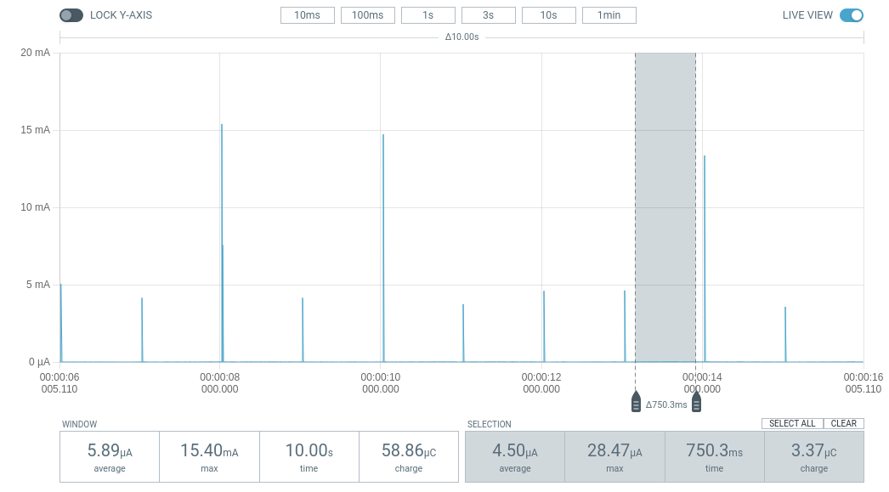

.. _app_power_opt_recommendations:

Power optimization recommendations
##################################

.. contents::
   :local:
   :depth: 2

Nordic System-on-Chip (SoC) designs are aimed at ease of use and ultra-low power consumption.
However, working on a final design might require fine-tuning some areas of your application.

.. _app_power_opt_general:

General recommendations
***********************

This section describe general recommendations for reducing power consumption of your application.
These recommendations are valid regardless of the SoC you are using.

See also the documentation for the Zephyr RTOS :ref:`zephyr:pm-guide` subsystem.
The subsystem provides interfaces and APIs that enable power management implementations for different SoCs and architectures.

Use power profiling tools
=========================

A power-optimized development ecosystem typically consists of the following developer tools:

* |NCS|
* Development kits
* `Power Profiler Kit II (PPK2)`_

Power Profiler Kit II is a flexible, low-cost tool that you can use for real-time power measurement of your design.
You can measure power on a connected development kit or any external board.

Together, these tools provide a unified solution for developers to evaluate, develop and characterize ultra-low power designs with ease.
See :ref:`installation` and :ref:`configuration_and_build` for more information about the |NCS| and its development environment.

Disable serial logging
======================

Current measurements on devices that have the |NCS| samples or applications programmed with the default configuration, might show elevated current values, when compared to the expected current values from  Nordic ultra-low power SoCs.
It is because most of the samples and applications in the |NCS| are configured to perform logging over serial port (associated with UART(E) peripheral) by default.

As an example, the image below shows the power measurement output on Power Profiler Kit II for an nRF9160 DK with the :ref:`zephyr:blinky-sample` sample compiled for the ``nrf9160dk_nrf9160_ns`` build target without modifications in the sample configuration.

.. figure:: images/app_power_opt_blinky_serial_on.png
   :width: 100 %
   :alt: Current measurement on the Blinky sample with serial logging enabled

   Current measurement for the Blinky sample with serial logging enabled

The average current is close to 470 µA, which drains a 500 mAh lithium polymer battery approximately in six weeks.
To reduce current consumption, disable serial logging.

To disable serial output, you must change the project configuration associated with the sample or application.
|config|

.. note::
    If the application consists of multiple images, like applications built for the nRF53 Series, logging must be disabled on both images.
    See :ref:`ug_nrf5340` and :ref:`ug_multi_image`.

1. Set the project configuration :kconfig:option:`CONFIG_SERIAL` to ``n`` irrespective of whether you are building the sample for the :ref:`SPE-only <app_boards_spe_nspe_cpuapp>` build targets or build targets with :ref:`NSPE <app_boards_spe_nspe_cpuapp_ns>`.
#. For the build target with NSPE (``nrf9160dk_nrf9160_ns``), ensure that serial logging is also disabled in Trusted Firmware-M by setting :kconfig:option:`CONFIG_TFM_LOG_LEVEL_SILENCE` to ``y``.

The output on Power Profiler Kit II shows the power consumption on an nRF9160 DK with the sample compiled for the ``nrf9160dk_nrf9160_ns`` build target with ``CONFIG_SERIAL=n``.

   Current measurement on the Blinky sample with serial logging disabled

The average current reduces to 6 µA, which implies 9.5 years of battery life on a 500 mAh lithium polymer battery compared to the 6-week battery life of the previous measurement.

For a similar configuration, see the :ref:`udp` sample, which transmits UDP packets to an LTE network using an nRF9160 DK.
You can use the sample to characterize the current consumption of the nRF9160 SiP.
It is optimized for low power operation on the ``nrf9160dk_nrf9160_ns`` build target without any modifications.

Verify idle current due to other peripherals
============================================

Peripherals other than the serial ports can also cause elevated currents.

The power management of the Nordic SoCs automatically switches in and out the resources that are needed by the active peripherals.
Peripherals that need a high frequency clock like UART, PWM, PDM or high frequency timers will show similar currents if enabled.

You can check the current consumption in peripherals for the SoC you are using in the "Power and clock management" section of the Product Specification for your SoC on `Nordic Semiconductor Infocenter`_.
For example, for the nRF9160 SiP, see the `Electrical specification of nRF9160`_ page.

.. note::
   Be careful with the use of pull-up resistors when designing the hardware for ultra-low power operation.
   An I/O pin with a 10 kΩ pull-up resistor that is set to ``GND`` will result in a current consumption of 300 µA at 3V.

Disable unused pins and peripherals
===================================

.. disable_unused_pins_start

Some of the pins and peripherals are enabled by default for some boards.
Depending on the peripheral or the pin type, they can increase the device power consumption to a different extent.
If the application does not use them, make sure they are disabled.

To disable a particular peripheral, set its state in the board's devicetree overlay to ``disabled``.
For example, for **ADC**:

.. code-block:: devicetree

    &adc {
        status = "disabled";
    };

.. disable_unused_pins_end

Enable Device Power Management module
=====================================

.. enable_device_pm_start

The Device Power Management module provides an interface that the device drivers use to be informed about entering the suspend state or resuming from the suspend state.
This allows the device drivers to do any necessary power management operations, such as turning off device clocks and peripherals, which lowers the power consumption.

To enable suspending peripherals when the CPU goes to sleep, set the :kconfig:option:`CONFIG_PM_DEVICE` Kconfig option to ``y``.

.. enable_device_pm_end

Put the external flash into sleep mode in inactivity periods
============================================================

When the CPU goes to sleep, some of the peripherals are suspended by their drivers.
However, the driver is not always able to know the application behavior and handle the peripheral state optimally.

One such case is the external flash usage by the applications.
It is very rarely used, and only for the Device Firmware Upgrade purposes.
For this reason, you might want to suspend the external flash for the majority of the time and have it in active state only if needed.
The state change for the Device Firmware Upgrade case is handled in the |NCS|, but for other proprietary use cases, you should handle state changes in your own implementation.

For example, to control the QSPI NOR external flash, you can use the following implementation:

.. code-block:: C++

    #include <zephyr/pm/device.h>

    const auto * qspi_dev = DEVICE_DT_GET(DT_INST(0, nordic_qspi_nor));
    if (device_is_ready(qspi_dev))
    {
        // Put the peripheral into suspended state.
        pm_device_action_run(qspi_dev, PM_DEVICE_ACTION_SUSPEND);

        // Resume the peripheral from the suspended state.
        pm_device_action_run(qspi_dev, PM_DEVICE_ACTION_RESUME);
    }

Power down unused RAM
=====================

:ref:`Optimizing the memory footprint <app_memory>` of your application can reduce the amount of RAM used, but unused RAM still consumes power.
You can power down this unused RAM to reduce the power consumption of your application.
In the |NCS|, you can use the :ref:`lib_ram_pwrdn` library for this purpose.

Configure radio transmitter power
=================================

.. radio_power_start

The radio transmitter power (radio TX power) has a significant impact on the device power consumption.
The higher the transmitter power, the greater the wireless communication range, but it also leads to higher power consumption.
Make sure to choose the optimal configuration for your specific use case.

.. radio_power_end

.. _app_power_opt_protocols:

Protocol-specific recommendations
*********************************

Besides applying `General recommendations`_, read the following subsections for more information on how to optimize specific subsystems.

Bluetooth Mesh
==============

The Bluetooth Mesh protocol offers the :ref:`ug_bt_mesh_configuring_lpn` feature for optimizing the power consumption of the Bluetooth Mesh devices.

Matter
======

To optimize the power consumption of your Matter application, complete the actions listed on the :ref:`ug_matter_device_low_power_configuration` page.

Thread
======

The Thread protocol offers :ref:`Sleepy End Device types <thread_sed_ssed>` for optimizing the power consumption of the Thread devices.
Sleepy End Devices try to limit their power consumption by sleeping most of the time.

The :ref:`ot_cli_sample` sample can be used to perform power consumption measurements when configured following some of the general recommendations.
See the :ref:`ot_cli_sample_low_power` section of the sample documentation for more information.

Wi-Fi
=====

The Wi-Fi protocol introduces the power save mechanism that allows the Station (STA) device to spend the majority of the time in a sleep state and wake up periodically to check for pending traffic.
For more information about the Wi-Fi power save mechanism, see the :ref:`Wi-Fi MAC layer <wifi_mac_layer>` documentation.

To enable the Wi-Fi power save mode, set the :kconfig:option:`CONFIG_NRF_WIFI_LOW_POWER` Kconfig option to ``y``.

See :ref:`ug_nrf70_developing_powersave` for more information about the power save modes.
