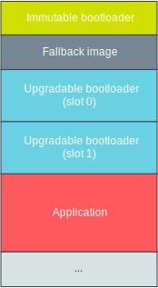

.. _ug_bootloader:

Secure bootloader chain
#######################

The |NCS| provides a secure bootloader solution based on the chain of trust concept.

By using this bootloader chain, you can easily ensure that all code that is executed is authorized and your application is protected against running altered code.
If, for example, an attacker attempts to modify your application, or you have a bug in your code that overwrites parts of the application flash, the secure bootloader chain detects that the flash has been altered and your application does not start up.

Chain of trust
**************

A secure system depends on building and maintaining a chain of trust through all layers in the system.
Each step in this chain will guarantee that the next step can be trusted to have certain properties, because any illegal modification of a following step will be detected and the process halted.
The trustworthiness of each layer is guaranteed by the previous layer, all the way back to a property in the system referred to as a root of trust (RoT).

You can compare a chain of trust to the concept of a door.
You trust a door because you trust the lock because you trust the key because the key is in your pocket.
If you lose this key the chain of trust unravels and you no longer trust this door.

It is important to note that a key alone is not a RoT, although a RoT may include a key.
A RoT will consist of both hardware, software, and data components that must always behave in an expected manner, because any misbehavior cannot be detected.

.. _ug_bootloader_architecture:

Architecture
************

The secure bootloader chain consists of a sequence of images that are booted one after the other.
To establish a root of trust, the first image verifies the signature of the next image (which can be the application or another bootloader image).
If the next image is another bootloader image, that one must verify the image following it to maintain the chain of trust.
After all images in the bootloader chain have been verified successfully, the application starts.

The current implementation provides the first stage in the chain, the :ref:`bootloader`, and uses :doc:`mcuboot:index` as upgradable bootloader.

The following image shows an abstract representation of the memory layout, assuming that there are two bootloader images (one immutable, one upgradable) and one application:

   Memory layout

For detailed information about the memory layout, see the partition configuration in the DTS overlay file for the board that you are using.
This file is located in ``subsys\bootloader\dts``.

.. _immutable_bootloader:

Immutable bootloader
====================

The first step in the chain of trust is an immutable first stage bootloader, in the following referred to as immutable bootloader.
The code abbreviates this bootloader as SB (for Secure Boot) or B0.

The immutable bootloader runs after every reset and establishes the root of trust by verifying the signature and metadata of the next image in the boot sequence.
If verification fails, the boot process stops.

This way, the immutable bootloader can guarantee that if the flash of the next image in the boot sequence (another bootloader or the application) has been tampered with in any way, that image will not start up.
So if an attacker attempts to take over the device by altering the flash, the device will not boot and not run the infected code.

The immutable bootloader cannot be updated or deleted from the device unless you erase the device.

There is no need to modify the immutable bootloader in any way before you program it. The default verification is recommended and suitable for all common user scenarios and includes the following checks:

Signature verification
   Verifies that the key used for signing the next image in the boot sequence matches one of the provided public keys.

Metadata verification
   Checks that the images are compatible.

.. _upgradable_bootloader:

Upgradable bootloader
=====================

Unlike the immutable bootloader, the upgradable bootloader can be updated through, for example, a Device Firmware Update (DFU).
This bootloader is therefore more flexible than the immutable bootloader.
It is protected by the root of trust in form of the immutable bootloader, and it must continue the chain of trust by verifying the next image in the boot sequence.

The upgradable bootloader should carry out the same signature and metadata verification as the immutable bootloader.
In addition, it can provide functionality for upgrading both itself and the following image in the boot sequence (in most cases, the application).

There are two partitions where the upgradable bootloader can be stored: slot 0 and slot 1 (also called *S0* and *S1*).
A new bootloader image is stored in the partition that is not currently used.
When booting, the immutable bootloader checks the version information for the images in slot 0 and slot 1 and boots the one with the highest version.
If this image is faulty and cannot be booted, the other partition will always hold a working image, and this one is booted instead.

Set the option :option:`CONFIG_BUILD_S1_VARIANT` when building the upgradable bootloader to automatically generate pre-signed variants of the image for both slots.
These signed variants can be used to perform an upgrade procedure through the :ref:`lib_fota_download` library.

Adding a bootloader chain to your application
*********************************************

See :ref:`bootloader_build_and_run` in the documentation of the :ref:`bootloader` sample for instructions on how to add an immutable bootloader as first stage of the secure bootloader chain.

See :doc:`mcuboot:index` for information on how to implement an upgradable bootlader.
:ref:`mcuboot:mcuboot_ncs` gives details on the integration of MCUboot in |NCS|.
