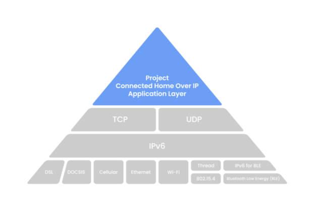
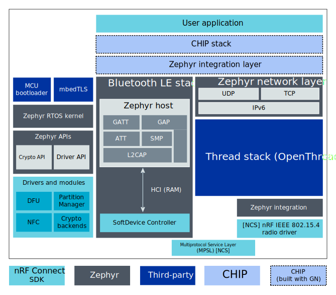

.. _ug_chip:

Project Connected Home over IP
##############################

.. contents::
   :local:
   :depth: 2

.. chip_intro_start

`Project Connected Home over IP`_  (Project CHIP) is an open-source application layer that aims at creating a unified communication standard across smart home devices, mobile applications, and cloud services.
It supports a wide range of existing technologies, including Wi-Fi, Thread, and Bluetooth LE, and uses IPv6-based transport protocols like TCP and UDP to ensure connectivity between different kinds of networks.

Project CHIP is in an early development stage and must be treated as an experimental feature.

.. chip_intro_end

The |NCS| allows you to develop applications that are compatible with Project CHIP.

Architecture
************

Project CHIP defines an application layer on top of the IPv6-based transport protocols.
This allows for routing messages regardless of the underlying physical and link layers.

   Project CHIP architecture overview

The Project CHIP application layer can be broken down into several main components, from IP framing and transport management up to Data Model structure and Application itself.
For detailed description, see the `Project CHIP Protocol Overview`_ page.

Integration with |NCS|
======================

Project CHIP is included in the |NCS| as one of the submodule repositories managed with the :ref:`zephyr:west` tool.
That is, the code used for |NCS| and Project CHIP integration is stored in the Project CHIP repository (nRF Connect platform) and is compiled when building one of the available :ref:`chip_samples`.
Both instances depend on each other, but their development is independent to ensure that they both support the latest stable version of one another.

Project CHIP is located on the top application layer of the integration model, looking from the networking point of view.
|NCS| and Zephyr provide the Bluetooth LE and Thread stacks, which must be integrated with the Project CHIP stack using a special intermediate layer.
The |NCS|'s Multiprotocol Service Layer (MPSL) driver allows running Bluetooth LE and Thread concurrently on the same radio chip.

   nRF Connect platform in Project CHIP

For detailed description, see the `nRF Connect platform overview`_ Project CHIP documentation page.

Configuration in |NCS|
**********************

The Project CHIP's nRF Connect platform is built when programming any of the available :ref:`chip_samples` to the supported development kits, which creates a Project CHIP accessory device.
Such a device requires additional configuration if it is to be paired and controlled remotely over a Project CHIP network built on top of a low-power, 802.15.4 Thread network.
The following figure shows an overview of the network topology with the required configuration elements.

   Project CHIP network topology example with Thread devices

For information about how to configure the required components, see the following documentation:

* For configuring Wi-Fi Access Point and Thread Border Router:

  * `Building and programming OpenThread RCP firmware`_ - This will create the OpenThread RCP device required for forming the Thread network.
  * `Configuring PC as Thread Border Router`_

* For setting up Project CHIP Controller and Bluetooth LE Commissioning: `Building and installing Android CHIPTool`_
* For preparing the accessory device and commissioning it: `Preparing and commissioning accessory device`_

You can find this information in the Project CHIP sample documentation as well.
If you are new to Project CHIP, check also the tutorials on `DevZone`_.

Samples
*******

See :ref:`chip_samples` for the list of available samples.

.. note::
    |chip_gn_required_note|
