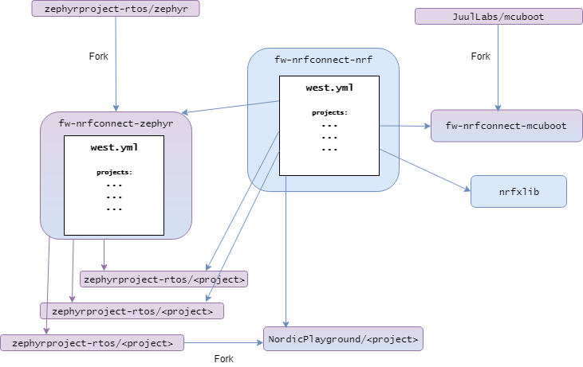

.. _dev-model:

|NCS| development model
#######################

This user guide describes the development model that the |NCS| follows in order to give its users access to both stable releases and newest features.

Refer to the :ref:`dm-glossary` for additional clarification on terms used in these sections.

Overview
********

The |NCS| is an SDK developed and maintained by Nordic Semiconductor to enable development of applications designed to run on its ICs (Integrated Circuits).
It is based both on the code developed by Nordic engineers and on open-source software projects, which in turn are developed collaboratively by many contributors.

The |NCS| is developed openly, and its users can track the development progress and even contribute to it.
This includes both the Nordic-specific and open-source portions of the SDK.

Any individual or company can choose to contribute to the |NCS| codebase.
Contributions are welcome but entirely optional, as the licenses used by the |NCS| allow for free modification of the source code without a requirement to contribute the changes back.

Git repositories
****************

The source code, libraries, and tools that compose the |NCS| are entirely hosted in a set of `Git`_ repositories.
Basic familiarity with Git is required to understand the architecture of the repository set and to work with the |NCS|.

All |NCS| repositories are publicly hosted on `GitHub`_, and accessible to both individual users and companies.

Forks and upstream/downstream repositories
==========================================

Git is a distributed version control system that allows repositories to be easily duplicated.
Every time you take an existing Git repository and create a copy of it, you are creating a *fork* of that repository.
This means that you create an identical copy that might diverge from the original over time, since commits to the original will not be automatically reflected in the copy, and commits to your copy will not be automatically reflected in the original.

.. note::
   When we talk about forks or copying Git repositories, we refer to the creation of a new repository hosted on a server and accessible to other users.
   If you clone a repository to your local machine using ``git clone``, that is referred to as a *clone* and not a fork.

When you create a fork by copying an existing repository, the original repository is called the *upstream* repository and the newly created copy the *downstream* repository.

A fork can be hosted on any server, including a public Git hosting site like `GitHub`_.
It is, however, important to differentiate between the generic concept of a fork and GitHub's concept of a `GitHub fork`_.
When you create a GitHub fork, GitHub copies the original repository and tags the downstream repository (the fork) with a flag that allows users to send pull requests from the fork to its upstream repository.
GitHub also supports creating forks without linking them to the upstream respository.
See the `GitHub documentation <GitHub duplicate_>`_ for information about how to do this.

.. _dm-repo-types:

Repository types
================

There are two main types of Git repositories in the |NCS| repository set:

* nRF repositories

  - Created, developed, and maintained by Nordic.
  - Usually licensed for use on Nordic products only.

* OSS repositories

  - Created and maintained by Nordic.
  - Soft forks of open-source projects.
  - Typically contain a small set of changes that are specific to |NCS|.
  - Updated ("upmerged") regularly with the latest changes from the open source project.

nRF repositories are stand-alone and have no upstreams, since they are unique to the |NCS|.
Some examples of repositories of this type are:

* `fw-nrfconnect-nrf`_: The main repository for Nordic-developed software.
* `nrfxlib`_: A repository containing linkable libraries developed by Nordic.

OSS repositories, on the other hand, are typically soft forks of an upstream open source project, which Nordic maintains in order to keep a small set of changes that do not belong, or have not been merged, to the upstream official open-source repository.
For example:

* `fw-nrfconnect-zephyr`_ is a soft fork (and therefore a downstream) of the upstream official `Zephyr repository`_.
* `fw-nrfconnect-mcuboot`_ is a soft fork (and therefore a downstream) of the upstream official `MCUboot repository`_.

Repository structure
====================

In order to manage the combination of repositories and versions, the |NCS| uses :ref:`west <zephyr:west>`, the same tool that the Zephyr Project uses to manage its repository set.
You can learn more about the reasons behind the introduction of west in :ref:`this section <zephyr:west-history>` of the Zephyr documentation.

A :ref:`manifest repository <zephyr:west-manifests>`, `fw-nrfconnect-nrf`_, contains a file in its root folder, :file:`west.yml`, which lists all other repositories (west projects) included in the |NCS| and their corresponding revisions.
The |NCS| repository structure is therefore in fact modeled in the shape of a star topology, with the `fw-nrfconnect-nrf`_ repository being the center of the star and all other repositories being west projects.
This is equivalent to topology T2 in the :ref:`west documentation <zephyr:west-multi-repo>`.

   The |NCS| repository structure

The figure above depicts the |NCS| repository structure.
A central concept with this repository structure is that each revision (in Git terms) of the `fw-nrfconnect-nrf`_ repository completely determines the revisions of all other
repositories (i.e. the west projects).
This means that the linear Git history of this manifest repository also determines the history of the repository set in its entirety, thanks to the :file:`west.yml` `west manifest file`_ being part of the manifest repository.
West reads the contents of the manifest file to find out which revisions of the project repositories are to be checked out every time ``west update`` is run.
In this way, you can decide to work with a specific |NCS| release either by initializing a new west installation at a particular tag or by checking out the corresponding tag for a release in an existing installation and then updating your project repositories to the corresponding state with ``west update``.
Alternatively, you can work with the latest state of development by using the master branch of the `fw-nrfconnect-nrf`_ repository, updating it with Git regularly and using ``west update`` to update the project repositories every time the manifest repository changes.
More information about manifests can be found in the :ref:`west manifest section <zephyr:west-manifests>` of the Zephyr documentation.

Revisions
=========

There are two fundamental revisions that are relevant to most |NCS| users:

* The ``master`` branch of the `fw-nrfconnect-nrf`_ repository
* Any Git tag (i.e. release) of the `fw-nrfconnect-nrf`_ repository

As discussed above, the revision of the manifest repository, `fw-nrfconnect-nrf`_, uniquely determines the revisions of all other repositories, so a discussion about |NCS| revisions can be essentially limited to the manifest repository revision.

The ``master`` branch of the `fw-nrfconnect-nrf`_ repository always contains the latest development state of the |NCS|.
Since all development is done openly, you can use it if you are not particularly concerned about stability and want to track the latest changes that are being merged continuously into the different repositories.

The Git tags follow the `Semantic Versioning 2.0.0`_ format and they correspond to official releases tested and signed by the Nordic engineers. The format is as follows::

  vX.Y.Z(-rcN)

Where X, Y, and Z are the major, minor, and patch version respectively and, optionally, a release candidate postfix ``-rcN`` is attached if the tag identifies a candidate instead of the actual release.

.. _dm-oss-downstreams:

OSS repositories downstream project history
===========================================

As described in :ref:`dm-repo-types`, the |NCS| contains OSS repositories, which are based on third-party, open-source Git repositories and may contain additional patches not present upstream.
Examples include `fw-nrfconnect-zephyr`_ and `fw-nrfconnect-mcuboot`_, which have upstream open-source projects used as a basis for downstream repositories distributed with the |NCS|.
This section describes how the history of these OSS repositories is maintained, and how they are upmerged with their upstreams.

The short logs for these downstream patches contain ``[nrf xyz]`` at the beginning, for different ``xyz`` strings.
This makes their different purposes downstream clearer, and makes them easier to search for and see in ``git log``.
The current values of ``[nrf xyz]`` are:

- ``[nrf mergeup]``: periodic merges of the upstream tree
- ``[nrf fromlist]``: patches which have upstream pull requests, including any later revisions
- ``[nrf toup]``: patches which Nordic developers intend to submit upstream later
- ``[nrf noup]``: patches which are specific to the |NCS|
- ``[nrf temphack]``: temporary patches with some known issues
- ``[nrf fromtree]``: patches which have been cherry-picked from an upstream tree

It is important to note that the **downstream project history is periodically rewritten**.
This is important to prevent the number of downstream patches included in a specific NCS release from increasing forever.
A repository's history is typically only rewritten once per every major |NCS| release.

To make incorporating new history into your own forks easier, a new point in the downstream |NCS| history is always created which has an empty ``git diff`` with the previous version.
The empty diff means you can always use:

- ``git merge`` to get the rewritten history merged into your own fork without errors
- ``git rebase --onto`` or ``git cherry-pick`` to reapply any of your own patches cleanly before and after the history rewrite
- ``git cherry`` to list any additional patches you may have applied to these projects to rewrite history as needed

Additionally, both the old and new histories are committed sequentially into the ``revision`` fields for these projects in the :file:`nrf/west.yml` west
manifest file.
This means you can always combine ``git bisect`` in the ``nrf`` repository with ``west update`` at each bisection point to diagnose regressions, etc.

.. _dm-user-workflow:

User workflow
*************

This section describes suggested user workflows to develop and maintain an application based on the |NCS|.

The development and distribution model that the |NCS| uses has been described at length in the sections above, and the present section deals with the actual practicalities of developing an application that is based on the |NCS| from a version control and maintenance point of view.

Common Git and west operations
==============================

In order to maintain an application that uses the |NCS|, it is recommended to use the same tools that Nordic employs to develop it.
In particular and when it comes to version control, a combination of `Git`_ and :ref:`west<zephyr:west>` is used to interact with the Git repositories that make up the |NCS|.

As previously described, the |NCS| contains the repositories listed below, along with the tool that is used to manage them:

* The manifest repository, `fw-nrfconnect-nrf`_.
  This repository is managed by the user using Git exclusively, since west will not modify or update it in any way.
  The exception to this is the ``west init`` command, which can clone the manifest repository automatically at an arbitrary revision.

* The west projects.
  Those are listed in the manifest repository's :file:`west.yml` manifest file.
  They are entirely managed by west, which will clone them or check out a specific revision of them every time you run ``west update``.

There are several basic operations that |NCS| users will perform routinely with Git and west, the most common of which are described in the subsections below.

.. _dm-wf-get-ncs:

Obtain a copy of the |NCS|
--------------------------

In order to obtain a fresh copy of the |NCS| at revision ``{revision}`` and place it in a folder named :file:`ncs`, use the following commands::

  west init -m https://github.com/NordicPlayground/fw-nrfconnect-nrf --mr {revision} ncs
  cd ncs
  west update

Replace ``{revision}`` with any revision you wish to obtain.
This can be ``master`` if you want the latest state, or any released version (e.g. ``v1.1.0``).
If you omit the ``--mr`` parameter, west defaults to ``master``.

.. _dm-wf-update-ncs:

Update a copy of the |NCS|
--------------------------

If you already have a copy of the |NCS| and wish to update it or switch to a new revision, then you only need to do the following::

  cd ncs/nrf
  git fetch {remote}
  # Check out the latest master branch
  git checkout {remote}/master
  # or check out a release
  git checkout {revision}
  west update

Where ``{remote}`` is the Git remote that points to the official Nordic repository.
This is called ``origin`` by default for the `fw-nrfconnect-nrf`_ repository and ``ncs`` for most others, but :ref:`may have another name <dm-wf-fork>`.
You can use ``git remote -v`` to list all your remotes.

Note that using ``git checkout`` is one of multiple ways of achieving this.
Git offers several commands and mechanisms to set the current working copy of a repository to a particular revision.
Depending on how you manage the branches of your local clone of the `fw-nrfconnect-nrf`_ repository, you can also replace the use of ``git checkout`` with, among many others::

  # If you have no changes of your own
  git reset --hard {remote}/master
  git reset --hard {revision}
  # If you have changes of your own
  git rebase {remote}/master
  git rebase {revision}

Describing the exact differences between the commands above is outside the scope of this section.
Refer to the publicly available `Git`_ documentation.

.. _dm-wf-fork:

Fork a repository of the |NCS|
------------------------------

In some cases, you might want to keep a :ref:`soft fork <dm-glossary>` of one or more repositories that are part of the |NCS|.
The procedure to achieve that is the same regardless of whether you fork the manifest repository and/or one or more project repositories.

There are two similar but slightly different meanings to the term "fork", as described in the :ref:`dm-glossary`:

  * A fork in general terms is a server-hosted copy of an upstream repository with a few downstream changes on top of it.
    It can be hosted on GitHub or elsewhere.
  * A `GitHub fork`_ is GitHub's mechanism to copy an existing repository and then send Pull Requests from it to the upstream repository.

A GitHub fork can be used to send Pull Requests and to act as a regular long-lived fork in general terms.
You can also create standard forks with GitHub by just creating an empty repository first and then initializing it with the contents of the upstream repository you wish to fork.

.. note::
   About Git remotes: The default name for a remote is ``origin`` but you can pick any arbitrary name for a remote.
   By convention, the following remote names are typically used:

   - ``origin`` usually points to the user's personal copy of the repository.
   - ``ncs`` is used to point to the |NCS| repository.
   - ``upstream`` typically points to the upstream repository, when applicable.

   The ``west init`` command creates a remote named ``origin`` that points to the original location of the cloned manifest repository.
   The ``west update`` command, on the other hand, uses the ``remote:`` property in the :file:`west.yml` file to name the remote pointing to the original location.

If you want to create a `GitHub fork`_ follow the steps below:

#. Create a `GitHub fork`_ using the **Fork** button in the GitHub user interface.
#. Add the newly created remote repository as a Git remote::

     cd ncs/{folder}
     # Rename the default remote from 'origin' to 'ncs', if required
     git remote rename origin ncs
     git remote add origin https://github.com/{username}/{repo}.git

   For example, to create a fork of the `fw-nrfconnect-nrf`_ repository for GitHub user ``foo``::

     cd ncs/nrf
     # The manifest repository defaults to a remote named 'origin'
     git remote rename origin ncs
     git remote add origin https://github.com/foo/fw-nrfconnect-nrf.git

   If you were to fork an OSS repository instead, which itself is already a fork of the original upstream project::

     cd ncs/zephyr
     # No need to rename the remote, since it will already be named 'ncs'
     git remote add origin https://github.com/foo/fw-nrfconnect-zephyr.git
     git remote add upstream https://github.com/zephyrproject-rtos/zephyr.git

  That way you would actually have three remotes, each pointing to the relevant copy of the Zephyr codebase:

    * ``origin`` pointing to your own fork of ``fw-nrfconnect-zephyr``.
    * ``ncs`` pointing to the |NCS| `fw-nrfconnect-zephyr`_.
    * ``upstream`` pointing to the upstream `official Zephyr repository`_.

To create a regular fork, follow the exact same steps as above, but the actual repository must be created by you beforehand, instead of clicking **Fork** in GitHub.
Also, since a GitHub fork automatically initializes the forked repository with the exact same contents as the original one, you must push the contents yourself::

  cd ncs/{folder}
  # Rename the default remote from 'origin' to 'ncs'
  git remote rename origin ncs
  git remote add origin https://github.com/{username}/{repo}.git
  git push origin master

Workflows
=========

Below you can find a few practical workflows that can be used by an application developer.
Which one to choose depends on the type of application, the timeframe to develop it, and the need to update the |NCS| version used.
All workflows are described under the following basic assumptions:

- One or more applications are to be developed using the |NCS|.
- Additional board definitions might be required by the user.
- Additional libraries might be required by the user.
- The term "application" refers to the application code and any board definitions and libraries it requires.
- The application(s) will require updates of the |NCS| revision.

Workflow 1: Eschew Git and west
-------------------------------

If you have your own version control tools, you might want to simply not use Git or west at all, and instead rely on your own toolset.
In such case, you must obtain a copy of the |NCS| on your file system and then manage the source code of both the SDK and your application yourself.

Since no downloadable packages of the |NCS| are currently available, the simplest path to obtain the source code is to follow the instructions in the :ref:`corresponding section <dm-wf-get-ncs>` of the documentation.
This requires you to install Git and west, but you can then ignore them from that point onwards.
If you need to update the copy of the |NCS| you are working with, you can :ref:`obtain the source code <dm-wf-get-ncs>` again, or, if you have kept the original set of repositories, :ref:`update it instead <dm-wf-update-ncs>`.
Once you have obtained a copy of the |NCS| source code, which is self-contained in a single folder, you can then proceed to manage that code in any way you see fit.

Unless you take some :ref:`additional steps <zephyr:no-west>`, west itself must still be installed in order to build applications.

Workflow 2: Out-of-tree application repository
----------------------------------------------

Another approach to maintaining your application is to completely decouple it from the |NCS| repositories and instead host it wherever you prefer - in Git, another version control system, or simply on your hard drive.
This is typically also known as "out-of-tree" application, meaning that the application, board definitions, and any other libraries are actually outside any of the repositories provided by the |NCS| and can be placed anywhere at all.
As long as you do not need to make any changes to any of the repositories of the |NCS|, you can use the procedures to :ref:`get the source code <dm-wf-get-ncs>` and later :ref:`update it <dm-wf-update-ncs>`, and manage your application separately, inside or outside the top folder of the |NCS|.

If you choose to have your application outside of the folder hierarchy of the |NCS|, the build system will find the location of the SDK through the :makevar:`ZEPHYR_BASE` environment variable, which is set either through a script or manually in an IDE.
More information about application development and the |NCS| build and configuration system can be found in the :ref:`ncs-app-dev` documentation section.

The drawback with this approach is that any changes you make to the set of |NCS| repositories are not directly trackable using Git, since you do not have any of the |NCS| repositories forked.
If you are tracking the master branch of the |NCS|, you can instead send the changes you require to the official repositories as Pull Requests, so that they are incorporated into the codebase.

Workflow 3: Application in a fork of `fw-nrfconnect-nrf`_
---------------------------------------------------------

Forking the `fw-nrfconnect-nrf`_ repository and adding the application to it is another valid option to develop and maintain your application.
This approach also allows you to fork additional |NCS| repositories and point to those.
This can be useful if you have to make changes to those repositories beyond adding your own application to the manifest repository.

In order to use this approach, you first need to :ref:`get the source code <dm-wf-get-ncs>`, and then :ref:`fork the fw-nrfconnect-nrf repository <dm-wf-fork>`.
Once you have your own fork, you can start adding your application to your fork's tree and push it to your own Git server.
Every time you want to update the revision of the |NCS| that you want to use as a basis for your application, you must follow the :ref:`instructions to update <dm-wf-update-ncs>` on your own fork of ``fw-nrfconnect-nrf``.

If you have changes in additional repositories beyond `fw-nrfconnect-nrf`_ itself, you can point to your own forks of those in the :file:`west.yml` included in your fork.

Workflow 4: Application as the manifest repository
--------------------------------------------------

An additional possibility is to take advantage of west to manage your own set of repositories.
This workflow is particularly beneficial if your application is split among multiple repositories or, just like in the previous workflow, if you want to make changes to one or more |NCS| repositories, since it allows you to define the full set of repositories yourself.

In order to implement this approach you first need to create a manifest repository of your own, which just means a repository that contains a :file:`west.yml` manifest file in its root.
Next you must populate the manifest file with the list of repositories and their revisions.
In general, the easiest thing to do is to take the :file:`west.yml` in `fw-nrfconnect-nrf`_ and copy its entries directly as a starting point.
Then, make the following changes:

  * Add an entry for `fw-nrfconnect-nrf`_ or a forked version of it, if applicable.
  * Point the entries of any |NCS| repositories that you have forked to your fork and fork revision.
  * Add any entries for repositories that you need and that are not part of the |NCS|.

Once you have your new manifest repository, you can use it with west just like you would use `fw-nrfconnect-nrf`_ when :ref:`getting <dm-wf-get-ncs>` and later :ref:`updating <dm-wf-update-ncs>` the source code.
You just need to replace ``fw-nrfconnect-nrf`` and ``nrf`` with whatever repository name and path you have chosen for your manifest repository.

.. _dm-glossary:

Glossary
********

Repository
   A Git repository in its strict sense, the highest granularity allowed by the Git version control system.

Manifest repository
   A repository that contains a :file:`west.yml` file in its root folder and can therefore act as center of a repository star topology.

West project
   Any of the listed repositories inside the :file:`west.yml` file in a manifest repository.

Contribution
   A change to the codebase sent to a remote repository for inclusion.

Upmerge
   The act of updating a downstream repository with a new revision of its upstream counterpart.

Clone
   A local copy of a remote Git repository obtained with ``git clone``.

Fork
   A server-hosted copy of a repository (upstream) that intends to follow the changes made in the original repository as time goes by, while at the same time keeping some other changes unique to it.

Soft fork
   A fork that contains a very small set of changes when compared to its upstream.

GitHub fork
   A `GitHub fork`_ is a copy of a repository inside GitHub, that allows the user to create a Pull Request.

Upstream
   The repository from which a downstream is forked off.

Downstream
   The repository that is forked off an upstream.

nRF repository
   An |NCS| repository that does not have an externally maintained, open-source upstream.
   It is exclusive to Nordic development.

OSS repository
   An |NCS| repository that tracks an upstream Open Source Software counterpart that is externally maintained.

Commit
   A Git commit, including a unique SHA and a commit message.

Patch
   See Commit.

Commit tag
   A tag prepended to the first line of the commit message to ease filtering and identification of particular commit types.

Pull Request
   A GitHub Pull Request, a set of commits that are sent for code review using GitHub.
