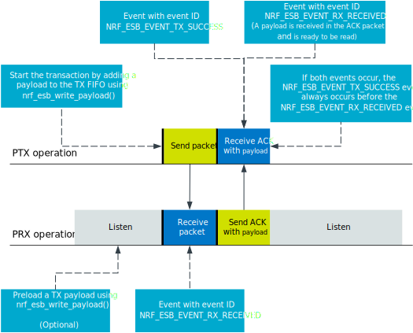
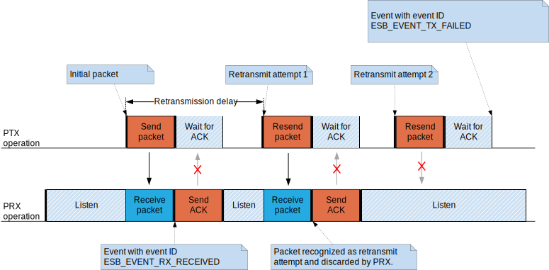
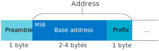

.. _ug_esb:

Enhanced ShockBurst (ESB)
#########################

This user guide describes what Enhanced ShockBurst (ESB) is and how to use it with an nRF5 Series device.

Enhanced ShockBurst (ESB) is a basic protocol supporting two-way data packet communication including packet buffering, packet acknowledgment, and automatic retransmission of lost packets. ESB provides radio communication with low power consumption, and the implementation is small in code size and easy to use.

The ESB protocol was embedded in hardware in the legacy nRF24L Series. The :ref:`esb_readme` module enables an nRF5 Series device to communicate with an nRF5 or nRF24L Series device using the ESB protocol.

ESB features automatic packet transaction handling for easy implementation of a reliable bidirectional data link. A transaction is a packet exchange between two transceivers, with one transceiver acting as the Primary Receiver (PRX) and the other transceiver acting as the Primary Transmitter (PTX).

.. figure:: images/esb_fig1_star_network.svg
   :alt: Enhanced ShockBurst network

   Enhanced ShockBurst network

.. _esb_features:

Features
========
 * Supports a star network topology with typically one Primary Receiver (PRX) and up to 8
   Primary Transmitters (PTX)
 * 1 to 32 bytes dynamic payload length in legacy mode
 * 1 to 252 bytes static payload length between nRF5 Series devices
 * Bidirectional data transfer between each PTX and the PRX
 * Packet acknowledgment and automatic packet retransmission functionality
 * Individual TX and RX FIFOs for every pipe
 * Backward compatible with legacy nRF24Lxx Enhanced ShockBurst

.. _esb_config:

Resources
=========

ESB requires exclusive access to all fixed and configured resources for the :ref:`esb_readme` library to ensure correct operation:

.. list-table::
   :header-rows: 1

   * - Resource type
     - Resource
     - Required
   * - Radio
     - NRF_RADIO
     - fixed
   * - Timer
     - NRF_TIMER2
     - configurable
   * - PPI channels
     - 5-11
     - configurable
   * - Software interrupt
     - 0
     - fixed

.. note::
   There is no MPU enforcement of this exclusive access, so manipulating these resources gives undefined behavior.

The radio and timer interrupt handlers run at priority level 0 (highest level), and the ESB callback functions run at priority level 1. Other interrupts used by the application must use priority level 2 or lower (level 2 to 7) to ensure correct operation.

.. _esb_backwards:

Backward compatibility
======================

The :ref:`esb_readme` library is compatible with the legacy nRFgo SDK.
To ensure that your application built with the |NCS| can communicate with nRF24 devices that run applications built with the nRFgo SDK, use the configuration ``ESB_LEGACY_CONFIG``.

Note, however, that the provided samples in the two SDKs do not correspond, so that you cannot use the Transmitter sample from one SDK with the Receiver sample from the other SDK.

.. _esb_transaction:

Packet transaction
==================

An Enhanced ShockBurst packet transaction is initiated by a packet transmission from the
PTX and successfully completed when the PTX has received an acknowledgment packet
(ACK packet) from the PRX.

To enable a bidirectional data link, the PRX is allowed to attach a data payload to the
ACK packet. To do so, the PRX adds a packet to its TX FIFO, which is sent as the payload in the next ACK packet.

   PTX to PRX packet transaction

If the PTX does not receive the ACK after the initial transmitted packet, it attempts to retransmit the packet until the ACK is finally
being received.
The maximum number of allowed retransmission attempts and the delay between each attempt is specified by the most recent call to either :cpp:func:`esb_init` (where the values of :cpp:member:`retransmit_count` and :cpp:member:`retransmit_delay` in the :cpp:type:`esb_config` structure specify the number of retransmission attempts and the delay between them, respectively) or the functions :cpp:func:`esb_set_retransmit_count` and :cpp:func:`esb_set_retransmit_delay`.
The retransmission delay is defined as the duration between the start of each transmission
attempt. Note that this differs from the legacy nRF24L Series hardware implementation,
where the delay was defined as the duration from the end of a
packet transmission until the start of the retransmission.

If the ACK packet sent from the PRX to the PTX is lost, but both the initial packet and the subsequent retransmission attempts are being successfully received by the PRX, the repeated packets will be discarded by the PRX. This prevents the PRX application from receiving duplicate packets. However, repeated packets will always be ACKed by the PRX, even though they are being discarded.

   Failed package transaction

A PTX can select that individual packets that are transmitted to the
PRX do not require an ACK to be sent in return from the PRX. This decision
is taken by the application when uploading a packet to the TX FIFO using the
:cpp:member:`esb_payload::noack` field of the :cpp:type:`p_payload` parameter that is passed to the :cpp:func:`esb_write_payload` function.

When the PRX receives a packet that does not require an ACK, it does not send an ACK packet to the PTX, and as a result the PTX will continue retransmitting the packet until the maximum number of allowed retransmission attempts is reached.

.. _esb_getting_started:

Setting up an ESB application
=============================

Perform the following steps to set up an application to send and receive packets:

1. Initialize ESB using :cpp:func:`esb_init`. You can use the default parameters in :c:macro:`ESB_DEFAULT_CONFIG` as starting point for the **p_config** parameter and reconfigure them if needed.
#. If necessary, use any of the folowing functions to update the addresses, the address prefix, the channel, and the bitrate:

   * :cpp:func:`esb_set_base_address_0`
   * :cpp:func:`esb_set_base_address_1`
   * :cpp:func:`esb_set_prefixes`
   * :cpp:func:`esb_set_rf_channel`
   * :cpp:func:`esb_set_bitrate`

#. Make sure that the high-frequency clock is running:

   .. code-block:: c

      NRF_CLOCK->EVENTS_HFCLKSTARTED = 0;
      NRF_CLOCK->TASKS_HFCLKSTART = 1;
      while (NRF_CLOCK->EVENTS_HFCLKSTARTED == 0);

#. Start sending or receiving packets:

   * If the node is a PTX:

     a. Add packets to the TX FIFO by calling :cpp:func:`esb_write_payload`.
     #. Depending on the value of :cpp:member:`esb_config::tx_mode` that was used in the most recent call to :cpp:func:`esb_init`, you might have to call :cpp:func:`esb_start_tx` to start the transmission.
     #. After the radio has received an acknowledgment or timed out, handle :c:macro:`ESB_EVENT_TX_SUCCESS`, :c:macro:`ESB_EVENT_TX_FAILED`, and :c:macro:`ESB_EVENT_RX_RECEIVED` events.

   * If the node is a PRX:

     a. Handle :c:macro:`ESB_EVENT_RX_RECEIVED` events as packets are coming in. Multiple packets might arrive in the RX FIFO between each event.
     #. To attach payloads to acknowledgment packets, add them to the TX FIFO using :cpp:func:`esb_write_payload`. The payload must be queued before a packet is received. After a queued payload is sent with an acknowledgment, it is assumed that it reaches the other device. Therefore, an :c:macro:`ESB_EVENT_TX_SUCCESS` event is queued.

To stop the ESB module, call :cpp:func:`esb_disable`. Note, however, that if a transaction is ongoing when you disable the module, it is not completed. Therefore, you might want to check if the module is idle before disabling it.

.. _freq_select:

Frequency selection
===================

ESB can send or receive packets using any of the channels that the nRF5 chip can use. The channel is selected by calling the :cpp:func:`esb_set_rf_channel` function.

The PTX and PRX must be configured to use the same frequency to exchange packets.

.. _esb_addressing:

Pipes and addressing
====================

Each logical address on the nodes is termed a pipe. Each pipe maps to one on-air address that is used when transmitting or receiving packets.

The on-air addresses are composed of a 2-4 byte long base address in addition to a 1 byte prefix address. Note that the nRF5 radio uses an alternating sequence of 0 and 1 as the preamble of the packet. Therefore, for packets to be received correctly, the most significant byte of the base address must not be an alternating sequence of 0 and 1, that is, it must not be 0x55 or 0xAA.

Pipe 0 has its own unique base address (base address 0), while pipes 1-7 use the same base address (base address 1). Each of the 8 pipes have a unique byte-long prefix address.

On-air, the most significant bit of each address byte is transmitted first. The most significant byte of the 2-4 byte long base address is the first transmitted address byte, while the prefix byte is transmitted last.

Addresses cannot consist of a 0x00 prefix and an address on the format 0x00XXXXXX (length 4)/0x0000XXXX (length 5). Such a zero address will cause error code :c:macro:`NRF_ERROR_INVALID_PARAM` to be returned.

Note that the byte ordering in ESB and the nRF5 radio peripheral are not the same, because the address bytes are rearranged in ESB to match the nRF24L radios.

   Address part of an ESB packet

.. _esb_packet_id:

Packet identification
=====================

Any packet that is transmitted from a PTX to a PRX is uniquely identified
by a two-bit packet ID field (PID) in the packet header together with the
packet's Cyclic Redundancy Check (CRC) field. This packet ID is used to distinguish a
new packet from the previous packet if it has the same payload.

At the PRX, retransmitted packets are discarded and not added to an RX FIFO.
The :c:macro:`ESB_EVENT_RX_RECEIVED` event is not called.

The CRC is used in addition to the PID to identify a unique packet. This reduces the
likelihood of a packet being falsely identified as a retransmission attempt
and discarded by the PRX when several consecutive failed packet transmission attempts
occur. This feature is helpful as the PID is only two bits.

.. _esb_fifos:

FIFOs
=====

On each node, there is one FIFO queue for RX and one for TX. The FIFOs are shared by all pipes, and :cpp:member:`esb_payload::pipe` indicates a packet's pipe. For received packets, this field specifies from which pipe the packet came. For transmitted packets, it specifies through which pipe the packet will be sent.

When multiple packets are queued, they are handled in a FIFO fashion, ignoring pipes.

.. _ptx_fifo:

PTX FIFO handling
*****************

When ESB is enabled in PTX mode, any packets that are uploaded to a TX FIFO will be transmitted at the next opportunity.

When an ACK is successfully received from a PRX, the PTX assumes that the payload was successfully received and added to the PRX's RX FIFO. The successfully transmitted packet is removed from the TX FIFO, so that the next packet in the FIFO can be transmitted.

If an ACK received by a PTX contains a payload, this payload is added to the PTX's RX FIFO.

.. _prx_FIFO:

PRX FIFO handling
*****************

When ESB is enabled in PRX mode, all enabled pipes (addresses) are simultaneously
monitored for incoming packets.

If a new packet that was not previously added to the PRX's RX FIFO is received, and RX FIFO has available space for the packet, the packet is added to the RX FIFO and an ACK is sent in return to the PTX. If the TX FIFO contains any packets, the next serviceable packet in the TX FIFO is attached as a payload in the ACK packet. Note that this TX packet must have been uploaded to the TX FIFO before the packet is received.

.. _callback_queuing:

Event handling
==============

When there is an event on the radio, the :ref:`esb_readme` module analyzes its cause and, if necessary, queues an event to the application.
This event indicates a successful operation, a failed operation, or new data available in the RX FIFO.

Events are queued as flags that are read out on the first opportunity to trigger a software interrupt. Therefore, there might be multiple radio interrupts between each event that is actually sent to the application. A single :c:macro:`ESB_EVENT_TX_SUCCESS` or :c:macro:`ESB_EVENT_TX_FAILED` event indicates one or more successful or failed operations, respectively. An :c:macro:`ESB_EVENT_RX_RECEIVED` event indicates that there is at least one new packet in the RX FIFO. The event handler should make sure to completely empty the RX FIFO when appropriate.

.. _esb_errata:

Errata workarounds and nRF52832 chip revisions
==============================================

The module implementation on nRF52832 devices include a set of workarounds for hardware erratas.
These erratas require a few houndred bytes of code space to determine runtime which workarounds are applicable to the device running the firmware.
This is to ensure that firmware based on newer SDKs function as intended on both older and newer revision chips.
If you know that your firmware will only on certain devices, you may save a few houndred bytes of code space by removing the workaround.
If you are sure that you do not require support for revision 1 chips, you may remove all code blocks within if statements on the format ``if((NRF_FICR->INFO.VARIANT & 0x0000FF00) == 0x00004200)``. If you are sure that you do not require support for revision 2 chips, you may remove all code blocks within if statements on the format ``if((NRF_FICR->INFO.VARIANT & 0x0000FF00) == 0x00004500)``.

.. _esb_users_guide_examples:

Examples
========

The |NCS| provides the following example application that shows how to use the ESB protocol:

* :ref:`esb_prx_ptx`
