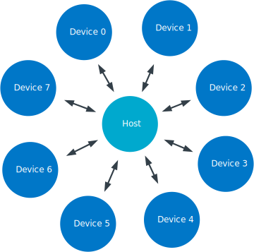
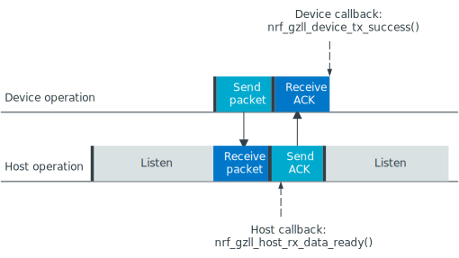
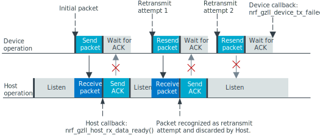
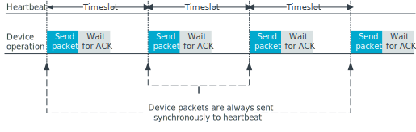
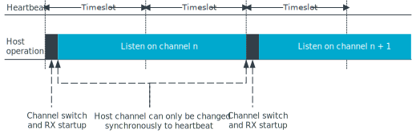
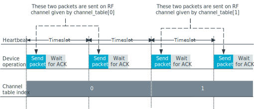
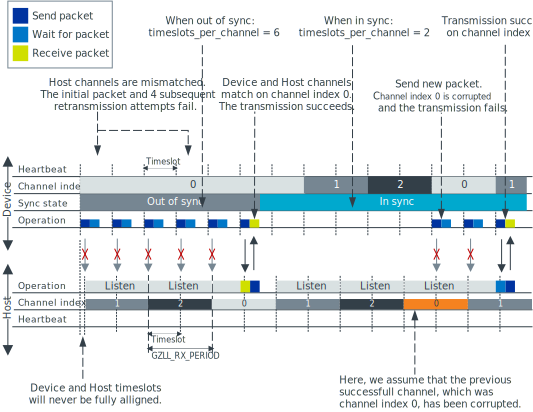

.. _ug_gzll:

Gazell Link Layer
#################

.. contents::
   :local:
   :depth: 2

Gazell Link Layer minimizes the power consumption of the power-sensitive peripheral devices.
Gazell uses the central hub (Host side) with its more relaxed power constraints to keep the link open while the peripheral devices can sleep and save on power consumption.
A typical example of this is a wireless mouse communicating with a USB dongle that is inserted into a computer.

Gazell provides a switching and synchronization scheme that reduces interference and provides wireless coexistence features, enabling high throughput and low latency.

Features
********

Gazell Link Layer provides the following features:

* Support for star network topology with one Host and up to eight Devices.
* Bidirectional data transfer between each Host and Device.
* Channel hopping functionality that gives a reliable wireless link in environments with interference from other radio sources.
* Packet acknowledgment and automatic packet retransmission functionality to prevent data loss.
* Individual TX and RX FIFOs for every data pipe.
* Backward compatible with legacy nRF24L IC Gazell.
* Devices self-synchronize to the Host, meaning:

  * No connection packets are required to setup a link.
  * No polling packets are required to maintain a link.
  * Devices can enter and remove themselves from the network at any time.

* Generates transmission statistics for each RF channel.

.. _ug_gzll_configuration:

Configuration
*************

To enable the Gazell support in the |NCS|, set the following Kconfig options:

* :kconfig:option:`CONFIG_GZLL` - This option enables the :ref:`nrfxlib:gzll` library.
* :kconfig:option:`CONFIG_CLOCK_CONTROL_NRF` - This option enables HFCLK controller support for the nRF52 Series devices.
* :kconfig:option:`CONFIG_GAZELL` - This option enables the :ref:`gzll_glue` module.

.. _ug_gzll_resources:

Resources required
******************

Gazell uses a fixed set of peripheral resources in System on Chips of the nRF52 series.
To ensure correct operation, Gazell requires exclusive access to the following resources:

* Radio
* Timer
* Three PPI channels
* Software interrupt (SWI)

The :ref:`gzll_glue` module specifies the resources used by the :ref:`nrfxlib:gzll` library.

The Gazell interrupt priorities are configured by applications.
The radio and timer interrupt handlers should run at priority level 0 (highest priority), and the Gazell callback functions can run at priority level 1.
To avoid blocking Gazell operations, applications can run at priority level 2 or higher.

You can customize Gazell at runtime for a range of different applications.
See the :ref:`nrfxlib:gzll` and :ref:`nrfxlib:gzll_api` for a list of configuration functions as well as the default and constant parameters.

.. note::

   Editing the header file containing the default and constant parameters does not change their value when compiling a new project.
   These values are provided as a useful reference when making an application with the precompiled library.

Gazell network
**************

Gazell has the following two roles available in its network:

* Device: an initiator role, where the Device transmits packets periodically.
* Host: a listening role, where the Host works mainly as a receiver and only transmits ACK packets back to the Device.
  The ACK packets can optionally carry payload (enabling duplex communication).

One application can only work in a single Gazell role at a time.
However, the role can be switched during runtime.

A member of a Gazell star network is either a Host or Device, and up to eight Devices can communicate with a single Host.
Each Host can communicate with up to eight Devices, and each Device communicates to a single Host.

   Gazell star network

Once enabled, the Host in a Gazell network is always listening, and the Device always initiates the communication.
Each packet that a Device sends is required to be acknowledged by the Host.
The Host can send data to the Device by piggybacking data in an acknowledgment (ACK) packet.
Therefore, the Host must wait for a packet from the Device before it can send any data to it.

You can build more sophisticated Gazell networks, since a single Device can speak to at least two Hosts and any node can change between the two roles.
However, this requires the application to coordinate such a network.

This document focuses on the typical use case of a star network with static roles.

Setting up a Gazell application
*******************************

Gazell automatically takes care of all synchronization and packet handling.
You need to add payloads to the transmit (TX) FIFOs and read payloads from the receive (RX) FIFOs.
Gazell automatically notifies the application when a packet is received.

To set up a Gazell application, complete the following steps:

1. Initialize Gazell Link Layer glue code using :c:func:`gzll_glue_init()`.
#. Initialize Gazell using :c:func:`nrf_gzll_init()` and choose either Host or Device.
#. Reconfigure Gazell's default parameters.

   At a minimum, reconfigure the addresses and channels to avoid interfering with other Gazell networks.
#. Enable Gazell using :c:func:`nrf_gzll_enable()`.
#. Continue to either `Setting up a Device`_ to set up a Device, or `Setting up a Host`_ to setup a Host.

Setting up a Device
===================

If the node is a Device, complete the following steps:

1. Add payloads to the TX FIFO using :c:func:`nrf_gzll_add_packet_to_tx_fifo()`.
#. Handle the returned ACK packet when the :c:func:`nrf_gzll_device_tx_success()` callback is called.

   Fetch the payloads from the RX FIFO using :c:func:`nrf_gzll_fetch_packet_from_rx_fifo()`.
#. Handle the failed packet transmissions when the :c:func:`nrf_gzll_device_tx_failed()` callback is called.

   Failed packets are automatically removed from the TX FIFO.

Setting up a Host
=================

If the node is a Host, start listening by completing the following steps:

1. Handle the received data packets when the :c:func:`nrf_gzll_host_rx_data_ready()` callback is called.

   Fetch the packets from the RX FIFO using :c:func:`nrf_gzll_fetch_from_rx_fifo()`.
#. Add any payloads to send to the TX FIFO using :c:func:`nrf_gzll_add_packet_to_tx_fifo()`.

Disabling Gazell
****************

You can also disable Gazell at any time using the :c:func:`nrf_gzll_disable()` function.

When this is called, Gazell completes any ongoing transmission or reception before being disabled.
(That is, until the end of the current timeslot, see :ref:`gazell_timeslots`).
When the disabling operation is complete, Gazell calls the :c:func:`nrf_gzll_disabled()` function.
When this callback is completed, the Gazell CPU context, radio and Gazell timer stop.

You can now call any of the configuration set functions, which will be valid, once Gazell is enabled again.

Packet transactions
*******************

A typical packet transaction between a Device and a Host consists of a Device initiating the transaction by sending a data packet to the Host and the Host sending an ACK packet in return.

When the Device receives an ACK packet, it knows that the initial packet was successfully transmitted and the :c:func:`nrf_gzll_device_tx_success()` callback function is called to notify the application of this.

Similarly, when the Host receives the initial packet, the :c:func:`nrf_gzll_host_rx_data_ready()` callback function is called to notify to the application that a new packet has been received.

.. note::

   These callback functions are actually queued so that the application avoids race conditions.
   See :ref:`gazell_cb_queue`.

   Successful packet transaction

A transaction can fail if the Host did not receive the initial packet from the Device, or the Device did not receive the corresponding ACK packet correctly.
Gazell ignores packets with a failing Cyclic Redundancy Check (CRC).

If a transaction fails, the Device makes an attempt to retransmit the initial packet to the Host until the ACK is finally received or the maximum number of transmission attempts is reached.
If the maximum number of transmission attempts is reached, the retransmissions stop and the :c:func:`nrf_gzll_device_tx_failed()` callback is called.

If only the ACK packet sent from the Host to the Device is lost, but the Host receives successfully both the initial packet and the subsequent retransmission attempts, the Host discards the repeated packets.
The ACK packets are still sent in return to the Device.
This prevents the application receiving duplicate data packets at the Host.

   Example on failing packet transaction.

In the figure, the maximum number of allowed transmission attempts is set to 3.

Packet identification
*********************

Any packet transmitted from a Device to a Host is uniquely identified by a two bit packet ID field in the packet header together with the packet's 16-bit Cyclic Redundancy Check (CRC).
This packet ID is used to distinguish a new packet from the previous packet, if it has the same payload.

On the Host side, retransmitted packets are discarded and not added to an RX FIFO.

Pipes and addressing
====================

Each logical address on the nodes is termed a *pipe*.
Each pipe maps to one on-air address used when transmitting or receiving packets.

The on-air addresses are composed of a 2-4 bytes long "base address" in addition to a 1-byte prefix address.
The radio of the nRF52 Series uses an alternating sequence of 0s and 1s as the preamble of the packet.
Therefore, for packets to be received correctly, the most significant byte of the base address should not be an alternating sequence of 0s and 1s, that is, it should not be 0x55 or 0xAA.

Pipe 0 has its own unique base address, which is base address 0, while pipes 1-7 use the same base address, which is base address 1.

Each of the eight pipes have a unique byte-long prefix address.

On-air, the most significant bit of each address byte is transmitted first.
The most significant byte of the four bytes long base address is the first transmitted address byte, while the prefix byte is transmitted last.

.. note::

   The byte order in Gazell and the nRF52 Series radio peripheral are not the same.
   This is because the address bytes are rearranged in Gazell to match radio of the nRF24L IC.

FIFOs
*****

All eight pipes on both the Device and the Host have two first in first out (FIFO) buffers that can hold packets.
Each pipe has a TX FIFO and an RX FIFO.
The total number of packets in the FIFOs is six, while every individual TX or RX FIFO (8 pipes x 2 = 16 in total) can store three packets.

Device FIFO handling
====================

When Gazell is enabled in Device role, any packets uploaded to a TX FIFO will be transmitted at the next opportunity.
If several TX FIFOs contain packets, the various TX FIFOs are serviced in a round robin fashion, meaning that no TX FIFOs will experience starvation even when packets are continuously added to other TX FIFOs.

When an ACK is successfully received from a Host, it implies that the payload was successfully received and added to the Host's RX FIFO.
The successfully transmitted packet is removed from the TX FIFO so that the next packet in the FIFO can be transmitted.

If an ACK received by a Device contains a payload, it is added to the pipe's RX FIFO.

If the RX FIFO for a specific pipe on a Device is full and cannot accommodate any new packets, no new packets are sent from the Device on this pipe.
A payload received in an ACK does not need to be discarded due to a full RX FIFO.

Host FIFO handling
==================

When Gazell is enabled in Host role, all enabled pipes (addresses) are simultaneously monitored for incoming packets.

If a new packet is received and the pipe's RX FIFO has available space, it is added to the RX FIFO and an ACK is sent in return to the Device.
If the pipe's TX FIFO contains any packets, the next serviceable packet is attached as a payload in the ACK packet.
To have a TX packet attached to an ACK, it needs to be uploaded to the TX FIFO before the packet is received.

Since the Device does not always receive the ACK successfully, the data payload added to the ACK is not removed from the TX FIFO immediately.
The TX packet is removed from the TX FIFO when a new packet (new packet ID or CRC) is received on the same pipe.
The new packet sent from the Device serves as an acknowledgment of the ACK sent previously by the Host.
ACKs sent in reply to retransmission attempts contain the same TX payload.

When the Host is handling packets on multiple pipes, ensure the ACK payloads in the TX FIFOs on pipes that are no longer used, are not taking up space in the memory pool and consequently blocking communication on other pipes.
To avoid such congestion, the application on the Host can flush the TX FIFOs on the unused pipes.

.. _gazell_cb_queue:

Callback queueing
*****************

Gazell has an internal callback queue for queueing pending callbacks.
This queue steps in when Gazell attempts to call a new callback function while the application is already servicing the previous one.

For example, if a new packet is received by the Host while the application is already servicing the :c:func:`nrf_gzll_host_rx_data_ready()` callback from a previously received packet, the callback for the latest packet is added to the callback queue and serviced at a later opportunity.
In this case, :c:func:`nrf_gzll_host_rx_data_ready()` is called once for every received packet, and the application does not need to handle the potential race condition scenario where a new packet is being received just before the application is about to exit the :c:func:`nrf_gzll_host_rx_data_ready()` function.

In a Device, the :c:func:`nrf_gzll_device_tx_success()` callback is called once for every packet receiving an ACK, even when a new packet is receiving an ACK while the application is servicing the callback of a previously transmitted packet.

The size of the callback queue is given by :c:macro:`NRF_GZLL_CONST_CALLBACK_QUEUE_LENGTH` but it cannot be configured.

.. _gazell_timeslots:

Timeslots
*********

Timeslot is a core parameter in Gazell.
It can be seen as the internal Gazell "heartbeat".

In a Device, any packet transmission (both new packets and retransmitted packets) starts at the beginning of a timeslot, and only one packet transmission (including ACK) can take place within a timeslot.

   Relation between Device operation and timeslot

On the Host side, the radio initiates a radio startup at the beginning of the timeslot to start listening.
In addition, it may optionally change the RF channel it listens to.

   Relation between Host operation and timeslot

To set the period for the heartbeat, use the :c:func:`nrf_gzll_set_timeslot_period()` function.

Frequency hopping
*****************

To ensure good coexistence performance with other radio products operating in the same 2.4 GHz frequency band as Gazell, such as Wi-Fi or Bluetooth, Gazell implements mechanisms for hopping between various radio frequency channels.

When enabled, Gazell picks channels from a predefined channel table.

The application can reconfigure the contents and size of the channel table.
The Device and Host must be configured to have the exact same channel table.
The application can pick from a full set of 80 channels.
A table of 3-7 channels is proven to give a satisfactory coexistence performance in most environments.

Too large channel table may increase the transmission latency and power consumption, while using a too small channel table may decrease the coexistence performance.

Following are the core parameters deciding the channel hopping behavior:

* ``timeslots_per_channel`` (applies to Host and "in sync" Device, set by :c:func:`nrf_gzll_set_timeslots_per_channel()`).
* ``timeslots_per_channel_when_device_out_of_sync`` (applies to "out of sync" Device only, set by :c:func:`nrf_gzll_set_timeslots_per_channel_when_device_out_of_sync()`).
* ``channel_selection_policy`` (applies to "in sync" Device only, set by :c:func:`nrf_gzll_set_device_channel_selection_policy()`).

Which one to use depends on whether Gazell is "in sync" or "out of sync", see :ref:`gazell_sync`.
Therefore, ``timeslots_per_channel`` is used instead of these terms.

The ``timeslots_per_channel`` parameter sets the number of timeslots Gazell has on a single channel before the channel is changed.
In the next timeslot with a channel shift, Gazell picks the next channel from the predefined channel table, cycling back to the beginning of the channel table if required.

   Host and Device channel switching. Here, ``timeslots_per_channel`` = 2.

.. note::

   Host channel switching is the same as Device channel switching.

In the Device role, ``timeslots_per_channel`` can also be seen as the number of transmission attempts spent on each channel before switching the channel.
This is because there is at least one transmission attempt for every timeslot.

The ``channel_selection_policy`` parameter is used by a Device in sync to decide the initial channel to be used when sending a new packet to a Host (that is, for the first time the new packet is sent, not for the retransmission attempts).

Once synchronized with the Host, the Device can send either on the current channel that it believes the Host is on or on the last successful channel.
To configure this, use the :c:func:`nrf_gzll_set_device_channel_selection_policy()` function.

The ``channel_selection_policy`` parameter can take the following two values:

* :c:enumerator:`NRF_GZLL_DEVICE_CHANNEL_SELECTION_POLICY_USE_SUCCESSFUL`
* :c:enumerator:`NRF_GZLL_DEVICE_CHANNEL_SELECTION_POLICY_USE_CURRENT`

If you choose the :c:enumerator:`NRF_GZLL_DEVICE_CHANNEL_SELECTION_POLICY_USE_SUCCESSFUL` policy, the Device starts sending packets on the channel it last had a successfully acknowledged transmission.
This policy is the most robust against static interference.
Once the Device finds a quiet channel, it should be able to continue using this channel.

If you choose the :c:enumerator:`NRF_GZLL_DEVICE_CHANNEL_SELECTION_POLICY_USE_CURRENT` policy, the Device sends on the channel it believes the Host is currently listening to.
This achieves the lowest latency and highest throughput of the two policies as the Device does not have to wait for the Host to be listening to a specific channel.
This policy is frequency hopping.
The disadvantage of this policy is that if there is static interference on a particular channel, the Device wastes packets attempting to send on this channel.
The application can reconfigure the channel table during runtime to overcome this.

The channel selection policy only applies to the initially transmitted packet.
If the transmission of this initial packet fails, the following retransmission attempts are always sent in the channel the Device believes the Host is monitoring.

If Gazell is "out of sync", it always starts the packet transmission immediately using the previous successful transmission channel.
If Gazell has not transmitted a successful packet and thus has no previous successful channel to relate to, it starts using the first channel in the channel table.

.. _gazell_sync:

Synchronization
***************

The internal timeslot, or "heartbeat", mechanism of Gazell is used to obtain synchronous communication while still enabling efficient channel switching.
This mechanism is useful when a Device needs to switch to a new channel while there is radio interference on the current channel.

Each Gazell Device has two synchronization states: in sync and out of sync.

On the Host, the internal heartbeat timer is always running when Gazell is enabled, independent of the Devices' synchronization state.

On the Device, the heartbeat timer only runs as long as the Device is "in sync" or as long as there are packets to be sent.
If the timer has been stopped and packets are added to a TX FIFO, the timer starts immediately.

Before any packets have been successfully received and acknowledged, the Device is out of sync.
In this state, the Device switches channel determined by the ``timeslots_per_channel_when_device_out_of_sync`` parameter.
The Device switches channel at a slower rate than the Host (as determined by ``timeslots_per_channel``) so that the Device eventually transmits a packet on the same channel that the Host is on.

When a Device successfully transmits a packet, that is when an ACK packet is received from the Host, it enters the in sync state, as it now has the information needed for continuing to guess the following channels the Host is listening to.

For knowing when to change channel, Gazell has an internal ``timeslot_counter`` to count the number of timeslots it has on a single channel.
When this counter reaches ``timeslots_per_channel``, the ``timeslot_counter`` is reset and the ``channel_index`` is incremented (cyclically).
When the Device has received an ACK, it knows the Host is using the current channel, but it does not know the ``timeslot_counter`` state on the Host.
As a result, only in the timeslots where the ``timeslot_counter`` equals zero the Device can be confident that it "guesses" the correct channel that the Host is monitoring.
Therefore, when an ACK is received, the ``timeslot_counter`` for the current timeslot is reset to zero, and a new Device transmission starts when the ``timeslot_index`` counter on the Device is zero.
Retransmission attempts, however, are sent on all timeslots.

Once the Device is in sync, it keeps an internal timer running to maintain the internal heartbeat in order to remain synchronized with the Host.
The duration the Device stays in the in sync state is the ``sync_lifetime`` and is measured in timeslots.
The ``sync_lifetime`` is reset whenever a packet is received.
Once the ``sync_lifetime`` has expired on a Device, the internal timer is stopped and the Device returns to out of sync state.

.. note::

   When a Device that is in sync sends a packet but does not receive an ACK, it continues to transmit until it reaches the maximum number of attempts.

If you set the ``sync_lifetime`` to zero, the Device will never be in sync.
The ``sync_lifetime`` should be chosen with regard to how often packets are required to be sent and the fact that synchronization can only be maintained for a finite time due to clock drift and radio interference.
To configure the sync lifetime, use the :c:func:`nrf_gzll_set_sync_lifetime()` function.

The Device knows it is in sync when the number of retransmissions gets close to zero.
The :c:struct:`nrf_gzll_device_tx_info_t` structure is passed to the Device callback functions, and it contains the number of transmit attempts required for the current packet.
In addition, the structure contains the ``num_channel_switches`` parameter that the application can use to determine whether the RF channels are reliable.
This enables the application to track bad channels and update the channel tables on Host and Device if desired.

Backwards compatibility
***********************

The Gazell Link Layer examples are not fully compatible out of the box with the legacy examples provided in the nRFgo SDK for the nRF24L IC.

The default timeslot period and channel tables require adjustment, as well as some setup to emulate the Gazell roles.
The Gazell Low Power Host role (Host role 1) is not supported in the nRF52 Series.

Channel tables
==============

The default channel tables require adjustment.

Depending on your project, do one of the following:

* Edit the :file:`gzll_params.h` file used in the nRF24L IC projects.
* Use the :c:func:`nrf_gzll_set_channel_table()` function in the nRF52 Series projects.

Timeslot periods
================

The Gazell Link Layer supports the following minimum timeslot periods:

* 600 us timeslot period, nRF52 Series Gazell Device to nRF52 Series Gazell Host.
* 504 us timeslot period, nRF52 Series Gazell Device to nRF24L IC Gazell Host.

When using 504 us timeslot period, the following restrictions apply:

* The maximum payload size is 17 bytes.
* The maximum ACK payload size is 10 bytes.

In addition, the relation between the Device and Host timing parameters should be as follows:

* The Host listens to each channel in a GZLL_RX_PERIOD number of microseconds, where GZLL_RX_PERIOD is the heartbeat interval in the nRF24L IC.
* The Host GZLL_RX_PERIOD must be greater than the time required to make two full transmission attempts on the Device (including ACK wait time).

Depending on your project, do one of the following:

* Edit the :file:`gzll_params.h` file used in the nRF24L IC projects.
* Use the :c:func:`nrf_gzll_set_timeslot_period()` function in the nRF52 Series projects (nRF52 Series Gazell timeslot period = 0.5*GZLL_RX_PERIOD).

Emulating legacy Gazell roles
=============================

The Gazell Link Layer protocol for the nRF52 Series is compatible with the most useful roles of the Gazell Link Layer for the nRF24L IC.

Emulating legacy Gazell Device role 2 and Host role 0 on the nRF24 IC
---------------------------------------------------------------------

You can emulate the legacy Device role 2 as follows:

* The channel selection policy is equivalent to :c:enumerator:`NRF_GZLL_DEVICE_CHANNEL_SELECTION_POLICY_USE_SUCCESSFUL`.
* When Gazell is out of sync, a large number of attempts may occur on each channel before the channel is switched.
* When Gazell is in sync, a low number of transmission attempts, typically two, are allowed on each channel before the channel is switched.

The legacy Host role 0 behaves as follows:

* Host is always on while it is enabled.
* When enabled, the Host will continuously cycle through the channel table.

See the example on how to achieve such behavior.
Assuming a channel table ``my_channel_table[]`` with three channels:

.. code-block:: c

   /* On Host and Device */
   timeslots_per_channel = 2;
   channel_table_size = 3;
   nrf_gzll_set_timeslot_period(GZLL_RX_PERIOD / 2);
   nrf_gzll_set_channel_table(my_channel_table, channel_table_size);
   nrf_gzll_set_timeslots_per_channel(timeslots_per_channel);
   /* On the Device */
   nrf_gzll_set_timeslots_per_channel_when_device_out_of_sync(channel_table_size*timeslots_per_channel);
   nrf_gzll_set_device_channel_selection_policy(NRF_GZLL_DEVICE_CHANNEL_SELECTION_POLICY_USE_SUCCESSFUL);

   Emulating legacy Gazell

Transmission statistics
***********************

The Gazell stack allows to automatically gather transmission information, such as:

* Total number of transmitted packets.
* Total number of transmission timeouts.
* Number of transmitted packets on each RF channel.
* Number of transmission failures on each RF channel.

The stack can also track packet transaction failure events, such as transmission timeout or receiving a packet with incorrect CRC.

To turn on transmission statistics, perform the following steps:

1. Define the :c:struct:`nrf_gzll_tx_statistics_t` structure.
   This is a buffer for transmission statistics data, so it must remain in memory as long as the transmission statistics are used.
#. Call :c:func:`nrf_gzll_init` to initialize Gazell.
#. Call the :c:func:`nrf_gzll_tx_statistics_enable` function to enable transmission information gathering.

After this, transmission statistics can be read from the defined structure.
To reset the recording, call the :c:func:`nrf_gzll_reset_tx_statistics` function.

To track packet transaction failures, perform the following steps:

1. Define the ``nrf_gzll_tx_timeout_callback`` or ``nrf_gzll_crc_failure_callback`` functions that will be called on a proper event.
#. Call :c:func:`nrf_gzll_init` to initialize Gazell.
#. Register the defined callbacks by calling :c:func:`nrf_gzll_tx_timeout_callback_register` or :c:func:`nrf_gzll_crc_failure_callback_register`.

After this, each transmission timeout and received packet CRC failure will be reported by the respective callback.
