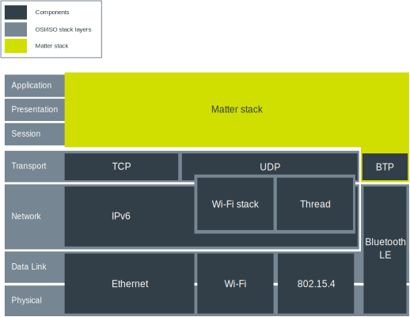
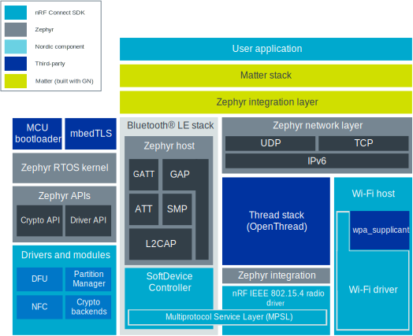

.. _ug_matter_architecture:

Matter architecture and integration
###################################

.. contents::
   :local:
   :depth: 2

Matter defines an application layer on top of the IPv6-based transport protocols.
This allows for routing messages regardless of the underlying physical and link layers.

   Matter architecture overview

The Matter application layer can be broken down into several main components, from IP framing and transport management up to Data Model structure and Application itself.

Matter is included in the |NCS| as one of the submodule repositories managed with the :ref:`zephyr:west` tool.
That is, the code used for the |NCS| and Matter integration is stored in the Matter repository (nRF Connect platform) and is compiled when building one of the available :ref:`matter_samples`.
Both instances depend on each other, but their development is independent to ensure that they both support the latest stable version of one another.

Matter is located on the top application layer of the integration model, looking from the networking point of view.
The |NCS| and Zephyr provide the Bluetooth® LE, Thread, and Wi-Fi stacks, which must be integrated with the Matter stack using a special intermediate layer.
Depending on the selected build target, either Wi-Fi or Thread is enabled.
The |NCS|'s Multiprotocol Service Layer (MPSL) driver allows running Bluetooth LE and Thread concurrently on the same radio chip.
You can also run Bluetooth LE and Wi-Fi concurrently on a single device using the Wi-Fi coexistence mechanism.

   nRF Connect platform in Matter

For detailed description, see the :doc:`matter:nrfconnect_platform_overview` page in the Matter documentation.
