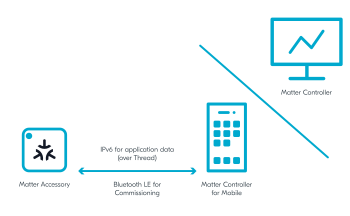
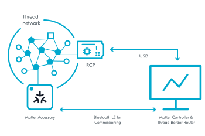

.. _ug_matter_configuring:

Configuring Matter development environment
##########################################

.. contents::
   :local:
   :depth: 2

When you program any of the available Matter samples to the supported development kits, you automatically build the Matter stack for the nRF Connect platform.
The development kit and the application running Matter stack that is programmed on the development kit together form the Matter accessory device.

For the |NCS|, the default use case of a Matter accessory device is within a Matter network that is built on top of a low-power, 802.15.4-compatible Thread network.
To pair and control the Matter accessory device remotely over such a network, you need to set up a Matter controller on a mobile or a PC.
A Matter controller is a role within the Matter environment.
This controller interacts with the accessory devices using the following protocols:

* Bluetooth® LE during the commissioning process - to securely pass the network credentials and provision the accessory device into the Thread network.
* Regular IPv6 communication after the accessory device joins the Thread network - to interact with each other by exchanging application messages.
  For example, to report temperature measurements of a sensor.

The following figure shows the protocol types and the available Matter controllers.

   Protocol types and controllers used by Matter

To enable the IPv6 communication with the Matter accessory device over the Thread network, the Matter controller requires the Thread Border Router.
This is because the Matter controller types described on this page do not have an 802.15.4 Thread interface.
The Border Router bridges the Thread network with the network interface of the controller, for example Wi-Fi.

Matter controller types
***********************

The Matter controller implementation for the nRF Connect platform can be of the following types:

* Python controller for Linux
* Mobile controller for Android

These controller types are also described in :ref:`ug_matter_tools` and are recommended in the |NCS|.
In the Matter upstream repository, you can find information and resources for implementing `other controller setups`_ (for example, for iOS).

Matter development environment setup options
********************************************

You can run the Matter controller on the same device as the Thread Border Router or run the Matter controller and the Thread Border Router on separate devices.

The recommended approach is to run the Thread Border Router and the Matter controller on separate devices.
With the Thread Border Router installed on Raspberry Pi, this approach provides support for most functionalities.
For example, it allows using a mobile controller by providing connectivity between a Wi-Fi network and a Thread network.

If you only have one device, be it a PC with Linux or a Raspberry Pi, you can set up and test the development environment with both the Thread Border Router and the Matter controller running on this one device.

.. _ug_matter_configuring_mobile:

Running Thread Border Router and Matter controller on separate devices
======================================================================

In this setup, Raspberry Pi runs the Thread Border Router, which provides communication between the Thread nodes and the Matter controller.
The controller can be installed on a PC or a mobile phone.
Both the Thread Border Router and the Matter controller must support IPv6 communication over backbone network, for example Wi-Fi or Ethernet.
The following figures show the possible setups with a dedicated Wi-Fi Access Point.

* Setup with OpenThread Border Router and Matter controller on PC

  .. figure:: images/matter_otbr_controller_separate_pc.svg
     :width: 600
     :alt: Setup with OpenThread Border Router and Matter controller on PC

* Setup with OpenThread Border Router and Matter controller on mobile

  .. figure:: images/matter_otbr_controller_separate_mobile.svg
     :width: 600
     :alt: Setup with OpenThread Border Router and Matter controller on mobile

To use this setup, you need the following hardware:

* 1x PC with Ubuntu (20.04 or newer) or 1x smartphone with Android 8+
* 1x Raspberry Pi Model 3B+ or newer (along with a SD card with at least 8 GB of memory)
* 1x Wi-Fi Access Point supporting IPv6 (without the IPv6 Router Advertisement Guard enabled on the router)
* 1x nRF52840 DK or nRF52840 Dongle - for the Radio Co-Processor (RCP) device
* 1x nRF52840 DK or nRF5340 DK - for the Matter accessory device (programmed with one of :ref:`matter_samples`)

For information about how to configure and use the required components, complete steps from the following user guides:

* Configuring the Thread Border Router on a Raspberry Pi - see :ref:`ug_thread_tools_tbr` in the |NCS| documentation
* Depending on the Matter controller type:

  * Python Matter controller - See :ref:`ug_matter_tools` for building instructions and :doc:`matter:python_chip_controller_building` in the Matter documentation for information about testing.
  * Android Mobile controller - See :ref:`ug_matter_tools` for building instructions and :doc:`matter:nrfconnect_android_commissioning` in the Matter documentation for information about testing.

Running Thread Border Router and Matter controller on the same device
=====================================================================

In this setup, a PC or a Raspberry Pi runs the Thread Border Router and the Python Matter controller simultaneously.
To simplify enabling the Thread communication with the Matter accessory device, use a Docker container with the OpenThread Border Router image instead of installing the OpenThread Border Router natively.

   Setup with OpenThread Border Router and Matter controller on the same device

To use this setup, you need the following hardware:

* 1x PC with Ubuntu (20.04 or newer) or Raspberry Pi Model 3B+ or newer with Ubuntu (20.04 or newer) instead of Raspbian OS
* 1x Bluetooth LE dongle (can be embedded inside the PC, like it is on Raspberry Pi)
* 1x nRF52840 DK or nRF52840 Dongle - for the Radio Co-Processor (RCP) device
* 1x nRF52840 DK or nRF5340 DK - for the Matter accessory device (programmed with one of :ref:`matter_samples`)

For information about how to configure and use the required components, see the following user guides:

* Configuring Thread Border Router on a PC or a Raspberry Pi - see :ref:`ug_thread_tools_tbr` in the |NCS| documentation
* Python Matter controller - See :ref:`ug_matter_tools` for building instructions and :doc:`matter:python_chip_controller_building` in the Matter documentation for information about testing.

.. note::
    The Python Matter controller is currently not supported for building on Raspbian OS.
    If you use Raspberry Pi to run the controller and the Thread Border Router, replace Raspbian OS with Ubuntu Server.
